Project 3
================
Richard Xiao & Xi Yang
2022-11-12

## Introduction section

This is an online news popularity data set, and dataset summarizes a
heterogeneous set of features about articles published by Mashable in a
period of two years. The goal is to predict the number of shares in
social networks (popularity). We’re thinking about what kind of articles
are we most likely to share, and we believe there are two aspects. One
is objectivity. Users can feel the content is useful and valuable. The
other one is subjectivity. Users agree with the attitudes expressed in
the article, and also, the emotion expressed in the article resonated
with users.

Based on the two aspects, we choose 21 variables, and they are
n_tokens_title, n_tokens_content, n_unique_tokens, num_imgs, num_videos,
kw_avg_min, kw_max_max, kw_avg_max, kw_avg_avg, weekday_is_monday,
weekday_is_tuesday, weekday_is_wednesday, weekday_is_thursday,
weekday_is_friday,. weekday_is_saturday, weekday_is_sunday,
global_subjectivity, global_sentiment_polarity,
global_rate_positive_words, global_rate_negative_words, and share.

We produce some basic analysis before we fitting the model. The purpose
is to inspect the trends between different variables with respect to the
number of share, and also, figure out the correlation between a few
notable numeric variables. It helps the reader understand the summary or
graph.

For a linear regression model, we’ll use forward stepwise and LASSO
regression model. For an ensemble tree-based model, we’ll fit random
forest and boosted tree model.

## Data

``` r
library(tidyverse)
library(caret)
#read in data
df1 <- read_csv("OnlineNewsPopularity.csv")
```

    ## Rows: 39644 Columns: 61
    ## ── Column specification ────────────────────────────────────────────────────────────────────────────────────────
    ## Delimiter: ","
    ## chr  (1): url
    ## dbl (60): timedelta, n_tokens_title, n_tokens_content, n_unique_tokens, n_non_stop_words, n_non_stop_unique_...
    ## 
    ## ℹ Use `spec()` to retrieve the full column specification for this data.
    ## ℹ Specify the column types or set `show_col_types = FALSE` to quiet this message.

``` r
df1
#Remove the first two variables we don't need. Also want to rename the day variables to make it easier for analysis with rename variable.


df <- df1 %>%
  select(-c(url, timedelta)) %>%
  mutate(log_shares = log(shares)) %>%
  select(-shares) %>% rename(monday = weekday_is_monday , tuesday = weekday_is_tuesday, wednesday = weekday_is_wednesday, thursday = weekday_is_thursday, friday =     weekday_is_friday, saturday = weekday_is_saturday, sunday = weekday_is_sunday)
df 
#setting up data channel 
selectchannel<- paste0("data_channel_is_", params[[1]])
df<- df %>% filter(get(selectchannel) ==1 ) 
df
set.seed(100)
index <- createDataPartition(df$log_shares, p = .7, list = FALSE)
train <- df[index,]
test <- df[-index,]
train
test
```

## Summarizations

### 1. Plotting the correlation between a few notable numeric variables.

``` r
library(tidyverse)
library(corrplot)
cor_mat <- cor(train %>% select(log_shares,num_imgs,num_videos,n_tokens_content,n_tokens_title,kw_avg_min,kw_max_max,kw_avg_max,kw_avg_avg,global_subjectivity,global_sentiment_polarity,global_rate_positive_words), method = "pearson")
corrplot(cor_mat, hc.order = TRUE,
type = "lower",
tl.pos = "lt",
title = "Correlation Coefficients for log of shares",
subtitle = "Correlation Coefficients for log of shares",
mar=c(0,0,2,0)
)
```

    ## Warning in text.default(pos.xlabel[, 1], pos.xlabel[, 2], newcolnames, srt = tl.srt, : "hc.order" is not a
    ## graphical parameter

    ## Warning in text.default(pos.xlabel[, 1], pos.xlabel[, 2], newcolnames, srt = tl.srt, : "subtitle" is not a
    ## graphical parameter

    ## Warning in text.default(pos.ylabel[, 1], pos.ylabel[, 2], newrownames, col = tl.col, : "hc.order" is not a
    ## graphical parameter

    ## Warning in text.default(pos.ylabel[, 1], pos.ylabel[, 2], newrownames, col = tl.col, : "subtitle" is not a
    ## graphical parameter

    ## Warning in title(title, ...): "hc.order" is not a graphical parameter

    ## Warning in title(title, ...): "subtitle" is not a graphical parameter

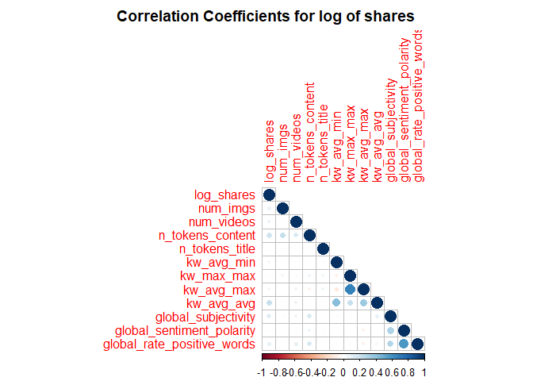<!-- -->

From the correlation graph, if the variable has a darker blue color, it
will signify a strong positive correlation with the other variable
whereas if it has a darker red color, it will have a stronger negative
correlation with the other variable.

``` r
#This new dataframe converts the days into categorical values for graphing.
moddf <- train%>%
  mutate(day = if_else(monday == 1,"Monday",if_else(tuesday == 1,"Tuesday",if_else(wednesday == 1,"Wednesday",if_else(
thursday == 1,"Thursday",if_else(friday == 1,"Friday",if_else(saturday == 1,"Saturday", "Sunday")))))))
#Eliminates any categorical variables for use of principal component analysis
continuous <- train %>%select(-c(monday, tuesday, wednesday, thursday,friday, saturday, sunday, is_weekend, ))
```

### 2. Boxplot for log shares subdivided by days.

``` r
#Boxplot for log shares subdivided by days.
ggplot(moddf, aes(x = day, y = log_shares, col = day)) + 
  geom_boxplot(fill="grey") + 
  geom_jitter() + 
  ylab("log(shares)") + 
  xlab("") +
  theme(axis.text.x = element_text(angle = 45)) +
  ggtitle("Boxplot for Log Shares by Day")
```

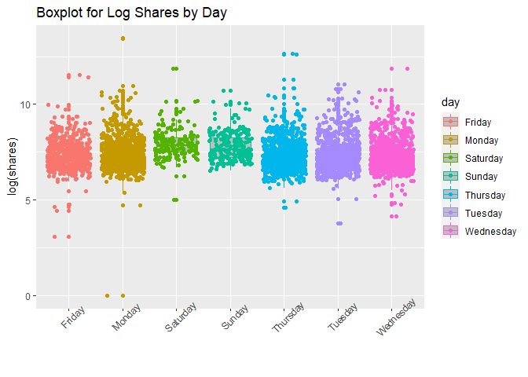<!-- -->

### 3. Scatterplot for log shares and number of images

``` r
#Scatterplot for log shares and number of images
ggplot(moddf, aes(y = log_shares, x = num_imgs, color = day)) + 
  geom_point(stat = "identity", position = "jitter") + 
  geom_smooth( method = "lm")  + 
  xlab("num_hrefs") + 
  ylab("log_shares")
```

    ## `geom_smooth()` using formula 'y ~ x'

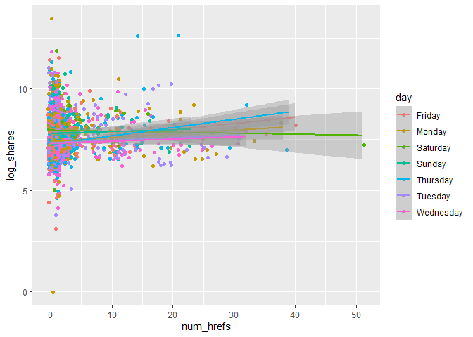<!-- -->

### 4. Scatterplot for log shares and number of videos.

``` r
#Scatterplot for log shares and number of videos.
ggplot(moddf, aes(y = log_shares, x = num_videos, color = day)) + 
  geom_point(stat = "identity", position = "jitter") + 
  geom_smooth( method = "lm")  + 
  xlab("num_hrefs") + 
  ylab("log_shares")
```

    ## `geom_smooth()` using formula 'y ~ x'

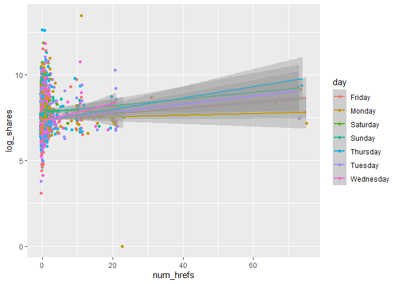<!-- -->

### 5. Histogram for log shares

``` r
#Histogram for log shares 
ggplot(moddf, aes(x=log_shares, fill = kw_avg_avg, color = day)) + geom_histogram(binwidth = 1, position="dodge") + xlab("Average KeyWord") + ylab("Log Shares")
```

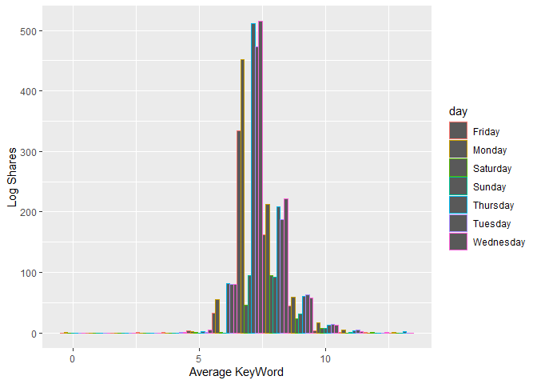<!-- -->

### 6. Scatterplot for number of unique tokens and log shares

``` r
#Scatterplot for number of unique tokens and log shares
ggplot(moddf, aes(y = log_shares, x = n_unique_tokens, color = day)) + 
  geom_point(stat = "identity", position = "jitter") + 
  geom_smooth( method = "lm")  + 
  xlab("n_unique_tokens") + 
  ylab("log_shares")
```

    ## `geom_smooth()` using formula 'y ~ x'

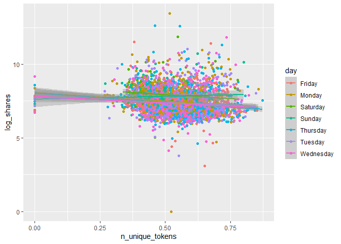<!-- -->

### 7. Scatterplot for number of tokens content and log shares

``` r
#Scatterplot for number of tokens content and log shares
ggplot(moddf, aes(y = log_shares, x = n_tokens_content, color = day)) + 
  geom_point(stat = "identity", position = "jitter") + 
  geom_smooth( method = "lm")  + 
  xlab("n_tokens_content") + 
  ylab("log_shares")
```

    ## `geom_smooth()` using formula 'y ~ x'

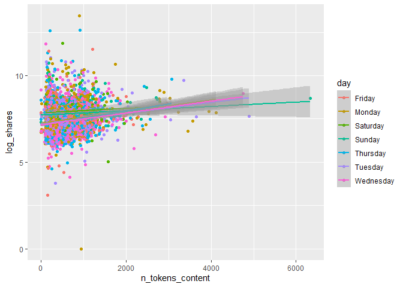<!-- -->

### 8. Scatterplot for number of token titles and log shares

``` r
#Scatterplot for number of token titles and log shares
ggplot(moddf, aes(y = log_shares, x = n_tokens_title, color = day)) + 
  geom_point(stat = "identity", position = "jitter") + 
  geom_smooth( method = "lm")  + 
  xlab("n_tokens_title") + 
  ylab("log_shares")
```

    ## `geom_smooth()` using formula 'y ~ x'

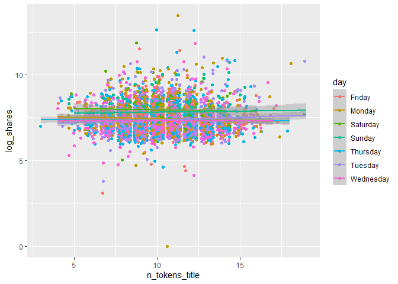<!-- -->

### 9. General summary statistics for continuous dataframe

The code chunk below will give summary statistics for the twelve
variables that we want to analyze. The results are ordered by descending
standard deviation. We want to know the general statistics for all of
these variables to see how they compare against each other.

### 10. Numerical summary of categorical variable is_weekend

let’s pull a summary of the number of shares. One of the factors that
most affects the number of shares is whether the day is weekday or
weekend. I wanted to look at the average, standard deviation, median and
IQR values of number of shares on weekdays and weekend. If the value of
average is larger , then articles tend to be shared more often.

``` r
library(tidyverse)
train %>%
  group_by(is_weekend) %>%
  summarise(average=mean(log_shares), median=median(log_shares), sd=sd(log_shares), IQR=IQR(log_shares))
```

### 11. Dependence of number of shares on text subjectivity

A scatter plot with the number of shares on the y-axis and the text
subjectivity on the x-axis is created: we can inspect the trend of
shares as a function of the text subjectivity. We know that if the value
of text subjectivity is 0, it stands for the article is very objective,
and value 1 stands for very subjective. If the most points distributed
lower than 0.5, then articles with more objectivity tend to be shared
more often. If the most points distributed larger than 0.5, then
articles with more subjectivity tend to be shared more often. If the
most points distributed around 0.5, then articles with more neutrality
tend to be shared more often.

``` r
library(tidyverse)
library(ggplot2)
subjectivityData <- train %>% group_by(global_subjectivity) %>% summarize(sharecount = mean(log_shares))
ggplot(subjectivityData, aes(x = global_subjectivity, y = sharecount, color =global_subjectivity)) +
geom_point() +
ggtitle("dependence of number of shares on text subjectivity ")
```

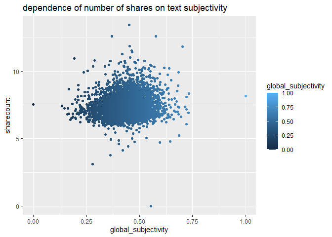<!-- -->

### 12. Dependence of number of shares on text sentiment polarity

A scatter plot with the number of shares on the y-axis and the text
sentiment polarity on the x-axis is created: we can inspect the trend of
shares as a function of the text sentiment polarity. We know that if the
value of text sentiment polarity is greater than -1 and less than 0, it
stands for the article sentiment is negative emotion. If the value of
text sentiment polarity is greater than 0 and less than 1, it stands for
the article sentiment is positive emotion. If the most points
distributed around (-1,0), then articles with negative emotion tend to
be shared more often. If the most points distributed around (0,1), then
articles with positive emotion tend to be shared more often. If the most
points distributed around 0, then articles with neutral emotion tend to
be shared more often.

``` r
library(tidyverse)
library(ggplot2)
sentimentpolarityData <- train %>% group_by(global_sentiment_polarity) %>% summarize(sharecount = mean(log_shares))
ggplot(sentimentpolarityData, aes(x = global_sentiment_polarity, y = sharecount, color =global_sentiment_polarity)) +
geom_point() +
ggtitle("dependence of number of shares on text sentiment polarity ")
```

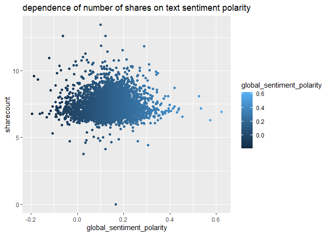<!-- -->

### 13. Dependence of number of shares on positive word rate

A scatter plot with the number of shares on the y-axis and the positive
word rate on the x-axis is created: we can inspect the trend of shares
as a function of the positive word rate. If the points show an upward
trend, then articles with more positive words tend to be shared more
often. If we see a negative trend then articles with more positive words
tend to be shared less often.

``` r
library(tidyverse)
library(ggplot2)
positivewordsData <- train %>% group_by(global_rate_positive_words) %>% summarize(sharecount = mean(log_shares))
ggplot(positivewordsData, aes(x = global_rate_positive_words, y = sharecount), color=global_rate_positive_words) +
geom_point() +
geom_smooth(method = "lm") +
ggtitle("dependence of number of shares on positive word rate ")
```

    ## `geom_smooth()` using formula 'y ~ x'

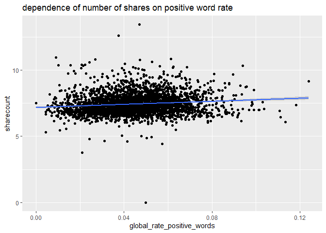<!-- --> \### 14.
Dependence of number of shares on negative words rate

A scatter plot with the number of shares on the y-axis and the negative
words rate on the x-axis is created: we can inspect the trend of shares
as a function of the negative words rate. If the points show an upward
trend, then articles with more negative words tend to be shared more
often. If we see a negative trend then articles with more negative words
tend to be shared less often.

``` r
library(tidyverse)
library(ggplot2)
negativewordsData <- train %>% group_by(global_rate_negative_words) %>% summarize(sharecount = mean(log_shares))
ggplot(negativewordsData, aes(x = global_rate_negative_words, y = sharecount)) +
geom_point() +
geom_smooth(method = "lm") +
ggtitle("dependence of number of shares on negative words rate")
```

    ## `geom_smooth()` using formula 'y ~ x'

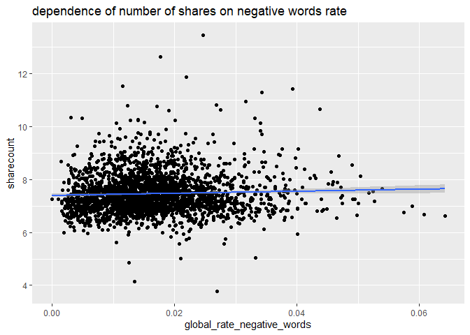<!-- -->

## Modeling

For models below, I have selected the log_shares as the dependent
variable, and num_imgs, num_videos, n_tokens_content, n_unique_tokens,
n_tokens_title, kw_avg_min, kw_max_max, kw_avg_max,
kw_avg_avg,global_subjectivity, global_sentiment_polarity,
global_rate_positive_words, global_rate_negative_words, monday, tuesday,
wednesday, thursday, friday, saturday, sunday as the independent
variables.

``` r
library(tidyverse)
#Select variables of interest for analysis.
analysis <- train %>% select(log_shares,num_imgs,num_videos,n_tokens_content,n_unique_tokens,n_tokens_title,kw_avg_min,kw_max_max,kw_avg_max,kw_avg_avg,global_subjectivity,global_sentiment_polarity,global_rate_positive_words,global_rate_negative_words,monday,tuesday,wednesday,thursday,friday,saturday,sunday)
analysis
```

Here after all the models formulated below, to compare them, I am
predicting the test data on this model to derive some common metrics
like RMSE and R squared values that can be used to compare multiple
models. For prediction, I am using predict() function, and to extract
prediction metrics, I am using postResample() function.

### 1. LASSO Regression Model

Lasso regression is a type of linear regression that uses shrinkage.
Shrinkage is where data values are shrunk towards a central point, like
the mean. The lasso procedure encourages simple, sparse models
(i.e. models with fewer parameters). This particular type of regression
is well-suited for models showing high levels of multicollinearity or
when you want to automate certain parts of model selection, like
variable selection/parameter elimination.

``` r
library(caret)
fitLASSO <- train(log_shares ~ ., data = analysis,
method = "lasso",
preProcess = c("center", "scale"),
trControl = trainControl(method = "cv", number = 10)
)
predLASSO <- predict(fitLASSO, newdata = test)
m1<-postResample(predLASSO, obs = test$log_shares)
m1
```

    ##      RMSE  Rsquared       MAE 
    ## 0.8042063 0.1015441 0.5798381

### 2. Boosted Tree Model

Boosting is an ensemble learning method that combines a set of weak
learners into a strong learner to minimize training errors. In boosting,
a random sample of data is selected, fitted with a model and then
trained sequentially—that is, each model tries to compensate for the
weaknesses of its predecessor. With each iteration, the weak rules from
each individual classifier are combined to form one, strong prediction
rule.

``` r
library(caret)
boostedFit <- train(log_shares ~ ., data = analysis, method = "gbm",trControl = trainControl(method = "cv" , number = 10),
                    preProcess = c("center", "scale"),
                    tuneGrid = expand.grid(n.trees = c(25, 50, 100, 150, 200),
                                           interaction.depth = 1:4,
                                           shrinkage = 0.1,
                                           n.minobsinnode = 10)
                    )
```

    ## Iter   TrainDeviance   ValidDeviance   StepSize   Improve
    ##      1        0.6874             nan     0.1000    0.0096
    ##      2        0.6798             nan     0.1000    0.0078
    ##      3        0.6716             nan     0.1000    0.0063
    ##      4        0.6658             nan     0.1000    0.0056
    ##      5        0.6606             nan     0.1000    0.0051
    ##      6        0.6557             nan     0.1000    0.0044
    ##      7        0.6512             nan     0.1000    0.0040
    ##      8        0.6471             nan     0.1000    0.0039
    ##      9        0.6435             nan     0.1000    0.0030
    ##     10        0.6405             nan     0.1000    0.0026
    ##     20        0.6179             nan     0.1000    0.0007
    ##     40        0.5956             nan     0.1000    0.0006
    ##     60        0.5842             nan     0.1000    0.0002
    ##     80        0.5755             nan     0.1000   -0.0001
    ##    100        0.5700             nan     0.1000   -0.0003
    ##    120        0.5659             nan     0.1000   -0.0007
    ##    140        0.5639             nan     0.1000   -0.0005
    ##    160        0.5619             nan     0.1000   -0.0003
    ##    180        0.5597             nan     0.1000   -0.0006
    ##    200        0.5577             nan     0.1000   -0.0004
    ## 
    ## Iter   TrainDeviance   ValidDeviance   StepSize   Improve
    ##      1        0.6845             nan     0.1000    0.0120
    ##      2        0.6734             nan     0.1000    0.0097
    ##      3        0.6638             nan     0.1000    0.0089
    ##      4        0.6556             nan     0.1000    0.0077
    ##      5        0.6493             nan     0.1000    0.0061
    ##      6        0.6431             nan     0.1000    0.0055
    ##      7        0.6376             nan     0.1000    0.0053
    ##      8        0.6328             nan     0.1000    0.0032
    ##      9        0.6279             nan     0.1000    0.0040
    ##     10        0.6238             nan     0.1000    0.0037
    ##     20        0.5977             nan     0.1000    0.0009
    ##     40        0.5742             nan     0.1000   -0.0000
    ##     60        0.5611             nan     0.1000    0.0000
    ##     80        0.5523             nan     0.1000   -0.0003
    ##    100        0.5467             nan     0.1000   -0.0009
    ##    120        0.5395             nan     0.1000   -0.0004
    ##    140        0.5340             nan     0.1000   -0.0006
    ##    160        0.5286             nan     0.1000   -0.0006
    ##    180        0.5242             nan     0.1000    0.0002
    ##    200        0.5193             nan     0.1000   -0.0001
    ## 
    ## Iter   TrainDeviance   ValidDeviance   StepSize   Improve
    ##      1        0.6827             nan     0.1000    0.0120
    ##      2        0.6709             nan     0.1000    0.0118
    ##      3        0.6601             nan     0.1000    0.0096
    ##      4        0.6513             nan     0.1000    0.0067
    ##      5        0.6427             nan     0.1000    0.0076
    ##      6        0.6356             nan     0.1000    0.0056
    ##      7        0.6304             nan     0.1000    0.0047
    ##      8        0.6255             nan     0.1000    0.0032
    ##      9        0.6210             nan     0.1000    0.0035
    ##     10        0.6156             nan     0.1000    0.0034
    ##     20        0.5868             nan     0.1000    0.0011
    ##     40        0.5586             nan     0.1000   -0.0006
    ##     60        0.5432             nan     0.1000   -0.0006
    ##     80        0.5310             nan     0.1000   -0.0002
    ##    100        0.5209             nan     0.1000   -0.0009
    ##    120        0.5132             nan     0.1000   -0.0004
    ##    140        0.5052             nan     0.1000   -0.0008
    ##    160        0.4982             nan     0.1000   -0.0010
    ##    180        0.4921             nan     0.1000   -0.0005
    ##    200        0.4856             nan     0.1000   -0.0005
    ## 
    ## Iter   TrainDeviance   ValidDeviance   StepSize   Improve
    ##      1        0.6825             nan     0.1000    0.0132
    ##      2        0.6688             nan     0.1000    0.0138
    ##      3        0.6564             nan     0.1000    0.0116
    ##      4        0.6469             nan     0.1000    0.0085
    ##      5        0.6378             nan     0.1000    0.0070
    ##      6        0.6290             nan     0.1000    0.0067
    ##      7        0.6229             nan     0.1000    0.0040
    ##      8        0.6173             nan     0.1000    0.0038
    ##      9        0.6135             nan     0.1000    0.0029
    ##     10        0.6079             nan     0.1000    0.0034
    ##     20        0.5789             nan     0.1000    0.0001
    ##     40        0.5507             nan     0.1000   -0.0005
    ##     60        0.5325             nan     0.1000   -0.0002
    ##     80        0.5183             nan     0.1000   -0.0011
    ##    100        0.5073             nan     0.1000   -0.0004
    ##    120        0.4954             nan     0.1000   -0.0003
    ##    140        0.4852             nan     0.1000   -0.0010
    ##    160        0.4758             nan     0.1000   -0.0003
    ##    180        0.4644             nan     0.1000   -0.0006
    ##    200        0.4555             nan     0.1000   -0.0006
    ## 
    ## Iter   TrainDeviance   ValidDeviance   StepSize   Improve
    ##      1        0.6760             nan     0.1000    0.0093
    ##      2        0.6676             nan     0.1000    0.0070
    ##      3        0.6609             nan     0.1000    0.0065
    ##      4        0.6550             nan     0.1000    0.0051
    ##      5        0.6496             nan     0.1000    0.0041
    ##      6        0.6451             nan     0.1000    0.0037
    ##      7        0.6402             nan     0.1000    0.0044
    ##      8        0.6357             nan     0.1000    0.0039
    ##      9        0.6322             nan     0.1000    0.0031
    ##     10        0.6290             nan     0.1000    0.0029
    ##     20        0.6076             nan     0.1000    0.0006
    ##     40        0.5864             nan     0.1000    0.0002
    ##     60        0.5746             nan     0.1000   -0.0001
    ##     80        0.5664             nan     0.1000   -0.0004
    ##    100        0.5609             nan     0.1000   -0.0003
    ##    120        0.5569             nan     0.1000   -0.0002
    ##    140        0.5536             nan     0.1000   -0.0002
    ##    160        0.5516             nan     0.1000   -0.0003
    ##    180        0.5489             nan     0.1000   -0.0000
    ##    200        0.5475             nan     0.1000   -0.0002
    ## 
    ## Iter   TrainDeviance   ValidDeviance   StepSize   Improve
    ##      1        0.6733             nan     0.1000    0.0122
    ##      2        0.6634             nan     0.1000    0.0097
    ##      3        0.6543             nan     0.1000    0.0086
    ##      4        0.6452             nan     0.1000    0.0076
    ##      5        0.6392             nan     0.1000    0.0051
    ##      6        0.6331             nan     0.1000    0.0048
    ##      7        0.6274             nan     0.1000    0.0054
    ##      8        0.6238             nan     0.1000    0.0020
    ##      9        0.6195             nan     0.1000    0.0037
    ##     10        0.6153             nan     0.1000    0.0018
    ##     20        0.5894             nan     0.1000    0.0015
    ##     40        0.5649             nan     0.1000    0.0006
    ##     60        0.5530             nan     0.1000   -0.0004
    ##     80        0.5423             nan     0.1000   -0.0006
    ##    100        0.5351             nan     0.1000   -0.0003
    ##    120        0.5295             nan     0.1000   -0.0006
    ##    140        0.5218             nan     0.1000   -0.0004
    ##    160        0.5162             nan     0.1000   -0.0007
    ##    180        0.5095             nan     0.1000   -0.0001
    ##    200        0.5037             nan     0.1000   -0.0003
    ## 
    ## Iter   TrainDeviance   ValidDeviance   StepSize   Improve
    ##      1        0.6714             nan     0.1000    0.0127
    ##      2        0.6591             nan     0.1000    0.0109
    ##      3        0.6487             nan     0.1000    0.0080
    ##      4        0.6404             nan     0.1000    0.0076
    ##      5        0.6327             nan     0.1000    0.0073
    ##      6        0.6259             nan     0.1000    0.0055
    ##      7        0.6195             nan     0.1000    0.0046
    ##      8        0.6146             nan     0.1000    0.0037
    ##      9        0.6096             nan     0.1000    0.0040
    ##     10        0.6055             nan     0.1000    0.0036
    ##     20        0.5783             nan     0.1000    0.0010
    ##     40        0.5499             nan     0.1000    0.0002
    ##     60        0.5340             nan     0.1000   -0.0001
    ##     80        0.5227             nan     0.1000   -0.0007
    ##    100        0.5129             nan     0.1000    0.0002
    ##    120        0.5037             nan     0.1000   -0.0013
    ##    140        0.4938             nan     0.1000   -0.0001
    ##    160        0.4862             nan     0.1000   -0.0012
    ##    180        0.4784             nan     0.1000   -0.0006
    ##    200        0.4704             nan     0.1000   -0.0004
    ## 
    ## Iter   TrainDeviance   ValidDeviance   StepSize   Improve
    ##      1        0.6712             nan     0.1000    0.0133
    ##      2        0.6582             nan     0.1000    0.0118
    ##      3        0.6465             nan     0.1000    0.0095
    ##      4        0.6368             nan     0.1000    0.0081
    ##      5        0.6269             nan     0.1000    0.0075
    ##      6        0.6201             nan     0.1000    0.0061
    ##      7        0.6142             nan     0.1000    0.0052
    ##      8        0.6081             nan     0.1000    0.0044
    ##      9        0.6029             nan     0.1000    0.0032
    ##     10        0.5980             nan     0.1000    0.0028
    ##     20        0.5671             nan     0.1000    0.0015
    ##     40        0.5370             nan     0.1000   -0.0009
    ##     60        0.5175             nan     0.1000   -0.0005
    ##     80        0.5029             nan     0.1000   -0.0005
    ##    100        0.4891             nan     0.1000    0.0002
    ##    120        0.4798             nan     0.1000   -0.0009
    ##    140        0.4703             nan     0.1000   -0.0004
    ##    160        0.4601             nan     0.1000   -0.0003
    ##    180        0.4510             nan     0.1000   -0.0003
    ##    200        0.4439             nan     0.1000   -0.0006
    ## 
    ## Iter   TrainDeviance   ValidDeviance   StepSize   Improve
    ##      1        0.6814             nan     0.1000    0.0085
    ##      2        0.6731             nan     0.1000    0.0075
    ##      3        0.6664             nan     0.1000    0.0062
    ##      4        0.6613             nan     0.1000    0.0053
    ##      5        0.6561             nan     0.1000    0.0042
    ##      6        0.6517             nan     0.1000    0.0041
    ##      7        0.6478             nan     0.1000    0.0035
    ##      8        0.6441             nan     0.1000    0.0031
    ##      9        0.6411             nan     0.1000    0.0024
    ##     10        0.6377             nan     0.1000    0.0033
    ##     20        0.6170             nan     0.1000    0.0012
    ##     40        0.5966             nan     0.1000    0.0005
    ##     60        0.5858             nan     0.1000   -0.0004
    ##     80        0.5784             nan     0.1000    0.0002
    ##    100        0.5737             nan     0.1000   -0.0000
    ##    120        0.5701             nan     0.1000   -0.0002
    ##    140        0.5667             nan     0.1000   -0.0004
    ##    160        0.5639             nan     0.1000   -0.0002
    ##    180        0.5616             nan     0.1000   -0.0002
    ##    200        0.5593             nan     0.1000   -0.0003
    ## 
    ## Iter   TrainDeviance   ValidDeviance   StepSize   Improve
    ##      1        0.6796             nan     0.1000    0.0109
    ##      2        0.6690             nan     0.1000    0.0097
    ##      3        0.6617             nan     0.1000    0.0060
    ##      4        0.6545             nan     0.1000    0.0061
    ##      5        0.6483             nan     0.1000    0.0065
    ##      6        0.6420             nan     0.1000    0.0062
    ##      7        0.6366             nan     0.1000    0.0038
    ##      8        0.6317             nan     0.1000    0.0042
    ##      9        0.6292             nan     0.1000    0.0015
    ##     10        0.6254             nan     0.1000    0.0038
    ##     20        0.6005             nan     0.1000    0.0003
    ##     40        0.5747             nan     0.1000    0.0004
    ##     60        0.5605             nan     0.1000    0.0001
    ##     80        0.5509             nan     0.1000   -0.0003
    ##    100        0.5434             nan     0.1000   -0.0007
    ##    120        0.5361             nan     0.1000   -0.0004
    ##    140        0.5306             nan     0.1000   -0.0008
    ##    160        0.5262             nan     0.1000   -0.0004
    ##    180        0.5207             nan     0.1000   -0.0003
    ##    200        0.5166             nan     0.1000   -0.0006
    ## 
    ## Iter   TrainDeviance   ValidDeviance   StepSize   Improve
    ##      1        0.6770             nan     0.1000    0.0122
    ##      2        0.6655             nan     0.1000    0.0115
    ##      3        0.6565             nan     0.1000    0.0080
    ##      4        0.6481             nan     0.1000    0.0065
    ##      5        0.6405             nan     0.1000    0.0069
    ##      6        0.6332             nan     0.1000    0.0065
    ##      7        0.6270             nan     0.1000    0.0052
    ##      8        0.6216             nan     0.1000    0.0036
    ##      9        0.6176             nan     0.1000    0.0033
    ##     10        0.6134             nan     0.1000    0.0027
    ##     20        0.5855             nan     0.1000    0.0018
    ##     40        0.5606             nan     0.1000    0.0001
    ##     60        0.5464             nan     0.1000   -0.0008
    ##     80        0.5336             nan     0.1000   -0.0011
    ##    100        0.5240             nan     0.1000   -0.0003
    ##    120        0.5138             nan     0.1000   -0.0002
    ##    140        0.5046             nan     0.1000   -0.0009
    ##    160        0.4962             nan     0.1000   -0.0011
    ##    180        0.4893             nan     0.1000   -0.0008
    ##    200        0.4830             nan     0.1000   -0.0008
    ## 
    ## Iter   TrainDeviance   ValidDeviance   StepSize   Improve
    ##      1        0.6758             nan     0.1000    0.0132
    ##      2        0.6628             nan     0.1000    0.0104
    ##      3        0.6518             nan     0.1000    0.0093
    ##      4        0.6417             nan     0.1000    0.0085
    ##      5        0.6343             nan     0.1000    0.0059
    ##      6        0.6267             nan     0.1000    0.0046
    ##      7        0.6212             nan     0.1000    0.0040
    ##      8        0.6155             nan     0.1000    0.0049
    ##      9        0.6107             nan     0.1000    0.0051
    ##     10        0.6058             nan     0.1000    0.0034
    ##     20        0.5757             nan     0.1000    0.0003
    ##     40        0.5480             nan     0.1000   -0.0009
    ##     60        0.5299             nan     0.1000   -0.0012
    ##     80        0.5147             nan     0.1000   -0.0010
    ##    100        0.5032             nan     0.1000   -0.0013
    ##    120        0.4913             nan     0.1000   -0.0005
    ##    140        0.4805             nan     0.1000   -0.0002
    ##    160        0.4719             nan     0.1000   -0.0010
    ##    180        0.4627             nan     0.1000   -0.0009
    ##    200        0.4540             nan     0.1000   -0.0009
    ## 
    ## Iter   TrainDeviance   ValidDeviance   StepSize   Improve
    ##      1        0.6950             nan     0.1000    0.0097
    ##      2        0.6858             nan     0.1000    0.0082
    ##      3        0.6779             nan     0.1000    0.0065
    ##      4        0.6716             nan     0.1000    0.0058
    ##      5        0.6662             nan     0.1000    0.0048
    ##      6        0.6610             nan     0.1000    0.0052
    ##      7        0.6565             nan     0.1000    0.0042
    ##      8        0.6520             nan     0.1000    0.0039
    ##      9        0.6477             nan     0.1000    0.0024
    ##     10        0.6452             nan     0.1000    0.0017
    ##     20        0.6217             nan     0.1000    0.0003
    ##     40        0.5998             nan     0.1000   -0.0004
    ##     60        0.5859             nan     0.1000    0.0004
    ##     80        0.5778             nan     0.1000   -0.0001
    ##    100        0.5717             nan     0.1000    0.0001
    ##    120        0.5678             nan     0.1000   -0.0002
    ##    140        0.5645             nan     0.1000   -0.0003
    ##    160        0.5617             nan     0.1000   -0.0003
    ##    180        0.5590             nan     0.1000   -0.0002
    ##    200        0.5571             nan     0.1000   -0.0002
    ## 
    ## Iter   TrainDeviance   ValidDeviance   StepSize   Improve
    ##      1        0.6915             nan     0.1000    0.0121
    ##      2        0.6796             nan     0.1000    0.0113
    ##      3        0.6701             nan     0.1000    0.0089
    ##      4        0.6609             nan     0.1000    0.0075
    ##      5        0.6543             nan     0.1000    0.0048
    ##      6        0.6472             nan     0.1000    0.0060
    ##      7        0.6422             nan     0.1000    0.0052
    ##      8        0.6378             nan     0.1000    0.0036
    ##      9        0.6338             nan     0.1000    0.0033
    ##     10        0.6295             nan     0.1000    0.0040
    ##     20        0.6016             nan     0.1000    0.0011
    ##     40        0.5777             nan     0.1000   -0.0003
    ##     60        0.5622             nan     0.1000   -0.0002
    ##     80        0.5529             nan     0.1000   -0.0004
    ##    100        0.5458             nan     0.1000   -0.0005
    ##    120        0.5396             nan     0.1000   -0.0009
    ##    140        0.5338             nan     0.1000   -0.0005
    ##    160        0.5299             nan     0.1000   -0.0004
    ##    180        0.5250             nan     0.1000   -0.0001
    ##    200        0.5194             nan     0.1000   -0.0005
    ## 
    ## Iter   TrainDeviance   ValidDeviance   StepSize   Improve
    ##      1        0.6903             nan     0.1000    0.0136
    ##      2        0.6780             nan     0.1000    0.0121
    ##      3        0.6658             nan     0.1000    0.0101
    ##      4        0.6564             nan     0.1000    0.0084
    ##      5        0.6490             nan     0.1000    0.0065
    ##      6        0.6417             nan     0.1000    0.0073
    ##      7        0.6351             nan     0.1000    0.0050
    ##      8        0.6284             nan     0.1000    0.0053
    ##      9        0.6233             nan     0.1000    0.0041
    ##     10        0.6184             nan     0.1000    0.0040
    ##     20        0.5890             nan     0.1000    0.0010
    ##     40        0.5608             nan     0.1000    0.0002
    ##     60        0.5448             nan     0.1000   -0.0003
    ##     80        0.5324             nan     0.1000   -0.0000
    ##    100        0.5216             nan     0.1000   -0.0003
    ##    120        0.5120             nan     0.1000   -0.0001
    ##    140        0.5035             nan     0.1000   -0.0003
    ##    160        0.4953             nan     0.1000   -0.0001
    ##    180        0.4880             nan     0.1000   -0.0006
    ##    200        0.4801             nan     0.1000   -0.0003
    ## 
    ## Iter   TrainDeviance   ValidDeviance   StepSize   Improve
    ##      1        0.6874             nan     0.1000    0.0139
    ##      2        0.6748             nan     0.1000    0.0121
    ##      3        0.6626             nan     0.1000    0.0097
    ##      4        0.6530             nan     0.1000    0.0085
    ##      5        0.6435             nan     0.1000    0.0085
    ##      6        0.6357             nan     0.1000    0.0056
    ##      7        0.6292             nan     0.1000    0.0044
    ##      8        0.6221             nan     0.1000    0.0050
    ##      9        0.6169             nan     0.1000    0.0043
    ##     10        0.6121             nan     0.1000    0.0028
    ##     20        0.5799             nan     0.1000    0.0020
    ##     40        0.5500             nan     0.1000    0.0002
    ##     60        0.5323             nan     0.1000   -0.0004
    ##     80        0.5173             nan     0.1000   -0.0002
    ##    100        0.5054             nan     0.1000   -0.0010
    ##    120        0.4951             nan     0.1000   -0.0010
    ##    140        0.4841             nan     0.1000   -0.0011
    ##    160        0.4742             nan     0.1000   -0.0001
    ##    180        0.4651             nan     0.1000   -0.0011
    ##    200        0.4538             nan     0.1000   -0.0007
    ## 
    ## Iter   TrainDeviance   ValidDeviance   StepSize   Improve
    ##      1        0.6975             nan     0.1000    0.0097
    ##      2        0.6892             nan     0.1000    0.0081
    ##      3        0.6822             nan     0.1000    0.0069
    ##      4        0.6758             nan     0.1000    0.0057
    ##      5        0.6705             nan     0.1000    0.0049
    ##      6        0.6651             nan     0.1000    0.0048
    ##      7        0.6610             nan     0.1000    0.0038
    ##      8        0.6566             nan     0.1000    0.0040
    ##      9        0.6524             nan     0.1000    0.0039
    ##     10        0.6488             nan     0.1000    0.0035
    ##     20        0.6242             nan     0.1000    0.0007
    ##     40        0.6023             nan     0.1000    0.0004
    ##     60        0.5905             nan     0.1000   -0.0000
    ##     80        0.5827             nan     0.1000   -0.0001
    ##    100        0.5775             nan     0.1000   -0.0007
    ##    120        0.5732             nan     0.1000    0.0001
    ##    140        0.5696             nan     0.1000   -0.0007
    ##    160        0.5663             nan     0.1000   -0.0002
    ##    180        0.5645             nan     0.1000   -0.0003
    ##    200        0.5624             nan     0.1000   -0.0001
    ## 
    ## Iter   TrainDeviance   ValidDeviance   StepSize   Improve
    ##      1        0.6941             nan     0.1000    0.0124
    ##      2        0.6829             nan     0.1000    0.0096
    ##      3        0.6707             nan     0.1000    0.0089
    ##      4        0.6620             nan     0.1000    0.0081
    ##      5        0.6550             nan     0.1000    0.0066
    ##      6        0.6483             nan     0.1000    0.0061
    ##      7        0.6422             nan     0.1000    0.0047
    ##      8        0.6376             nan     0.1000    0.0032
    ##      9        0.6339             nan     0.1000    0.0033
    ##     10        0.6291             nan     0.1000    0.0036
    ##     20        0.6037             nan     0.1000    0.0010
    ##     40        0.5800             nan     0.1000    0.0003
    ##     60        0.5652             nan     0.1000   -0.0011
    ##     80        0.5553             nan     0.1000   -0.0012
    ##    100        0.5479             nan     0.1000   -0.0007
    ##    120        0.5425             nan     0.1000   -0.0005
    ##    140        0.5357             nan     0.1000   -0.0006
    ##    160        0.5310             nan     0.1000   -0.0008
    ##    180        0.5252             nan     0.1000   -0.0007
    ##    200        0.5209             nan     0.1000   -0.0004
    ## 
    ## Iter   TrainDeviance   ValidDeviance   StepSize   Improve
    ##      1        0.6927             nan     0.1000    0.0141
    ##      2        0.6794             nan     0.1000    0.0104
    ##      3        0.6693             nan     0.1000    0.0097
    ##      4        0.6586             nan     0.1000    0.0091
    ##      5        0.6510             nan     0.1000    0.0060
    ##      6        0.6441             nan     0.1000    0.0046
    ##      7        0.6381             nan     0.1000    0.0051
    ##      8        0.6329             nan     0.1000    0.0050
    ##      9        0.6276             nan     0.1000    0.0039
    ##     10        0.6231             nan     0.1000    0.0037
    ##     20        0.5928             nan     0.1000    0.0005
    ##     40        0.5655             nan     0.1000   -0.0001
    ##     60        0.5489             nan     0.1000   -0.0012
    ##     80        0.5360             nan     0.1000   -0.0003
    ##    100        0.5269             nan     0.1000   -0.0004
    ##    120        0.5181             nan     0.1000   -0.0002
    ##    140        0.5116             nan     0.1000   -0.0009
    ##    160        0.5044             nan     0.1000   -0.0000
    ##    180        0.4972             nan     0.1000   -0.0009
    ##    200        0.4906             nan     0.1000   -0.0007
    ## 
    ## Iter   TrainDeviance   ValidDeviance   StepSize   Improve
    ##      1        0.6892             nan     0.1000    0.0150
    ##      2        0.6757             nan     0.1000    0.0104
    ##      3        0.6635             nan     0.1000    0.0096
    ##      4        0.6534             nan     0.1000    0.0093
    ##      5        0.6442             nan     0.1000    0.0075
    ##      6        0.6368             nan     0.1000    0.0052
    ##      7        0.6308             nan     0.1000    0.0033
    ##      8        0.6246             nan     0.1000    0.0054
    ##      9        0.6205             nan     0.1000    0.0025
    ##     10        0.6167             nan     0.1000    0.0028
    ##     20        0.5834             nan     0.1000    0.0010
    ##     40        0.5523             nan     0.1000   -0.0002
    ##     60        0.5341             nan     0.1000   -0.0002
    ##     80        0.5200             nan     0.1000   -0.0009
    ##    100        0.5063             nan     0.1000   -0.0002
    ##    120        0.4935             nan     0.1000   -0.0013
    ##    140        0.4830             nan     0.1000   -0.0011
    ##    160        0.4729             nan     0.1000   -0.0013
    ##    180        0.4641             nan     0.1000   -0.0006
    ##    200        0.4554             nan     0.1000   -0.0003
    ## 
    ## Iter   TrainDeviance   ValidDeviance   StepSize   Improve
    ##      1        0.6906             nan     0.1000    0.0095
    ##      2        0.6821             nan     0.1000    0.0088
    ##      3        0.6741             nan     0.1000    0.0070
    ##      4        0.6681             nan     0.1000    0.0052
    ##      5        0.6612             nan     0.1000    0.0059
    ##      6        0.6561             nan     0.1000    0.0047
    ##      7        0.6513             nan     0.1000    0.0040
    ##      8        0.6467             nan     0.1000    0.0041
    ##      9        0.6426             nan     0.1000    0.0031
    ##     10        0.6393             nan     0.1000    0.0029
    ##     20        0.6157             nan     0.1000    0.0010
    ##     40        0.5958             nan     0.1000    0.0004
    ##     60        0.5846             nan     0.1000    0.0004
    ##     80        0.5771             nan     0.1000   -0.0001
    ##    100        0.5729             nan     0.1000   -0.0007
    ##    120        0.5683             nan     0.1000    0.0000
    ##    140        0.5651             nan     0.1000   -0.0006
    ##    160        0.5624             nan     0.1000   -0.0006
    ##    180        0.5602             nan     0.1000   -0.0009
    ##    200        0.5589             nan     0.1000   -0.0003
    ## 
    ## Iter   TrainDeviance   ValidDeviance   StepSize   Improve
    ##      1        0.6867             nan     0.1000    0.0134
    ##      2        0.6757             nan     0.1000    0.0108
    ##      3        0.6656             nan     0.1000    0.0099
    ##      4        0.6572             nan     0.1000    0.0075
    ##      5        0.6512             nan     0.1000    0.0053
    ##      6        0.6444             nan     0.1000    0.0053
    ##      7        0.6387             nan     0.1000    0.0053
    ##      8        0.6337             nan     0.1000    0.0038
    ##      9        0.6285             nan     0.1000    0.0047
    ##     10        0.6247             nan     0.1000    0.0013
    ##     20        0.5987             nan     0.1000    0.0013
    ##     40        0.5741             nan     0.1000    0.0001
    ##     60        0.5615             nan     0.1000   -0.0000
    ##     80        0.5530             nan     0.1000   -0.0006
    ##    100        0.5458             nan     0.1000   -0.0002
    ##    120        0.5396             nan     0.1000   -0.0004
    ##    140        0.5347             nan     0.1000   -0.0003
    ##    160        0.5271             nan     0.1000   -0.0007
    ##    180        0.5216             nan     0.1000   -0.0002
    ##    200        0.5170             nan     0.1000   -0.0010
    ## 
    ## Iter   TrainDeviance   ValidDeviance   StepSize   Improve
    ##      1        0.6860             nan     0.1000    0.0153
    ##      2        0.6731             nan     0.1000    0.0121
    ##      3        0.6617             nan     0.1000    0.0109
    ##      4        0.6527             nan     0.1000    0.0085
    ##      5        0.6445             nan     0.1000    0.0071
    ##      6        0.6376             nan     0.1000    0.0057
    ##      7        0.6321             nan     0.1000    0.0029
    ##      8        0.6258             nan     0.1000    0.0045
    ##      9        0.6210             nan     0.1000    0.0041
    ##     10        0.6162             nan     0.1000    0.0033
    ##     20        0.5883             nan     0.1000    0.0011
    ##     40        0.5624             nan     0.1000    0.0008
    ##     60        0.5447             nan     0.1000   -0.0010
    ##     80        0.5333             nan     0.1000   -0.0004
    ##    100        0.5233             nan     0.1000   -0.0004
    ##    120        0.5139             nan     0.1000   -0.0005
    ##    140        0.5052             nan     0.1000   -0.0010
    ##    160        0.4963             nan     0.1000   -0.0012
    ##    180        0.4895             nan     0.1000   -0.0010
    ##    200        0.4836             nan     0.1000   -0.0005
    ## 
    ## Iter   TrainDeviance   ValidDeviance   StepSize   Improve
    ##      1        0.6841             nan     0.1000    0.0139
    ##      2        0.6718             nan     0.1000    0.0125
    ##      3        0.6591             nan     0.1000    0.0101
    ##      4        0.6496             nan     0.1000    0.0076
    ##      5        0.6402             nan     0.1000    0.0087
    ##      6        0.6325             nan     0.1000    0.0062
    ##      7        0.6260             nan     0.1000    0.0054
    ##      8        0.6199             nan     0.1000    0.0047
    ##      9        0.6142             nan     0.1000    0.0031
    ##     10        0.6089             nan     0.1000    0.0035
    ##     20        0.5796             nan     0.1000    0.0000
    ##     40        0.5496             nan     0.1000   -0.0003
    ##     60        0.5312             nan     0.1000   -0.0009
    ##     80        0.5151             nan     0.1000   -0.0002
    ##    100        0.5002             nan     0.1000   -0.0009
    ##    120        0.4883             nan     0.1000   -0.0005
    ##    140        0.4782             nan     0.1000    0.0001
    ##    160        0.4684             nan     0.1000   -0.0005
    ##    180        0.4588             nan     0.1000   -0.0001
    ##    200        0.4500             nan     0.1000   -0.0009
    ## 
    ## Iter   TrainDeviance   ValidDeviance   StepSize   Improve
    ##      1        0.6975             nan     0.1000    0.0091
    ##      2        0.6890             nan     0.1000    0.0069
    ##      3        0.6814             nan     0.1000    0.0070
    ##      4        0.6754             nan     0.1000    0.0056
    ##      5        0.6694             nan     0.1000    0.0055
    ##      6        0.6649             nan     0.1000    0.0042
    ##      7        0.6604             nan     0.1000    0.0046
    ##      8        0.6561             nan     0.1000    0.0037
    ##      9        0.6522             nan     0.1000    0.0033
    ##     10        0.6489             nan     0.1000    0.0025
    ##     20        0.6258             nan     0.1000    0.0012
    ##     40        0.6039             nan     0.1000    0.0006
    ##     60        0.5919             nan     0.1000   -0.0004
    ##     80        0.5841             nan     0.1000    0.0000
    ##    100        0.5792             nan     0.1000   -0.0003
    ##    120        0.5749             nan     0.1000   -0.0001
    ##    140        0.5721             nan     0.1000   -0.0002
    ##    160        0.5696             nan     0.1000   -0.0002
    ##    180        0.5672             nan     0.1000   -0.0005
    ##    200        0.5648             nan     0.1000   -0.0003
    ## 
    ## Iter   TrainDeviance   ValidDeviance   StepSize   Improve
    ##      1        0.6946             nan     0.1000    0.0126
    ##      2        0.6829             nan     0.1000    0.0113
    ##      3        0.6748             nan     0.1000    0.0079
    ##      4        0.6652             nan     0.1000    0.0081
    ##      5        0.6571             nan     0.1000    0.0066
    ##      6        0.6515             nan     0.1000    0.0045
    ##      7        0.6461             nan     0.1000    0.0051
    ##      8        0.6416             nan     0.1000    0.0040
    ##      9        0.6364             nan     0.1000    0.0041
    ##     10        0.6319             nan     0.1000    0.0036
    ##     20        0.6058             nan     0.1000    0.0011
    ##     40        0.5797             nan     0.1000    0.0001
    ##     60        0.5659             nan     0.1000   -0.0000
    ##     80        0.5572             nan     0.1000   -0.0003
    ##    100        0.5499             nan     0.1000   -0.0005
    ##    120        0.5439             nan     0.1000   -0.0005
    ##    140        0.5385             nan     0.1000   -0.0006
    ##    160        0.5340             nan     0.1000   -0.0004
    ##    180        0.5278             nan     0.1000   -0.0006
    ##    200        0.5226             nan     0.1000   -0.0009
    ## 
    ## Iter   TrainDeviance   ValidDeviance   StepSize   Improve
    ##      1        0.6923             nan     0.1000    0.0150
    ##      2        0.6797             nan     0.1000    0.0120
    ##      3        0.6693             nan     0.1000    0.0100
    ##      4        0.6584             nan     0.1000    0.0093
    ##      5        0.6497             nan     0.1000    0.0065
    ##      6        0.6426             nan     0.1000    0.0055
    ##      7        0.6370             nan     0.1000    0.0052
    ##      8        0.6322             nan     0.1000    0.0034
    ##      9        0.6277             nan     0.1000    0.0037
    ##     10        0.6233             nan     0.1000    0.0040
    ##     20        0.5948             nan     0.1000    0.0016
    ##     40        0.5673             nan     0.1000   -0.0016
    ##     60        0.5524             nan     0.1000   -0.0004
    ##     80        0.5383             nan     0.1000   -0.0008
    ##    100        0.5276             nan     0.1000   -0.0006
    ##    120        0.5195             nan     0.1000   -0.0007
    ##    140        0.5104             nan     0.1000   -0.0006
    ##    160        0.5015             nan     0.1000   -0.0008
    ##    180        0.4956             nan     0.1000   -0.0010
    ##    200        0.4887             nan     0.1000   -0.0005
    ## 
    ## Iter   TrainDeviance   ValidDeviance   StepSize   Improve
    ##      1        0.6901             nan     0.1000    0.0156
    ##      2        0.6764             nan     0.1000    0.0119
    ##      3        0.6645             nan     0.1000    0.0097
    ##      4        0.6543             nan     0.1000    0.0078
    ##      5        0.6455             nan     0.1000    0.0070
    ##      6        0.6377             nan     0.1000    0.0071
    ##      7        0.6312             nan     0.1000    0.0052
    ##      8        0.6248             nan     0.1000    0.0047
    ##      9        0.6198             nan     0.1000    0.0034
    ##     10        0.6154             nan     0.1000    0.0025
    ##     20        0.5834             nan     0.1000   -0.0002
    ##     40        0.5524             nan     0.1000    0.0003
    ##     60        0.5343             nan     0.1000   -0.0006
    ##     80        0.5191             nan     0.1000   -0.0012
    ##    100        0.5061             nan     0.1000   -0.0001
    ##    120        0.4938             nan     0.1000    0.0002
    ##    140        0.4829             nan     0.1000   -0.0009
    ##    160        0.4736             nan     0.1000   -0.0003
    ##    180        0.4644             nan     0.1000   -0.0006
    ##    200        0.4569             nan     0.1000   -0.0010
    ## 
    ## Iter   TrainDeviance   ValidDeviance   StepSize   Improve
    ##      1        0.6876             nan     0.1000    0.0096
    ##      2        0.6796             nan     0.1000    0.0080
    ##      3        0.6733             nan     0.1000    0.0050
    ##      4        0.6665             nan     0.1000    0.0066
    ##      5        0.6600             nan     0.1000    0.0061
    ##      6        0.6550             nan     0.1000    0.0050
    ##      7        0.6500             nan     0.1000    0.0039
    ##      8        0.6448             nan     0.1000    0.0037
    ##      9        0.6410             nan     0.1000    0.0032
    ##     10        0.6373             nan     0.1000    0.0030
    ##     20        0.6152             nan     0.1000    0.0014
    ##     40        0.5938             nan     0.1000    0.0001
    ##     60        0.5823             nan     0.1000    0.0001
    ##     80        0.5753             nan     0.1000   -0.0000
    ##    100        0.5707             nan     0.1000   -0.0002
    ##    120        0.5667             nan     0.1000   -0.0003
    ##    140        0.5630             nan     0.1000   -0.0002
    ##    160        0.5610             nan     0.1000   -0.0000
    ##    180        0.5588             nan     0.1000   -0.0003
    ##    200        0.5574             nan     0.1000   -0.0006
    ## 
    ## Iter   TrainDeviance   ValidDeviance   StepSize   Improve
    ##      1        0.6853             nan     0.1000    0.0123
    ##      2        0.6740             nan     0.1000    0.0100
    ##      3        0.6631             nan     0.1000    0.0099
    ##      4        0.6557             nan     0.1000    0.0076
    ##      5        0.6493             nan     0.1000    0.0055
    ##      6        0.6431             nan     0.1000    0.0049
    ##      7        0.6364             nan     0.1000    0.0052
    ##      8        0.6321             nan     0.1000    0.0029
    ##      9        0.6272             nan     0.1000    0.0040
    ##     10        0.6246             nan     0.1000    0.0016
    ##     20        0.5993             nan     0.1000    0.0015
    ##     40        0.5744             nan     0.1000    0.0011
    ##     60        0.5613             nan     0.1000   -0.0009
    ##     80        0.5513             nan     0.1000   -0.0003
    ##    100        0.5439             nan     0.1000    0.0000
    ##    120        0.5370             nan     0.1000   -0.0009
    ##    140        0.5316             nan     0.1000   -0.0002
    ##    160        0.5260             nan     0.1000   -0.0003
    ##    180        0.5211             nan     0.1000   -0.0001
    ##    200        0.5168             nan     0.1000   -0.0006
    ## 
    ## Iter   TrainDeviance   ValidDeviance   StepSize   Improve
    ##      1        0.6841             nan     0.1000    0.0123
    ##      2        0.6715             nan     0.1000    0.0116
    ##      3        0.6615             nan     0.1000    0.0085
    ##      4        0.6531             nan     0.1000    0.0083
    ##      5        0.6456             nan     0.1000    0.0073
    ##      6        0.6381             nan     0.1000    0.0068
    ##      7        0.6315             nan     0.1000    0.0058
    ##      8        0.6249             nan     0.1000    0.0055
    ##      9        0.6201             nan     0.1000    0.0031
    ##     10        0.6153             nan     0.1000    0.0036
    ##     20        0.5878             nan     0.1000    0.0009
    ##     40        0.5583             nan     0.1000    0.0002
    ##     60        0.5418             nan     0.1000   -0.0008
    ##     80        0.5296             nan     0.1000   -0.0005
    ##    100        0.5214             nan     0.1000   -0.0007
    ##    120        0.5127             nan     0.1000   -0.0012
    ##    140        0.5058             nan     0.1000   -0.0007
    ##    160        0.4996             nan     0.1000   -0.0002
    ##    180        0.4905             nan     0.1000   -0.0006
    ##    200        0.4844             nan     0.1000   -0.0010
    ## 
    ## Iter   TrainDeviance   ValidDeviance   StepSize   Improve
    ##      1        0.6837             nan     0.1000    0.0146
    ##      2        0.6699             nan     0.1000    0.0139
    ##      3        0.6583             nan     0.1000    0.0098
    ##      4        0.6484             nan     0.1000    0.0084
    ##      5        0.6397             nan     0.1000    0.0059
    ##      6        0.6325             nan     0.1000    0.0052
    ##      7        0.6249             nan     0.1000    0.0053
    ##      8        0.6188             nan     0.1000    0.0050
    ##      9        0.6139             nan     0.1000    0.0020
    ##     10        0.6094             nan     0.1000    0.0030
    ##     20        0.5792             nan     0.1000    0.0005
    ##     40        0.5488             nan     0.1000   -0.0014
    ##     60        0.5292             nan     0.1000   -0.0009
    ##     80        0.5115             nan     0.1000   -0.0007
    ##    100        0.5000             nan     0.1000   -0.0004
    ##    120        0.4888             nan     0.1000   -0.0002
    ##    140        0.4764             nan     0.1000   -0.0010
    ##    160        0.4664             nan     0.1000   -0.0010
    ##    180        0.4563             nan     0.1000   -0.0005
    ##    200        0.4474             nan     0.1000   -0.0003
    ## 
    ## Iter   TrainDeviance   ValidDeviance   StepSize   Improve
    ##      1        0.6866             nan     0.1000    0.0099
    ##      2        0.6788             nan     0.1000    0.0079
    ##      3        0.6721             nan     0.1000    0.0064
    ##      4        0.6666             nan     0.1000    0.0055
    ##      5        0.6613             nan     0.1000    0.0047
    ##      6        0.6560             nan     0.1000    0.0050
    ##      7        0.6520             nan     0.1000    0.0037
    ##      8        0.6476             nan     0.1000    0.0039
    ##      9        0.6437             nan     0.1000    0.0033
    ##     10        0.6399             nan     0.1000    0.0029
    ##     20        0.6185             nan     0.1000    0.0014
    ##     40        0.5962             nan     0.1000    0.0006
    ##     60        0.5852             nan     0.1000   -0.0001
    ##     80        0.5777             nan     0.1000    0.0002
    ##    100        0.5719             nan     0.1000   -0.0000
    ##    120        0.5686             nan     0.1000   -0.0001
    ##    140        0.5647             nan     0.1000   -0.0005
    ##    160        0.5614             nan     0.1000   -0.0008
    ##    180        0.5594             nan     0.1000   -0.0009
    ##    200        0.5574             nan     0.1000   -0.0003
    ## 
    ## Iter   TrainDeviance   ValidDeviance   StepSize   Improve
    ##      1        0.6850             nan     0.1000    0.0114
    ##      2        0.6735             nan     0.1000    0.0105
    ##      3        0.6642             nan     0.1000    0.0082
    ##      4        0.6564             nan     0.1000    0.0076
    ##      5        0.6501             nan     0.1000    0.0063
    ##      6        0.6438             nan     0.1000    0.0049
    ##      7        0.6387             nan     0.1000    0.0041
    ##      8        0.6335             nan     0.1000    0.0044
    ##      9        0.6290             nan     0.1000    0.0034
    ##     10        0.6258             nan     0.1000    0.0024
    ##     20        0.6028             nan     0.1000    0.0014
    ##     40        0.5759             nan     0.1000   -0.0003
    ##     60        0.5635             nan     0.1000   -0.0003
    ##     80        0.5542             nan     0.1000   -0.0008
    ##    100        0.5460             nan     0.1000   -0.0003
    ##    120        0.5407             nan     0.1000   -0.0004
    ##    140        0.5357             nan     0.1000   -0.0005
    ##    160        0.5292             nan     0.1000   -0.0001
    ##    180        0.5238             nan     0.1000   -0.0006
    ##    200        0.5195             nan     0.1000   -0.0008
    ## 
    ## Iter   TrainDeviance   ValidDeviance   StepSize   Improve
    ##      1        0.6828             nan     0.1000    0.0133
    ##      2        0.6715             nan     0.1000    0.0110
    ##      3        0.6615             nan     0.1000    0.0093
    ##      4        0.6520             nan     0.1000    0.0088
    ##      5        0.6446             nan     0.1000    0.0065
    ##      6        0.6379             nan     0.1000    0.0047
    ##      7        0.6319             nan     0.1000    0.0056
    ##      8        0.6267             nan     0.1000    0.0035
    ##      9        0.6219             nan     0.1000    0.0036
    ##     10        0.6172             nan     0.1000    0.0036
    ##     20        0.5890             nan     0.1000    0.0018
    ##     40        0.5611             nan     0.1000   -0.0003
    ##     60        0.5433             nan     0.1000   -0.0010
    ##     80        0.5284             nan     0.1000    0.0001
    ##    100        0.5195             nan     0.1000   -0.0004
    ##    120        0.5107             nan     0.1000   -0.0001
    ##    140        0.5011             nan     0.1000   -0.0009
    ##    160        0.4939             nan     0.1000   -0.0009
    ##    180        0.4866             nan     0.1000   -0.0004
    ##    200        0.4808             nan     0.1000   -0.0007
    ## 
    ## Iter   TrainDeviance   ValidDeviance   StepSize   Improve
    ##      1        0.6808             nan     0.1000    0.0136
    ##      2        0.6684             nan     0.1000    0.0107
    ##      3        0.6586             nan     0.1000    0.0098
    ##      4        0.6484             nan     0.1000    0.0090
    ##      5        0.6389             nan     0.1000    0.0073
    ##      6        0.6315             nan     0.1000    0.0068
    ##      7        0.6255             nan     0.1000    0.0042
    ##      8        0.6197             nan     0.1000    0.0030
    ##      9        0.6153             nan     0.1000    0.0022
    ##     10        0.6110             nan     0.1000    0.0013
    ##     20        0.5806             nan     0.1000    0.0012
    ##     40        0.5502             nan     0.1000   -0.0005
    ##     60        0.5337             nan     0.1000   -0.0006
    ##     80        0.5185             nan     0.1000   -0.0010
    ##    100        0.5081             nan     0.1000   -0.0006
    ##    120        0.4948             nan     0.1000   -0.0012
    ##    140        0.4829             nan     0.1000   -0.0001
    ##    160        0.4735             nan     0.1000   -0.0004
    ##    180        0.4651             nan     0.1000   -0.0004
    ##    200        0.4569             nan     0.1000   -0.0010
    ## 
    ## Iter   TrainDeviance   ValidDeviance   StepSize   Improve
    ##      1        0.6805             nan     0.1000    0.0090
    ##      2        0.6714             nan     0.1000    0.0082
    ##      3        0.6638             nan     0.1000    0.0067
    ##      4        0.6581             nan     0.1000    0.0056
    ##      5        0.6526             nan     0.1000    0.0047
    ##      6        0.6479             nan     0.1000    0.0038
    ##      7        0.6420             nan     0.1000    0.0050
    ##      8        0.6376             nan     0.1000    0.0033
    ##      9        0.6330             nan     0.1000    0.0036
    ##     10        0.6294             nan     0.1000    0.0032
    ##     20        0.6075             nan     0.1000    0.0010
    ##     40        0.5838             nan     0.1000    0.0003
    ##     60        0.5701             nan     0.1000    0.0003
    ##     80        0.5622             nan     0.1000    0.0002
    ##    100        0.5568             nan     0.1000   -0.0001
    ##    120        0.5538             nan     0.1000   -0.0005
    ##    140        0.5519             nan     0.1000   -0.0006
    ##    160        0.5494             nan     0.1000   -0.0002
    ##    180        0.5476             nan     0.1000   -0.0004
    ##    200        0.5460             nan     0.1000   -0.0005
    ## 
    ## Iter   TrainDeviance   ValidDeviance   StepSize   Improve
    ##      1        0.6769             nan     0.1000    0.0130
    ##      2        0.6654             nan     0.1000    0.0101
    ##      3        0.6553             nan     0.1000    0.0087
    ##      4        0.6475             nan     0.1000    0.0069
    ##      5        0.6389             nan     0.1000    0.0076
    ##      6        0.6321             nan     0.1000    0.0058
    ##      7        0.6264             nan     0.1000    0.0048
    ##      8        0.6213             nan     0.1000    0.0037
    ##      9        0.6169             nan     0.1000    0.0041
    ##     10        0.6131             nan     0.1000    0.0030
    ##     20        0.5863             nan     0.1000    0.0015
    ##     40        0.5610             nan     0.1000    0.0003
    ##     60        0.5473             nan     0.1000   -0.0000
    ##     80        0.5376             nan     0.1000   -0.0001
    ##    100        0.5317             nan     0.1000   -0.0002
    ##    120        0.5264             nan     0.1000   -0.0003
    ##    140        0.5223             nan     0.1000   -0.0005
    ##    160        0.5175             nan     0.1000   -0.0004
    ##    180        0.5128             nan     0.1000   -0.0005
    ##    200        0.5089             nan     0.1000   -0.0005
    ## 
    ## Iter   TrainDeviance   ValidDeviance   StepSize   Improve
    ##      1        0.6764             nan     0.1000    0.0130
    ##      2        0.6646             nan     0.1000    0.0127
    ##      3        0.6535             nan     0.1000    0.0107
    ##      4        0.6437             nan     0.1000    0.0090
    ##      5        0.6344             nan     0.1000    0.0072
    ##      6        0.6263             nan     0.1000    0.0064
    ##      7        0.6198             nan     0.1000    0.0054
    ##      8        0.6140             nan     0.1000    0.0047
    ##      9        0.6095             nan     0.1000    0.0032
    ##     10        0.6057             nan     0.1000    0.0029
    ##     20        0.5757             nan     0.1000    0.0019
    ##     40        0.5467             nan     0.1000   -0.0003
    ##     60        0.5318             nan     0.1000   -0.0004
    ##     80        0.5189             nan     0.1000   -0.0003
    ##    100        0.5098             nan     0.1000   -0.0004
    ##    120        0.5014             nan     0.1000   -0.0002
    ##    140        0.4946             nan     0.1000   -0.0004
    ##    160        0.4860             nan     0.1000   -0.0004
    ##    180        0.4788             nan     0.1000   -0.0003
    ##    200        0.4712             nan     0.1000   -0.0008
    ## 
    ## Iter   TrainDeviance   ValidDeviance   StepSize   Improve
    ##      1        0.6752             nan     0.1000    0.0143
    ##      2        0.6605             nan     0.1000    0.0125
    ##      3        0.6474             nan     0.1000    0.0111
    ##      4        0.6373             nan     0.1000    0.0092
    ##      5        0.6294             nan     0.1000    0.0064
    ##      6        0.6208             nan     0.1000    0.0056
    ##      7        0.6130             nan     0.1000    0.0056
    ##      8        0.6076             nan     0.1000    0.0036
    ##      9        0.6023             nan     0.1000    0.0040
    ##     10        0.5972             nan     0.1000    0.0031
    ##     20        0.5640             nan     0.1000    0.0003
    ##     40        0.5356             nan     0.1000   -0.0003
    ##     60        0.5193             nan     0.1000   -0.0005
    ##     80        0.5061             nan     0.1000   -0.0003
    ##    100        0.4957             nan     0.1000   -0.0009
    ##    120        0.4861             nan     0.1000   -0.0008
    ##    140        0.4764             nan     0.1000   -0.0007
    ##    160        0.4675             nan     0.1000   -0.0003
    ##    180        0.4589             nan     0.1000   -0.0017
    ##    200        0.4507             nan     0.1000   -0.0011
    ## 
    ## Iter   TrainDeviance   ValidDeviance   StepSize   Improve
    ##      1        0.6833             nan     0.1000    0.0139
    ##      2        0.6709             nan     0.1000    0.0112
    ##      3        0.6594             nan     0.1000    0.0103
    ##      4        0.6504             nan     0.1000    0.0078
    ##      5        0.6427             nan     0.1000    0.0065
    ##      6        0.6354             nan     0.1000    0.0067
    ##      7        0.6305             nan     0.1000    0.0044
    ##      8        0.6251             nan     0.1000    0.0036
    ##      9        0.6208             nan     0.1000    0.0039
    ##     10        0.6167             nan     0.1000    0.0026
    ##     20        0.5879             nan     0.1000    0.0019
    ##     40        0.5600             nan     0.1000    0.0001
    ##     60        0.5473             nan     0.1000   -0.0009
    ##     80        0.5350             nan     0.1000   -0.0004
    ##    100        0.5249             nan     0.1000    0.0003

``` r
pred_boosted <- predict(boostedFit, newdata = test)
m2<-postResample(pred_boosted, test$log_shares)
m2
```

    ##      RMSE  Rsquared       MAE 
    ## 0.7791636 0.1568140 0.5597708

### 3. Forward Fitting Model

Also known as forward selection, this is a type of stepwise regression
which begins with an empty model and adds in variables one by one. For
each forward step, you add in a variable that will give the best
improvement to your model.

``` r
library(caret)
fit_forward <- train(log_shares ~., data = analysis,  method = "leapForward", preProcess = c("center", "scale"),trControl = trainControl(method = "cv", number = 10))
```

    ## Warning in leaps.setup(x, y, wt = weights, nbest = nbest, nvmax = nvmax, : 1 linear dependencies found

    ## Warning in leaps.setup(x, y, wt = weights, nbest = nbest, nvmax = nvmax, : 1 linear dependencies found

    ## Warning in leaps.setup(x, y, wt = weights, nbest = nbest, nvmax = nvmax, : 1 linear dependencies found

    ## Warning in leaps.setup(x, y, wt = weights, nbest = nbest, nvmax = nvmax, : 1 linear dependencies found

    ## Warning in leaps.setup(x, y, wt = weights, nbest = nbest, nvmax = nvmax, : 1 linear dependencies found

    ## Warning in leaps.setup(x, y, wt = weights, nbest = nbest, nvmax = nvmax, : 1 linear dependencies found

    ## Warning in leaps.setup(x, y, wt = weights, nbest = nbest, nvmax = nvmax, : 1 linear dependencies found

    ## Warning in leaps.setup(x, y, wt = weights, nbest = nbest, nvmax = nvmax, : 1 linear dependencies found

    ## Warning in leaps.setup(x, y, wt = weights, nbest = nbest, nvmax = nvmax, : 1 linear dependencies found

    ## Warning in leaps.setup(x, y, wt = weights, nbest = nbest, nvmax = nvmax, : 1 linear dependencies found

    ## Warning in leaps.setup(x, y, wt = weights, nbest = nbest, nvmax = nvmax, : 1 linear dependencies found

``` r
fit_forward_prediction <- predict(fit_forward, newdata = test)
m3<-postResample(fit_forward_prediction, test$log_shares)
m3
```

    ##       RMSE   Rsquared        MAE 
    ## 0.80639829 0.09668484 0.58347901

### 4. Random Forest Model

Random forests is another ensemble method in which we create multiple
trees from the bootstraps samples and average the results. However, we
use a random subset of predictors for each bootstrap sample instead of
the whole sample.

``` r
fit_forest <- train(log_shares ~ ., data = analysis, method = "treebag",trControl = trainControl(method = "cv" , number = 10),preProcess = c("center", "scale"),mtry = c(1:21))
pred_forest <- predict(fit_forest, newdata = test)
m4<-postResample(pred_forest, test$log_shares)
m4
```

    ##      RMSE  Rsquared       MAE 
    ## 0.7936491 0.1264854 0.5752575

## Comparison

``` r
LASSO<- tibble(model = c("LASSO"), RMSE = c(m1[[1]]), Rsquared = c(m1[[2]]))

boostedTree<- tibble(model = c("boosted"), RMSE = c(m2[[1]]), Rsquared = c(m2[[2]]))

farward<- tibble(model = c("farward"), RMSE = c(m3[[1]]), Rsquared = c(m3[[2]]))

randomForest<- tibble(model = c("randomForest"), RMSE = c(m4[[1]]), Rsquared = c(m4[[2]]))

comparison<- rbind(LASSO, boostedTree, farward, randomForest)
comparison
```

Based off the output, we would select the best model that would have the
least RMSE value and the largest R squared value.

### Screeplot and Biplot

For the screeplots, we are selecting the fewest number of PCAs that
would give the most amount of variation in our data. In addition, we are
seeing which PC is stronger on each predictor variable. In this case, we
are using two.

``` r
#For this portion, I split the principal component aspect into 3 chunks since including all of the variables in one graph would make it unreadable. 

#First chunk of code for screeplot and biplot. 

df_no_shares <- continuous %>%
  select(num_imgs,num_videos,n_tokens_content,n_unique_tokens)
#Creating PC's along with center and scaling variables
PCs <- prcomp(df_no_shares, center = TRUE, scale = TRUE)
#Creating screeplots
par(mfrow = c(1,2))
plot(PCs$sdev^2/sum(PCs$sdev^2), xlab = "Principal Component",
ylab = "Proportion of Variance Explained", ylim = c(0, 1), type = 'b')
plot(cumsum(PCs$sdev^2/sum(PCs$sdev^2)), xlab = "Principal Component",
ylab = "Cum. Prop of Variance Explained", ylim = c(0, 1), type = 'b')
```

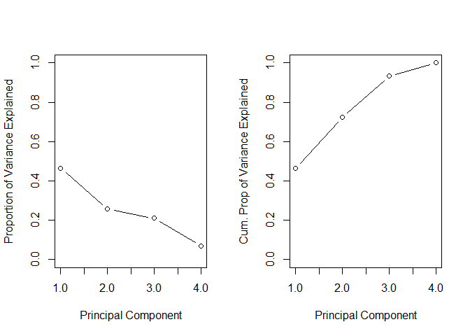<!-- -->

``` r
#Selecting only the PC's up to a 80% variance explained threshold using caret
PCs_eighty <- preProcess(df_no_shares, method = c("center","scale", "pca"), thresh = .8)
#Creating a data frame with just my PC's, day variables, and log_shares to use later as a regression
df_PC <- predict(PCs_eighty, newdata = df_no_shares)
#Monday is excluded to avoid multicollinearity
df_PC <- df_PC %>%
  bind_cols(log_shares = continuous$log_shares,tuesday = train$tuesday, 
            wednesday = train$wednesday, thursday = train$thursday, friday = train$friday,
            saturday = train$saturday, sunday = train$sunday)
screeplot(PCs, type = "lines")
biplot(PCs)
```

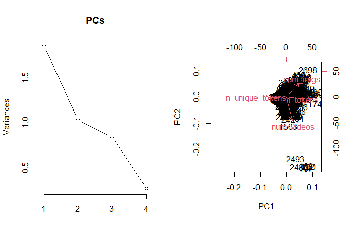<!-- -->

``` r
#Second chunk of code for screeplot and biplot

df_no_shares <- continuous %>%
  select(n_tokens_title,kw_avg_min,kw_max_max,kw_avg_max,kw_avg_avg)
#Creating PC's along with center and scaling variables
PCs <- prcomp(df_no_shares, center = TRUE, scale = TRUE)
#Creating screeplots
par(mfrow = c(1,2))
plot(PCs$sdev^2/sum(PCs$sdev^2), xlab = "Principal Component",
ylab = "Proportion of Variance Explained", ylim = c(0, 1), type = 'b')
plot(cumsum(PCs$sdev^2/sum(PCs$sdev^2)), xlab = "Principal Component",
ylab = "Cum. Prop of Variance Explained", ylim = c(0, 1), type = 'b')
```

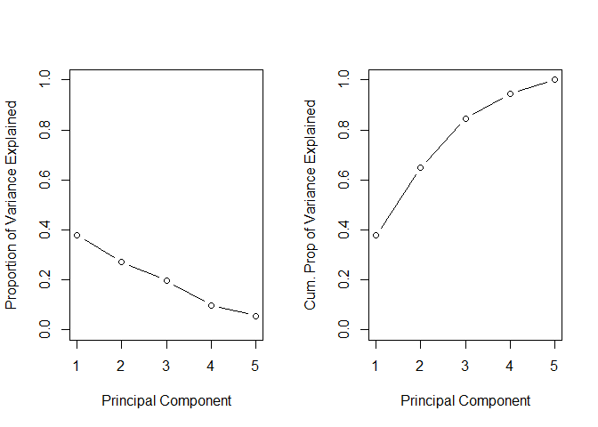<!-- -->

``` r
#Selecting only the PC's up to a 80% variance explained threshold using caret
PCs_eighty <- preProcess(df_no_shares, method = c("center","scale", "pca"), thresh = .8)
#Creating a data frame with just my PC's, day variables, and log_shares to use later as a regression
df_PC <- predict(PCs_eighty, newdata = df_no_shares)
#Monday is excluded to avoid multicollinearity
df_PC <- df_PC %>%
  bind_cols(log_shares = continuous$log_shares,tuesday = train$tuesday, 
            wednesday = train$wednesday, thursday = train$thursday, friday = train$friday,
            saturday = train$saturday, sunday = train$sunday)
screeplot(PCs, type = "lines")
biplot(PCs)
```

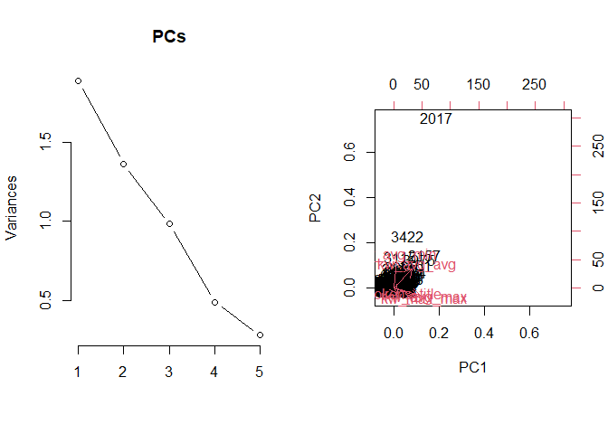<!-- -->

``` r
#Third Chunk


df_no_shares <- continuous %>%
  select(global_subjectivity,global_sentiment_polarity,global_rate_positive_words,global_rate_negative_words)
#Creating PC's along with center and scaling variables
PCs <- prcomp(df_no_shares, center = TRUE, scale = TRUE)
#Creating screeplots
par(mfrow = c(1,2))
plot(PCs$sdev^2/sum(PCs$sdev^2), xlab = "Principal Component",
ylab = "Proportion of Variance Explained", ylim = c(0, 1), type = 'b')
plot(cumsum(PCs$sdev^2/sum(PCs$sdev^2)), xlab = "Principal Component",
ylab = "Cum. Prop of Variance Explained", ylim = c(0, 1), type = 'b')
```

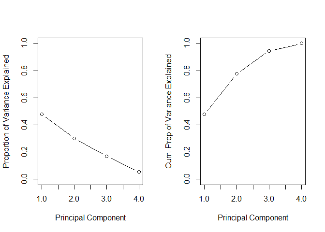<!-- -->

``` r
#Selecting only the PC's up to a 80% variance explained threshold using caret
PCs_eighty <- preProcess(df_no_shares, method = c("center","scale", "pca"), thresh = .8)
#Creating a data frame with just my PC's, day variables, and log_shares to use later as a regression
df_PC <- predict(PCs_eighty, newdata = df_no_shares)
#Monday is excluded to avoid multicollinearity
df_PC <- df_PC %>%
  bind_cols(log_shares = continuous$log_shares,tuesday = train$tuesday, 
            wednesday = train$wednesday, thursday = train$thursday, friday = train$friday,
            saturday = train$saturday, sunday = train$sunday)
screeplot(PCs, type = "lines")
biplot(PCs)
```

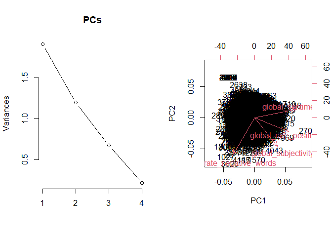<!-- -->

## Automation

\#install.packages(“purrr”)

``` r
library(purrr)
library(tidyverse)
#get data channels
channelIDs <- data.frame("lifestyle", "entertainment", "bus", "socmed", "tech", "world")
channelIDs
#create filenames
output_file <- paste0(channelIDs, ".md")
#create a list for each team with just the team name parameter
params<- lapply(channelIDs, FUN = function(x){list(channel = x)})
params
#put into a data frame
reports <- tibble(output_file, params)
reports

library(rmarkdown)
#render code
apply(reports, MARGIN = 1,
FUN = function(x){
render(input = "Project 3 Final.Rmd", output_file = x[[1]], params = x[[2]])
})
```
