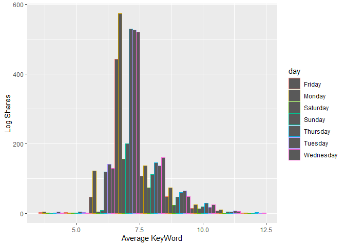
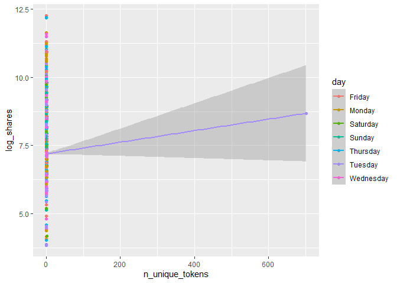
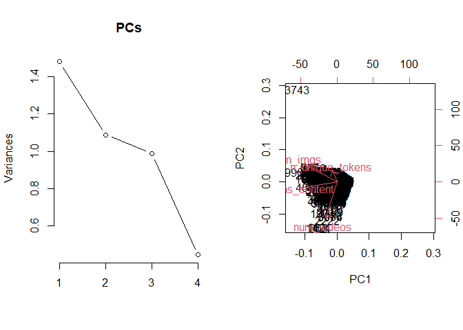
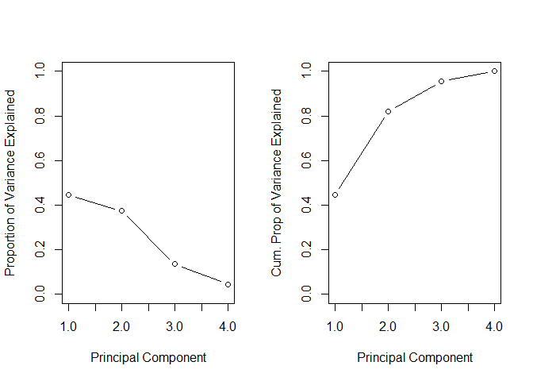

Project 3
================
Richard Xiao & Xi Yang
2022-11-12

## Introduction section

This is an online news popularity data set, and dataset summarizes a
heterogeneous set of features about articles published by Mashable in a
period of two years. The goal is to predict the number of shares in
social networks (popularity). We’re thinking about what kind of articles
are we most likely to share, and we believe there are two aspects. One
is objectivity. Users can feel the content is useful and valuable. The
other one is subjectivity. Users agree with the attitudes expressed in
the article, and also, the emotion expressed in the article resonated
with users.

Based on the two aspects, we choose 21 variables, and they are
n_tokens_title, n_tokens_content, n_unique_tokens, num_imgs, num_videos,
kw_avg_min, kw_max_max, kw_avg_max, kw_avg_avg, weekday_is_monday,
weekday_is_tuesday, weekday_is_wednesday, weekday_is_thursday,
weekday_is_friday,. weekday_is_saturday, weekday_is_sunday,
global_subjectivity, global_sentiment_polarity,
global_rate_positive_words, global_rate_negative_words, and share.

We produce some basic analysis before we fitting the model. The purpose
is to inspect the trends between different variables with respect to the
number of share, and also, figure out the correlation between a few
notable numeric variables. It helps the reader understand the summary or
graph.

For a linear regression model, we’ll use forward stepwise and LASSO
regression model. For an ensemble tree-based model, we’ll fit random
forest and boosted tree model.

## Data

``` r
library(tidyverse)
library(caret)
#read in data
df1 <- read_csv("OnlineNewsPopularity.csv")
```

    ## Rows: 39644 Columns: 61
    ## ── Column specification ────────────────────────────────────────────────────────────────────────────────────────
    ## Delimiter: ","
    ## chr  (1): url
    ## dbl (60): timedelta, n_tokens_title, n_tokens_content, n_unique_tokens, n_non_stop_words, n_non_stop_unique_...
    ## 
    ## ℹ Use `spec()` to retrieve the full column specification for this data.
    ## ℹ Specify the column types or set `show_col_types = FALSE` to quiet this message.

``` r
df1
#Remove the first two variables we don't need. Also want to rename the day variables to make it easier for analysis with rename variable.


df <- df1 %>%
  select(-c(url, timedelta)) %>%
  mutate(log_shares = log(shares)) %>%
  select(-shares) %>% rename(monday = weekday_is_monday , tuesday = weekday_is_tuesday, wednesday = weekday_is_wednesday, thursday = weekday_is_thursday, friday =     weekday_is_friday, saturday = weekday_is_saturday, sunday = weekday_is_sunday)
df 
#setting up data channel 
selectchannel<- paste0("data_channel_is_", params[[1]])
df<- df %>% filter(get(selectchannel) ==1 ) 
df
set.seed(100)
index <- createDataPartition(df$log_shares, p = .7, list = FALSE)
train <- df[index,]
test <- df[-index,]
train
test
```

## Summarizations

### 1. Plotting the correlation between a few notable numeric variables.

``` r
library(tidyverse)
library(corrplot)
cor_mat <- cor(train %>% select(log_shares,num_imgs,num_videos,n_tokens_content,n_tokens_title,kw_avg_min,kw_max_max,kw_avg_max,kw_avg_avg,global_subjectivity,global_sentiment_polarity,global_rate_positive_words), method = "pearson")
corrplot(cor_mat, hc.order = TRUE,
type = "lower",
tl.pos = "lt",
title = "Correlation Coefficients for log of shares",
subtitle = "Correlation Coefficients for log of shares",
mar=c(0,0,2,0)
)
```

    ## Warning in text.default(pos.xlabel[, 1], pos.xlabel[, 2], newcolnames, srt = tl.srt, : "hc.order" is not a
    ## graphical parameter

    ## Warning in text.default(pos.xlabel[, 1], pos.xlabel[, 2], newcolnames, srt = tl.srt, : "subtitle" is not a
    ## graphical parameter

    ## Warning in text.default(pos.ylabel[, 1], pos.ylabel[, 2], newrownames, col = tl.col, : "hc.order" is not a
    ## graphical parameter

    ## Warning in text.default(pos.ylabel[, 1], pos.ylabel[, 2], newrownames, col = tl.col, : "subtitle" is not a
    ## graphical parameter

    ## Warning in title(title, ...): "hc.order" is not a graphical parameter

    ## Warning in title(title, ...): "subtitle" is not a graphical parameter

<!-- -->

From the correlation graph, if the variable has a darker blue color, it
will signify a strong positive correlation with the other variable
whereas if it has a darker red color, it will have a stronger negative
correlation with the other variable.

``` r
#This new dataframe converts the days into categorical values for graphing.
moddf <- train%>%
  mutate(day = if_else(monday == 1,"Monday",if_else(tuesday == 1,"Tuesday",if_else(wednesday == 1,"Wednesday",if_else(
thursday == 1,"Thursday",if_else(friday == 1,"Friday",if_else(saturday == 1,"Saturday", "Sunday")))))))
#Eliminates any categorical variables for use of principal component analysis
continuous <- train %>%select(-c(monday, tuesday, wednesday, thursday,friday, saturday, sunday, is_weekend, ))
```

### 2. Boxplot for log shares subdivided by days.

``` r
#Boxplot for log shares subdivided by days.
ggplot(moddf, aes(x = day, y = log_shares, col = day)) + 
  geom_boxplot(fill="grey") + 
  geom_jitter() + 
  ylab("log(shares)") + 
  xlab("") +
  theme(axis.text.x = element_text(angle = 45)) +
  ggtitle("Boxplot for Log Shares by Day")
```

<!-- -->

### 3. Scatterplot for log shares and number of images

``` r
#Scatterplot for log shares and number of images
ggplot(moddf, aes(y = log_shares, x = num_imgs, color = day)) + 
  geom_point(stat = "identity", position = "jitter") + 
  geom_smooth( method = "lm")  + 
  xlab("num_hrefs") + 
  ylab("log_shares")
```

    ## `geom_smooth()` using formula 'y ~ x'

<!-- -->

### 4. Scatterplot for log shares and number of videos.

``` r
#Scatterplot for log shares and number of videos.
ggplot(moddf, aes(y = log_shares, x = num_videos, color = day)) + 
  geom_point(stat = "identity", position = "jitter") + 
  geom_smooth( method = "lm")  + 
  xlab("num_hrefs") + 
  ylab("log_shares")
```

    ## `geom_smooth()` using formula 'y ~ x'

<!-- -->

### 5. Histogram for log shares

``` r
#Histogram for log shares 
ggplot(moddf, aes(x=log_shares, fill = kw_avg_avg, color = day)) + geom_histogram(binwidth = 1, position="dodge") + xlab("Average KeyWord") + ylab("Log Shares")
```

<!-- -->

### 6. Scatterplot for number of unique tokens and log shares

``` r
#Scatterplot for number of unique tokens and log shares
ggplot(moddf, aes(y = log_shares, x = n_unique_tokens, color = day)) + 
  geom_point(stat = "identity", position = "jitter") + 
  geom_smooth( method = "lm")  + 
  xlab("n_unique_tokens") + 
  ylab("log_shares")
```

    ## `geom_smooth()` using formula 'y ~ x'

<!-- -->

### 7. Scatterplot for number of tokens content and log shares

``` r
#Scatterplot for number of tokens content and log shares
ggplot(moddf, aes(y = log_shares, x = n_tokens_content, color = day)) + 
  geom_point(stat = "identity", position = "jitter") + 
  geom_smooth( method = "lm")  + 
  xlab("n_tokens_content") + 
  ylab("log_shares")
```

    ## `geom_smooth()` using formula 'y ~ x'

<!-- -->

### 8. Scatterplot for number of token titles and log shares

``` r
#Scatterplot for number of token titles and log shares
ggplot(moddf, aes(y = log_shares, x = n_tokens_title, color = day)) + 
  geom_point(stat = "identity", position = "jitter") + 
  geom_smooth( method = "lm")  + 
  xlab("n_tokens_title") + 
  ylab("log_shares")
```

    ## `geom_smooth()` using formula 'y ~ x'

<!-- -->

### 9. General summary statistics for continuous dataframe

The code chunk below will give summary statistics for the twelve
variables that we want to analyze. The results are ordered by descending
standard deviation. We want to know the general statistics for all of
these variables to see how they compare against each other.

### 10. Numerical summary of categorical variable is_weekend

let’s pull a summary of the number of shares. One of the factors that
most affects the number of shares is whether the day is weekday or
weekend. I wanted to look at the average, standard deviation, median and
IQR values of number of shares on weekdays and weekend. If the value of
average is larger , then articles tend to be shared more often.

``` r
library(tidyverse)
train %>%
  group_by(is_weekend) %>%
  summarise(average=mean(log_shares), median=median(log_shares), sd=sd(log_shares), IQR=IQR(log_shares))
```

### 11. Dependence of number of shares on text subjectivity

A scatter plot with the number of shares on the y-axis and the text
subjectivity on the x-axis is created: we can inspect the trend of
shares as a function of the text subjectivity. We know that if the value
of text subjectivity is 0, it stands for the article is very objective,
and value 1 stands for very subjective. If the most points distributed
lower than 0.5, then articles with more objectivity tend to be shared
more often. If the most points distributed larger than 0.5, then
articles with more subjectivity tend to be shared more often. If the
most points distributed around 0.5, then articles with more neutrality
tend to be shared more often.

``` r
library(tidyverse)
library(ggplot2)
subjectivityData <- train %>% group_by(global_subjectivity) %>% summarize(sharecount = mean(log_shares))
ggplot(subjectivityData, aes(x = global_subjectivity, y = sharecount, color =global_subjectivity)) +
geom_point() +
ggtitle("dependence of number of shares on text subjectivity ")
```

<!-- -->

### 12. Dependence of number of shares on text sentiment polarity

A scatter plot with the number of shares on the y-axis and the text
sentiment polarity on the x-axis is created: we can inspect the trend of
shares as a function of the text sentiment polarity. We know that if the
value of text sentiment polarity is greater than -1 and less than 0, it
stands for the article sentiment is negative emotion. If the value of
text sentiment polarity is greater than 0 and less than 1, it stands for
the article sentiment is positive emotion. If the most points
distributed around (-1,0), then articles with negative emotion tend to
be shared more often. If the most points distributed around (0,1), then
articles with positive emotion tend to be shared more often. If the most
points distributed around 0, then articles with neutral emotion tend to
be shared more often.

``` r
library(tidyverse)
library(ggplot2)
sentimentpolarityData <- train %>% group_by(global_sentiment_polarity) %>% summarize(sharecount = mean(log_shares))
ggplot(sentimentpolarityData, aes(x = global_sentiment_polarity, y = sharecount, color =global_sentiment_polarity)) +
geom_point() +
ggtitle("dependence of number of shares on text sentiment polarity ")
```

<!-- -->

### 13. Dependence of number of shares on positive word rate

A scatter plot with the number of shares on the y-axis and the positive
word rate on the x-axis is created: we can inspect the trend of shares
as a function of the positive word rate. If the points show an upward
trend, then articles with more positive words tend to be shared more
often. If we see a negative trend then articles with more positive words
tend to be shared less often.

``` r
library(tidyverse)
library(ggplot2)
positivewordsData <- train %>% group_by(global_rate_positive_words) %>% summarize(sharecount = mean(log_shares))
ggplot(positivewordsData, aes(x = global_rate_positive_words, y = sharecount), color=global_rate_positive_words) +
geom_point() +
geom_smooth(method = "lm") +
ggtitle("dependence of number of shares on positive word rate ")
```

    ## `geom_smooth()` using formula 'y ~ x'

<!-- --> \###
14. Dependence of number of shares on negative words rate

A scatter plot with the number of shares on the y-axis and the negative
words rate on the x-axis is created: we can inspect the trend of shares
as a function of the negative words rate. If the points show an upward
trend, then articles with more negative words tend to be shared more
often. If we see a negative trend then articles with more negative words
tend to be shared less often.

``` r
library(tidyverse)
library(ggplot2)
negativewordsData <- train %>% group_by(global_rate_negative_words) %>% summarize(sharecount = mean(log_shares))
ggplot(negativewordsData, aes(x = global_rate_negative_words, y = sharecount)) +
geom_point() +
geom_smooth(method = "lm") +
ggtitle("dependence of number of shares on negative words rate")
```

    ## `geom_smooth()` using formula 'y ~ x'

<!-- -->

## Modeling

For models below, I have selected the log_shares as the dependent
variable, and num_imgs, num_videos, n_tokens_content, n_unique_tokens,
n_tokens_title, kw_avg_min, kw_max_max, kw_avg_max,
kw_avg_avg,global_subjectivity, global_sentiment_polarity,
global_rate_positive_words, global_rate_negative_words, monday, tuesday,
wednesday, thursday, friday, saturday, sunday as the independent
variables.

``` r
library(tidyverse)
#Select variables of interest for analysis.
analysis <- train %>% select(log_shares,num_imgs,num_videos,n_tokens_content,n_unique_tokens,n_tokens_title,kw_avg_min,kw_max_max,kw_avg_max,kw_avg_avg,global_subjectivity,global_sentiment_polarity,global_rate_positive_words,global_rate_negative_words,monday,tuesday,wednesday,thursday,friday,saturday,sunday)
analysis
```

Here after all the models formulated below, to compare them, I am
predicting the test data on this model to derive some common metrics
like RMSE and R squared values that can be used to compare multiple
models. For prediction, I am using predict() function, and to extract
prediction metrics, I am using postResample() function.

### 1. LASSO Regression Model

Lasso regression is a type of linear regression that uses shrinkage.
Shrinkage is where data values are shrunk towards a central point, like
the mean. The lasso procedure encourages simple, sparse models
(i.e. models with fewer parameters). This particular type of regression
is well-suited for models showing high levels of multicollinearity or
when you want to automate certain parts of model selection, like
variable selection/parameter elimination.

``` r
library(caret)
fitLASSO <- train(log_shares ~ ., data = analysis,
method = "lasso",
preProcess = c("center", "scale"),
trControl = trainControl(method = "cv", number = 10)
)
predLASSO <- predict(fitLASSO, newdata = test)
m1<-postResample(predLASSO, obs = test$log_shares)
m1
```

    ##       RMSE   Rsquared        MAE 
    ## 0.92203494 0.06093185 0.66815511

### 2. Boosted Tree Model

Boosting is an ensemble learning method that combines a set of weak
learners into a strong learner to minimize training errors. In boosting,
a random sample of data is selected, fitted with a model and then
trained sequentially—that is, each model tries to compensate for the
weaknesses of its predecessor. With each iteration, the weak rules from
each individual classifier are combined to form one, strong prediction
rule.

``` r
library(caret)
boostedFit <- train(log_shares ~ ., data = analysis, method = "gbm",trControl = trainControl(method = "cv" , number = 10),
                    preProcess = c("center", "scale"),
                    tuneGrid = expand.grid(n.trees = c(25, 50, 100, 150, 200),
                                           interaction.depth = 1:4,
                                           shrinkage = 0.1,
                                           n.minobsinnode = 10)
                    )
```

    ## Iter   TrainDeviance   ValidDeviance   StepSize   Improve
    ##      1        0.8580             nan     0.1000    0.0064
    ##      2        0.8524             nan     0.1000    0.0048
    ##      3        0.8483             nan     0.1000    0.0042
    ##      4        0.8450             nan     0.1000    0.0019
    ##      5        0.8418             nan     0.1000    0.0026
    ##      6        0.8392             nan     0.1000    0.0025
    ##      7        0.8370             nan     0.1000    0.0022
    ##      8        0.8344             nan     0.1000    0.0022
    ##      9        0.8322             nan     0.1000    0.0017
    ##     10        0.8304             nan     0.1000    0.0012
    ##     20        0.8173             nan     0.1000    0.0002
    ##     40        0.8021             nan     0.1000    0.0002
    ##     60        0.7922             nan     0.1000   -0.0006
    ##     80        0.7854             nan     0.1000   -0.0004
    ##    100        0.7806             nan     0.1000   -0.0002
    ##    120        0.7768             nan     0.1000   -0.0001
    ##    140        0.7741             nan     0.1000   -0.0001
    ##    160        0.7713             nan     0.1000   -0.0003
    ##    180        0.7689             nan     0.1000   -0.0007
    ##    200        0.7666             nan     0.1000   -0.0004
    ## 
    ## Iter   TrainDeviance   ValidDeviance   StepSize   Improve
    ##      1        0.8563             nan     0.1000    0.0088
    ##      2        0.8504             nan     0.1000    0.0052
    ##      3        0.8447             nan     0.1000    0.0057
    ##      4        0.8400             nan     0.1000    0.0043
    ##      5        0.8364             nan     0.1000    0.0029
    ##      6        0.8320             nan     0.1000    0.0036
    ##      7        0.8279             nan     0.1000    0.0033
    ##      8        0.8255             nan     0.1000    0.0019
    ##      9        0.8229             nan     0.1000    0.0018
    ##     10        0.8192             nan     0.1000    0.0017
    ##     20        0.7997             nan     0.1000    0.0003
    ##     40        0.7787             nan     0.1000   -0.0006
    ##     60        0.7681             nan     0.1000   -0.0002
    ##     80        0.7591             nan     0.1000   -0.0008
    ##    100        0.7503             nan     0.1000   -0.0005
    ##    120        0.7444             nan     0.1000   -0.0005
    ##    140        0.7366             nan     0.1000   -0.0002
    ##    160        0.7299             nan     0.1000   -0.0002
    ##    180        0.7237             nan     0.1000   -0.0004
    ##    200        0.7188             nan     0.1000   -0.0010
    ## 
    ## Iter   TrainDeviance   ValidDeviance   StepSize   Improve
    ##      1        0.8554             nan     0.1000    0.0081
    ##      2        0.8469             nan     0.1000    0.0071
    ##      3        0.8403             nan     0.1000    0.0059
    ##      4        0.8328             nan     0.1000    0.0064
    ##      5        0.8271             nan     0.1000    0.0039
    ##      6        0.8228             nan     0.1000    0.0033
    ##      7        0.8193             nan     0.1000    0.0017
    ##      8        0.8149             nan     0.1000    0.0025
    ##      9        0.8128             nan     0.1000    0.0008
    ##     10        0.8096             nan     0.1000    0.0023
    ##     20        0.7888             nan     0.1000   -0.0001
    ##     40        0.7632             nan     0.1000    0.0002
    ##     60        0.7473             nan     0.1000   -0.0006
    ##     80        0.7357             nan     0.1000   -0.0006
    ##    100        0.7229             nan     0.1000   -0.0010
    ##    120        0.7126             nan     0.1000   -0.0009
    ##    140        0.7045             nan     0.1000   -0.0006
    ##    160        0.6956             nan     0.1000   -0.0007
    ##    180        0.6869             nan     0.1000   -0.0010
    ##    200        0.6790             nan     0.1000   -0.0006
    ## 
    ## Iter   TrainDeviance   ValidDeviance   StepSize   Improve
    ##      1        0.8536             nan     0.1000    0.0093
    ##      2        0.8427             nan     0.1000    0.0084
    ##      3        0.8343             nan     0.1000    0.0069
    ##      4        0.8282             nan     0.1000    0.0051
    ##      5        0.8230             nan     0.1000    0.0031
    ##      6        0.8181             nan     0.1000    0.0022
    ##      7        0.8137             nan     0.1000    0.0014
    ##      8        0.8095             nan     0.1000    0.0029
    ##      9        0.8058             nan     0.1000    0.0015
    ##     10        0.8021             nan     0.1000    0.0017
    ##     20        0.7793             nan     0.1000    0.0014
    ##     40        0.7525             nan     0.1000   -0.0002
    ##     60        0.7338             nan     0.1000   -0.0004
    ##     80        0.7182             nan     0.1000   -0.0003
    ##    100        0.7034             nan     0.1000    0.0001
    ##    120        0.6911             nan     0.1000   -0.0004
    ##    140        0.6763             nan     0.1000   -0.0005
    ##    160        0.6658             nan     0.1000   -0.0007
    ##    180        0.6549             nan     0.1000   -0.0009
    ##    200        0.6440             nan     0.1000   -0.0012
    ## 
    ## Iter   TrainDeviance   ValidDeviance   StepSize   Improve
    ##      1        0.8449             nan     0.1000    0.0048
    ##      2        0.8400             nan     0.1000    0.0047
    ##      3        0.8353             nan     0.1000    0.0033
    ##      4        0.8326             nan     0.1000    0.0023
    ##      5        0.8299             nan     0.1000    0.0030
    ##      6        0.8268             nan     0.1000    0.0021
    ##      7        0.8245             nan     0.1000    0.0021
    ##      8        0.8223             nan     0.1000    0.0020
    ##      9        0.8201             nan     0.1000    0.0010
    ##     10        0.8183             nan     0.1000    0.0015
    ##     20        0.8057             nan     0.1000    0.0006
    ##     40        0.7914             nan     0.1000    0.0001
    ##     60        0.7824             nan     0.1000   -0.0002
    ##     80        0.7757             nan     0.1000    0.0000
    ##    100        0.7711             nan     0.1000    0.0000
    ##    120        0.7671             nan     0.1000   -0.0002
    ##    140        0.7633             nan     0.1000   -0.0004
    ##    160        0.7599             nan     0.1000   -0.0003
    ##    180        0.7578             nan     0.1000   -0.0001
    ##    200        0.7558             nan     0.1000   -0.0002
    ## 
    ## Iter   TrainDeviance   ValidDeviance   StepSize   Improve
    ##      1        0.8420             nan     0.1000    0.0075
    ##      2        0.8360             nan     0.1000    0.0057
    ##      3        0.8295             nan     0.1000    0.0050
    ##      4        0.8259             nan     0.1000    0.0038
    ##      5        0.8208             nan     0.1000    0.0036
    ##      6        0.8173             nan     0.1000    0.0030
    ##      7        0.8142             nan     0.1000    0.0029
    ##      8        0.8107             nan     0.1000    0.0023
    ##      9        0.8079             nan     0.1000    0.0020
    ##     10        0.8052             nan     0.1000    0.0018
    ##     20        0.7896             nan     0.1000    0.0005
    ##     40        0.7709             nan     0.1000   -0.0000
    ##     60        0.7581             nan     0.1000   -0.0003
    ##     80        0.7474             nan     0.1000   -0.0009
    ##    100        0.7397             nan     0.1000   -0.0002
    ##    120        0.7335             nan     0.1000   -0.0009
    ##    140        0.7277             nan     0.1000   -0.0002
    ##    160        0.7221             nan     0.1000   -0.0005
    ##    180        0.7155             nan     0.1000   -0.0006
    ##    200        0.7096             nan     0.1000   -0.0004
    ## 
    ## Iter   TrainDeviance   ValidDeviance   StepSize   Improve
    ##      1        0.8414             nan     0.1000    0.0085
    ##      2        0.8328             nan     0.1000    0.0071
    ##      3        0.8272             nan     0.1000    0.0045
    ##      4        0.8219             nan     0.1000    0.0043
    ##      5        0.8169             nan     0.1000    0.0045
    ##      6        0.8122             nan     0.1000    0.0037
    ##      7        0.8084             nan     0.1000    0.0030
    ##      8        0.8044             nan     0.1000    0.0032
    ##      9        0.8010             nan     0.1000    0.0023
    ##     10        0.7978             nan     0.1000    0.0014
    ##     20        0.7781             nan     0.1000    0.0002
    ##     40        0.7564             nan     0.1000   -0.0001
    ##     60        0.7400             nan     0.1000   -0.0000
    ##     80        0.7276             nan     0.1000   -0.0004
    ##    100        0.7165             nan     0.1000   -0.0003
    ##    120        0.7057             nan     0.1000   -0.0004
    ##    140        0.6950             nan     0.1000   -0.0009
    ##    160        0.6849             nan     0.1000   -0.0008
    ##    180        0.6761             nan     0.1000   -0.0008
    ##    200        0.6678             nan     0.1000   -0.0011
    ## 
    ## Iter   TrainDeviance   ValidDeviance   StepSize   Improve
    ##      1        0.8389             nan     0.1000    0.0079
    ##      2        0.8309             nan     0.1000    0.0070
    ##      3        0.8229             nan     0.1000    0.0063
    ##      4        0.8162             nan     0.1000    0.0053
    ##      5        0.8104             nan     0.1000    0.0042
    ##      6        0.8055             nan     0.1000    0.0036
    ##      7        0.8012             nan     0.1000    0.0023
    ##      8        0.7976             nan     0.1000    0.0014
    ##      9        0.7939             nan     0.1000    0.0014
    ##     10        0.7908             nan     0.1000    0.0025
    ##     20        0.7692             nan     0.1000   -0.0003
    ##     40        0.7420             nan     0.1000   -0.0019
    ##     60        0.7224             nan     0.1000   -0.0007
    ##     80        0.7065             nan     0.1000   -0.0008
    ##    100        0.6918             nan     0.1000   -0.0006
    ##    120        0.6772             nan     0.1000   -0.0008
    ##    140        0.6667             nan     0.1000   -0.0020
    ##    160        0.6560             nan     0.1000   -0.0010
    ##    180        0.6451             nan     0.1000   -0.0010
    ##    200        0.6354             nan     0.1000   -0.0006
    ## 
    ## Iter   TrainDeviance   ValidDeviance   StepSize   Improve
    ##      1        0.8559             nan     0.1000    0.0055
    ##      2        0.8509             nan     0.1000    0.0045
    ##      3        0.8467             nan     0.1000    0.0041
    ##      4        0.8425             nan     0.1000    0.0028
    ##      5        0.8393             nan     0.1000    0.0017
    ##      6        0.8366             nan     0.1000    0.0023
    ##      7        0.8346             nan     0.1000    0.0019
    ##      8        0.8319             nan     0.1000    0.0020
    ##      9        0.8300             nan     0.1000    0.0012
    ##     10        0.8279             nan     0.1000    0.0017
    ##     20        0.8147             nan     0.1000    0.0003
    ##     40        0.7989             nan     0.1000    0.0003
    ##     60        0.7895             nan     0.1000    0.0001
    ##     80        0.7835             nan     0.1000   -0.0002
    ##    100        0.7785             nan     0.1000   -0.0003
    ##    120        0.7740             nan     0.1000   -0.0002
    ##    140        0.7704             nan     0.1000   -0.0003
    ##    160        0.7674             nan     0.1000   -0.0006
    ##    180        0.7650             nan     0.1000   -0.0005
    ##    200        0.7627             nan     0.1000   -0.0002
    ## 
    ## Iter   TrainDeviance   ValidDeviance   StepSize   Improve
    ##      1        0.8538             nan     0.1000    0.0085
    ##      2        0.8466             nan     0.1000    0.0052
    ##      3        0.8406             nan     0.1000    0.0049
    ##      4        0.8358             nan     0.1000    0.0027
    ##      5        0.8311             nan     0.1000    0.0028
    ##      6        0.8281             nan     0.1000    0.0033
    ##      7        0.8253             nan     0.1000    0.0016
    ##      8        0.8225             nan     0.1000    0.0018
    ##      9        0.8198             nan     0.1000    0.0015
    ##     10        0.8170             nan     0.1000    0.0025
    ##     20        0.7978             nan     0.1000    0.0010
    ##     40        0.7772             nan     0.1000   -0.0002
    ##     60        0.7643             nan     0.1000   -0.0001
    ##     80        0.7543             nan     0.1000   -0.0003
    ##    100        0.7452             nan     0.1000   -0.0003
    ##    120        0.7383             nan     0.1000   -0.0010
    ##    140        0.7326             nan     0.1000   -0.0011
    ##    160        0.7249             nan     0.1000   -0.0003
    ##    180        0.7185             nan     0.1000   -0.0004
    ##    200        0.7121             nan     0.1000   -0.0004
    ## 
    ## Iter   TrainDeviance   ValidDeviance   StepSize   Improve
    ##      1        0.8526             nan     0.1000    0.0093
    ##      2        0.8443             nan     0.1000    0.0069
    ##      3        0.8372             nan     0.1000    0.0063
    ##      4        0.8322             nan     0.1000    0.0050
    ##      5        0.8278             nan     0.1000    0.0034
    ##      6        0.8231             nan     0.1000    0.0033
    ##      7        0.8186             nan     0.1000    0.0027
    ##      8        0.8156             nan     0.1000    0.0023
    ##      9        0.8115             nan     0.1000    0.0033
    ##     10        0.8079             nan     0.1000    0.0022
    ##     20        0.7852             nan     0.1000    0.0010
    ##     40        0.7609             nan     0.1000   -0.0003
    ##     60        0.7433             nan     0.1000   -0.0006
    ##     80        0.7301             nan     0.1000   -0.0004
    ##    100        0.7183             nan     0.1000   -0.0007
    ##    120        0.7070             nan     0.1000   -0.0003
    ##    140        0.6975             nan     0.1000   -0.0006
    ##    160        0.6879             nan     0.1000   -0.0006
    ##    180        0.6787             nan     0.1000   -0.0010
    ##    200        0.6695             nan     0.1000   -0.0004
    ## 
    ## Iter   TrainDeviance   ValidDeviance   StepSize   Improve
    ##      1        0.8527             nan     0.1000    0.0091
    ##      2        0.8441             nan     0.1000    0.0064
    ##      3        0.8348             nan     0.1000    0.0075
    ##      4        0.8275             nan     0.1000    0.0049
    ##      5        0.8206             nan     0.1000    0.0047
    ##      6        0.8153             nan     0.1000    0.0027
    ##      7        0.8097             nan     0.1000    0.0034
    ##      8        0.8053             nan     0.1000    0.0024
    ##      9        0.8014             nan     0.1000   -0.0001
    ##     10        0.7985             nan     0.1000    0.0005
    ##     20        0.7737             nan     0.1000    0.0007
    ##     40        0.7451             nan     0.1000   -0.0012
    ##     60        0.7278             nan     0.1000   -0.0010
    ##     80        0.7081             nan     0.1000   -0.0008
    ##    100        0.6916             nan     0.1000   -0.0011
    ##    120        0.6778             nan     0.1000   -0.0010
    ##    140        0.6641             nan     0.1000   -0.0014
    ##    160        0.6514             nan     0.1000   -0.0010
    ##    180        0.6397             nan     0.1000   -0.0007
    ##    200        0.6280             nan     0.1000    0.0001
    ## 
    ## Iter   TrainDeviance   ValidDeviance   StepSize   Improve
    ##      1        0.8398             nan     0.1000    0.0035
    ##      2        0.8343             nan     0.1000    0.0048
    ##      3        0.8303             nan     0.1000    0.0040
    ##      4        0.8269             nan     0.1000    0.0031
    ##      5        0.8238             nan     0.1000    0.0028
    ##      6        0.8213             nan     0.1000    0.0018
    ##      7        0.8187             nan     0.1000    0.0021
    ##      8        0.8167             nan     0.1000    0.0017
    ##      9        0.8149             nan     0.1000    0.0012
    ##     10        0.8134             nan     0.1000    0.0009
    ##     20        0.7989             nan     0.1000    0.0004
    ##     40        0.7845             nan     0.1000    0.0001
    ##     60        0.7752             nan     0.1000   -0.0000
    ##     80        0.7695             nan     0.1000   -0.0005
    ##    100        0.7649             nan     0.1000   -0.0004
    ##    120        0.7603             nan     0.1000   -0.0005
    ##    140        0.7577             nan     0.1000   -0.0003
    ##    160        0.7556             nan     0.1000   -0.0003
    ##    180        0.7531             nan     0.1000    0.0001
    ##    200        0.7506             nan     0.1000   -0.0004
    ## 
    ## Iter   TrainDeviance   ValidDeviance   StepSize   Improve
    ##      1        0.8371             nan     0.1000    0.0070
    ##      2        0.8305             nan     0.1000    0.0061
    ##      3        0.8251             nan     0.1000    0.0048
    ##      4        0.8203             nan     0.1000    0.0042
    ##      5        0.8159             nan     0.1000    0.0037
    ##      6        0.8122             nan     0.1000    0.0032
    ##      7        0.8088             nan     0.1000    0.0020
    ##      8        0.8053             nan     0.1000    0.0027
    ##      9        0.8029             nan     0.1000    0.0008
    ##     10        0.8013             nan     0.1000    0.0008
    ##     20        0.7843             nan     0.1000    0.0013
    ##     40        0.7648             nan     0.1000   -0.0000
    ##     60        0.7528             nan     0.1000   -0.0009
    ##     80        0.7431             nan     0.1000   -0.0010
    ##    100        0.7349             nan     0.1000   -0.0007
    ##    120        0.7274             nan     0.1000   -0.0003
    ##    140        0.7222             nan     0.1000   -0.0006
    ##    160        0.7170             nan     0.1000   -0.0003
    ##    180        0.7102             nan     0.1000   -0.0005
    ##    200        0.7049             nan     0.1000   -0.0005
    ## 
    ## Iter   TrainDeviance   ValidDeviance   StepSize   Improve
    ##      1        0.8359             nan     0.1000    0.0082
    ##      2        0.8278             nan     0.1000    0.0076
    ##      3        0.8211             nan     0.1000    0.0053
    ##      4        0.8154             nan     0.1000    0.0037
    ##      5        0.8103             nan     0.1000    0.0029
    ##      6        0.8058             nan     0.1000    0.0040
    ##      7        0.8021             nan     0.1000    0.0030
    ##      8        0.7989             nan     0.1000    0.0025
    ##      9        0.7960             nan     0.1000    0.0013
    ##     10        0.7925             nan     0.1000    0.0011
    ##     20        0.7722             nan     0.1000    0.0001
    ##     40        0.7479             nan     0.1000   -0.0002
    ##     60        0.7334             nan     0.1000   -0.0010
    ##     80        0.7193             nan     0.1000   -0.0000
    ##    100        0.7087             nan     0.1000   -0.0007
    ##    120        0.6979             nan     0.1000   -0.0006
    ##    140        0.6880             nan     0.1000   -0.0005
    ##    160        0.6792             nan     0.1000   -0.0003
    ##    180        0.6712             nan     0.1000   -0.0005
    ##    200        0.6620             nan     0.1000   -0.0000
    ## 
    ## Iter   TrainDeviance   ValidDeviance   StepSize   Improve
    ##      1        0.8341             nan     0.1000    0.0099
    ##      2        0.8255             nan     0.1000    0.0075
    ##      3        0.8177             nan     0.1000    0.0046
    ##      4        0.8104             nan     0.1000    0.0038
    ##      5        0.8056             nan     0.1000    0.0037
    ##      6        0.8004             nan     0.1000    0.0034
    ##      7        0.7969             nan     0.1000    0.0004
    ##      8        0.7936             nan     0.1000    0.0007
    ##      9        0.7897             nan     0.1000    0.0019
    ##     10        0.7869             nan     0.1000    0.0009
    ##     20        0.7647             nan     0.1000    0.0007
    ##     40        0.7364             nan     0.1000   -0.0011
    ##     60        0.7164             nan     0.1000   -0.0008
    ##     80        0.7021             nan     0.1000   -0.0003
    ##    100        0.6875             nan     0.1000   -0.0011
    ##    120        0.6738             nan     0.1000   -0.0009
    ##    140        0.6599             nan     0.1000   -0.0005
    ##    160        0.6455             nan     0.1000   -0.0007
    ##    180        0.6337             nan     0.1000   -0.0011
    ##    200        0.6237             nan     0.1000   -0.0005
    ## 
    ## Iter   TrainDeviance   ValidDeviance   StepSize   Improve
    ##      1        0.8589             nan     0.1000    0.0058
    ##      2        0.8535             nan     0.1000    0.0052
    ##      3        0.8492             nan     0.1000    0.0040
    ##      4        0.8449             nan     0.1000    0.0032
    ##      5        0.8414             nan     0.1000    0.0025
    ##      6        0.8381             nan     0.1000    0.0017
    ##      7        0.8354             nan     0.1000    0.0023
    ##      8        0.8334             nan     0.1000    0.0018
    ##      9        0.8313             nan     0.1000    0.0016
    ##     10        0.8294             nan     0.1000    0.0016
    ##     20        0.8157             nan     0.1000    0.0008
    ##     40        0.8015             nan     0.1000   -0.0005
    ##     60        0.7918             nan     0.1000    0.0000
    ##     80        0.7856             nan     0.1000   -0.0003
    ##    100        0.7807             nan     0.1000   -0.0003
    ##    120        0.7771             nan     0.1000   -0.0005
    ##    140        0.7741             nan     0.1000   -0.0001
    ##    160        0.7713             nan     0.1000   -0.0007
    ##    180        0.7690             nan     0.1000   -0.0008
    ##    200        0.7670             nan     0.1000   -0.0005
    ## 
    ## Iter   TrainDeviance   ValidDeviance   StepSize   Improve
    ##      1        0.8558             nan     0.1000    0.0065
    ##      2        0.8496             nan     0.1000    0.0071
    ##      3        0.8427             nan     0.1000    0.0058
    ##      4        0.8375             nan     0.1000    0.0045
    ##      5        0.8331             nan     0.1000    0.0032
    ##      6        0.8291             nan     0.1000    0.0033
    ##      7        0.8260             nan     0.1000    0.0020
    ##      8        0.8230             nan     0.1000    0.0013
    ##      9        0.8197             nan     0.1000    0.0023
    ##     10        0.8180             nan     0.1000    0.0012
    ##     20        0.7989             nan     0.1000    0.0008
    ##     40        0.7798             nan     0.1000   -0.0003
    ##     60        0.7666             nan     0.1000   -0.0000
    ##     80        0.7543             nan     0.1000    0.0002
    ##    100        0.7465             nan     0.1000   -0.0000
    ##    120        0.7392             nan     0.1000   -0.0004
    ##    140        0.7317             nan     0.1000   -0.0006
    ##    160        0.7257             nan     0.1000   -0.0006
    ##    180        0.7198             nan     0.1000   -0.0005
    ##    200        0.7150             nan     0.1000   -0.0005
    ## 
    ## Iter   TrainDeviance   ValidDeviance   StepSize   Improve
    ##      1        0.8549             nan     0.1000    0.0067
    ##      2        0.8472             nan     0.1000    0.0082
    ##      3        0.8399             nan     0.1000    0.0051
    ##      4        0.8328             nan     0.1000    0.0058
    ##      5        0.8275             nan     0.1000    0.0042
    ##      6        0.8237             nan     0.1000    0.0031
    ##      7        0.8197             nan     0.1000    0.0031
    ##      8        0.8159             nan     0.1000    0.0028
    ##      9        0.8125             nan     0.1000    0.0028
    ##     10        0.8097             nan     0.1000    0.0018
    ##     20        0.7878             nan     0.1000   -0.0001
    ##     40        0.7633             nan     0.1000   -0.0001
    ##     60        0.7472             nan     0.1000    0.0001
    ##     80        0.7346             nan     0.1000   -0.0003
    ##    100        0.7238             nan     0.1000   -0.0008
    ##    120        0.7110             nan     0.1000   -0.0009
    ##    140        0.7004             nan     0.1000   -0.0004
    ##    160        0.6926             nan     0.1000   -0.0006
    ##    180        0.6832             nan     0.1000   -0.0003
    ##    200        0.6739             nan     0.1000   -0.0006
    ## 
    ## Iter   TrainDeviance   ValidDeviance   StepSize   Improve
    ##      1        0.8537             nan     0.1000    0.0093
    ##      2        0.8453             nan     0.1000    0.0066
    ##      3        0.8376             nan     0.1000    0.0073
    ##      4        0.8313             nan     0.1000    0.0045
    ##      5        0.8264             nan     0.1000    0.0036
    ##      6        0.8210             nan     0.1000    0.0035
    ##      7        0.8169             nan     0.1000    0.0027
    ##      8        0.8127             nan     0.1000    0.0028
    ##      9        0.8075             nan     0.1000    0.0035
    ##     10        0.8039             nan     0.1000    0.0024
    ##     20        0.7790             nan     0.1000    0.0001
    ##     40        0.7508             nan     0.1000   -0.0005
    ##     60        0.7302             nan     0.1000   -0.0006
    ##     80        0.7132             nan     0.1000   -0.0001
    ##    100        0.6966             nan     0.1000   -0.0007
    ##    120        0.6823             nan     0.1000   -0.0007
    ##    140        0.6676             nan     0.1000   -0.0004
    ##    160        0.6560             nan     0.1000   -0.0008
    ##    180        0.6451             nan     0.1000   -0.0009
    ##    200        0.6337             nan     0.1000   -0.0006
    ## 
    ## Iter   TrainDeviance   ValidDeviance   StepSize   Improve
    ##      1        0.8625             nan     0.1000    0.0059
    ##      2        0.8569             nan     0.1000    0.0049
    ##      3        0.8528             nan     0.1000    0.0040
    ##      4        0.8494             nan     0.1000    0.0025
    ##      5        0.8469             nan     0.1000    0.0022
    ##      6        0.8435             nan     0.1000    0.0032
    ##      7        0.8405             nan     0.1000    0.0028
    ##      8        0.8375             nan     0.1000    0.0014
    ##      9        0.8351             nan     0.1000    0.0010
    ##     10        0.8330             nan     0.1000    0.0017
    ##     20        0.8206             nan     0.1000    0.0004
    ##     40        0.8072             nan     0.1000   -0.0002
    ##     60        0.7983             nan     0.1000   -0.0006
    ##     80        0.7914             nan     0.1000    0.0001
    ##    100        0.7859             nan     0.1000   -0.0001
    ##    120        0.7825             nan     0.1000   -0.0002
    ##    140        0.7798             nan     0.1000   -0.0002
    ##    160        0.7770             nan     0.1000   -0.0011
    ##    180        0.7743             nan     0.1000   -0.0002
    ##    200        0.7719             nan     0.1000   -0.0007
    ## 
    ## Iter   TrainDeviance   ValidDeviance   StepSize   Improve
    ##      1        0.8604             nan     0.1000    0.0074
    ##      2        0.8534             nan     0.1000    0.0067
    ##      3        0.8483             nan     0.1000    0.0037
    ##      4        0.8437             nan     0.1000    0.0048
    ##      5        0.8399             nan     0.1000    0.0029
    ##      6        0.8360             nan     0.1000    0.0031
    ##      7        0.8324             nan     0.1000    0.0022
    ##      8        0.8295             nan     0.1000    0.0014
    ##      9        0.8264             nan     0.1000    0.0026
    ##     10        0.8238             nan     0.1000    0.0014
    ##     20        0.8052             nan     0.1000    0.0006
    ##     40        0.7852             nan     0.1000   -0.0002
    ##     60        0.7734             nan     0.1000   -0.0008
    ##     80        0.7637             nan     0.1000    0.0002
    ##    100        0.7557             nan     0.1000   -0.0001
    ##    120        0.7488             nan     0.1000    0.0003
    ##    140        0.7415             nan     0.1000   -0.0001
    ##    160        0.7342             nan     0.1000   -0.0005
    ##    180        0.7280             nan     0.1000    0.0003
    ##    200        0.7220             nan     0.1000   -0.0005
    ## 
    ## Iter   TrainDeviance   ValidDeviance   StepSize   Improve
    ##      1        0.8589             nan     0.1000    0.0094
    ##      2        0.8505             nan     0.1000    0.0075
    ##      3        0.8427             nan     0.1000    0.0052
    ##      4        0.8365             nan     0.1000    0.0050
    ##      5        0.8329             nan     0.1000    0.0026
    ##      6        0.8299             nan     0.1000    0.0020
    ##      7        0.8262             nan     0.1000    0.0027
    ##      8        0.8211             nan     0.1000    0.0025
    ##      9        0.8180             nan     0.1000    0.0014
    ##     10        0.8151             nan     0.1000    0.0010
    ##     20        0.7938             nan     0.1000    0.0010
    ##     40        0.7691             nan     0.1000   -0.0001
    ##     60        0.7529             nan     0.1000    0.0003
    ##     80        0.7406             nan     0.1000   -0.0009
    ##    100        0.7301             nan     0.1000   -0.0006
    ##    120        0.7206             nan     0.1000   -0.0010
    ##    140        0.7101             nan     0.1000   -0.0007
    ##    160        0.7002             nan     0.1000   -0.0010
    ##    180        0.6918             nan     0.1000   -0.0001
    ##    200        0.6814             nan     0.1000   -0.0006
    ## 
    ## Iter   TrainDeviance   ValidDeviance   StepSize   Improve
    ##      1        0.8572             nan     0.1000    0.0097
    ##      2        0.8486             nan     0.1000    0.0071
    ##      3        0.8410             nan     0.1000    0.0059
    ##      4        0.8349             nan     0.1000    0.0055
    ##      5        0.8286             nan     0.1000    0.0049
    ##      6        0.8229             nan     0.1000    0.0033
    ##      7        0.8188             nan     0.1000    0.0021
    ##      8        0.8142             nan     0.1000    0.0023
    ##      9        0.8100             nan     0.1000    0.0019
    ##     10        0.8069             nan     0.1000    0.0010
    ##     20        0.7794             nan     0.1000   -0.0003
    ##     40        0.7511             nan     0.1000   -0.0006
    ##     60        0.7324             nan     0.1000   -0.0008
    ##     80        0.7149             nan     0.1000   -0.0004
    ##    100        0.6997             nan     0.1000   -0.0005
    ##    120        0.6873             nan     0.1000   -0.0010
    ##    140        0.6732             nan     0.1000   -0.0002
    ##    160        0.6617             nan     0.1000   -0.0012
    ##    180        0.6495             nan     0.1000   -0.0007
    ##    200        0.6386             nan     0.1000   -0.0004
    ## 
    ## Iter   TrainDeviance   ValidDeviance   StepSize   Improve
    ##      1        0.8390             nan     0.1000    0.0047
    ##      2        0.8344             nan     0.1000    0.0041
    ##      3        0.8304             nan     0.1000    0.0042
    ##      4        0.8259             nan     0.1000    0.0034
    ##      5        0.8223             nan     0.1000    0.0019
    ##      6        0.8197             nan     0.1000    0.0024
    ##      7        0.8167             nan     0.1000    0.0017
    ##      8        0.8143             nan     0.1000    0.0022
    ##      9        0.8121             nan     0.1000    0.0012
    ##     10        0.8102             nan     0.1000    0.0009
    ##     20        0.7971             nan     0.1000    0.0005
    ##     40        0.7817             nan     0.1000    0.0001
    ##     60        0.7732             nan     0.1000   -0.0008
    ##     80        0.7676             nan     0.1000    0.0001
    ##    100        0.7631             nan     0.1000   -0.0003
    ##    120        0.7598             nan     0.1000   -0.0008
    ##    140        0.7570             nan     0.1000   -0.0002
    ##    160        0.7546             nan     0.1000   -0.0004
    ##    180        0.7525             nan     0.1000   -0.0003
    ##    200        0.7498             nan     0.1000   -0.0004
    ## 
    ## Iter   TrainDeviance   ValidDeviance   StepSize   Improve
    ##      1        0.8352             nan     0.1000    0.0076
    ##      2        0.8295             nan     0.1000    0.0043
    ##      3        0.8236             nan     0.1000    0.0056
    ##      4        0.8184             nan     0.1000    0.0046
    ##      5        0.8146             nan     0.1000    0.0029
    ##      6        0.8109             nan     0.1000    0.0028
    ##      7        0.8072             nan     0.1000    0.0018
    ##      8        0.8047             nan     0.1000    0.0013
    ##      9        0.8015             nan     0.1000    0.0019
    ##     10        0.7994             nan     0.1000    0.0009
    ##     20        0.7806             nan     0.1000    0.0008
    ##     40        0.7596             nan     0.1000   -0.0004
    ##     60        0.7475             nan     0.1000   -0.0002
    ##     80        0.7386             nan     0.1000   -0.0005
    ##    100        0.7310             nan     0.1000   -0.0002
    ##    120        0.7233             nan     0.1000   -0.0002
    ##    140        0.7169             nan     0.1000   -0.0003
    ##    160        0.7120             nan     0.1000   -0.0002
    ##    180        0.7070             nan     0.1000   -0.0007
    ##    200        0.7014             nan     0.1000   -0.0004
    ## 
    ## Iter   TrainDeviance   ValidDeviance   StepSize   Improve
    ##      1        0.8362             nan     0.1000    0.0080
    ##      2        0.8286             nan     0.1000    0.0074
    ##      3        0.8216             nan     0.1000    0.0059
    ##      4        0.8168             nan     0.1000    0.0050
    ##      5        0.8105             nan     0.1000    0.0050
    ##      6        0.8055             nan     0.1000    0.0023
    ##      7        0.8018             nan     0.1000    0.0016
    ##      8        0.7975             nan     0.1000    0.0027
    ##      9        0.7951             nan     0.1000    0.0018
    ##     10        0.7923             nan     0.1000    0.0016
    ##     20        0.7705             nan     0.1000    0.0007
    ##     40        0.7469             nan     0.1000    0.0006
    ##     60        0.7320             nan     0.1000   -0.0006
    ##     80        0.7174             nan     0.1000   -0.0003
    ##    100        0.7064             nan     0.1000   -0.0006
    ##    120        0.6955             nan     0.1000   -0.0009
    ##    140        0.6876             nan     0.1000   -0.0002
    ##    160        0.6783             nan     0.1000   -0.0008
    ##    180        0.6680             nan     0.1000   -0.0003
    ##    200        0.6605             nan     0.1000   -0.0020
    ## 
    ## Iter   TrainDeviance   ValidDeviance   StepSize   Improve
    ##      1        0.8343             nan     0.1000    0.0088
    ##      2        0.8253             nan     0.1000    0.0063
    ##      3        0.8179             nan     0.1000    0.0075
    ##      4        0.8100             nan     0.1000    0.0062
    ##      5        0.8053             nan     0.1000    0.0035
    ##      6        0.8018             nan     0.1000    0.0023
    ##      7        0.7969             nan     0.1000    0.0035
    ##      8        0.7927             nan     0.1000    0.0024
    ##      9        0.7879             nan     0.1000    0.0039
    ##     10        0.7838             nan     0.1000    0.0031
    ##     20        0.7608             nan     0.1000    0.0003
    ##     40        0.7308             nan     0.1000    0.0000
    ##     60        0.7136             nan     0.1000   -0.0008
    ##     80        0.6951             nan     0.1000   -0.0008
    ##    100        0.6804             nan     0.1000   -0.0007
    ##    120        0.6654             nan     0.1000   -0.0002
    ##    140        0.6528             nan     0.1000    0.0001
    ##    160        0.6401             nan     0.1000   -0.0002
    ##    180        0.6292             nan     0.1000   -0.0012
    ##    200        0.6201             nan     0.1000   -0.0006
    ## 
    ## Iter   TrainDeviance   ValidDeviance   StepSize   Improve
    ##      1        0.8462             nan     0.1000    0.0062
    ##      2        0.8411             nan     0.1000    0.0050
    ##      3        0.8366             nan     0.1000    0.0043
    ##      4        0.8324             nan     0.1000    0.0033
    ##      5        0.8295             nan     0.1000    0.0030
    ##      6        0.8269             nan     0.1000    0.0022
    ##      7        0.8249             nan     0.1000    0.0021
    ##      8        0.8226             nan     0.1000    0.0022
    ##      9        0.8206             nan     0.1000    0.0019
    ##     10        0.8186             nan     0.1000    0.0014
    ##     20        0.8043             nan     0.1000    0.0011
    ##     40        0.7896             nan     0.1000    0.0000
    ##     60        0.7806             nan     0.1000   -0.0003
    ##     80        0.7739             nan     0.1000    0.0002
    ##    100        0.7693             nan     0.1000   -0.0003
    ##    120        0.7648             nan     0.1000   -0.0002
    ##    140        0.7620             nan     0.1000   -0.0002
    ##    160        0.7595             nan     0.1000   -0.0003
    ##    180        0.7569             nan     0.1000   -0.0002
    ##    200        0.7552             nan     0.1000   -0.0004
    ## 
    ## Iter   TrainDeviance   ValidDeviance   StepSize   Improve
    ##      1        0.8442             nan     0.1000    0.0082
    ##      2        0.8373             nan     0.1000    0.0069
    ##      3        0.8324             nan     0.1000    0.0037
    ##      4        0.8272             nan     0.1000    0.0053
    ##      5        0.8218             nan     0.1000    0.0038
    ##      6        0.8180             nan     0.1000    0.0022
    ##      7        0.8145             nan     0.1000    0.0030
    ##      8        0.8116             nan     0.1000    0.0023
    ##      9        0.8089             nan     0.1000    0.0015
    ##     10        0.8067             nan     0.1000    0.0004
    ##     20        0.7890             nan     0.1000    0.0013
    ##     40        0.7697             nan     0.1000   -0.0008
    ##     60        0.7563             nan     0.1000   -0.0004
    ##     80        0.7473             nan     0.1000   -0.0004
    ##    100        0.7402             nan     0.1000    0.0000
    ##    120        0.7325             nan     0.1000   -0.0004
    ##    140        0.7259             nan     0.1000   -0.0000
    ##    160        0.7199             nan     0.1000   -0.0010
    ##    180        0.7148             nan     0.1000   -0.0005
    ##    200        0.7087             nan     0.1000   -0.0001
    ## 
    ## Iter   TrainDeviance   ValidDeviance   StepSize   Improve
    ##      1        0.8420             nan     0.1000    0.0091
    ##      2        0.8335             nan     0.1000    0.0072
    ##      3        0.8268             nan     0.1000    0.0063
    ##      4        0.8208             nan     0.1000    0.0049
    ##      5        0.8167             nan     0.1000    0.0034
    ##      6        0.8116             nan     0.1000    0.0038
    ##      7        0.8085             nan     0.1000    0.0030
    ##      8        0.8052             nan     0.1000    0.0017
    ##      9        0.8019             nan     0.1000    0.0028
    ##     10        0.7983             nan     0.1000    0.0016
    ##     20        0.7792             nan     0.1000    0.0016
    ##     40        0.7563             nan     0.1000   -0.0005
    ##     60        0.7393             nan     0.1000   -0.0004
    ##     80        0.7264             nan     0.1000   -0.0005
    ##    100        0.7141             nan     0.1000    0.0001
    ##    120        0.7045             nan     0.1000   -0.0008
    ##    140        0.6965             nan     0.1000   -0.0006
    ##    160        0.6865             nan     0.1000   -0.0005
    ##    180        0.6779             nan     0.1000   -0.0006
    ##    200        0.6718             nan     0.1000   -0.0011
    ## 
    ## Iter   TrainDeviance   ValidDeviance   StepSize   Improve
    ##      1        0.8412             nan     0.1000    0.0088
    ##      2        0.8329             nan     0.1000    0.0077
    ##      3        0.8257             nan     0.1000    0.0049
    ##      4        0.8194             nan     0.1000    0.0051
    ##      5        0.8131             nan     0.1000    0.0034
    ##      6        0.8079             nan     0.1000    0.0025
    ##      7        0.8030             nan     0.1000    0.0043
    ##      8        0.7988             nan     0.1000    0.0022
    ##      9        0.7941             nan     0.1000    0.0036
    ##     10        0.7898             nan     0.1000    0.0021
    ##     20        0.7683             nan     0.1000    0.0005
    ##     40        0.7413             nan     0.1000   -0.0001
    ##     60        0.7192             nan     0.1000   -0.0011
    ##     80        0.7045             nan     0.1000   -0.0002
    ##    100        0.6894             nan     0.1000   -0.0009
    ##    120        0.6772             nan     0.1000   -0.0006
    ##    140        0.6639             nan     0.1000   -0.0003
    ##    160        0.6495             nan     0.1000   -0.0013
    ##    180        0.6384             nan     0.1000   -0.0007
    ##    200        0.6280             nan     0.1000   -0.0008
    ## 
    ## Iter   TrainDeviance   ValidDeviance   StepSize   Improve
    ##      1        0.8459             nan     0.1000    0.0060
    ##      2        0.8405             nan     0.1000    0.0048
    ##      3        0.8352             nan     0.1000    0.0036
    ##      4        0.8321             nan     0.1000    0.0019
    ##      5        0.8290             nan     0.1000    0.0031
    ##      6        0.8253             nan     0.1000    0.0022
    ##      7        0.8225             nan     0.1000    0.0023
    ##      8        0.8202             nan     0.1000    0.0013
    ##      9        0.8181             nan     0.1000    0.0015
    ##     10        0.8165             nan     0.1000    0.0013
    ##     20        0.8030             nan     0.1000    0.0003
    ##     40        0.7876             nan     0.1000    0.0003
    ##     60        0.7783             nan     0.1000   -0.0002
    ##     80        0.7716             nan     0.1000   -0.0005
    ##    100        0.7671             nan     0.1000   -0.0001
    ##    120        0.7633             nan     0.1000   -0.0002
    ##    140        0.7601             nan     0.1000    0.0000
    ##    160        0.7577             nan     0.1000   -0.0004
    ##    180        0.7556             nan     0.1000   -0.0006
    ##    200        0.7538             nan     0.1000   -0.0003
    ## 
    ## Iter   TrainDeviance   ValidDeviance   StepSize   Improve
    ##      1        0.8441             nan     0.1000    0.0072
    ##      2        0.8363             nan     0.1000    0.0060
    ##      3        0.8309             nan     0.1000    0.0049
    ##      4        0.8262             nan     0.1000    0.0044
    ##      5        0.8215             nan     0.1000    0.0041
    ##      6        0.8176             nan     0.1000    0.0039
    ##      7        0.8147             nan     0.1000    0.0023
    ##      8        0.8123             nan     0.1000    0.0018
    ##      9        0.8091             nan     0.1000    0.0030
    ##     10        0.8066             nan     0.1000    0.0020
    ##     20        0.7879             nan     0.1000    0.0014
    ##     40        0.7671             nan     0.1000   -0.0004
    ##     60        0.7536             nan     0.1000    0.0001
    ##     80        0.7449             nan     0.1000   -0.0007
    ##    100        0.7364             nan     0.1000   -0.0002
    ##    120        0.7287             nan     0.1000   -0.0003
    ##    140        0.7213             nan     0.1000   -0.0004
    ##    160        0.7153             nan     0.1000   -0.0008
    ##    180        0.7099             nan     0.1000   -0.0008
    ##    200        0.7055             nan     0.1000   -0.0007
    ## 
    ## Iter   TrainDeviance   ValidDeviance   StepSize   Improve
    ##      1        0.8433             nan     0.1000    0.0083
    ##      2        0.8352             nan     0.1000    0.0076
    ##      3        0.8272             nan     0.1000    0.0054
    ##      4        0.8216             nan     0.1000    0.0042
    ##      5        0.8166             nan     0.1000    0.0037
    ##      6        0.8114             nan     0.1000    0.0043
    ##      7        0.8068             nan     0.1000    0.0030
    ##      8        0.8030             nan     0.1000    0.0022
    ##      9        0.7993             nan     0.1000    0.0027
    ##     10        0.7962             nan     0.1000    0.0013
    ##     20        0.7756             nan     0.1000    0.0002
    ##     40        0.7516             nan     0.1000    0.0003
    ##     60        0.7352             nan     0.1000   -0.0002
    ##     80        0.7231             nan     0.1000   -0.0001
    ##    100        0.7129             nan     0.1000   -0.0010
    ##    120        0.7025             nan     0.1000   -0.0002
    ##    140        0.6921             nan     0.1000   -0.0005
    ##    160        0.6830             nan     0.1000   -0.0007
    ##    180        0.6733             nan     0.1000   -0.0005
    ##    200        0.6645             nan     0.1000   -0.0011
    ## 
    ## Iter   TrainDeviance   ValidDeviance   StepSize   Improve
    ##      1        0.8395             nan     0.1000    0.0103
    ##      2        0.8318             nan     0.1000    0.0058
    ##      3        0.8252             nan     0.1000    0.0066
    ##      4        0.8185             nan     0.1000    0.0065
    ##      5        0.8123             nan     0.1000    0.0054
    ##      6        0.8064             nan     0.1000    0.0041
    ##      7        0.8024             nan     0.1000    0.0020
    ##      8        0.7971             nan     0.1000    0.0036
    ##      9        0.7937             nan     0.1000    0.0013
    ##     10        0.7911             nan     0.1000    0.0014
    ##     20        0.7652             nan     0.1000    0.0010
    ##     40        0.7368             nan     0.1000   -0.0010
    ##     60        0.7161             nan     0.1000   -0.0008
    ##     80        0.6991             nan     0.1000   -0.0005
    ##    100        0.6846             nan     0.1000   -0.0001
    ##    120        0.6701             nan     0.1000   -0.0003
    ##    140        0.6571             nan     0.1000   -0.0009
    ##    160        0.6450             nan     0.1000   -0.0009
    ##    180        0.6345             nan     0.1000   -0.0005
    ##    200        0.6231             nan     0.1000   -0.0007
    ## 
    ## Iter   TrainDeviance   ValidDeviance   StepSize   Improve
    ##      1        0.8389             nan     0.1000    0.0059
    ##      2        0.8346             nan     0.1000    0.0041
    ##      3        0.8302             nan     0.1000    0.0041
    ##      4        0.8269             nan     0.1000    0.0030
    ##      5        0.8237             nan     0.1000    0.0023
    ##      6        0.8211             nan     0.1000    0.0021
    ##      7        0.8185             nan     0.1000    0.0016
    ##      8        0.8168             nan     0.1000    0.0014
    ##      9        0.8144             nan     0.1000    0.0020
    ##     10        0.8124             nan     0.1000    0.0017
    ##     20        0.8001             nan     0.1000    0.0007
    ##     40        0.7867             nan     0.1000   -0.0003
    ##     60        0.7774             nan     0.1000   -0.0003
    ##     80        0.7708             nan     0.1000    0.0002
    ##    100        0.7657             nan     0.1000   -0.0002
    ##    120        0.7618             nan     0.1000   -0.0001
    ##    140        0.7590             nan     0.1000   -0.0001
    ##    160        0.7567             nan     0.1000    0.0001
    ##    180        0.7543             nan     0.1000   -0.0005
    ##    200        0.7519             nan     0.1000   -0.0002
    ## 
    ## Iter   TrainDeviance   ValidDeviance   StepSize   Improve
    ##      1        0.8384             nan     0.1000    0.0066
    ##      2        0.8321             nan     0.1000    0.0061
    ##      3        0.8260             nan     0.1000    0.0056
    ##      4        0.8209             nan     0.1000    0.0046
    ##      5        0.8168             nan     0.1000    0.0041
    ##      6        0.8142             nan     0.1000    0.0019
    ##      7        0.8112             nan     0.1000    0.0017
    ##      8        0.8080             nan     0.1000    0.0015
    ##      9        0.8054             nan     0.1000    0.0018
    ##     10        0.8027             nan     0.1000    0.0019
    ##     20        0.7851             nan     0.1000    0.0002
    ##     40        0.7677             nan     0.1000   -0.0012
    ##     60        0.7556             nan     0.1000    0.0000
    ##     80        0.7467             nan     0.1000   -0.0004
    ##    100        0.7402             nan     0.1000   -0.0004
    ##    120        0.7335             nan     0.1000   -0.0008
    ##    140        0.7275             nan     0.1000   -0.0000
    ##    160        0.7216             nan     0.1000    0.0002
    ##    180        0.7154             nan     0.1000   -0.0007
    ##    200        0.7084             nan     0.1000   -0.0007
    ## 
    ## Iter   TrainDeviance   ValidDeviance   StepSize   Improve
    ##      1        0.8357             nan     0.1000    0.0063
    ##      2        0.8278             nan     0.1000    0.0075
    ##      3        0.8210             nan     0.1000    0.0060
    ##      4        0.8149             nan     0.1000    0.0050
    ##      5        0.8104             nan     0.1000    0.0030
    ##      6        0.8057             nan     0.1000    0.0032
    ##      7        0.8018             nan     0.1000    0.0015
    ##      8        0.7987             nan     0.1000    0.0023
    ##      9        0.7960             nan     0.1000    0.0009
    ##     10        0.7937             nan     0.1000    0.0012
    ##     20        0.7747             nan     0.1000   -0.0001
    ##     40        0.7517             nan     0.1000   -0.0001
    ##     60        0.7359             nan     0.1000   -0.0003
    ##     80        0.7245             nan     0.1000   -0.0010
    ##    100        0.7123             nan     0.1000   -0.0007
    ##    120        0.7030             nan     0.1000   -0.0005
    ##    140        0.6937             nan     0.1000   -0.0007
    ##    160        0.6838             nan     0.1000   -0.0007
    ##    180        0.6753             nan     0.1000   -0.0009
    ##    200        0.6676             nan     0.1000   -0.0006
    ## 
    ## Iter   TrainDeviance   ValidDeviance   StepSize   Improve
    ##      1        0.8357             nan     0.1000    0.0094
    ##      2        0.8277             nan     0.1000    0.0067
    ##      3        0.8197             nan     0.1000    0.0056
    ##      4        0.8133             nan     0.1000    0.0042
    ##      5        0.8067             nan     0.1000    0.0031
    ##      6        0.8017             nan     0.1000    0.0037
    ##      7        0.7973             nan     0.1000    0.0023
    ##      8        0.7934             nan     0.1000    0.0020
    ##      9        0.7906             nan     0.1000    0.0011
    ##     10        0.7883             nan     0.1000    0.0010
    ##     20        0.7638             nan     0.1000    0.0001
    ##     40        0.7371             nan     0.1000   -0.0006
    ##     60        0.7187             nan     0.1000   -0.0004
    ##     80        0.7052             nan     0.1000   -0.0009
    ##    100        0.6908             nan     0.1000   -0.0004
    ##    120        0.6762             nan     0.1000   -0.0014
    ##    140        0.6634             nan     0.1000   -0.0001
    ##    160        0.6512             nan     0.1000    0.0000
    ##    180        0.6402             nan     0.1000   -0.0007
    ##    200        0.6289             nan     0.1000   -0.0006
    ## 
    ## Iter   TrainDeviance   ValidDeviance   StepSize   Improve
    ##      1        0.8476             nan     0.1000    0.0074
    ##      2        0.8407             nan     0.1000    0.0066
    ##      3        0.8348             nan     0.1000    0.0052
    ##      4        0.8295             nan     0.1000    0.0034
    ##      5        0.8247             nan     0.1000    0.0042
    ##      6        0.8212             nan     0.1000    0.0036
    ##      7        0.8179             nan     0.1000    0.0026
    ##      8        0.8152             nan     0.1000    0.0021
    ##      9        0.8122             nan     0.1000    0.0020
    ##     10        0.8100             nan     0.1000    0.0014
    ##     20        0.7914             nan     0.1000    0.0011
    ##     40        0.7727             nan     0.1000    0.0002
    ##     60        0.7610             nan     0.1000   -0.0004
    ##     80        0.7529             nan     0.1000   -0.0004
    ##    100        0.7462             nan     0.1000   -0.0005

``` r
pred_boosted <- predict(boostedFit, newdata = test)
m2<-postResample(pred_boosted, test$log_shares)
m2
```

    ##       RMSE   Rsquared        MAE 
    ## 0.91763391 0.06985771 0.66927602

### 3. Forward Fitting Model

Also known as forward selection, this is a type of stepwise regression
which begins with an empty model and adds in variables one by one. For
each forward step, you add in a variable that will give the best
improvement to your model.

``` r
library(caret)
fit_forward <- train(log_shares ~., data = analysis,  method = "leapForward", preProcess = c("center", "scale"),trControl = trainControl(method = "cv", number = 10))
```

    ## Warning in leaps.setup(x, y, wt = weights, nbest = nbest, nvmax = nvmax, : 1 linear dependencies found

    ## Warning in leaps.setup(x, y, wt = weights, nbest = nbest, nvmax = nvmax, : 1 linear dependencies found

    ## Warning in leaps.setup(x, y, wt = weights, nbest = nbest, nvmax = nvmax, : 1 linear dependencies found

    ## Warning in leaps.setup(x, y, wt = weights, nbest = nbest, nvmax = nvmax, : 1 linear dependencies found

    ## Warning in leaps.setup(x, y, wt = weights, nbest = nbest, nvmax = nvmax, : 1 linear dependencies found

    ## Warning in leaps.setup(x, y, wt = weights, nbest = nbest, nvmax = nvmax, : 1 linear dependencies found

    ## Warning in leaps.setup(x, y, wt = weights, nbest = nbest, nvmax = nvmax, : 1 linear dependencies found

    ## Warning in leaps.setup(x, y, wt = weights, nbest = nbest, nvmax = nvmax, : 1 linear dependencies found

    ## Warning in leaps.setup(x, y, wt = weights, nbest = nbest, nvmax = nvmax, : 1 linear dependencies found

    ## Warning in leaps.setup(x, y, wt = weights, nbest = nbest, nvmax = nvmax, : 1 linear dependencies found

    ## Warning in leaps.setup(x, y, wt = weights, nbest = nbest, nvmax = nvmax, : 1 linear dependencies found

``` r
fit_forward_prediction <- predict(fit_forward, newdata = test)
m3<-postResample(fit_forward_prediction, test$log_shares)
m3
```

    ##       RMSE   Rsquared        MAE 
    ## 0.92447010 0.05596122 0.67408337

### 4. Random Forest Model

Random forests is another ensemble method in which we create multiple
trees from the bootstraps samples and average the results. However, we
use a random subset of predictors for each bootstrap sample instead of
the whole sample.

``` r
fit_forest <- train(log_shares ~ ., data = analysis, method = "treebag",trControl = trainControl(method = "cv" , number = 10),preProcess = c("center", "scale"),mtry = c(1:21))
pred_forest <- predict(fit_forest, newdata = test)
m4<-postResample(pred_forest, test$log_shares)
m4
```

    ##       RMSE   Rsquared        MAE 
    ## 0.92914398 0.04629475 0.67771110

## Comparison

``` r
LASSO<- tibble(model = c("LASSO"), RMSE = c(m1[[1]]), Rsquared = c(m1[[2]]))

boostedTree<- tibble(model = c("boosted"), RMSE = c(m2[[1]]), Rsquared = c(m2[[2]]))

farward<- tibble(model = c("farward"), RMSE = c(m3[[1]]), Rsquared = c(m3[[2]]))

randomForest<- tibble(model = c("randomForest"), RMSE = c(m4[[1]]), Rsquared = c(m4[[2]]))

comparison<- rbind(LASSO, boostedTree, farward, randomForest)
comparison
```

Based off the output, we would select the best model that would have the
least RMSE value and the largest R squared value.

### Screeplot and Biplot

For the screeplots, we are selecting the fewest number of PCAs that
would give the most amount of variation in our data. In addition, we are
seeing which PC is stronger on each predictor variable. In this case, we
are using two.

``` r
#For this portion, I split the principal component aspect into 3 chunks since including all of the variables in one graph would make it unreadable. 

#First chunk of code for screeplot and biplot. 

df_no_shares <- continuous %>%
  select(num_imgs,num_videos,n_tokens_content,n_unique_tokens)
#Creating PC's along with center and scaling variables
PCs <- prcomp(df_no_shares, center = TRUE, scale = TRUE)
#Creating screeplots
par(mfrow = c(1,2))
plot(PCs$sdev^2/sum(PCs$sdev^2), xlab = "Principal Component",
ylab = "Proportion of Variance Explained", ylim = c(0, 1), type = 'b')
plot(cumsum(PCs$sdev^2/sum(PCs$sdev^2)), xlab = "Principal Component",
ylab = "Cum. Prop of Variance Explained", ylim = c(0, 1), type = 'b')
```

<!-- -->

``` r
#Selecting only the PC's up to a 80% variance explained threshold using caret
PCs_eighty <- preProcess(df_no_shares, method = c("center","scale", "pca"), thresh = .8)
#Creating a data frame with just my PC's, day variables, and log_shares to use later as a regression
df_PC <- predict(PCs_eighty, newdata = df_no_shares)
#Monday is excluded to avoid multicollinearity
df_PC <- df_PC %>%
  bind_cols(log_shares = continuous$log_shares,tuesday = train$tuesday, 
            wednesday = train$wednesday, thursday = train$thursday, friday = train$friday,
            saturday = train$saturday, sunday = train$sunday)
screeplot(PCs, type = "lines")
biplot(PCs)
```

<!-- -->

``` r
#Second chunk of code for screeplot and biplot

df_no_shares <- continuous %>%
  select(n_tokens_title,kw_avg_min,kw_max_max,kw_avg_max,kw_avg_avg)
#Creating PC's along with center and scaling variables
PCs <- prcomp(df_no_shares, center = TRUE, scale = TRUE)
#Creating screeplots
par(mfrow = c(1,2))
plot(PCs$sdev^2/sum(PCs$sdev^2), xlab = "Principal Component",
ylab = "Proportion of Variance Explained", ylim = c(0, 1), type = 'b')
plot(cumsum(PCs$sdev^2/sum(PCs$sdev^2)), xlab = "Principal Component",
ylab = "Cum. Prop of Variance Explained", ylim = c(0, 1), type = 'b')
```

<!-- -->

``` r
#Selecting only the PC's up to a 80% variance explained threshold using caret
PCs_eighty <- preProcess(df_no_shares, method = c("center","scale", "pca"), thresh = .8)
#Creating a data frame with just my PC's, day variables, and log_shares to use later as a regression
df_PC <- predict(PCs_eighty, newdata = df_no_shares)
#Monday is excluded to avoid multicollinearity
df_PC <- df_PC %>%
  bind_cols(log_shares = continuous$log_shares,tuesday = train$tuesday, 
            wednesday = train$wednesday, thursday = train$thursday, friday = train$friday,
            saturday = train$saturday, sunday = train$sunday)
screeplot(PCs, type = "lines")
biplot(PCs)
```

<!-- -->

``` r
#Third Chunk


df_no_shares <- continuous %>%
  select(global_subjectivity,global_sentiment_polarity,global_rate_positive_words,global_rate_negative_words)
#Creating PC's along with center and scaling variables
PCs <- prcomp(df_no_shares, center = TRUE, scale = TRUE)
#Creating screeplots
par(mfrow = c(1,2))
plot(PCs$sdev^2/sum(PCs$sdev^2), xlab = "Principal Component",
ylab = "Proportion of Variance Explained", ylim = c(0, 1), type = 'b')
plot(cumsum(PCs$sdev^2/sum(PCs$sdev^2)), xlab = "Principal Component",
ylab = "Cum. Prop of Variance Explained", ylim = c(0, 1), type = 'b')
```

<!-- -->

``` r
#Selecting only the PC's up to a 80% variance explained threshold using caret
PCs_eighty <- preProcess(df_no_shares, method = c("center","scale", "pca"), thresh = .8)
#Creating a data frame with just my PC's, day variables, and log_shares to use later as a regression
df_PC <- predict(PCs_eighty, newdata = df_no_shares)
#Monday is excluded to avoid multicollinearity
df_PC <- df_PC %>%
  bind_cols(log_shares = continuous$log_shares,tuesday = train$tuesday, 
            wednesday = train$wednesday, thursday = train$thursday, friday = train$friday,
            saturday = train$saturday, sunday = train$sunday)
screeplot(PCs, type = "lines")
biplot(PCs)
```

<!-- -->

## Automation

\#install.packages(“purrr”)

``` r
library(purrr)
library(tidyverse)
#get data channels
channelIDs <- data.frame("lifestyle", "entertainment", "bus", "socmed", "tech", "world")
channelIDs
#create filenames
output_file <- paste0(channelIDs, ".md")
#create a list for each team with just the team name parameter
params<- lapply(channelIDs, FUN = function(x){list(channel = x)})
params
#put into a data frame
reports <- tibble(output_file, params)
reports

library(rmarkdown)
#render code
apply(reports, MARGIN = 1,
FUN = function(x){
render(input = "Project 3 Final.Rmd", output_file = x[[1]], params = x[[2]])
})
```
