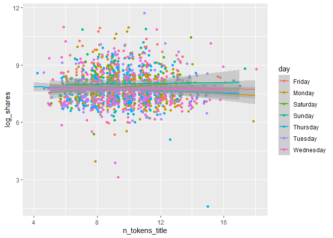
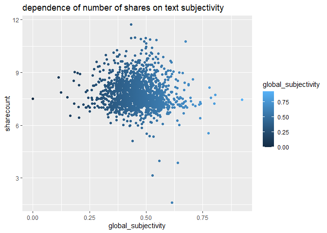

Project 3
================
Richard Xiao & Xi Yang
2022-11-12

## Introduction section

This is an online news popularity data set, and dataset summarizes a
heterogeneous set of features about articles published by Mashable in a
period of two years. The goal is to predict the number of shares in
social networks (popularity). We’re thinking about what kind of articles
are we most likely to share, and we believe there are two aspects. One
is objectivity. Users can feel the content is useful and valuable. The
other one is subjectivity. Users agree with the attitudes expressed in
the article, and also, the emotion expressed in the article resonated
with users.

Based on the two aspects, we choose 21 variables, and they are
n_tokens_title, n_tokens_content, n_unique_tokens, num_imgs, num_videos,
kw_avg_min, kw_max_max, kw_avg_max, kw_avg_avg, weekday_is_monday,
weekday_is_tuesday, weekday_is_wednesday, weekday_is_thursday,
weekday_is_friday,. weekday_is_saturday, weekday_is_sunday,
global_subjectivity, global_sentiment_polarity,
global_rate_positive_words, global_rate_negative_words, and share.

We produce some basic analysis before we fitting the model. The purpose
is to inspect the trends between different variables with respect to the
number of share, and also, figure out the correlation between a few
notable numeric variables. It helps the reader understand the summary or
graph.

For a linear regression model, we’ll use Backward stepwise and LASSO
regression model. For an ensemble tree-based model, we’ll fit random
forest and boosted tree model.

## Data

``` r
library(tidyverse)
library(caret)
#read in data
df1 <- read_csv("OnlineNewsPopularity.csv")
```

    ## Rows: 39644 Columns: 61
    ## ── Column specification ────────────────────────────────────────────────────────────────────────────────────────
    ## Delimiter: ","
    ## chr  (1): url
    ## dbl (60): timedelta, n_tokens_title, n_tokens_content, n_unique_tokens, n_non_stop_words, n_non_stop_unique_...
    ## 
    ## ℹ Use `spec()` to retrieve the full column specification for this data.
    ## ℹ Specify the column types or set `show_col_types = FALSE` to quiet this message.

``` r
df1
#Create a new variable for new data channel classification. Also want to remove the old data channel variables and other variables we don't need. Also want to rename the day variables to make it easier for analysis with rename variable.
selectchannel<- paste0("data_channel_is_", params[[1]])
df <- df1 %>%
  select(-c(url, timedelta)) %>%
  mutate(log_shares = log(shares)) %>%
  select(-shares) %>% rename(monday = weekday_is_monday , tuesday = weekday_is_tuesday, wednesday = weekday_is_wednesday, thursday = weekday_is_thursday, friday =     weekday_is_friday, saturday = weekday_is_saturday, sunday = weekday_is_sunday)
df 
#a single data_channel_is_lifestyle
df_channel <- df %>% filter(get(selectchannel) ==1 ) 
df_channel
set.seed(100)
index <- createDataPartition(df_lifestyle$log_shares, p = .7, list = FALSE)
train <- df_lifestyle[lifestyle_index,]
test <- df_lifestyle[-lifestyle_index,]
train
test
```

Here, we plotted the correlation between a few notable numeric
variables.

``` r
library(tidyverse)
library(corrplot)
cor_mat <- cor(train %>% select(log_shares,num_imgs,num_videos,n_tokens_content,n_tokens_title,kw_avg_min,kw_max_max,kw_avg_max,kw_avg_avg,global_subjectivity,global_sentiment_polarity,global_rate_positive_words), method = "pearson")
corrplot(cor_mat, hc.order = TRUE,
type = "lower",
tl.pos = "lt",
title = "Correlation Coefficients for log of shares",
subtitle = "Correlation Coefficients for log of shares",
mar=c(0,0,2,0)
)
```

    ## Warning in text.default(pos.xlabel[, 1], pos.xlabel[, 2], newcolnames, srt = tl.srt, : "hc.order" is not a
    ## graphical parameter

    ## Warning in text.default(pos.xlabel[, 1], pos.xlabel[, 2], newcolnames, srt = tl.srt, : "subtitle" is not a
    ## graphical parameter

    ## Warning in text.default(pos.ylabel[, 1], pos.ylabel[, 2], newrownames, col = tl.col, : "hc.order" is not a
    ## graphical parameter

    ## Warning in text.default(pos.ylabel[, 1], pos.ylabel[, 2], newrownames, col = tl.col, : "subtitle" is not a
    ## graphical parameter

    ## Warning in title(title, ...): "hc.order" is not a graphical parameter

    ## Warning in title(title, ...): "subtitle" is not a graphical parameter

<!-- --> From the
correlation graph, if the variable has a darker blue color, it will
signify a strong positive correlation with the other variable whereas if
it has a darker red color, it will have a stronger negative correlation
with the other variable.

## Summarizations

``` r
#This new dataframe converts the days into categorical values for graphing.
moddf <- train%>%
  mutate(day = if_else(monday == 1,"Monday",if_else(tuesday == 1,"Tuesday",if_else(wednesday == 1,"Wednesday",if_else(
thursday == 1,"Thursday",if_else(friday == 1,"Friday",if_else(saturday == 1,"Saturday", "Sunday")))))))
#Eliminates any categorical variables for use of principal component analysis
continuous <- lifestyle_train %>%select(-c(monday, tuesday, wednesday, thursday,friday, saturday, sunday, is_weekend, ))
```

### 1.

``` r
#Boxplot for log shares subdivided by days.
ggplot(moddf, aes(x = day, y = log_shares, col = day)) + 
  geom_boxplot(fill="grey") + 
  geom_jitter() + 
  ylab("log(shares)") + 
  xlab("") +
  theme(axis.text.x = element_text(angle = 45)) +
  ggtitle("Boxplot for Log Shares by Day")
```

<!-- -->

### 2.

``` r
#Scatterplot for log shares and number of images
ggplot(moddf, aes(y = log_shares, x = num_imgs, color = day)) + 
  geom_point(stat = "identity", position = "jitter") + 
  geom_smooth( method = "lm")  + 
  xlab("num_hrefs") + 
  ylab("log_shares")
```

    ## `geom_smooth()` using formula 'y ~ x'

<!-- -->

### 3.

``` r
#Scatterplot for log shares and number of videos.
ggplot(moddf, aes(y = log_shares, x = num_videos, color = day)) + 
  geom_point(stat = "identity", position = "jitter") + 
  geom_smooth( method = "lm")  + 
  xlab("num_hrefs") + 
  ylab("log_shares")
```

    ## `geom_smooth()` using formula 'y ~ x'

<!-- -->

### 4.

``` r
#Histogram for log shares 
ggplot(moddf, aes(x=log_shares, fill = kw_avg_avg, color = day)) + geom_histogram(binwidth = 1, position="dodge") + xlab("Average KeyWord") + ylab("Log Shares")
```

<!-- -->

### 5.

``` r
#Scatterplot for number of unique tokens and log shares
ggplot(moddf, aes(y = log_shares, x = n_unique_tokens, color = day)) + 
  geom_point(stat = "identity", position = "jitter") + 
  geom_smooth( method = "lm")  + 
  xlab("n_unique_tokens") + 
  ylab("log_shares")
```

    ## `geom_smooth()` using formula 'y ~ x'

<!-- -->

### 6.

``` r
#Scatterplot for number of tokens content and log shares
ggplot(moddf, aes(y = log_shares, x = n_tokens_content, color = day)) + 
  geom_point(stat = "identity", position = "jitter") + 
  geom_smooth( method = "lm")  + 
  xlab("n_tokens_content") + 
  ylab("log_shares")
```

    ## `geom_smooth()` using formula 'y ~ x'

<!-- -->

### 7.

``` r
#Scatterplot for number of token titles and log shares
ggplot(moddf, aes(y = log_shares, x = n_tokens_title, color = day)) + 
  geom_point(stat = "identity", position = "jitter") + 
  geom_smooth( method = "lm")  + 
  xlab("n_tokens_title") + 
  ylab("log_shares")
```

    ## `geom_smooth()` using formula 'y ~ x'

<!-- -->

### 8. General summary statistics for continuous dataframe

The code chunk below will give summary statistics for the twelve
variables that we want to analyze. The results are ordered by descending
standard deviation. We want to know the general statistics for all of
these variables to see how they compare against each other.

### 9. Numerical summary of categorical variable is_weekend

let’s pull a summary of the number of shares. One of the factors that
most affects the number of shares is whether the day is weekday or
weekend. I wanted to look at the average, standard deviation, median and
IQR values of number of shares on weekdays and weekend. If the value of
average is larger , then articles tend to be shared more often.

``` r
library(tidyverse)
train %>%
  group_by(is_weekend) %>%
  summarise(average=mean(log_shares), median=median(log_shares), sd=sd(log_shares), IQR=IQR(log_shares))
```

### 10. Dependence of number of shares on text subjectivity

A scatter plot with the number of shares on the y-axis and the text
subjectivity on the x-axis is created: we can inspect the trend of
shares as a function of the text subjectivity. We know that if the value
of text subjectivity is 0, it stands for the article is very objective,
and value 1 stands for very subjective. If the most points distributed
lower than 0.5, then articles with more objectivity tend to be shared
more often. If the most points distributed larger than 0.5, then
articles with more subjectivity tend to be shared more often. If the
most points distributed around 0.5, then articles with more neutrality
tend to be shared more often.

``` r
library(tidyverse)
library(ggplot2)
subjectivityData <- train %>% group_by(global_subjectivity) %>% summarize(sharecount = mean(log_shares))
ggplot(subjectivityData, aes(x = global_subjectivity, y = sharecount, color =global_subjectivity)) +
geom_point() +
ggtitle("dependence of number of shares on text subjectivity ")
```

<!-- -->

### 11. Dependence of number of shares on text sentiment polarity

A scatter plot with the number of shares on the y-axis and the text
sentiment polarity on the x-axis is created: we can inspect the trend of
shares as a function of the text sentiment polarity. We know that if the
value of text sentiment polarity is greater than -1 and less than 0, it
stands for the article sentiment is negative emotion. If the value of
text sentiment polarity is greater than 0 and less than 1, it stands for
the article sentiment is positive emotion. If the most points
distributed around (-1,0), then articles with negative emotion tend to
be shared more often. If the most points distributed around (0,1), then
articles with positive emotion tend to be shared more often. If the most
points distributed around 0, then articles with neutral emotion tend to
be shared more often.

``` r
library(tidyverse)
library(ggplot2)
sentimentpolarityData <- train %>% group_by(global_sentiment_polarity) %>% summarize(sharecount = mean(log_shares))
ggplot(sentimentpolarityData, aes(x = global_sentiment_polarity, y = sharecount, color =global_sentiment_polarity)) +
geom_point() +
ggtitle("dependence of number of shares on text sentiment polarity ")
```

<!-- -->

### 12. Dependence of number of shares on positive word rate

A scatter plot with the number of shares on the y-axis and the positive
word rate on the x-axis is created: we can inspect the trend of shares
as a function of the positive word rate. If the points show an upward
trend, then articles with more positive words tend to be shared more
often. If we see a negative trend then articles with more positive words
tend to be shared less often.

``` r
library(tidyverse)
library(ggplot2)
positivewordsData <- train %>% group_by(global_rate_positive_words) %>% summarize(sharecount = mean(log_shares))
ggplot(positivewordsData, aes(x = global_rate_positive_words, y = sharecount), color=global_rate_positive_words) +
geom_point() +
geom_smooth(method = "lm") +
ggtitle("dependence of number of shares on positive word rate ")
```

    ## `geom_smooth()` using formula 'y ~ x'

<!-- --> \### 13.
Dependence of number of shares on negative words rate

A scatter plot with the number of shares on the y-axis and the negative
words rate on the x-axis is created: we can inspect the trend of shares
as a function of the negative words rate. If the points show an upward
trend, then articles with more negative words tend to be shared more
often. If we see a negative trend then articles with more negative words
tend to be shared less often.

``` r
library(tidyverse)
library(ggplot2)
negativewordsData <- train %>% group_by(global_rate_negative_words) %>% summarize(sharecount = mean(log_shares))
ggplot(negativewordsData, aes(x = global_rate_negative_words, y = sharecount)) +
geom_point() +
geom_smooth(method = "lm") +
ggtitle("dependence of number of shares on negative words rate")
```

    ## `geom_smooth()` using formula 'y ~ x'

<!-- -->

## Modeling

For models below, I have selected the log_shares as the dependent
variable, and num_imgs, num_videos, n_tokens_content, n_unique_tokens,
n_tokens_title, kw_avg_min, kw_max_max, kw_avg_max,
kw_avg_avg,global_subjectivity, global_sentiment_polarity,
global_rate_positive_words, global_rate_negative_words, monday, tuesday,
wednesday, thursday, friday, saturday, sunday as the independent
variables.

``` r
library(tidyverse)
#Select variables of interest for analysis.
analysis <- train %>% select(log_shares,num_imgs,num_videos,n_tokens_content,n_unique_tokens,n_tokens_title,kw_avg_min,kw_max_max,kw_avg_max,kw_avg_avg,global_subjectivity,global_sentiment_polarity,global_rate_positive_words,global_rate_negative_words,monday,tuesday,wednesday,thursday,friday,saturday,sunday)
analysis
```

Here after all the models formulated below, to compare them, I am
predicting the test data on this model to derive some common metrics
like RMSE and R squared values that can be used to compare multiple
models. For prediction, I am using predict() function, and to extract
prediction metrics, I am using postResample() function.

### 1. LASSO Regression Model

Lasso regression is a type of linear regression that uses shrinkage.
Shrinkage is where data values are shrunk towards a central point, like
the mean. The lasso procedure encourages simple, sparse models
(i.e. models with fewer parameters). This particular type of regression
is well-suited for models showing high levels of multicollinearity or
when you want to automate certain parts of model selection, like
variable selection/parameter elimination.

``` r
library(caret)
fitLASSO <- train(log_shares ~ ., data = analysis,
method = "lasso",
preProcess = c("center", "scale"),
trControl = trainControl(method = "cv", number = 10)
)
predLASSO <- predict(fitLASSO, newdata = test)
m1<-postResample(predLASSO, obs = test$log_shares)
m1
```

    ##       RMSE   Rsquared        MAE 
    ## 0.92859100 0.02805001 0.70447995

### 2. Boosted Tree Model

Boosting is an ensemble learning method that combines a set of weak
learners into a strong learner to minimize training errors. In boosting,
a random sample of data is selected, fitted with a model and then
trained sequentially—that is, each model tries to compensate for the
weaknesses of its predecessor. With each iteration, the weak rules from
each individual classifier are combined to form one, strong prediction
rule.

``` r
library(caret)
boostedFit <- train(log_shares ~ ., data = analysis, method = "gbm",trControl = trainControl(method = "cv" , number = 10),
                    preProcess = c("center", "scale"),
                    tuneGrid = expand.grid(n.trees = c(25, 50, 100, 150, 200),
                                           interaction.depth = 1:4,
                                           shrinkage = 0.1,
                                           n.minobsinnode = 10)
                    )
```

    ## Iter   TrainDeviance   ValidDeviance   StepSize   Improve
    ##      1        0.8799             nan     0.1000    0.0042
    ##      2        0.8757             nan     0.1000    0.0040
    ##      3        0.8720             nan     0.1000    0.0026
    ##      4        0.8691             nan     0.1000    0.0004
    ##      5        0.8674             nan     0.1000    0.0007
    ##      6        0.8643             nan     0.1000    0.0015
    ##      7        0.8615             nan     0.1000    0.0016
    ##      8        0.8593             nan     0.1000   -0.0002
    ##      9        0.8558             nan     0.1000    0.0034
    ##     10        0.8535             nan     0.1000    0.0006
    ##     20        0.8357             nan     0.1000   -0.0008
    ##     40        0.8167             nan     0.1000    0.0000
    ##     60        0.8058             nan     0.1000   -0.0012
    ##     80        0.7962             nan     0.1000   -0.0005
    ##    100        0.7893             nan     0.1000   -0.0005
    ##    120        0.7810             nan     0.1000   -0.0009
    ##    140        0.7736             nan     0.1000   -0.0015
    ##    160        0.7679             nan     0.1000   -0.0007
    ##    180        0.7619             nan     0.1000   -0.0004
    ##    200        0.7553             nan     0.1000   -0.0016
    ## 
    ## Iter   TrainDeviance   ValidDeviance   StepSize   Improve
    ##      1        0.8782             nan     0.1000    0.0038
    ##      2        0.8723             nan     0.1000    0.0028
    ##      3        0.8667             nan     0.1000    0.0035
    ##      4        0.8626             nan     0.1000    0.0020
    ##      5        0.8575             nan     0.1000    0.0028
    ##      6        0.8533             nan     0.1000   -0.0003
    ##      7        0.8482             nan     0.1000    0.0003
    ##      8        0.8446             nan     0.1000    0.0022
    ##      9        0.8409             nan     0.1000   -0.0009
    ##     10        0.8373             nan     0.1000    0.0015
    ##     20        0.8126             nan     0.1000   -0.0005
    ##     40        0.7814             nan     0.1000   -0.0015
    ##     60        0.7595             nan     0.1000    0.0003
    ##     80        0.7354             nan     0.1000   -0.0015
    ##    100        0.7148             nan     0.1000   -0.0008
    ##    120        0.6993             nan     0.1000   -0.0025
    ##    140        0.6844             nan     0.1000   -0.0009
    ##    160        0.6694             nan     0.1000    0.0003
    ##    180        0.6578             nan     0.1000   -0.0014
    ##    200        0.6444             nan     0.1000   -0.0020
    ## 
    ## Iter   TrainDeviance   ValidDeviance   StepSize   Improve
    ##      1        0.8758             nan     0.1000    0.0063
    ##      2        0.8679             nan     0.1000    0.0050
    ##      3        0.8618             nan     0.1000    0.0035
    ##      4        0.8565             nan     0.1000    0.0003
    ##      5        0.8486             nan     0.1000    0.0062
    ##      6        0.8449             nan     0.1000    0.0016
    ##      7        0.8400             nan     0.1000    0.0017
    ##      8        0.8347             nan     0.1000    0.0030
    ##      9        0.8302             nan     0.1000    0.0017
    ##     10        0.8248             nan     0.1000   -0.0006
    ##     20        0.7915             nan     0.1000   -0.0012
    ##     40        0.7477             nan     0.1000   -0.0031
    ##     60        0.7097             nan     0.1000   -0.0021
    ##     80        0.6811             nan     0.1000   -0.0017
    ##    100        0.6545             nan     0.1000   -0.0011
    ##    120        0.6296             nan     0.1000   -0.0027
    ##    140        0.6074             nan     0.1000   -0.0018
    ##    160        0.5869             nan     0.1000   -0.0011
    ##    180        0.5712             nan     0.1000   -0.0031
    ##    200        0.5532             nan     0.1000   -0.0031
    ## 
    ## Iter   TrainDeviance   ValidDeviance   StepSize   Improve
    ##      1        0.8735             nan     0.1000    0.0102
    ##      2        0.8624             nan     0.1000    0.0054
    ##      3        0.8548             nan     0.1000    0.0021
    ##      4        0.8452             nan     0.1000    0.0027
    ##      5        0.8392             nan     0.1000    0.0040
    ##      6        0.8325             nan     0.1000    0.0016
    ##      7        0.8269             nan     0.1000    0.0026
    ##      8        0.8219             nan     0.1000    0.0015
    ##      9        0.8163             nan     0.1000    0.0015
    ##     10        0.8118             nan     0.1000   -0.0012
    ##     20        0.7706             nan     0.1000   -0.0005
    ##     40        0.7160             nan     0.1000   -0.0011
    ##     60        0.6741             nan     0.1000   -0.0038
    ##     80        0.6342             nan     0.1000   -0.0006
    ##    100        0.5998             nan     0.1000   -0.0015
    ##    120        0.5738             nan     0.1000   -0.0010
    ##    140        0.5487             nan     0.1000   -0.0008
    ##    160        0.5241             nan     0.1000   -0.0012
    ##    180        0.5006             nan     0.1000   -0.0013
    ##    200        0.4801             nan     0.1000   -0.0018
    ## 
    ## Iter   TrainDeviance   ValidDeviance   StepSize   Improve
    ##      1        0.8963             nan     0.1000    0.0025
    ##      2        0.8909             nan     0.1000    0.0028
    ##      3        0.8889             nan     0.1000    0.0006
    ##      4        0.8868             nan     0.1000    0.0003
    ##      5        0.8827             nan     0.1000    0.0039
    ##      6        0.8791             nan     0.1000    0.0017
    ##      7        0.8763             nan     0.1000    0.0009
    ##      8        0.8734             nan     0.1000    0.0011
    ##      9        0.8706             nan     0.1000    0.0014
    ##     10        0.8681             nan     0.1000    0.0002
    ##     20        0.8520             nan     0.1000   -0.0001
    ##     40        0.8309             nan     0.1000   -0.0003
    ##     60        0.8181             nan     0.1000   -0.0004
    ##     80        0.8087             nan     0.1000   -0.0009
    ##    100        0.8018             nan     0.1000   -0.0009
    ##    120        0.7922             nan     0.1000   -0.0021
    ##    140        0.7859             nan     0.1000   -0.0012
    ##    160        0.7812             nan     0.1000   -0.0012
    ##    180        0.7758             nan     0.1000   -0.0015
    ##    200        0.7696             nan     0.1000   -0.0006
    ## 
    ## Iter   TrainDeviance   ValidDeviance   StepSize   Improve
    ##      1        0.8928             nan     0.1000    0.0083
    ##      2        0.8876             nan     0.1000    0.0014
    ##      3        0.8822             nan     0.1000    0.0044
    ##      4        0.8774             nan     0.1000    0.0021
    ##      5        0.8744             nan     0.1000    0.0019
    ##      6        0.8687             nan     0.1000    0.0044
    ##      7        0.8633             nan     0.1000    0.0031
    ##      8        0.8587             nan     0.1000    0.0022
    ##      9        0.8564             nan     0.1000    0.0004
    ##     10        0.8521             nan     0.1000    0.0018
    ##     20        0.8234             nan     0.1000   -0.0003
    ##     40        0.7927             nan     0.1000   -0.0012
    ##     60        0.7706             nan     0.1000   -0.0018
    ##     80        0.7493             nan     0.1000   -0.0003
    ##    100        0.7312             nan     0.1000   -0.0019
    ##    120        0.7171             nan     0.1000   -0.0026
    ##    140        0.7023             nan     0.1000   -0.0011
    ##    160        0.6882             nan     0.1000   -0.0014
    ##    180        0.6750             nan     0.1000   -0.0026
    ##    200        0.6615             nan     0.1000   -0.0005
    ## 
    ## Iter   TrainDeviance   ValidDeviance   StepSize   Improve
    ##      1        0.8913             nan     0.1000    0.0078
    ##      2        0.8818             nan     0.1000    0.0055
    ##      3        0.8746             nan     0.1000    0.0002
    ##      4        0.8683             nan     0.1000    0.0032
    ##      5        0.8623             nan     0.1000    0.0030
    ##      6        0.8570             nan     0.1000    0.0020
    ##      7        0.8505             nan     0.1000    0.0017
    ##      8        0.8462             nan     0.1000    0.0009
    ##      9        0.8414             nan     0.1000    0.0012
    ##     10        0.8378             nan     0.1000   -0.0015
    ##     20        0.8030             nan     0.1000    0.0009
    ##     40        0.7636             nan     0.1000   -0.0042
    ##     60        0.7284             nan     0.1000   -0.0012
    ##     80        0.7022             nan     0.1000   -0.0004
    ##    100        0.6789             nan     0.1000   -0.0005
    ##    120        0.6550             nan     0.1000   -0.0007
    ##    140        0.6350             nan     0.1000   -0.0026
    ##    160        0.6137             nan     0.1000   -0.0026
    ##    180        0.5940             nan     0.1000   -0.0010
    ##    200        0.5742             nan     0.1000   -0.0022
    ## 
    ## Iter   TrainDeviance   ValidDeviance   StepSize   Improve
    ##      1        0.8899             nan     0.1000    0.0097
    ##      2        0.8809             nan     0.1000    0.0039
    ##      3        0.8711             nan     0.1000    0.0065
    ##      4        0.8668             nan     0.1000    0.0024
    ##      5        0.8591             nan     0.1000    0.0056
    ##      6        0.8499             nan     0.1000    0.0038
    ##      7        0.8467             nan     0.1000   -0.0009
    ##      8        0.8387             nan     0.1000    0.0032
    ##      9        0.8328             nan     0.1000   -0.0011
    ##     10        0.8272             nan     0.1000    0.0002
    ##     20        0.7913             nan     0.1000   -0.0014
    ##     40        0.7362             nan     0.1000   -0.0024
    ##     60        0.6912             nan     0.1000   -0.0008
    ##     80        0.6533             nan     0.1000   -0.0032
    ##    100        0.6191             nan     0.1000   -0.0032
    ##    120        0.5918             nan     0.1000   -0.0020
    ##    140        0.5646             nan     0.1000   -0.0002
    ##    160        0.5427             nan     0.1000   -0.0014
    ##    180        0.5201             nan     0.1000   -0.0027
    ##    200        0.4977             nan     0.1000   -0.0019
    ## 
    ## Iter   TrainDeviance   ValidDeviance   StepSize   Improve
    ##      1        0.8760             nan     0.1000    0.0042
    ##      2        0.8712             nan     0.1000    0.0019
    ##      3        0.8680             nan     0.1000    0.0012
    ##      4        0.8655             nan     0.1000    0.0012
    ##      5        0.8626             nan     0.1000    0.0021
    ##      6        0.8593             nan     0.1000    0.0024
    ##      7        0.8573             nan     0.1000    0.0011
    ##      8        0.8549             nan     0.1000    0.0008
    ##      9        0.8529             nan     0.1000    0.0009
    ##     10        0.8503             nan     0.1000    0.0017
    ##     20        0.8321             nan     0.1000    0.0001
    ##     40        0.8126             nan     0.1000   -0.0018
    ##     60        0.8009             nan     0.1000   -0.0012
    ##     80        0.7896             nan     0.1000   -0.0000
    ##    100        0.7814             nan     0.1000    0.0002
    ##    120        0.7763             nan     0.1000   -0.0011
    ##    140        0.7708             nan     0.1000   -0.0009
    ##    160        0.7651             nan     0.1000   -0.0020
    ##    180        0.7582             nan     0.1000   -0.0012
    ##    200        0.7542             nan     0.1000   -0.0022
    ## 
    ## Iter   TrainDeviance   ValidDeviance   StepSize   Improve
    ##      1        0.8734             nan     0.1000    0.0049
    ##      2        0.8667             nan     0.1000    0.0048
    ##      3        0.8620             nan     0.1000    0.0025
    ##      4        0.8567             nan     0.1000    0.0010
    ##      5        0.8538             nan     0.1000    0.0011
    ##      6        0.8484             nan     0.1000    0.0021
    ##      7        0.8437             nan     0.1000    0.0020
    ##      8        0.8402             nan     0.1000    0.0009
    ##      9        0.8368             nan     0.1000    0.0003
    ##     10        0.8349             nan     0.1000    0.0008
    ##     20        0.8104             nan     0.1000    0.0006
    ##     40        0.7796             nan     0.1000   -0.0016
    ##     60        0.7561             nan     0.1000   -0.0016
    ##     80        0.7358             nan     0.1000   -0.0003
    ##    100        0.7189             nan     0.1000   -0.0019
    ##    120        0.7038             nan     0.1000   -0.0010
    ##    140        0.6838             nan     0.1000   -0.0022
    ##    160        0.6695             nan     0.1000   -0.0007
    ##    180        0.6563             nan     0.1000   -0.0014
    ##    200        0.6451             nan     0.1000   -0.0018
    ## 
    ## Iter   TrainDeviance   ValidDeviance   StepSize   Improve
    ##      1        0.8738             nan     0.1000    0.0051
    ##      2        0.8671             nan     0.1000    0.0034
    ##      3        0.8621             nan     0.1000    0.0007
    ##      4        0.8543             nan     0.1000    0.0025
    ##      5        0.8465             nan     0.1000    0.0043
    ##      6        0.8401             nan     0.1000    0.0009
    ##      7        0.8339             nan     0.1000    0.0010
    ##      8        0.8295             nan     0.1000    0.0007
    ##      9        0.8248             nan     0.1000   -0.0007
    ##     10        0.8204             nan     0.1000    0.0014
    ##     20        0.7902             nan     0.1000    0.0003
    ##     40        0.7485             nan     0.1000   -0.0009
    ##     60        0.7145             nan     0.1000   -0.0005
    ##     80        0.6840             nan     0.1000   -0.0028
    ##    100        0.6573             nan     0.1000   -0.0036
    ##    120        0.6345             nan     0.1000   -0.0025
    ##    140        0.6159             nan     0.1000   -0.0022
    ##    160        0.5970             nan     0.1000   -0.0023
    ##    180        0.5773             nan     0.1000   -0.0020
    ##    200        0.5608             nan     0.1000   -0.0008
    ## 
    ## Iter   TrainDeviance   ValidDeviance   StepSize   Improve
    ##      1        0.8702             nan     0.1000    0.0087
    ##      2        0.8606             nan     0.1000    0.0018
    ##      3        0.8516             nan     0.1000    0.0050
    ##      4        0.8432             nan     0.1000    0.0027
    ##      5        0.8347             nan     0.1000    0.0055
    ##      6        0.8276             nan     0.1000    0.0044
    ##      7        0.8212             nan     0.1000    0.0030
    ##      8        0.8159             nan     0.1000   -0.0005
    ##      9        0.8120             nan     0.1000   -0.0007
    ##     10        0.8082             nan     0.1000   -0.0030
    ##     20        0.7719             nan     0.1000   -0.0002
    ##     40        0.7220             nan     0.1000   -0.0015
    ##     60        0.6781             nan     0.1000   -0.0011
    ##     80        0.6405             nan     0.1000   -0.0023
    ##    100        0.6100             nan     0.1000   -0.0008
    ##    120        0.5828             nan     0.1000   -0.0013
    ##    140        0.5563             nan     0.1000   -0.0020
    ##    160        0.5306             nan     0.1000   -0.0024
    ##    180        0.5081             nan     0.1000   -0.0010
    ##    200        0.4841             nan     0.1000   -0.0033
    ## 
    ## Iter   TrainDeviance   ValidDeviance   StepSize   Improve
    ##      1        0.8950             nan     0.1000    0.0030
    ##      2        0.8896             nan     0.1000    0.0022
    ##      3        0.8858             nan     0.1000    0.0016
    ##      4        0.8829             nan     0.1000    0.0013
    ##      5        0.8806             nan     0.1000    0.0009
    ##      6        0.8764             nan     0.1000    0.0029
    ##      7        0.8726             nan     0.1000    0.0021
    ##      8        0.8706             nan     0.1000   -0.0009
    ##      9        0.8691             nan     0.1000    0.0007
    ##     10        0.8662             nan     0.1000    0.0020
    ##     20        0.8500             nan     0.1000   -0.0001
    ##     40        0.8305             nan     0.1000   -0.0011
    ##     60        0.8169             nan     0.1000   -0.0001
    ##     80        0.8078             nan     0.1000   -0.0015
    ##    100        0.7994             nan     0.1000    0.0001
    ##    120        0.7920             nan     0.1000   -0.0007
    ##    140        0.7851             nan     0.1000   -0.0010
    ##    160        0.7785             nan     0.1000   -0.0016
    ##    180        0.7723             nan     0.1000   -0.0007
    ##    200        0.7676             nan     0.1000   -0.0011
    ## 
    ## Iter   TrainDeviance   ValidDeviance   StepSize   Improve
    ##      1        0.8916             nan     0.1000    0.0042
    ##      2        0.8855             nan     0.1000    0.0032
    ##      3        0.8783             nan     0.1000    0.0038
    ##      4        0.8727             nan     0.1000    0.0038
    ##      5        0.8689             nan     0.1000    0.0014
    ##      6        0.8645             nan     0.1000    0.0017
    ##      7        0.8616             nan     0.1000    0.0002
    ##      8        0.8584             nan     0.1000    0.0011
    ##      9        0.8546             nan     0.1000    0.0009
    ##     10        0.8519             nan     0.1000    0.0007
    ##     20        0.8246             nan     0.1000    0.0005
    ##     40        0.7918             nan     0.1000   -0.0002
    ##     60        0.7684             nan     0.1000   -0.0009
    ##     80        0.7435             nan     0.1000   -0.0011
    ##    100        0.7249             nan     0.1000   -0.0021
    ##    120        0.7092             nan     0.1000   -0.0015
    ##    140        0.6916             nan     0.1000   -0.0003
    ##    160        0.6775             nan     0.1000   -0.0017
    ##    180        0.6616             nan     0.1000   -0.0010
    ##    200        0.6481             nan     0.1000   -0.0016
    ## 
    ## Iter   TrainDeviance   ValidDeviance   StepSize   Improve
    ##      1        0.8912             nan     0.1000    0.0065
    ##      2        0.8826             nan     0.1000    0.0041
    ##      3        0.8751             nan     0.1000    0.0057
    ##      4        0.8663             nan     0.1000    0.0044
    ##      5        0.8587             nan     0.1000    0.0009
    ##      6        0.8542             nan     0.1000    0.0015
    ##      7        0.8486             nan     0.1000    0.0017
    ##      8        0.8436             nan     0.1000    0.0031
    ##      9        0.8405             nan     0.1000   -0.0009
    ##     10        0.8375             nan     0.1000   -0.0028
    ##     20        0.8037             nan     0.1000   -0.0013
    ##     40        0.7599             nan     0.1000   -0.0019
    ##     60        0.7241             nan     0.1000   -0.0019
    ##     80        0.6906             nan     0.1000   -0.0021
    ##    100        0.6662             nan     0.1000   -0.0016
    ##    120        0.6439             nan     0.1000   -0.0026
    ##    140        0.6205             nan     0.1000   -0.0029
    ##    160        0.5985             nan     0.1000   -0.0018
    ##    180        0.5802             nan     0.1000   -0.0013
    ##    200        0.5629             nan     0.1000   -0.0013
    ## 
    ## Iter   TrainDeviance   ValidDeviance   StepSize   Improve
    ##      1        0.8889             nan     0.1000    0.0088
    ##      2        0.8784             nan     0.1000    0.0061
    ##      3        0.8710             nan     0.1000    0.0048
    ##      4        0.8645             nan     0.1000    0.0019
    ##      5        0.8578             nan     0.1000    0.0033
    ##      6        0.8510             nan     0.1000    0.0023
    ##      7        0.8424             nan     0.1000    0.0052
    ##      8        0.8383             nan     0.1000   -0.0008
    ##      9        0.8329             nan     0.1000   -0.0006
    ##     10        0.8276             nan     0.1000   -0.0012
    ##     20        0.7856             nan     0.1000    0.0020
    ##     40        0.7302             nan     0.1000   -0.0016
    ##     60        0.6834             nan     0.1000   -0.0018
    ##     80        0.6527             nan     0.1000   -0.0006
    ##    100        0.6193             nan     0.1000   -0.0024
    ##    120        0.5920             nan     0.1000   -0.0007
    ##    140        0.5662             nan     0.1000   -0.0029
    ##    160        0.5442             nan     0.1000   -0.0008
    ##    180        0.5194             nan     0.1000   -0.0017
    ##    200        0.4959             nan     0.1000   -0.0011
    ## 
    ## Iter   TrainDeviance   ValidDeviance   StepSize   Improve
    ##      1        0.8826             nan     0.1000    0.0016
    ##      2        0.8804             nan     0.1000   -0.0028
    ##      3        0.8750             nan     0.1000    0.0031
    ##      4        0.8700             nan     0.1000    0.0029
    ##      5        0.8666             nan     0.1000    0.0006
    ##      6        0.8640             nan     0.1000    0.0021
    ##      7        0.8613             nan     0.1000    0.0012
    ##      8        0.8571             nan     0.1000    0.0028
    ##      9        0.8554             nan     0.1000    0.0005
    ##     10        0.8524             nan     0.1000    0.0010
    ##     20        0.8342             nan     0.1000    0.0005
    ##     40        0.8160             nan     0.1000   -0.0010
    ##     60        0.8019             nan     0.1000   -0.0001
    ##     80        0.7924             nan     0.1000   -0.0021
    ##    100        0.7833             nan     0.1000   -0.0011
    ##    120        0.7758             nan     0.1000   -0.0012
    ##    140        0.7685             nan     0.1000   -0.0014
    ##    160        0.7620             nan     0.1000   -0.0008
    ##    180        0.7582             nan     0.1000   -0.0012
    ##    200        0.7519             nan     0.1000   -0.0005
    ## 
    ## Iter   TrainDeviance   ValidDeviance   StepSize   Improve
    ##      1        0.8812             nan     0.1000    0.0022
    ##      2        0.8740             nan     0.1000    0.0070
    ##      3        0.8684             nan     0.1000    0.0013
    ##      4        0.8615             nan     0.1000    0.0010
    ##      5        0.8555             nan     0.1000    0.0012
    ##      6        0.8501             nan     0.1000    0.0023
    ##      7        0.8463             nan     0.1000    0.0012
    ##      8        0.8425             nan     0.1000   -0.0002
    ##      9        0.8388             nan     0.1000    0.0004
    ##     10        0.8361             nan     0.1000    0.0002
    ##     20        0.8103             nan     0.1000   -0.0030
    ##     40        0.7777             nan     0.1000   -0.0019
    ##     60        0.7535             nan     0.1000   -0.0019
    ##     80        0.7330             nan     0.1000   -0.0023
    ##    100        0.7162             nan     0.1000   -0.0016
    ##    120        0.6974             nan     0.1000   -0.0017
    ##    140        0.6835             nan     0.1000   -0.0011
    ##    160        0.6665             nan     0.1000   -0.0004
    ##    180        0.6566             nan     0.1000   -0.0021
    ##    200        0.6432             nan     0.1000   -0.0006
    ## 
    ## Iter   TrainDeviance   ValidDeviance   StepSize   Improve
    ##      1        0.8755             nan     0.1000    0.0047
    ##      2        0.8677             nan     0.1000    0.0035
    ##      3        0.8601             nan     0.1000    0.0044
    ##      4        0.8540             nan     0.1000    0.0026
    ##      5        0.8485             nan     0.1000    0.0024
    ##      6        0.8419             nan     0.1000    0.0036
    ##      7        0.8368             nan     0.1000    0.0021
    ##      8        0.8313             nan     0.1000    0.0014
    ##      9        0.8280             nan     0.1000   -0.0021
    ##     10        0.8254             nan     0.1000   -0.0013
    ##     20        0.7896             nan     0.1000   -0.0006
    ##     40        0.7428             nan     0.1000   -0.0010
    ##     60        0.7048             nan     0.1000   -0.0008
    ##     80        0.6760             nan     0.1000   -0.0010
    ##    100        0.6512             nan     0.1000   -0.0003
    ##    120        0.6314             nan     0.1000   -0.0026
    ##    140        0.6118             nan     0.1000   -0.0017
    ##    160        0.5920             nan     0.1000   -0.0013
    ##    180        0.5748             nan     0.1000   -0.0025
    ##    200        0.5568             nan     0.1000   -0.0011
    ## 
    ## Iter   TrainDeviance   ValidDeviance   StepSize   Improve
    ##      1        0.8764             nan     0.1000    0.0068
    ##      2        0.8666             nan     0.1000    0.0054
    ##      3        0.8577             nan     0.1000    0.0033
    ##      4        0.8502             nan     0.1000    0.0049
    ##      5        0.8444             nan     0.1000   -0.0012
    ##      6        0.8367             nan     0.1000    0.0024
    ##      7        0.8310             nan     0.1000    0.0004
    ##      8        0.8240             nan     0.1000    0.0013
    ##      9        0.8178             nan     0.1000    0.0042
    ##     10        0.8131             nan     0.1000   -0.0008
    ##     20        0.7744             nan     0.1000   -0.0042
    ##     40        0.7207             nan     0.1000    0.0002
    ##     60        0.6806             nan     0.1000   -0.0016
    ##     80        0.6445             nan     0.1000   -0.0017
    ##    100        0.6119             nan     0.1000   -0.0018
    ##    120        0.5853             nan     0.1000   -0.0028
    ##    140        0.5611             nan     0.1000   -0.0023
    ##    160        0.5368             nan     0.1000   -0.0021
    ##    180        0.5129             nan     0.1000   -0.0017
    ##    200        0.4921             nan     0.1000   -0.0014
    ## 
    ## Iter   TrainDeviance   ValidDeviance   StepSize   Improve
    ##      1        0.8929             nan     0.1000    0.0035
    ##      2        0.8872             nan     0.1000    0.0018
    ##      3        0.8827             nan     0.1000    0.0019
    ##      4        0.8803             nan     0.1000   -0.0009
    ##      5        0.8760             nan     0.1000    0.0009
    ##      6        0.8724             nan     0.1000    0.0003
    ##      7        0.8704             nan     0.1000    0.0019
    ##      8        0.8677             nan     0.1000    0.0022
    ##      9        0.8652             nan     0.1000    0.0018
    ##     10        0.8627             nan     0.1000    0.0014
    ##     20        0.8452             nan     0.1000   -0.0004
    ##     40        0.8272             nan     0.1000    0.0003
    ##     60        0.8145             nan     0.1000   -0.0003
    ##     80        0.8037             nan     0.1000   -0.0004
    ##    100        0.7949             nan     0.1000   -0.0006
    ##    120        0.7867             nan     0.1000   -0.0014
    ##    140        0.7810             nan     0.1000   -0.0006
    ##    160        0.7751             nan     0.1000   -0.0011
    ##    180        0.7685             nan     0.1000   -0.0006
    ##    200        0.7635             nan     0.1000   -0.0015
    ## 
    ## Iter   TrainDeviance   ValidDeviance   StepSize   Improve
    ##      1        0.8891             nan     0.1000    0.0046
    ##      2        0.8838             nan     0.1000    0.0017
    ##      3        0.8792             nan     0.1000    0.0001
    ##      4        0.8748             nan     0.1000    0.0019
    ##      5        0.8710             nan     0.1000    0.0004
    ##      6        0.8647             nan     0.1000    0.0047
    ##      7        0.8588             nan     0.1000    0.0017
    ##      8        0.8540             nan     0.1000    0.0034
    ##      9        0.8498             nan     0.1000    0.0011
    ##     10        0.8456             nan     0.1000    0.0012
    ##     20        0.8205             nan     0.1000   -0.0002
    ##     40        0.7935             nan     0.1000   -0.0018
    ##     60        0.7714             nan     0.1000   -0.0026
    ##     80        0.7511             nan     0.1000   -0.0026
    ##    100        0.7323             nan     0.1000   -0.0013
    ##    120        0.7135             nan     0.1000   -0.0008
    ##    140        0.6977             nan     0.1000   -0.0019
    ##    160        0.6831             nan     0.1000   -0.0004
    ##    180        0.6682             nan     0.1000   -0.0003
    ##    200        0.6574             nan     0.1000   -0.0009
    ## 
    ## Iter   TrainDeviance   ValidDeviance   StepSize   Improve
    ##      1        0.8853             nan     0.1000    0.0069
    ##      2        0.8781             nan     0.1000    0.0017
    ##      3        0.8735             nan     0.1000    0.0014
    ##      4        0.8690             nan     0.1000    0.0016
    ##      5        0.8619             nan     0.1000    0.0028
    ##      6        0.8573             nan     0.1000    0.0008
    ##      7        0.8504             nan     0.1000    0.0057
    ##      8        0.8460             nan     0.1000    0.0017
    ##      9        0.8402             nan     0.1000    0.0017
    ##     10        0.8358             nan     0.1000    0.0005
    ##     20        0.8022             nan     0.1000    0.0004
    ##     40        0.7638             nan     0.1000   -0.0026
    ##     60        0.7292             nan     0.1000   -0.0013
    ##     80        0.7012             nan     0.1000   -0.0021
    ##    100        0.6754             nan     0.1000   -0.0019
    ##    120        0.6497             nan     0.1000   -0.0028
    ##    140        0.6256             nan     0.1000   -0.0011
    ##    160        0.6059             nan     0.1000   -0.0019
    ##    180        0.5868             nan     0.1000   -0.0016
    ##    200        0.5698             nan     0.1000   -0.0018
    ## 
    ## Iter   TrainDeviance   ValidDeviance   StepSize   Improve
    ##      1        0.8845             nan     0.1000    0.0052
    ##      2        0.8712             nan     0.1000    0.0064
    ##      3        0.8619             nan     0.1000    0.0046
    ##      4        0.8564             nan     0.1000    0.0018
    ##      5        0.8487             nan     0.1000    0.0035
    ##      6        0.8429             nan     0.1000   -0.0002
    ##      7        0.8377             nan     0.1000    0.0010
    ##      8        0.8344             nan     0.1000   -0.0012
    ##      9        0.8291             nan     0.1000   -0.0017
    ##     10        0.8254             nan     0.1000   -0.0009
    ##     20        0.7836             nan     0.1000   -0.0028
    ##     40        0.7294             nan     0.1000   -0.0005
    ##     60        0.6841             nan     0.1000   -0.0022
    ##     80        0.6469             nan     0.1000   -0.0018
    ##    100        0.6211             nan     0.1000   -0.0020
    ##    120        0.5923             nan     0.1000   -0.0038
    ##    140        0.5653             nan     0.1000   -0.0016
    ##    160        0.5409             nan     0.1000   -0.0027
    ##    180        0.5201             nan     0.1000   -0.0027
    ##    200        0.4985             nan     0.1000   -0.0014
    ## 
    ## Iter   TrainDeviance   ValidDeviance   StepSize   Improve
    ##      1        0.8854             nan     0.1000    0.0042
    ##      2        0.8808             nan     0.1000    0.0050
    ##      3        0.8761             nan     0.1000    0.0028
    ##      4        0.8725             nan     0.1000    0.0011
    ##      5        0.8702             nan     0.1000    0.0006
    ##      6        0.8657             nan     0.1000    0.0033
    ##      7        0.8625             nan     0.1000    0.0023
    ##      8        0.8586             nan     0.1000    0.0032
    ##      9        0.8562             nan     0.1000    0.0013
    ##     10        0.8520             nan     0.1000    0.0020
    ##     20        0.8351             nan     0.1000    0.0003
    ##     40        0.8138             nan     0.1000   -0.0007
    ##     60        0.7968             nan     0.1000    0.0001
    ##     80        0.7858             nan     0.1000    0.0000
    ##    100        0.7756             nan     0.1000   -0.0006
    ##    120        0.7670             nan     0.1000   -0.0010
    ##    140        0.7604             nan     0.1000   -0.0005
    ##    160        0.7535             nan     0.1000   -0.0004
    ##    180        0.7477             nan     0.1000   -0.0012
    ##    200        0.7418             nan     0.1000   -0.0011
    ## 
    ## Iter   TrainDeviance   ValidDeviance   StepSize   Improve
    ##      1        0.8825             nan     0.1000    0.0078
    ##      2        0.8740             nan     0.1000    0.0060
    ##      3        0.8660             nan     0.1000    0.0035
    ##      4        0.8583             nan     0.1000    0.0043
    ##      5        0.8533             nan     0.1000   -0.0012
    ##      6        0.8464             nan     0.1000    0.0046
    ##      7        0.8440             nan     0.1000   -0.0006
    ##      8        0.8406             nan     0.1000    0.0017
    ##      9        0.8385             nan     0.1000   -0.0011
    ##     10        0.8335             nan     0.1000    0.0001
    ##     20        0.8077             nan     0.1000   -0.0014
    ##     40        0.7816             nan     0.1000   -0.0021
    ##     60        0.7537             nan     0.1000   -0.0005
    ##     80        0.7327             nan     0.1000   -0.0012
    ##    100        0.7148             nan     0.1000   -0.0023
    ##    120        0.6963             nan     0.1000   -0.0020
    ##    140        0.6808             nan     0.1000   -0.0013
    ##    160        0.6665             nan     0.1000   -0.0010
    ##    180        0.6534             nan     0.1000   -0.0019
    ##    200        0.6399             nan     0.1000   -0.0007
    ## 
    ## Iter   TrainDeviance   ValidDeviance   StepSize   Improve
    ##      1        0.8801             nan     0.1000    0.0085
    ##      2        0.8700             nan     0.1000    0.0080
    ##      3        0.8634             nan     0.1000    0.0023
    ##      4        0.8558             nan     0.1000    0.0025
    ##      5        0.8493             nan     0.1000    0.0013
    ##      6        0.8423             nan     0.1000    0.0037
    ##      7        0.8369             nan     0.1000    0.0022
    ##      8        0.8316             nan     0.1000    0.0031
    ##      9        0.8255             nan     0.1000    0.0023
    ##     10        0.8216             nan     0.1000    0.0020
    ##     20        0.7862             nan     0.1000   -0.0003
    ##     40        0.7409             nan     0.1000   -0.0005
    ##     60        0.7016             nan     0.1000    0.0007
    ##     80        0.6749             nan     0.1000    0.0001
    ##    100        0.6534             nan     0.1000   -0.0016
    ##    120        0.6305             nan     0.1000   -0.0023
    ##    140        0.6076             nan     0.1000   -0.0008
    ##    160        0.5900             nan     0.1000   -0.0008
    ##    180        0.5713             nan     0.1000   -0.0016
    ##    200        0.5520             nan     0.1000   -0.0019
    ## 
    ## Iter   TrainDeviance   ValidDeviance   StepSize   Improve
    ##      1        0.8785             nan     0.1000    0.0120
    ##      2        0.8668             nan     0.1000    0.0046
    ##      3        0.8571             nan     0.1000    0.0062
    ##      4        0.8469             nan     0.1000    0.0050
    ##      5        0.8401             nan     0.1000    0.0029
    ##      6        0.8306             nan     0.1000    0.0043
    ##      7        0.8227             nan     0.1000    0.0047
    ##      8        0.8168             nan     0.1000    0.0009
    ##      9        0.8122             nan     0.1000    0.0003
    ##     10        0.8061             nan     0.1000    0.0001
    ##     20        0.7676             nan     0.1000   -0.0012
    ##     40        0.7117             nan     0.1000   -0.0053
    ##     60        0.6641             nan     0.1000   -0.0018
    ##     80        0.6271             nan     0.1000   -0.0012
    ##    100        0.5915             nan     0.1000   -0.0015
    ##    120        0.5655             nan     0.1000   -0.0012
    ##    140        0.5419             nan     0.1000   -0.0013
    ##    160        0.5161             nan     0.1000   -0.0004
    ##    180        0.4919             nan     0.1000   -0.0023
    ##    200        0.4685             nan     0.1000   -0.0018
    ## 
    ## Iter   TrainDeviance   ValidDeviance   StepSize   Improve
    ##      1        0.9004             nan     0.1000    0.0040
    ##      2        0.8963             nan     0.1000    0.0038
    ##      3        0.8919             nan     0.1000    0.0016
    ##      4        0.8883             nan     0.1000    0.0027
    ##      5        0.8858             nan     0.1000    0.0020
    ##      6        0.8833             nan     0.1000    0.0023
    ##      7        0.8804             nan     0.1000    0.0015
    ##      8        0.8786             nan     0.1000    0.0004
    ##      9        0.8760             nan     0.1000    0.0009
    ##     10        0.8744             nan     0.1000    0.0005
    ##     20        0.8568             nan     0.1000    0.0006
    ##     40        0.8367             nan     0.1000   -0.0014
    ##     60        0.8226             nan     0.1000   -0.0010
    ##     80        0.8124             nan     0.1000   -0.0001
    ##    100        0.8038             nan     0.1000   -0.0022
    ##    120        0.7961             nan     0.1000   -0.0017
    ##    140        0.7886             nan     0.1000   -0.0007
    ##    160        0.7821             nan     0.1000   -0.0012
    ##    180        0.7767             nan     0.1000   -0.0009
    ##    200        0.7719             nan     0.1000   -0.0011
    ## 
    ## Iter   TrainDeviance   ValidDeviance   StepSize   Improve
    ##      1        0.8962             nan     0.1000    0.0022
    ##      2        0.8889             nan     0.1000    0.0047
    ##      3        0.8825             nan     0.1000    0.0050
    ##      4        0.8765             nan     0.1000    0.0031
    ##      5        0.8716             nan     0.1000    0.0032
    ##      6        0.8675             nan     0.1000    0.0009
    ##      7        0.8632             nan     0.1000    0.0010
    ##      8        0.8597             nan     0.1000    0.0007
    ##      9        0.8552             nan     0.1000    0.0018
    ##     10        0.8510             nan     0.1000    0.0015
    ##     20        0.8227             nan     0.1000   -0.0006
    ##     40        0.7895             nan     0.1000   -0.0002
    ##     60        0.7638             nan     0.1000   -0.0017
    ##     80        0.7406             nan     0.1000   -0.0014
    ##    100        0.7265             nan     0.1000   -0.0018
    ##    120        0.7083             nan     0.1000   -0.0012
    ##    140        0.6957             nan     0.1000   -0.0017
    ##    160        0.6819             nan     0.1000   -0.0018
    ##    180        0.6678             nan     0.1000   -0.0006
    ##    200        0.6561             nan     0.1000   -0.0025
    ## 
    ## Iter   TrainDeviance   ValidDeviance   StepSize   Improve
    ##      1        0.8972             nan     0.1000    0.0038
    ##      2        0.8918             nan     0.1000   -0.0005
    ##      3        0.8824             nan     0.1000    0.0041
    ##      4        0.8751             nan     0.1000    0.0031
    ##      5        0.8685             nan     0.1000    0.0044
    ##      6        0.8621             nan     0.1000    0.0023
    ##      7        0.8554             nan     0.1000    0.0026
    ##      8        0.8502             nan     0.1000    0.0009
    ##      9        0.8463             nan     0.1000    0.0009
    ##     10        0.8404             nan     0.1000    0.0016
    ##     20        0.8085             nan     0.1000   -0.0014
    ##     40        0.7619             nan     0.1000   -0.0004
    ##     60        0.7228             nan     0.1000   -0.0029
    ##     80        0.6955             nan     0.1000   -0.0017
    ##    100        0.6662             nan     0.1000   -0.0028
    ##    120        0.6423             nan     0.1000   -0.0033
    ##    140        0.6193             nan     0.1000   -0.0009
    ##    160        0.6004             nan     0.1000   -0.0014
    ##    180        0.5790             nan     0.1000   -0.0014
    ##    200        0.5624             nan     0.1000   -0.0005
    ## 
    ## Iter   TrainDeviance   ValidDeviance   StepSize   Improve
    ##      1        0.8947             nan     0.1000    0.0069
    ##      2        0.8849             nan     0.1000    0.0072
    ##      3        0.8753             nan     0.1000    0.0027
    ##      4        0.8671             nan     0.1000    0.0057
    ##      5        0.8587             nan     0.1000    0.0019
    ##      6        0.8533             nan     0.1000    0.0016
    ##      7        0.8451             nan     0.1000    0.0014
    ##      8        0.8388             nan     0.1000   -0.0011
    ##      9        0.8333             nan     0.1000    0.0028
    ##     10        0.8280             nan     0.1000    0.0011
    ##     20        0.7840             nan     0.1000    0.0014
    ##     40        0.7319             nan     0.1000   -0.0032
    ##     60        0.6887             nan     0.1000   -0.0034
    ##     80        0.6555             nan     0.1000   -0.0020
    ##    100        0.6254             nan     0.1000   -0.0034
    ##    120        0.6001             nan     0.1000   -0.0034
    ##    140        0.5765             nan     0.1000   -0.0008
    ##    160        0.5507             nan     0.1000   -0.0029
    ##    180        0.5244             nan     0.1000   -0.0015
    ##    200        0.5046             nan     0.1000   -0.0012
    ## 
    ## Iter   TrainDeviance   ValidDeviance   StepSize   Improve
    ##      1        0.8822             nan     0.1000    0.0039
    ##      2        0.8781             nan     0.1000    0.0021
    ##      3        0.8762             nan     0.1000   -0.0005
    ##      4        0.8725             nan     0.1000    0.0016
    ##      5        0.8688             nan     0.1000    0.0028
    ##      6        0.8643             nan     0.1000    0.0021
    ##      7        0.8614             nan     0.1000    0.0016
    ##      8        0.8587             nan     0.1000    0.0015
    ##      9        0.8561             nan     0.1000   -0.0004
    ##     10        0.8543             nan     0.1000    0.0007
    ##     20        0.8368             nan     0.1000    0.0005
    ##     40        0.8168             nan     0.1000   -0.0009
    ##     60        0.8011             nan     0.1000   -0.0013
    ##     80        0.7889             nan     0.1000   -0.0003
    ##    100        0.7804             nan     0.1000   -0.0012
    ##    120        0.7725             nan     0.1000   -0.0009
    ##    140        0.7659             nan     0.1000   -0.0010
    ##    160        0.7588             nan     0.1000   -0.0012
    ##    180        0.7530             nan     0.1000   -0.0010
    ##    200        0.7473             nan     0.1000   -0.0014
    ## 
    ## Iter   TrainDeviance   ValidDeviance   StepSize   Improve
    ##      1        0.8799             nan     0.1000    0.0051
    ##      2        0.8727             nan     0.1000    0.0044
    ##      3        0.8680             nan     0.1000    0.0020
    ##      4        0.8618             nan     0.1000    0.0054
    ##      5        0.8583             nan     0.1000   -0.0009
    ##      6        0.8549             nan     0.1000   -0.0010
    ##      7        0.8512             nan     0.1000    0.0014
    ##      8        0.8491             nan     0.1000   -0.0010
    ##      9        0.8451             nan     0.1000    0.0020
    ##     10        0.8408             nan     0.1000    0.0019
    ##     20        0.8109             nan     0.1000   -0.0022
    ##     40        0.7686             nan     0.1000   -0.0008
    ##     60        0.7420             nan     0.1000   -0.0014
    ##     80        0.7243             nan     0.1000   -0.0018
    ##    100        0.7067             nan     0.1000   -0.0010
    ##    120        0.6872             nan     0.1000   -0.0017
    ##    140        0.6758             nan     0.1000   -0.0016
    ##    160        0.6635             nan     0.1000   -0.0016
    ##    180        0.6474             nan     0.1000   -0.0005
    ##    200        0.6360             nan     0.1000   -0.0024
    ## 
    ## Iter   TrainDeviance   ValidDeviance   StepSize   Improve
    ##      1        0.8773             nan     0.1000    0.0071
    ##      2        0.8679             nan     0.1000    0.0065
    ##      3        0.8609             nan     0.1000    0.0040
    ##      4        0.8528             nan     0.1000    0.0051
    ##      5        0.8445             nan     0.1000    0.0044
    ##      6        0.8401             nan     0.1000    0.0005
    ##      7        0.8347             nan     0.1000    0.0008
    ##      8        0.8306             nan     0.1000    0.0001
    ##      9        0.8269             nan     0.1000    0.0020
    ##     10        0.8225             nan     0.1000   -0.0002
    ##     20        0.7856             nan     0.1000   -0.0006
    ##     40        0.7408             nan     0.1000   -0.0029
    ##     60        0.7061             nan     0.1000   -0.0038
    ##     80        0.6789             nan     0.1000   -0.0046
    ##    100        0.6560             nan     0.1000   -0.0033
    ##    120        0.6289             nan     0.1000   -0.0012
    ##    140        0.6079             nan     0.1000   -0.0017
    ##    160        0.5873             nan     0.1000   -0.0013
    ##    180        0.5696             nan     0.1000   -0.0016
    ##    200        0.5487             nan     0.1000   -0.0005
    ## 
    ## Iter   TrainDeviance   ValidDeviance   StepSize   Improve
    ##      1        0.8760             nan     0.1000    0.0063
    ##      2        0.8645             nan     0.1000    0.0063
    ##      3        0.8570             nan     0.1000    0.0030
    ##      4        0.8467             nan     0.1000    0.0054
    ##      5        0.8384             nan     0.1000    0.0033
    ##      6        0.8307             nan     0.1000    0.0011
    ##      7        0.8257             nan     0.1000   -0.0017
    ##      8        0.8186             nan     0.1000    0.0015
    ##      9        0.8146             nan     0.1000   -0.0013
    ##     10        0.8106             nan     0.1000   -0.0011
    ##     20        0.7665             nan     0.1000   -0.0027
    ##     40        0.7071             nan     0.1000   -0.0034
    ##     60        0.6662             nan     0.1000   -0.0017
    ##     80        0.6298             nan     0.1000   -0.0018
    ##    100        0.5978             nan     0.1000   -0.0010
    ##    120        0.5690             nan     0.1000   -0.0024
    ##    140        0.5425             nan     0.1000   -0.0017
    ##    160        0.5193             nan     0.1000   -0.0013
    ##    180        0.4980             nan     0.1000   -0.0012
    ##    200        0.4762             nan     0.1000   -0.0010
    ## 
    ## Iter   TrainDeviance   ValidDeviance   StepSize   Improve
    ##      1        0.8554             nan     0.1000    0.0010
    ##      2        0.8533             nan     0.1000    0.0000
    ##      3        0.8499             nan     0.1000    0.0027
    ##      4        0.8465             nan     0.1000    0.0026
    ##      5        0.8429             nan     0.1000    0.0023
    ##      6        0.8416             nan     0.1000   -0.0005
    ##      7        0.8398             nan     0.1000    0.0003
    ##      8        0.8368             nan     0.1000    0.0005
    ##      9        0.8340             nan     0.1000    0.0011
    ##     10        0.8322             nan     0.1000    0.0003
    ##     20        0.8147             nan     0.1000   -0.0005
    ##     40        0.7955             nan     0.1000   -0.0003
    ##     60        0.7827             nan     0.1000   -0.0002
    ##     80        0.7734             nan     0.1000   -0.0004
    ##    100        0.7655             nan     0.1000   -0.0012
    ##    120        0.7589             nan     0.1000   -0.0021
    ##    140        0.7540             nan     0.1000   -0.0015
    ##    160        0.7474             nan     0.1000   -0.0009
    ##    180        0.7411             nan     0.1000   -0.0008
    ##    200        0.7353             nan     0.1000   -0.0005
    ## 
    ## Iter   TrainDeviance   ValidDeviance   StepSize   Improve
    ##      1        0.8542             nan     0.1000    0.0028
    ##      2        0.8495             nan     0.1000    0.0027
    ##      3        0.8428             nan     0.1000    0.0045
    ##      4        0.8369             nan     0.1000    0.0027
    ##      5        0.8330             nan     0.1000    0.0016
    ##      6        0.8289             nan     0.1000    0.0028
    ##      7        0.8254             nan     0.1000    0.0007
    ##      8        0.8239             nan     0.1000   -0.0009
    ##      9        0.8203             nan     0.1000    0.0021
    ##     10        0.8171             nan     0.1000    0.0013
    ##     20        0.7941             nan     0.1000   -0.0010
    ##     40        0.7603             nan     0.1000   -0.0013
    ##     60        0.7373             nan     0.1000   -0.0004
    ##     80        0.7208             nan     0.1000   -0.0012
    ##    100        0.7025             nan     0.1000   -0.0004
    ##    120        0.6854             nan     0.1000   -0.0005
    ##    140        0.6701             nan     0.1000   -0.0006
    ##    160        0.6546             nan     0.1000   -0.0015
    ##    180        0.6426             nan     0.1000   -0.0016
    ##    200        0.6296             nan     0.1000   -0.0012
    ## 
    ## Iter   TrainDeviance   ValidDeviance   StepSize   Improve
    ##      1        0.8528             nan     0.1000    0.0044
    ##      2        0.8472             nan     0.1000   -0.0007
    ##      3        0.8409             nan     0.1000    0.0038
    ##      4        0.8346             nan     0.1000    0.0031
    ##      5        0.8271             nan     0.1000    0.0052
    ##      6        0.8229             nan     0.1000    0.0015
    ##      7        0.8190             nan     0.1000    0.0011
    ##      8        0.8143             nan     0.1000   -0.0007
    ##      9        0.8097             nan     0.1000   -0.0003
    ##     10        0.8067             nan     0.1000    0.0000
    ##     20        0.7808             nan     0.1000   -0.0019
    ##     40        0.7334             nan     0.1000   -0.0008
    ##     60        0.7002             nan     0.1000   -0.0021
    ##     80        0.6702             nan     0.1000   -0.0010
    ##    100        0.6471             nan     0.1000   -0.0021
    ##    120        0.6256             nan     0.1000   -0.0020
    ##    140        0.6052             nan     0.1000   -0.0020
    ##    160        0.5856             nan     0.1000   -0.0027
    ##    180        0.5664             nan     0.1000   -0.0022
    ##    200        0.5498             nan     0.1000   -0.0016
    ## 
    ## Iter   TrainDeviance   ValidDeviance   StepSize   Improve
    ##      1        0.8532             nan     0.1000    0.0043
    ##      2        0.8457             nan     0.1000    0.0036
    ##      3        0.8386             nan     0.1000    0.0015
    ##      4        0.8305             nan     0.1000    0.0011
    ##      5        0.8256             nan     0.1000    0.0012
    ##      6        0.8205             nan     0.1000    0.0025
    ##      7        0.8148             nan     0.1000    0.0009
    ##      8        0.8092             nan     0.1000   -0.0018
    ##      9        0.8037             nan     0.1000    0.0016
    ##     10        0.7974             nan     0.1000    0.0010
    ##     20        0.7572             nan     0.1000   -0.0018
    ##     40        0.7059             nan     0.1000   -0.0031
    ##     60        0.6686             nan     0.1000   -0.0023
    ##     80        0.6339             nan     0.1000   -0.0010
    ##    100        0.6050             nan     0.1000   -0.0024
    ##    120        0.5751             nan     0.1000   -0.0011
    ##    140        0.5466             nan     0.1000   -0.0014
    ##    160        0.5217             nan     0.1000   -0.0016
    ##    180        0.5014             nan     0.1000   -0.0021
    ##    200        0.4840             nan     0.1000   -0.0012
    ## 
    ## Iter   TrainDeviance   ValidDeviance   StepSize   Improve
    ##      1        0.8803             nan     0.1000    0.0032
    ##      2        0.8698             nan     0.1000    0.0065
    ##      3        0.8610             nan     0.1000    0.0040
    ##      4        0.8539             nan     0.1000    0.0015
    ##      5        0.8499             nan     0.1000   -0.0009
    ##      6        0.8451             nan     0.1000   -0.0007
    ##      7        0.8384             nan     0.1000    0.0007
    ##      8        0.8316             nan     0.1000    0.0017
    ##      9        0.8250             nan     0.1000    0.0029
    ##     10        0.8196             nan     0.1000    0.0017
    ##     20        0.7845             nan     0.1000   -0.0019
    ##     25        0.7681             nan     0.1000   -0.0008

``` r
pred_boosted <- predict(boostedFit, newdata = test)
m2<-postResample(pred_boosted, test$log_shares)
m2
```

    ##       RMSE   Rsquared        MAE 
    ## 0.93853668 0.01844159 0.71819856

### 3. Forward Fitting Model

Also known as forward selection, this is a type of stepwise regression
which begins with an empty model and adds in variables one by one. For
each forward step, you add in a variable that will give the best
improvement to your model.

``` r
library(caret)
fit_forward <- train(log_shares ~., data = analysis,  method = "leapForward", preProcess = c("center", "scale"),trControl = trainControl(method = "cv", number = 10))
```

    ## Warning in leaps.setup(x, y, wt = weights, nbest = nbest, nvmax = nvmax, : 1 linear dependencies found

    ## Warning in leaps.setup(x, y, wt = weights, nbest = nbest, nvmax = nvmax, : 1 linear dependencies found

    ## Warning in leaps.setup(x, y, wt = weights, nbest = nbest, nvmax = nvmax, : 1 linear dependencies found

    ## Warning in leaps.setup(x, y, wt = weights, nbest = nbest, nvmax = nvmax, : 1 linear dependencies found

    ## Warning in leaps.setup(x, y, wt = weights, nbest = nbest, nvmax = nvmax, : 1 linear dependencies found

    ## Warning in leaps.setup(x, y, wt = weights, nbest = nbest, nvmax = nvmax, : 1 linear dependencies found

    ## Warning in leaps.setup(x, y, wt = weights, nbest = nbest, nvmax = nvmax, : 1 linear dependencies found

    ## Warning in leaps.setup(x, y, wt = weights, nbest = nbest, nvmax = nvmax, : 1 linear dependencies found

    ## Warning in leaps.setup(x, y, wt = weights, nbest = nbest, nvmax = nvmax, : 1 linear dependencies found

    ## Warning in leaps.setup(x, y, wt = weights, nbest = nbest, nvmax = nvmax, : 1 linear dependencies found

    ## Warning in leaps.setup(x, y, wt = weights, nbest = nbest, nvmax = nvmax, : 1 linear dependencies found

``` r
fit_forward_prediction <- predict(fit_forward, newdata = test)
m3<-postResample(fit_forward_prediction, test$log_shares)
m3
```

    ##       RMSE   Rsquared        MAE 
    ## 0.93498057 0.01710873 0.70796620

### 4. Random Forest Model

Random forests is another ensemble method in which we create multiple
trees from the bootstraps samples and average the results. However, we
use a random subset of predictors for each bootstrap sample instead of
the whole sample.

``` r
fit_forest <- train(log_shares ~ ., data = analysis, method = "treebag",trControl = trainControl(method = "cv" , number = 10),preProcess = c("center", "scale"),mtry = c(1:21))
pred_forest <- predict(fit_forest, newdata = test)
m4<-postResample(pred_forest, test$log_shares)
m4
```

    ##       RMSE   Rsquared        MAE 
    ## 0.93568285 0.02321822 0.71305250

## Comparison

``` r
LASSO<- tibble(model = c("LASSO"), RMSE = c(m1[[1]]), Rsquared = c(m1[[2]]))

boostedTree<- tibble(model = c("boosted"), RMSE = c(m2[[1]]), Rsquared = c(m2[[2]]))

farward<- tibble(model = c("farward"), RMSE = c(m3[[1]]), Rsquared = c(m3[[2]]))

randomForest<- tibble(model = c("randomForest"), RMSE = c(m4[[1]]), Rsquared = c(m4[[2]]))

comparison<- rbind(LASSO, boostedTree, farward, randomForest)
comparison
```

Based off the output, we would select the best model that would have the
least RMSE value and the largest R squared value.

### Screeplot and Biplot

For the screeplots, we are selecting the fewest number of PCAs that
would give the most amount of variation in our data. In addition, we are
seeing which PC is stronger on each predictor variable. In this case, we
are using two.

``` r
#For this portion, I split the principal component aspect into 3 chunks since including all of the variables in one graph would make it unreadable. 

#First chunk of code for screeplot and biplot. 

df_no_shares <- continuous %>%
  select(num_imgs,num_videos,n_tokens_content,n_unique_tokens)
#Creating PC's along with center and scaling variables
PCs <- prcomp(df_no_shares, center = TRUE, scale = TRUE)
#Creating screeplots
par(mfrow = c(1,2))
plot(PCs$sdev^2/sum(PCs$sdev^2), xlab = "Principal Component",
ylab = "Proportion of Variance Explained", ylim = c(0, 1), type = 'b')
plot(cumsum(PCs$sdev^2/sum(PCs$sdev^2)), xlab = "Principal Component",
ylab = "Cum. Prop of Variance Explained", ylim = c(0, 1), type = 'b')
```

<!-- -->

``` r
#Selecting only the PC's up to a 80% variance explained threshold using caret
PCs_eighty <- preProcess(df_no_shares, method = c("center","scale", "pca"), thresh = .8)
#Creating a data frame with just my PC's, day variables, and log_shares to use later as a regression
df_PC <- predict(PCs_eighty, newdata = df_no_shares)
#Monday is excluded to avoid multicollinearity
df_PC <- df_PC %>%
  bind_cols(log_shares = continuous$log_shares,tuesday = train$tuesday, 
            wednesday = train$wednesday, thursday = train$thursday, friday = train$friday,
            saturday = train$saturday, sunday = train$sunday)
screeplot(PCs, type = "lines")
biplot(PCs)
```

<!-- -->

``` r
#Second chunk of code for screeplot and biplot

df_no_shares <- continuous %>%
  select(n_tokens_title,kw_avg_min,kw_max_max,kw_avg_max,kw_avg_avg)
#Creating PC's along with center and scaling variables
PCs <- prcomp(df_no_shares, center = TRUE, scale = TRUE)
#Creating screeplots
par(mfrow = c(1,2))
plot(PCs$sdev^2/sum(PCs$sdev^2), xlab = "Principal Component",
ylab = "Proportion of Variance Explained", ylim = c(0, 1), type = 'b')
plot(cumsum(PCs$sdev^2/sum(PCs$sdev^2)), xlab = "Principal Component",
ylab = "Cum. Prop of Variance Explained", ylim = c(0, 1), type = 'b')
```

<!-- -->

``` r
#Selecting only the PC's up to a 80% variance explained threshold using caret
PCs_eighty <- preProcess(df_no_shares, method = c("center","scale", "pca"), thresh = .8)
#Creating a data frame with just my PC's, day variables, and log_shares to use later as a regression
df_PC <- predict(PCs_eighty, newdata = df_no_shares)
#Monday is excluded to avoid multicollinearity
df_PC <- df_PC %>%
  bind_cols(log_shares = continuous$log_shares,tuesday = train$tuesday, 
            wednesday = train$wednesday, thursday = train$thursday, friday = train$friday,
            saturday = train$saturday, sunday = train$sunday)
screeplot(PCs, type = "lines")
biplot(PCs)
```

<!-- -->

``` r
#Third Chunk


df_no_shares <- continuous %>%
  select(global_subjectivity,global_sentiment_polarity,global_rate_positive_words,global_rate_negative_words)
#Creating PC's along with center and scaling variables
PCs <- prcomp(df_no_shares, center = TRUE, scale = TRUE)
#Creating screeplots
par(mfrow = c(1,2))
plot(PCs$sdev^2/sum(PCs$sdev^2), xlab = "Principal Component",
ylab = "Proportion of Variance Explained", ylim = c(0, 1), type = 'b')
plot(cumsum(PCs$sdev^2/sum(PCs$sdev^2)), xlab = "Principal Component",
ylab = "Cum. Prop of Variance Explained", ylim = c(0, 1), type = 'b')
```

<!-- -->

``` r
#Selecting only the PC's up to a 80% variance explained threshold using caret
PCs_eighty <- preProcess(df_no_shares, method = c("center","scale", "pca"), thresh = .8)
#Creating a data frame with just my PC's, day variables, and log_shares to use later as a regression
df_PC <- predict(PCs_eighty, newdata = df_no_shares)
#Monday is excluded to avoid multicollinearity
df_PC <- df_PC %>%
  bind_cols(log_shares = continuous$log_shares,tuesday = train$tuesday, 
            wednesday = train$wednesday, thursday = train$thursday, friday = train$friday,
            saturday = train$saturday, sunday = train$sunday)
screeplot(PCs, type = "lines")
biplot(PCs)
```

<!-- -->

## Automation

\#install.packages(“purrr”)

``` r
library(purrr)
library(tidyverse)
#get unique teams
channelIDs <- data.frame("lifestyle", "entertainment", "bus", "socmed", "tech", "world")
channelIDs
#create filenames
output_file <- paste0(channelIDs, ".md")
#create a list for each team with just the team name parameter
params<- lapply(channelIDs, FUN = function(x){list(channel = x)})
params
#put into a data frame
reports <- tibble(output_file, params)
reports
```

``` r
library(rmarkdown)
#need to use x[[1]] to get at elements since tibble doesn't simplify
apply(reports, MARGIN = 1,
FUN = function(x){
render(input = "Project 3 Final.Rmd", output_file = x[[1]], params = x[[2]])
})
```
