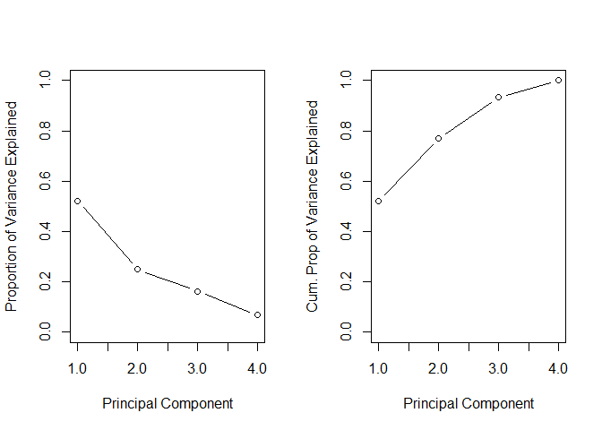

Project 3
================
Richard Xiao & Xi Yang
2022-11-12

## Introduction section

This is an online news popularity data set, and dataset summarizes a
heterogeneous set of features about articles published by Mashable in a
period of two years. The goal is to predict the number of shares in
social networks (popularity). We’re thinking about what kind of articles
are we most likely to share, and we believe there are two aspects. One
is objectivity. Users can feel the content is useful and valuable. The
other one is subjectivity. Users agree with the attitudes expressed in
the article, and also, the emotion expressed in the article resonated
with users.

Based on the two aspects, we choose 21 variables, and they are
n_tokens_title, n_tokens_content, n_unique_tokens, num_imgs, num_videos,
kw_avg_min, kw_max_max, kw_avg_max, kw_avg_avg, weekday_is_monday,
weekday_is_tuesday, weekday_is_wednesday, weekday_is_thursday,
weekday_is_friday,. weekday_is_saturday, weekday_is_sunday,
global_subjectivity, global_sentiment_polarity,
global_rate_positive_words, global_rate_negative_words, and share.

We produce some basic analysis before we fitting the model. The purpose
is to inspect the trends between different variables with respect to the
number of share, and also, figure out the correlation between a few
notable numeric variables. It helps the reader understand the summary or
graph.

For a linear regression model, we’ll use Backward stepwise and LASSO
regression model. For an ensemble tree-based model, we’ll fit random
forest and boosted tree model.

## Data

``` r
library(tidyverse)
library(caret)
#read in data
df1 <- read_csv("OnlineNewsPopularity.csv")
```

    ## Rows: 39644 Columns: 61
    ## ── Column specification ────────────────────────────────────────────────────────────────────────────────────────
    ## Delimiter: ","
    ## chr  (1): url
    ## dbl (60): timedelta, n_tokens_title, n_tokens_content, n_unique_tokens, n_non_stop_words, n_non_stop_unique_...
    ## 
    ## ℹ Use `spec()` to retrieve the full column specification for this data.
    ## ℹ Specify the column types or set `show_col_types = FALSE` to quiet this message.

``` r
df1
#Create a new variable for new data channel classification. Also want to remove the old data channel variables and other variables we don't need. Also want to rename the day variables to make it easier for analysis with rename variable.
selectchannel<- paste0("data_channel_is_", params[[1]])
df <- df1 %>%
  select(-c(url, timedelta)) %>%
  mutate(log_shares = log(shares)) %>%
  select(-shares) %>% rename(monday = weekday_is_monday , tuesday = weekday_is_tuesday, wednesday = weekday_is_wednesday, thursday = weekday_is_thursday, friday =     weekday_is_friday, saturday = weekday_is_saturday, sunday = weekday_is_sunday)
df 
#a single data_channel_is_lifestyle
df<- df %>% filter(get(selectchannel) ==1 ) 
df
set.seed(100)
index <- createDataPartition(df$log_shares, p = .7, list = FALSE)
train <- df[index,]
test <- df[-index,]
train
test
```

Here, we plotted the correlation between a few notable numeric
variables.

``` r
library(tidyverse)
library(corrplot)
cor_mat <- cor(train %>% select(log_shares,num_imgs,num_videos,n_tokens_content,n_tokens_title,kw_avg_min,kw_max_max,kw_avg_max,kw_avg_avg,global_subjectivity,global_sentiment_polarity,global_rate_positive_words), method = "pearson")
corrplot(cor_mat, hc.order = TRUE,
type = "lower",
tl.pos = "lt",
title = "Correlation Coefficients for log of shares",
subtitle = "Correlation Coefficients for log of shares",
mar=c(0,0,2,0)
)
```

    ## Warning in text.default(pos.xlabel[, 1], pos.xlabel[, 2], newcolnames, srt = tl.srt, : "hc.order" is not a
    ## graphical parameter

    ## Warning in text.default(pos.xlabel[, 1], pos.xlabel[, 2], newcolnames, srt = tl.srt, : "subtitle" is not a
    ## graphical parameter

    ## Warning in text.default(pos.ylabel[, 1], pos.ylabel[, 2], newrownames, col = tl.col, : "hc.order" is not a
    ## graphical parameter

    ## Warning in text.default(pos.ylabel[, 1], pos.ylabel[, 2], newrownames, col = tl.col, : "subtitle" is not a
    ## graphical parameter

    ## Warning in title(title, ...): "hc.order" is not a graphical parameter

    ## Warning in title(title, ...): "subtitle" is not a graphical parameter

<!-- --> From the
correlation graph, if the variable has a darker blue color, it will
signify a strong positive correlation with the other variable whereas if
it has a darker red color, it will have a stronger negative correlation
with the other variable.

## Summarizations

``` r
#This new dataframe converts the days into categorical values for graphing.
moddf <- train%>%
  mutate(day = if_else(monday == 1,"Monday",if_else(tuesday == 1,"Tuesday",if_else(wednesday == 1,"Wednesday",if_else(
thursday == 1,"Thursday",if_else(friday == 1,"Friday",if_else(saturday == 1,"Saturday", "Sunday")))))))
#Eliminates any categorical variables for use of principal component analysis
continuous <- train %>%select(-c(monday, tuesday, wednesday, thursday,friday, saturday, sunday, is_weekend, ))
```

### 1.

``` r
#Boxplot for log shares subdivided by days.
ggplot(moddf, aes(x = day, y = log_shares, col = day)) + 
  geom_boxplot(fill="grey") + 
  geom_jitter() + 
  ylab("log(shares)") + 
  xlab("") +
  theme(axis.text.x = element_text(angle = 45)) +
  ggtitle("Boxplot for Log Shares by Day")
```

<!-- -->

### 2.

``` r
#Scatterplot for log shares and number of images
ggplot(moddf, aes(y = log_shares, x = num_imgs, color = day)) + 
  geom_point(stat = "identity", position = "jitter") + 
  geom_smooth( method = "lm")  + 
  xlab("num_hrefs") + 
  ylab("log_shares")
```

    ## `geom_smooth()` using formula 'y ~ x'

<!-- -->

### 3.

``` r
#Scatterplot for log shares and number of videos.
ggplot(moddf, aes(y = log_shares, x = num_videos, color = day)) + 
  geom_point(stat = "identity", position = "jitter") + 
  geom_smooth( method = "lm")  + 
  xlab("num_hrefs") + 
  ylab("log_shares")
```

    ## `geom_smooth()` using formula 'y ~ x'

<!-- -->

### 4.

``` r
#Histogram for log shares 
ggplot(moddf, aes(x=log_shares, fill = kw_avg_avg, color = day)) + geom_histogram(binwidth = 1, position="dodge") + xlab("Average KeyWord") + ylab("Log Shares")
```

<!-- -->

### 5.

``` r
#Scatterplot for number of unique tokens and log shares
ggplot(moddf, aes(y = log_shares, x = n_unique_tokens, color = day)) + 
  geom_point(stat = "identity", position = "jitter") + 
  geom_smooth( method = "lm")  + 
  xlab("n_unique_tokens") + 
  ylab("log_shares")
```

    ## `geom_smooth()` using formula 'y ~ x'

<!-- -->

### 6.

``` r
#Scatterplot for number of tokens content and log shares
ggplot(moddf, aes(y = log_shares, x = n_tokens_content, color = day)) + 
  geom_point(stat = "identity", position = "jitter") + 
  geom_smooth( method = "lm")  + 
  xlab("n_tokens_content") + 
  ylab("log_shares")
```

    ## `geom_smooth()` using formula 'y ~ x'

<!-- -->

### 7.

``` r
#Scatterplot for number of token titles and log shares
ggplot(moddf, aes(y = log_shares, x = n_tokens_title, color = day)) + 
  geom_point(stat = "identity", position = "jitter") + 
  geom_smooth( method = "lm")  + 
  xlab("n_tokens_title") + 
  ylab("log_shares")
```

    ## `geom_smooth()` using formula 'y ~ x'

<!-- -->

### 8. General summary statistics for continuous dataframe

The code chunk below will give summary statistics for the twelve
variables that we want to analyze. The results are ordered by descending
standard deviation. We want to know the general statistics for all of
these variables to see how they compare against each other.

### 9. Numerical summary of categorical variable is_weekend

let’s pull a summary of the number of shares. One of the factors that
most affects the number of shares is whether the day is weekday or
weekend. I wanted to look at the average, standard deviation, median and
IQR values of number of shares on weekdays and weekend. If the value of
average is larger , then articles tend to be shared more often.

``` r
library(tidyverse)
train %>%
  group_by(is_weekend) %>%
  summarise(average=mean(log_shares), median=median(log_shares), sd=sd(log_shares), IQR=IQR(log_shares))
```

### 10. Dependence of number of shares on text subjectivity

A scatter plot with the number of shares on the y-axis and the text
subjectivity on the x-axis is created: we can inspect the trend of
shares as a function of the text subjectivity. We know that if the value
of text subjectivity is 0, it stands for the article is very objective,
and value 1 stands for very subjective. If the most points distributed
lower than 0.5, then articles with more objectivity tend to be shared
more often. If the most points distributed larger than 0.5, then
articles with more subjectivity tend to be shared more often. If the
most points distributed around 0.5, then articles with more neutrality
tend to be shared more often.

``` r
library(tidyverse)
library(ggplot2)
subjectivityData <- train %>% group_by(global_subjectivity) %>% summarize(sharecount = mean(log_shares))
ggplot(subjectivityData, aes(x = global_subjectivity, y = sharecount, color =global_subjectivity)) +
geom_point() +
ggtitle("dependence of number of shares on text subjectivity ")
```

<!-- -->

### 11. Dependence of number of shares on text sentiment polarity

A scatter plot with the number of shares on the y-axis and the text
sentiment polarity on the x-axis is created: we can inspect the trend of
shares as a function of the text sentiment polarity. We know that if the
value of text sentiment polarity is greater than -1 and less than 0, it
stands for the article sentiment is negative emotion. If the value of
text sentiment polarity is greater than 0 and less than 1, it stands for
the article sentiment is positive emotion. If the most points
distributed around (-1,0), then articles with negative emotion tend to
be shared more often. If the most points distributed around (0,1), then
articles with positive emotion tend to be shared more often. If the most
points distributed around 0, then articles with neutral emotion tend to
be shared more often.

``` r
library(tidyverse)
library(ggplot2)
sentimentpolarityData <- train %>% group_by(global_sentiment_polarity) %>% summarize(sharecount = mean(log_shares))
ggplot(sentimentpolarityData, aes(x = global_sentiment_polarity, y = sharecount, color =global_sentiment_polarity)) +
geom_point() +
ggtitle("dependence of number of shares on text sentiment polarity ")
```

<!-- -->

### 12. Dependence of number of shares on positive word rate

A scatter plot with the number of shares on the y-axis and the positive
word rate on the x-axis is created: we can inspect the trend of shares
as a function of the positive word rate. If the points show an upward
trend, then articles with more positive words tend to be shared more
often. If we see a negative trend then articles with more positive words
tend to be shared less often.

``` r
library(tidyverse)
library(ggplot2)
positivewordsData <- train %>% group_by(global_rate_positive_words) %>% summarize(sharecount = mean(log_shares))
ggplot(positivewordsData, aes(x = global_rate_positive_words, y = sharecount), color=global_rate_positive_words) +
geom_point() +
geom_smooth(method = "lm") +
ggtitle("dependence of number of shares on positive word rate ")
```

    ## `geom_smooth()` using formula 'y ~ x'

<!-- --> \### 13.
Dependence of number of shares on negative words rate

A scatter plot with the number of shares on the y-axis and the negative
words rate on the x-axis is created: we can inspect the trend of shares
as a function of the negative words rate. If the points show an upward
trend, then articles with more negative words tend to be shared more
often. If we see a negative trend then articles with more negative words
tend to be shared less often.

``` r
library(tidyverse)
library(ggplot2)
negativewordsData <- train %>% group_by(global_rate_negative_words) %>% summarize(sharecount = mean(log_shares))
ggplot(negativewordsData, aes(x = global_rate_negative_words, y = sharecount)) +
geom_point() +
geom_smooth(method = "lm") +
ggtitle("dependence of number of shares on negative words rate")
```

    ## `geom_smooth()` using formula 'y ~ x'

<!-- -->

## Modeling

For models below, I have selected the log_shares as the dependent
variable, and num_imgs, num_videos, n_tokens_content, n_unique_tokens,
n_tokens_title, kw_avg_min, kw_max_max, kw_avg_max,
kw_avg_avg,global_subjectivity, global_sentiment_polarity,
global_rate_positive_words, global_rate_negative_words, monday, tuesday,
wednesday, thursday, friday, saturday, sunday as the independent
variables.

``` r
library(tidyverse)
#Select variables of interest for analysis.
analysis <- train %>% select(log_shares,num_imgs,num_videos,n_tokens_content,n_unique_tokens,n_tokens_title,kw_avg_min,kw_max_max,kw_avg_max,kw_avg_avg,global_subjectivity,global_sentiment_polarity,global_rate_positive_words,global_rate_negative_words,monday,tuesday,wednesday,thursday,friday,saturday,sunday)
analysis
```

Here after all the models formulated below, to compare them, I am
predicting the test data on this model to derive some common metrics
like RMSE and R squared values that can be used to compare multiple
models. For prediction, I am using predict() function, and to extract
prediction metrics, I am using postResample() function.

### 1. LASSO Regression Model

Lasso regression is a type of linear regression that uses shrinkage.
Shrinkage is where data values are shrunk towards a central point, like
the mean. The lasso procedure encourages simple, sparse models
(i.e. models with fewer parameters). This particular type of regression
is well-suited for models showing high levels of multicollinearity or
when you want to automate certain parts of model selection, like
variable selection/parameter elimination.

``` r
library(caret)
fitLASSO <- train(log_shares ~ ., data = analysis,
method = "lasso",
preProcess = c("center", "scale"),
trControl = trainControl(method = "cv", number = 10)
)
predLASSO <- predict(fitLASSO, newdata = test)
m1<-postResample(predLASSO, obs = test$log_shares)
m1
```

    ##      RMSE  Rsquared       MAE 
    ## 0.8278550 0.0247206 0.6190274

### 2. Boosted Tree Model

Boosting is an ensemble learning method that combines a set of weak
learners into a strong learner to minimize training errors. In boosting,
a random sample of data is selected, fitted with a model and then
trained sequentially—that is, each model tries to compensate for the
weaknesses of its predecessor. With each iteration, the weak rules from
each individual classifier are combined to form one, strong prediction
rule.

``` r
library(caret)
boostedFit <- train(log_shares ~ ., data = analysis, method = "gbm",trControl = trainControl(method = "cv" , number = 10),
                    preProcess = c("center", "scale"),
                    tuneGrid = expand.grid(n.trees = c(25, 50, 100, 150, 200),
                                           interaction.depth = 1:4,
                                           shrinkage = 0.1,
                                           n.minobsinnode = 10)
                    )
```

    ## Iter   TrainDeviance   ValidDeviance   StepSize   Improve
    ##      1        0.6936             nan     0.1000    0.0059
    ##      2        0.6901             nan     0.1000    0.0031
    ##      3        0.6852             nan     0.1000    0.0042
    ##      4        0.6794             nan     0.1000    0.0031
    ##      5        0.6757             nan     0.1000    0.0013
    ##      6        0.6728             nan     0.1000    0.0017
    ##      7        0.6704             nan     0.1000    0.0010
    ##      8        0.6658             nan     0.1000    0.0033
    ##      9        0.6629             nan     0.1000    0.0017
    ##     10        0.6606             nan     0.1000    0.0018
    ##     20        0.6414             nan     0.1000    0.0005
    ##     40        0.6183             nan     0.1000   -0.0001
    ##     60        0.6034             nan     0.1000   -0.0002
    ##     80        0.5908             nan     0.1000   -0.0006
    ##    100        0.5801             nan     0.1000   -0.0015
    ##    120        0.5717             nan     0.1000   -0.0004
    ##    140        0.5639             nan     0.1000   -0.0010
    ##    160        0.5565             nan     0.1000   -0.0002
    ##    180        0.5500             nan     0.1000   -0.0011
    ##    200        0.5453             nan     0.1000   -0.0005
    ## 
    ## Iter   TrainDeviance   ValidDeviance   StepSize   Improve
    ##      1        0.6901             nan     0.1000    0.0086
    ##      2        0.6825             nan     0.1000    0.0048
    ##      3        0.6762             nan     0.1000    0.0038
    ##      4        0.6694             nan     0.1000    0.0057
    ##      5        0.6629             nan     0.1000    0.0053
    ##      6        0.6570             nan     0.1000    0.0024
    ##      7        0.6541             nan     0.1000    0.0008
    ##      8        0.6507             nan     0.1000    0.0012
    ##      9        0.6459             nan     0.1000    0.0025
    ##     10        0.6429             nan     0.1000    0.0021
    ##     20        0.6170             nan     0.1000    0.0001
    ##     40        0.5857             nan     0.1000   -0.0008
    ##     60        0.5612             nan     0.1000   -0.0017
    ##     80        0.5392             nan     0.1000   -0.0010
    ##    100        0.5241             nan     0.1000   -0.0007
    ##    120        0.5088             nan     0.1000   -0.0016
    ##    140        0.4962             nan     0.1000   -0.0012
    ##    160        0.4841             nan     0.1000   -0.0004
    ##    180        0.4736             nan     0.1000   -0.0007
    ##    200        0.4652             nan     0.1000   -0.0012
    ## 
    ## Iter   TrainDeviance   ValidDeviance   StepSize   Improve
    ##      1        0.6900             nan     0.1000    0.0075
    ##      2        0.6779             nan     0.1000    0.0080
    ##      3        0.6704             nan     0.1000    0.0038
    ##      4        0.6623             nan     0.1000    0.0047
    ##      5        0.6566             nan     0.1000    0.0031
    ##      6        0.6506             nan     0.1000    0.0037
    ##      7        0.6433             nan     0.1000    0.0030
    ##      8        0.6368             nan     0.1000    0.0031
    ##      9        0.6318             nan     0.1000    0.0015
    ##     10        0.6265             nan     0.1000    0.0022
    ##     20        0.5953             nan     0.1000   -0.0002
    ##     40        0.5579             nan     0.1000   -0.0000
    ##     60        0.5262             nan     0.1000   -0.0006
    ##     80        0.5030             nan     0.1000   -0.0012
    ##    100        0.4830             nan     0.1000   -0.0009
    ##    120        0.4643             nan     0.1000   -0.0010
    ##    140        0.4493             nan     0.1000   -0.0013
    ##    160        0.4376             nan     0.1000   -0.0010
    ##    180        0.4254             nan     0.1000   -0.0014
    ##    200        0.4099             nan     0.1000   -0.0004
    ## 
    ## Iter   TrainDeviance   ValidDeviance   StepSize   Improve
    ##      1        0.6867             nan     0.1000    0.0096
    ##      2        0.6753             nan     0.1000    0.0094
    ##      3        0.6637             nan     0.1000    0.0082
    ##      4        0.6534             nan     0.1000    0.0047
    ##      5        0.6460             nan     0.1000    0.0043
    ##      6        0.6404             nan     0.1000    0.0016
    ##      7        0.6352             nan     0.1000    0.0020
    ##      8        0.6307             nan     0.1000    0.0013
    ##      9        0.6241             nan     0.1000    0.0044
    ##     10        0.6180             nan     0.1000    0.0029
    ##     20        0.5818             nan     0.1000    0.0004
    ##     40        0.5347             nan     0.1000   -0.0014
    ##     60        0.5037             nan     0.1000   -0.0017
    ##     80        0.4726             nan     0.1000   -0.0010
    ##    100        0.4477             nan     0.1000   -0.0000
    ##    120        0.4261             nan     0.1000   -0.0013
    ##    140        0.4073             nan     0.1000   -0.0020
    ##    160        0.3921             nan     0.1000   -0.0009
    ##    180        0.3778             nan     0.1000   -0.0011
    ##    200        0.3640             nan     0.1000   -0.0016
    ## 
    ## Iter   TrainDeviance   ValidDeviance   StepSize   Improve
    ##      1        0.7034             nan     0.1000    0.0041
    ##      2        0.7010             nan     0.1000    0.0015
    ##      3        0.6961             nan     0.1000    0.0049
    ##      4        0.6906             nan     0.1000    0.0045
    ##      5        0.6862             nan     0.1000    0.0037
    ##      6        0.6820             nan     0.1000    0.0039
    ##      7        0.6784             nan     0.1000    0.0031
    ##      8        0.6746             nan     0.1000    0.0029
    ##      9        0.6721             nan     0.1000    0.0022
    ##     10        0.6693             nan     0.1000    0.0023
    ##     20        0.6494             nan     0.1000   -0.0006
    ##     40        0.6247             nan     0.1000    0.0003
    ##     60        0.6071             nan     0.1000   -0.0002
    ##     80        0.5945             nan     0.1000   -0.0001
    ##    100        0.5845             nan     0.1000   -0.0004
    ##    120        0.5751             nan     0.1000   -0.0002
    ##    140        0.5687             nan     0.1000   -0.0017
    ##    160        0.5629             nan     0.1000   -0.0008
    ##    180        0.5570             nan     0.1000   -0.0016
    ##    200        0.5524             nan     0.1000   -0.0008
    ## 
    ## Iter   TrainDeviance   ValidDeviance   StepSize   Improve
    ##      1        0.6998             nan     0.1000    0.0098
    ##      2        0.6887             nan     0.1000    0.0065
    ##      3        0.6810             nan     0.1000    0.0035
    ##      4        0.6734             nan     0.1000    0.0070
    ##      5        0.6677             nan     0.1000    0.0021
    ##      6        0.6629             nan     0.1000    0.0027
    ##      7        0.6568             nan     0.1000    0.0032
    ##      8        0.6527             nan     0.1000    0.0034
    ##      9        0.6488             nan     0.1000    0.0007
    ##     10        0.6455             nan     0.1000    0.0011
    ##     20        0.6182             nan     0.1000    0.0014
    ##     40        0.5858             nan     0.1000    0.0004
    ##     60        0.5619             nan     0.1000    0.0001
    ##     80        0.5452             nan     0.1000   -0.0004
    ##    100        0.5283             nan     0.1000   -0.0004
    ##    120        0.5164             nan     0.1000   -0.0019
    ##    140        0.5039             nan     0.1000   -0.0009
    ##    160        0.4925             nan     0.1000   -0.0008
    ##    180        0.4817             nan     0.1000   -0.0011
    ##    200        0.4723             nan     0.1000   -0.0012
    ## 
    ## Iter   TrainDeviance   ValidDeviance   StepSize   Improve
    ##      1        0.6994             nan     0.1000    0.0078
    ##      2        0.6871             nan     0.1000    0.0068
    ##      3        0.6767             nan     0.1000    0.0064
    ##      4        0.6695             nan     0.1000    0.0051
    ##      5        0.6625             nan     0.1000    0.0032
    ##      6        0.6554             nan     0.1000    0.0028
    ##      7        0.6503             nan     0.1000    0.0018
    ##      8        0.6457             nan     0.1000    0.0021
    ##      9        0.6406             nan     0.1000    0.0042
    ##     10        0.6370             nan     0.1000    0.0004
    ##     20        0.6014             nan     0.1000    0.0004
    ##     40        0.5607             nan     0.1000   -0.0001
    ##     60        0.5353             nan     0.1000   -0.0011
    ##     80        0.5128             nan     0.1000   -0.0005
    ##    100        0.4898             nan     0.1000   -0.0012
    ##    120        0.4734             nan     0.1000   -0.0008
    ##    140        0.4584             nan     0.1000   -0.0022
    ##    160        0.4458             nan     0.1000   -0.0017
    ##    180        0.4326             nan     0.1000   -0.0006
    ##    200        0.4213             nan     0.1000   -0.0003
    ## 
    ## Iter   TrainDeviance   ValidDeviance   StepSize   Improve
    ##      1        0.6992             nan     0.1000    0.0095
    ##      2        0.6847             nan     0.1000    0.0125
    ##      3        0.6735             nan     0.1000    0.0076
    ##      4        0.6629             nan     0.1000    0.0066
    ##      5        0.6557             nan     0.1000    0.0057
    ##      6        0.6496             nan     0.1000    0.0038
    ##      7        0.6449             nan     0.1000    0.0013
    ##      8        0.6392             nan     0.1000    0.0031
    ##      9        0.6323             nan     0.1000    0.0040
    ##     10        0.6277             nan     0.1000    0.0001
    ##     20        0.5899             nan     0.1000   -0.0008
    ##     40        0.5397             nan     0.1000    0.0009
    ##     60        0.5049             nan     0.1000   -0.0015
    ##     80        0.4776             nan     0.1000   -0.0011
    ##    100        0.4535             nan     0.1000   -0.0010
    ##    120        0.4328             nan     0.1000   -0.0018
    ##    140        0.4136             nan     0.1000   -0.0019
    ##    160        0.3964             nan     0.1000   -0.0007
    ##    180        0.3787             nan     0.1000   -0.0006
    ##    200        0.3627             nan     0.1000   -0.0006
    ## 
    ## Iter   TrainDeviance   ValidDeviance   StepSize   Improve
    ##      1        0.7002             nan     0.1000    0.0061
    ##      2        0.6939             nan     0.1000    0.0060
    ##      3        0.6889             nan     0.1000    0.0032
    ##      4        0.6847             nan     0.1000    0.0024
    ##      5        0.6795             nan     0.1000    0.0046
    ##      6        0.6766             nan     0.1000    0.0015
    ##      7        0.6740             nan     0.1000    0.0020
    ##      8        0.6693             nan     0.1000    0.0036
    ##      9        0.6662             nan     0.1000    0.0024
    ##     10        0.6637             nan     0.1000    0.0008
    ##     20        0.6443             nan     0.1000    0.0011
    ##     40        0.6206             nan     0.1000   -0.0009
    ##     60        0.6046             nan     0.1000    0.0002
    ##     80        0.5930             nan     0.1000   -0.0000
    ##    100        0.5835             nan     0.1000   -0.0007
    ##    120        0.5764             nan     0.1000   -0.0006
    ##    140        0.5697             nan     0.1000   -0.0006
    ##    160        0.5630             nan     0.1000   -0.0007
    ##    180        0.5572             nan     0.1000   -0.0006
    ##    200        0.5508             nan     0.1000   -0.0007
    ## 
    ## Iter   TrainDeviance   ValidDeviance   StepSize   Improve
    ##      1        0.6962             nan     0.1000    0.0041
    ##      2        0.6890             nan     0.1000    0.0065
    ##      3        0.6799             nan     0.1000    0.0073
    ##      4        0.6731             nan     0.1000    0.0072
    ##      5        0.6677             nan     0.1000    0.0057
    ##      6        0.6626             nan     0.1000    0.0021
    ##      7        0.6582             nan     0.1000    0.0031
    ##      8        0.6548             nan     0.1000    0.0017
    ##      9        0.6495             nan     0.1000    0.0016
    ##     10        0.6447             nan     0.1000    0.0035
    ##     20        0.6143             nan     0.1000   -0.0000
    ##     40        0.5798             nan     0.1000   -0.0018
    ##     60        0.5546             nan     0.1000   -0.0002
    ##     80        0.5351             nan     0.1000   -0.0004
    ##    100        0.5193             nan     0.1000   -0.0006
    ##    120        0.5024             nan     0.1000   -0.0010
    ##    140        0.4892             nan     0.1000   -0.0011
    ##    160        0.4789             nan     0.1000   -0.0019
    ##    180        0.4695             nan     0.1000   -0.0009
    ##    200        0.4608             nan     0.1000   -0.0012
    ## 
    ## Iter   TrainDeviance   ValidDeviance   StepSize   Improve
    ##      1        0.6904             nan     0.1000    0.0123
    ##      2        0.6830             nan     0.1000    0.0025
    ##      3        0.6713             nan     0.1000    0.0078
    ##      4        0.6618             nan     0.1000    0.0030
    ##      5        0.6543             nan     0.1000    0.0027
    ##      6        0.6483             nan     0.1000    0.0042
    ##      7        0.6430             nan     0.1000    0.0016
    ##      8        0.6371             nan     0.1000    0.0044
    ##      9        0.6318             nan     0.1000    0.0007
    ##     10        0.6274             nan     0.1000    0.0023
    ##     20        0.5935             nan     0.1000   -0.0014
    ##     40        0.5505             nan     0.1000    0.0006
    ##     60        0.5192             nan     0.1000   -0.0002
    ##     80        0.4945             nan     0.1000   -0.0005
    ##    100        0.4725             nan     0.1000   -0.0013
    ##    120        0.4523             nan     0.1000   -0.0005
    ##    140        0.4362             nan     0.1000   -0.0014
    ##    160        0.4208             nan     0.1000   -0.0006
    ##    180        0.4097             nan     0.1000   -0.0008
    ##    200        0.3992             nan     0.1000   -0.0013
    ## 
    ## Iter   TrainDeviance   ValidDeviance   StepSize   Improve
    ##      1        0.6923             nan     0.1000    0.0100
    ##      2        0.6820             nan     0.1000    0.0100
    ##      3        0.6713             nan     0.1000    0.0090
    ##      4        0.6630             nan     0.1000    0.0065
    ##      5        0.6545             nan     0.1000    0.0044
    ##      6        0.6500             nan     0.1000    0.0002
    ##      7        0.6428             nan     0.1000    0.0046
    ##      8        0.6353             nan     0.1000    0.0062
    ##      9        0.6265             nan     0.1000    0.0046
    ##     10        0.6216             nan     0.1000    0.0023
    ##     20        0.5838             nan     0.1000    0.0024
    ##     40        0.5335             nan     0.1000   -0.0022
    ##     60        0.4965             nan     0.1000   -0.0015
    ##     80        0.4681             nan     0.1000   -0.0018
    ##    100        0.4413             nan     0.1000   -0.0021
    ##    120        0.4223             nan     0.1000   -0.0023
    ##    140        0.4047             nan     0.1000   -0.0017
    ##    160        0.3859             nan     0.1000   -0.0017
    ##    180        0.3702             nan     0.1000   -0.0008
    ##    200        0.3565             nan     0.1000   -0.0007
    ## 
    ## Iter   TrainDeviance   ValidDeviance   StepSize   Improve
    ##      1        0.7030             nan     0.1000    0.0078
    ##      2        0.6960             nan     0.1000    0.0053
    ##      3        0.6907             nan     0.1000    0.0047
    ##      4        0.6874             nan     0.1000    0.0030
    ##      5        0.6836             nan     0.1000    0.0037
    ##      6        0.6808             nan     0.1000    0.0023
    ##      7        0.6769             nan     0.1000    0.0020
    ##      8        0.6744             nan     0.1000    0.0013
    ##      9        0.6714             nan     0.1000    0.0013
    ##     10        0.6689             nan     0.1000    0.0014
    ##     20        0.6497             nan     0.1000    0.0009
    ##     40        0.6256             nan     0.1000   -0.0001
    ##     60        0.6110             nan     0.1000    0.0002
    ##     80        0.5970             nan     0.1000   -0.0004
    ##    100        0.5878             nan     0.1000   -0.0005
    ##    120        0.5794             nan     0.1000   -0.0007
    ##    140        0.5723             nan     0.1000   -0.0007
    ##    160        0.5661             nan     0.1000   -0.0008
    ##    180        0.5596             nan     0.1000   -0.0001
    ##    200        0.5543             nan     0.1000   -0.0007
    ## 
    ## Iter   TrainDeviance   ValidDeviance   StepSize   Improve
    ##      1        0.7021             nan     0.1000    0.0099
    ##      2        0.6981             nan     0.1000    0.0027
    ##      3        0.6866             nan     0.1000    0.0072
    ##      4        0.6774             nan     0.1000    0.0053
    ##      5        0.6710             nan     0.1000    0.0050
    ##      6        0.6666             nan     0.1000    0.0018
    ##      7        0.6632             nan     0.1000    0.0016
    ##      8        0.6588             nan     0.1000    0.0031
    ##      9        0.6555             nan     0.1000    0.0024
    ##     10        0.6517             nan     0.1000    0.0017
    ##     20        0.6241             nan     0.1000   -0.0013
    ##     40        0.5883             nan     0.1000   -0.0008
    ##     60        0.5635             nan     0.1000   -0.0015
    ##     80        0.5474             nan     0.1000   -0.0014
    ##    100        0.5297             nan     0.1000   -0.0011
    ##    120        0.5177             nan     0.1000   -0.0011
    ##    140        0.5014             nan     0.1000   -0.0001
    ##    160        0.4918             nan     0.1000   -0.0008
    ##    180        0.4815             nan     0.1000    0.0001
    ##    200        0.4715             nan     0.1000   -0.0006
    ## 
    ## Iter   TrainDeviance   ValidDeviance   StepSize   Improve
    ##      1        0.6988             nan     0.1000    0.0120
    ##      2        0.6889             nan     0.1000    0.0082
    ##      3        0.6780             nan     0.1000    0.0073
    ##      4        0.6726             nan     0.1000    0.0029
    ##      5        0.6653             nan     0.1000    0.0067
    ##      6        0.6587             nan     0.1000    0.0062
    ##      7        0.6532             nan     0.1000    0.0031
    ##      8        0.6463             nan     0.1000    0.0033
    ##      9        0.6421             nan     0.1000    0.0026
    ##     10        0.6377             nan     0.1000    0.0023
    ##     20        0.6030             nan     0.1000   -0.0004
    ##     40        0.5615             nan     0.1000   -0.0011
    ##     60        0.5314             nan     0.1000   -0.0010
    ##     80        0.5088             nan     0.1000   -0.0022
    ##    100        0.4880             nan     0.1000   -0.0012
    ##    120        0.4683             nan     0.1000   -0.0015
    ##    140        0.4516             nan     0.1000   -0.0016
    ##    160        0.4376             nan     0.1000   -0.0012
    ##    180        0.4231             nan     0.1000   -0.0019
    ##    200        0.4114             nan     0.1000   -0.0006
    ## 
    ## Iter   TrainDeviance   ValidDeviance   StepSize   Improve
    ##      1        0.6967             nan     0.1000    0.0144
    ##      2        0.6866             nan     0.1000    0.0095
    ##      3        0.6755             nan     0.1000    0.0084
    ##      4        0.6631             nan     0.1000    0.0027
    ##      5        0.6550             nan     0.1000    0.0043
    ##      6        0.6488             nan     0.1000    0.0036
    ##      7        0.6424             nan     0.1000    0.0030
    ##      8        0.6369             nan     0.1000    0.0023
    ##      9        0.6307             nan     0.1000    0.0022
    ##     10        0.6260             nan     0.1000    0.0004
    ##     20        0.5866             nan     0.1000    0.0011
    ##     40        0.5349             nan     0.1000   -0.0021
    ##     60        0.4991             nan     0.1000   -0.0009
    ##     80        0.4702             nan     0.1000   -0.0006
    ##    100        0.4455             nan     0.1000   -0.0023
    ##    120        0.4243             nan     0.1000   -0.0005
    ##    140        0.4070             nan     0.1000   -0.0005
    ##    160        0.3892             nan     0.1000   -0.0014
    ##    180        0.3727             nan     0.1000   -0.0008
    ##    200        0.3578             nan     0.1000   -0.0010
    ## 
    ## Iter   TrainDeviance   ValidDeviance   StepSize   Improve
    ##      1        0.7255             nan     0.1000    0.0064
    ##      2        0.7211             nan     0.1000    0.0039
    ##      3        0.7149             nan     0.1000    0.0038
    ##      4        0.7096             nan     0.1000    0.0061
    ##      5        0.7051             nan     0.1000    0.0027
    ##      6        0.7009             nan     0.1000    0.0045
    ##      7        0.6962             nan     0.1000    0.0004
    ##      8        0.6936             nan     0.1000    0.0021
    ##      9        0.6906             nan     0.1000    0.0011
    ##     10        0.6876             nan     0.1000    0.0022
    ##     20        0.6645             nan     0.1000    0.0010
    ##     40        0.6412             nan     0.1000    0.0005
    ##     60        0.6239             nan     0.1000    0.0000
    ##     80        0.6121             nan     0.1000   -0.0014
    ##    100        0.6015             nan     0.1000   -0.0005
    ##    120        0.5948             nan     0.1000   -0.0003
    ##    140        0.5869             nan     0.1000   -0.0008
    ##    160        0.5809             nan     0.1000   -0.0015
    ##    180        0.5757             nan     0.1000   -0.0001
    ##    200        0.5716             nan     0.1000   -0.0008
    ## 
    ## Iter   TrainDeviance   ValidDeviance   StepSize   Improve
    ##      1        0.7196             nan     0.1000    0.0080
    ##      2        0.7099             nan     0.1000    0.0101
    ##      3        0.6996             nan     0.1000    0.0066
    ##      4        0.6924             nan     0.1000    0.0054
    ##      5        0.6876             nan     0.1000    0.0025
    ##      6        0.6835             nan     0.1000    0.0025
    ##      7        0.6802             nan     0.1000    0.0011
    ##      8        0.6741             nan     0.1000    0.0036
    ##      9        0.6699             nan     0.1000    0.0022
    ##     10        0.6668             nan     0.1000    0.0006
    ##     20        0.6375             nan     0.1000    0.0008
    ##     40        0.6029             nan     0.1000   -0.0013
    ##     60        0.5799             nan     0.1000   -0.0004
    ##     80        0.5604             nan     0.1000   -0.0012
    ##    100        0.5453             nan     0.1000   -0.0007
    ##    120        0.5306             nan     0.1000   -0.0003
    ##    140        0.5177             nan     0.1000   -0.0014
    ##    160        0.5046             nan     0.1000   -0.0007
    ##    180        0.4941             nan     0.1000   -0.0001
    ##    200        0.4833             nan     0.1000   -0.0001
    ## 
    ## Iter   TrainDeviance   ValidDeviance   StepSize   Improve
    ##      1        0.7198             nan     0.1000    0.0109
    ##      2        0.7101             nan     0.1000    0.0079
    ##      3        0.6986             nan     0.1000    0.0090
    ##      4        0.6887             nan     0.1000    0.0085
    ##      5        0.6796             nan     0.1000    0.0045
    ##      6        0.6737             nan     0.1000    0.0045
    ##      7        0.6651             nan     0.1000    0.0035
    ##      8        0.6591             nan     0.1000    0.0026
    ##      9        0.6549             nan     0.1000    0.0012
    ##     10        0.6492             nan     0.1000    0.0026
    ##     20        0.6192             nan     0.1000   -0.0003
    ##     40        0.5788             nan     0.1000   -0.0004
    ##     60        0.5478             nan     0.1000   -0.0001
    ##     80        0.5194             nan     0.1000   -0.0022
    ##    100        0.4953             nan     0.1000   -0.0008
    ##    120        0.4755             nan     0.1000   -0.0008
    ##    140        0.4605             nan     0.1000   -0.0022
    ##    160        0.4458             nan     0.1000   -0.0003
    ##    180        0.4316             nan     0.1000   -0.0011
    ##    200        0.4171             nan     0.1000   -0.0006
    ## 
    ## Iter   TrainDeviance   ValidDeviance   StepSize   Improve
    ##      1        0.7174             nan     0.1000    0.0123
    ##      2        0.7074             nan     0.1000    0.0081
    ##      3        0.6955             nan     0.1000    0.0097
    ##      4        0.6842             nan     0.1000    0.0073
    ##      5        0.6743             nan     0.1000    0.0087
    ##      6        0.6665             nan     0.1000    0.0067
    ##      7        0.6595             nan     0.1000    0.0022
    ##      8        0.6550             nan     0.1000    0.0017
    ##      9        0.6505             nan     0.1000   -0.0002
    ##     10        0.6448             nan     0.1000    0.0028
    ##     20        0.6029             nan     0.1000    0.0011
    ##     40        0.5536             nan     0.1000   -0.0013
    ##     60        0.5182             nan     0.1000   -0.0002
    ##     80        0.4870             nan     0.1000   -0.0005
    ##    100        0.4614             nan     0.1000   -0.0014
    ##    120        0.4395             nan     0.1000   -0.0019
    ##    140        0.4184             nan     0.1000   -0.0012
    ##    160        0.3987             nan     0.1000   -0.0020
    ##    180        0.3821             nan     0.1000   -0.0012
    ##    200        0.3682             nan     0.1000   -0.0013
    ## 
    ## Iter   TrainDeviance   ValidDeviance   StepSize   Improve
    ##      1        0.7248             nan     0.1000    0.0034
    ##      2        0.7185             nan     0.1000    0.0068
    ##      3        0.7119             nan     0.1000    0.0042
    ##      4        0.7057             nan     0.1000    0.0049
    ##      5        0.7004             nan     0.1000    0.0034
    ##      6        0.6965             nan     0.1000    0.0039
    ##      7        0.6927             nan     0.1000    0.0009
    ##      8        0.6891             nan     0.1000    0.0033
    ##      9        0.6861             nan     0.1000    0.0013
    ##     10        0.6835             nan     0.1000   -0.0000
    ##     20        0.6592             nan     0.1000   -0.0003
    ##     40        0.6314             nan     0.1000   -0.0005
    ##     60        0.6132             nan     0.1000   -0.0002
    ##     80        0.6013             nan     0.1000   -0.0005
    ##    100        0.5921             nan     0.1000   -0.0001
    ##    120        0.5813             nan     0.1000    0.0002
    ##    140        0.5735             nan     0.1000   -0.0011
    ##    160        0.5671             nan     0.1000   -0.0003
    ##    180        0.5617             nan     0.1000   -0.0004
    ##    200        0.5558             nan     0.1000   -0.0007
    ## 
    ## Iter   TrainDeviance   ValidDeviance   StepSize   Improve
    ##      1        0.7185             nan     0.1000    0.0090
    ##      2        0.7086             nan     0.1000    0.0094
    ##      3        0.7007             nan     0.1000    0.0037
    ##      4        0.6946             nan     0.1000    0.0050
    ##      5        0.6863             nan     0.1000    0.0053
    ##      6        0.6789             nan     0.1000    0.0018
    ##      7        0.6748             nan     0.1000    0.0019
    ##      8        0.6697             nan     0.1000    0.0041
    ##      9        0.6658             nan     0.1000    0.0026
    ##     10        0.6622             nan     0.1000    0.0028
    ##     20        0.6303             nan     0.1000    0.0000
    ##     40        0.5937             nan     0.1000   -0.0013
    ##     60        0.5686             nan     0.1000   -0.0008
    ##     80        0.5487             nan     0.1000   -0.0015
    ##    100        0.5337             nan     0.1000   -0.0027
    ##    120        0.5210             nan     0.1000    0.0001
    ##    140        0.5082             nan     0.1000   -0.0007
    ##    160        0.4964             nan     0.1000   -0.0011
    ##    180        0.4863             nan     0.1000   -0.0004
    ##    200        0.4760             nan     0.1000   -0.0008
    ## 
    ## Iter   TrainDeviance   ValidDeviance   StepSize   Improve
    ##      1        0.7183             nan     0.1000    0.0109
    ##      2        0.7062             nan     0.1000    0.0103
    ##      3        0.6967             nan     0.1000    0.0099
    ##      4        0.6875             nan     0.1000    0.0054
    ##      5        0.6778             nan     0.1000    0.0045
    ##      6        0.6702             nan     0.1000    0.0026
    ##      7        0.6619             nan     0.1000    0.0061
    ##      8        0.6570             nan     0.1000    0.0013
    ##      9        0.6532             nan     0.1000    0.0025
    ##     10        0.6502             nan     0.1000   -0.0016
    ##     20        0.6104             nan     0.1000   -0.0008
    ##     40        0.5698             nan     0.1000   -0.0008
    ##     60        0.5387             nan     0.1000   -0.0019
    ##     80        0.5129             nan     0.1000   -0.0013
    ##    100        0.4912             nan     0.1000   -0.0016
    ##    120        0.4740             nan     0.1000   -0.0019
    ##    140        0.4583             nan     0.1000   -0.0011
    ##    160        0.4413             nan     0.1000   -0.0012
    ##    180        0.4301             nan     0.1000   -0.0008
    ##    200        0.4159             nan     0.1000   -0.0006
    ## 
    ## Iter   TrainDeviance   ValidDeviance   StepSize   Improve
    ##      1        0.7132             nan     0.1000    0.0142
    ##      2        0.6976             nan     0.1000    0.0118
    ##      3        0.6825             nan     0.1000    0.0103
    ##      4        0.6737             nan     0.1000    0.0044
    ##      5        0.6645             nan     0.1000    0.0055
    ##      6        0.6571             nan     0.1000    0.0035
    ##      7        0.6497             nan     0.1000    0.0028
    ##      8        0.6456             nan     0.1000    0.0020
    ##      9        0.6388             nan     0.1000   -0.0002
    ##     10        0.6345             nan     0.1000   -0.0001
    ##     20        0.5973             nan     0.1000    0.0010
    ##     40        0.5479             nan     0.1000   -0.0013
    ##     60        0.5123             nan     0.1000   -0.0005
    ##     80        0.4804             nan     0.1000    0.0001
    ##    100        0.4581             nan     0.1000   -0.0012
    ##    120        0.4365             nan     0.1000   -0.0011
    ##    140        0.4167             nan     0.1000   -0.0005
    ##    160        0.3988             nan     0.1000   -0.0013
    ##    180        0.3806             nan     0.1000   -0.0000
    ##    200        0.3670             nan     0.1000   -0.0002
    ## 
    ## Iter   TrainDeviance   ValidDeviance   StepSize   Improve
    ##      1        0.6794             nan     0.1000    0.0062
    ##      2        0.6742             nan     0.1000    0.0061
    ##      3        0.6704             nan     0.1000    0.0017
    ##      4        0.6663             nan     0.1000    0.0023
    ##      5        0.6633             nan     0.1000    0.0017
    ##      6        0.6610             nan     0.1000    0.0015
    ##      7        0.6576             nan     0.1000    0.0017
    ##      8        0.6553             nan     0.1000    0.0003
    ##      9        0.6528             nan     0.1000    0.0018
    ##     10        0.6506             nan     0.1000    0.0014
    ##     20        0.6342             nan     0.1000    0.0004
    ##     40        0.6107             nan     0.1000    0.0005
    ##     60        0.5949             nan     0.1000   -0.0002
    ##     80        0.5822             nan     0.1000   -0.0004
    ##    100        0.5723             nan     0.1000   -0.0008
    ##    120        0.5635             nan     0.1000   -0.0007
    ##    140        0.5567             nan     0.1000   -0.0002
    ##    160        0.5506             nan     0.1000   -0.0008
    ##    180        0.5446             nan     0.1000   -0.0008
    ##    200        0.5399             nan     0.1000   -0.0015
    ## 
    ## Iter   TrainDeviance   ValidDeviance   StepSize   Improve
    ##      1        0.6761             nan     0.1000    0.0066
    ##      2        0.6688             nan     0.1000    0.0046
    ##      3        0.6618             nan     0.1000    0.0043
    ##      4        0.6573             nan     0.1000    0.0042
    ##      5        0.6520             nan     0.1000    0.0056
    ##      6        0.6476             nan     0.1000    0.0022
    ##      7        0.6442             nan     0.1000    0.0013
    ##      8        0.6406             nan     0.1000    0.0019
    ##      9        0.6373             nan     0.1000    0.0006
    ##     10        0.6341             nan     0.1000    0.0003
    ##     20        0.6063             nan     0.1000   -0.0005
    ##     40        0.5756             nan     0.1000   -0.0013
    ##     60        0.5539             nan     0.1000   -0.0009
    ##     80        0.5356             nan     0.1000   -0.0012
    ##    100        0.5204             nan     0.1000   -0.0001
    ##    120        0.5087             nan     0.1000   -0.0008
    ##    140        0.4966             nan     0.1000   -0.0015
    ##    160        0.4844             nan     0.1000   -0.0012
    ##    180        0.4756             nan     0.1000   -0.0004
    ##    200        0.4666             nan     0.1000   -0.0006
    ## 
    ## Iter   TrainDeviance   ValidDeviance   StepSize   Improve
    ##      1        0.6752             nan     0.1000    0.0071
    ##      2        0.6666             nan     0.1000    0.0071
    ##      3        0.6616             nan     0.1000    0.0019
    ##      4        0.6537             nan     0.1000    0.0065
    ##      5        0.6462             nan     0.1000    0.0050
    ##      6        0.6429             nan     0.1000    0.0003
    ##      7        0.6378             nan     0.1000    0.0021
    ##      8        0.6315             nan     0.1000    0.0036
    ##      9        0.6268             nan     0.1000    0.0025
    ##     10        0.6239             nan     0.1000   -0.0003
    ##     20        0.5896             nan     0.1000   -0.0005
    ##     40        0.5498             nan     0.1000   -0.0003
    ##     60        0.5220             nan     0.1000   -0.0010
    ##     80        0.4998             nan     0.1000   -0.0012
    ##    100        0.4792             nan     0.1000   -0.0015
    ##    120        0.4617             nan     0.1000   -0.0010
    ##    140        0.4452             nan     0.1000   -0.0014
    ##    160        0.4297             nan     0.1000   -0.0005
    ##    180        0.4156             nan     0.1000   -0.0014
    ##    200        0.4037             nan     0.1000   -0.0009
    ## 
    ## Iter   TrainDeviance   ValidDeviance   StepSize   Improve
    ##      1        0.6726             nan     0.1000    0.0098
    ##      2        0.6630             nan     0.1000    0.0068
    ##      3        0.6547             nan     0.1000    0.0033
    ##      4        0.6492             nan     0.1000    0.0019
    ##      5        0.6421             nan     0.1000    0.0028
    ##      6        0.6361             nan     0.1000    0.0022
    ##      7        0.6301             nan     0.1000    0.0047
    ##      8        0.6240             nan     0.1000    0.0022
    ##      9        0.6181             nan     0.1000    0.0032
    ##     10        0.6129             nan     0.1000    0.0023
    ##     20        0.5756             nan     0.1000   -0.0009
    ##     40        0.5268             nan     0.1000   -0.0013
    ##     60        0.4935             nan     0.1000   -0.0011
    ##     80        0.4626             nan     0.1000   -0.0002
    ##    100        0.4416             nan     0.1000   -0.0012
    ##    120        0.4216             nan     0.1000   -0.0012
    ##    140        0.4045             nan     0.1000   -0.0011
    ##    160        0.3893             nan     0.1000   -0.0015
    ##    180        0.3742             nan     0.1000   -0.0018
    ##    200        0.3620             nan     0.1000   -0.0013
    ## 
    ## Iter   TrainDeviance   ValidDeviance   StepSize   Improve
    ##      1        0.7055             nan     0.1000    0.0016
    ##      2        0.6994             nan     0.1000    0.0049
    ##      3        0.6936             nan     0.1000    0.0048
    ##      4        0.6896             nan     0.1000    0.0036
    ##      5        0.6853             nan     0.1000    0.0030
    ##      6        0.6819             nan     0.1000    0.0028
    ##      7        0.6785             nan     0.1000    0.0031
    ##      8        0.6753             nan     0.1000    0.0018
    ##      9        0.6726             nan     0.1000    0.0017
    ##     10        0.6689             nan     0.1000    0.0006
    ##     20        0.6454             nan     0.1000    0.0008
    ##     40        0.6197             nan     0.1000   -0.0004
    ##     60        0.6041             nan     0.1000    0.0005
    ##     80        0.5944             nan     0.1000    0.0000
    ##    100        0.5845             nan     0.1000   -0.0002
    ##    120        0.5767             nan     0.1000   -0.0000
    ##    140        0.5702             nan     0.1000   -0.0011
    ##    160        0.5641             nan     0.1000   -0.0005
    ##    180        0.5590             nan     0.1000   -0.0003
    ##    200        0.5541             nan     0.1000   -0.0007
    ## 
    ## Iter   TrainDeviance   ValidDeviance   StepSize   Improve
    ##      1        0.6966             nan     0.1000    0.0091
    ##      2        0.6892             nan     0.1000    0.0060
    ##      3        0.6796             nan     0.1000    0.0054
    ##      4        0.6743             nan     0.1000    0.0006
    ##      5        0.6686             nan     0.1000    0.0027
    ##      6        0.6635             nan     0.1000    0.0032
    ##      7        0.6597             nan     0.1000    0.0021
    ##      8        0.6559             nan     0.1000    0.0016
    ##      9        0.6519             nan     0.1000    0.0015
    ##     10        0.6476             nan     0.1000    0.0035
    ##     20        0.6213             nan     0.1000    0.0006
    ##     40        0.5867             nan     0.1000    0.0002
    ##     60        0.5628             nan     0.1000    0.0002
    ##     80        0.5434             nan     0.1000   -0.0004
    ##    100        0.5267             nan     0.1000   -0.0002
    ##    120        0.5139             nan     0.1000   -0.0013
    ##    140        0.4998             nan     0.1000   -0.0003
    ##    160        0.4877             nan     0.1000   -0.0020
    ##    180        0.4775             nan     0.1000   -0.0005
    ##    200        0.4691             nan     0.1000   -0.0011
    ## 
    ## Iter   TrainDeviance   ValidDeviance   StepSize   Improve
    ##      1        0.6942             nan     0.1000    0.0117
    ##      2        0.6846             nan     0.1000    0.0073
    ##      3        0.6772             nan     0.1000    0.0062
    ##      4        0.6703             nan     0.1000    0.0039
    ##      5        0.6627             nan     0.1000    0.0046
    ##      6        0.6563             nan     0.1000    0.0028
    ##      7        0.6483             nan     0.1000    0.0051
    ##      8        0.6431             nan     0.1000    0.0019
    ##      9        0.6374             nan     0.1000    0.0017
    ##     10        0.6347             nan     0.1000    0.0003
    ##     20        0.6045             nan     0.1000   -0.0014
    ##     40        0.5619             nan     0.1000   -0.0013
    ##     60        0.5328             nan     0.1000   -0.0020
    ##     80        0.5100             nan     0.1000   -0.0037
    ##    100        0.4904             nan     0.1000   -0.0001
    ##    120        0.4730             nan     0.1000   -0.0029
    ##    140        0.4553             nan     0.1000   -0.0012
    ##    160        0.4414             nan     0.1000   -0.0008
    ##    180        0.4268             nan     0.1000   -0.0022
    ##    200        0.4128             nan     0.1000   -0.0023
    ## 
    ## Iter   TrainDeviance   ValidDeviance   StepSize   Improve
    ##      1        0.6961             nan     0.1000    0.0123
    ##      2        0.6855             nan     0.1000    0.0048
    ##      3        0.6723             nan     0.1000    0.0087
    ##      4        0.6626             nan     0.1000    0.0064
    ##      5        0.6548             nan     0.1000    0.0048
    ##      6        0.6480             nan     0.1000    0.0036
    ##      7        0.6427             nan     0.1000    0.0003
    ##      8        0.6355             nan     0.1000    0.0056
    ##      9        0.6283             nan     0.1000    0.0024
    ##     10        0.6232             nan     0.1000    0.0025
    ##     20        0.5837             nan     0.1000   -0.0002
    ##     40        0.5367             nan     0.1000   -0.0006
    ##     60        0.4999             nan     0.1000    0.0011
    ##     80        0.4729             nan     0.1000   -0.0023
    ##    100        0.4507             nan     0.1000   -0.0014
    ##    120        0.4304             nan     0.1000   -0.0019
    ##    140        0.4067             nan     0.1000   -0.0012
    ##    160        0.3893             nan     0.1000   -0.0017
    ##    180        0.3753             nan     0.1000   -0.0014
    ##    200        0.3597             nan     0.1000   -0.0015
    ## 
    ## Iter   TrainDeviance   ValidDeviance   StepSize   Improve
    ##      1        0.7082             nan     0.1000    0.0075
    ##      2        0.7038             nan     0.1000    0.0029
    ##      3        0.7009             nan     0.1000    0.0014
    ##      4        0.6961             nan     0.1000    0.0045
    ##      5        0.6922             nan     0.1000    0.0033
    ##      6        0.6904             nan     0.1000   -0.0003
    ##      7        0.6865             nan     0.1000    0.0020
    ##      8        0.6838             nan     0.1000    0.0021
    ##      9        0.6817             nan     0.1000    0.0003
    ##     10        0.6776             nan     0.1000    0.0021
    ##     20        0.6564             nan     0.1000    0.0012
    ##     40        0.6284             nan     0.1000   -0.0002
    ##     60        0.6107             nan     0.1000   -0.0007
    ##     80        0.5987             nan     0.1000    0.0001
    ##    100        0.5883             nan     0.1000   -0.0003
    ##    120        0.5808             nan     0.1000   -0.0004
    ##    140        0.5737             nan     0.1000   -0.0003
    ##    160        0.5668             nan     0.1000   -0.0006
    ##    180        0.5617             nan     0.1000   -0.0012
    ##    200        0.5571             nan     0.1000   -0.0008
    ## 
    ## Iter   TrainDeviance   ValidDeviance   StepSize   Improve
    ##      1        0.7067             nan     0.1000    0.0058
    ##      2        0.7010             nan     0.1000    0.0024
    ##      3        0.6927             nan     0.1000    0.0073
    ##      4        0.6850             nan     0.1000    0.0009
    ##      5        0.6792             nan     0.1000    0.0035
    ##      6        0.6734             nan     0.1000    0.0028
    ##      7        0.6702             nan     0.1000    0.0006
    ##      8        0.6644             nan     0.1000    0.0052
    ##      9        0.6584             nan     0.1000    0.0051
    ##     10        0.6546             nan     0.1000    0.0027
    ##     20        0.6253             nan     0.1000    0.0009
    ##     40        0.5925             nan     0.1000    0.0003
    ##     60        0.5702             nan     0.1000   -0.0009
    ##     80        0.5502             nan     0.1000   -0.0008
    ##    100        0.5326             nan     0.1000   -0.0008
    ##    120        0.5166             nan     0.1000   -0.0013
    ##    140        0.5049             nan     0.1000   -0.0007
    ##    160        0.4943             nan     0.1000   -0.0021
    ##    180        0.4845             nan     0.1000   -0.0006
    ##    200        0.4737             nan     0.1000   -0.0006
    ## 
    ## Iter   TrainDeviance   ValidDeviance   StepSize   Improve
    ##      1        0.7020             nan     0.1000    0.0095
    ##      2        0.6889             nan     0.1000    0.0086
    ##      3        0.6822             nan     0.1000    0.0046
    ##      4        0.6752             nan     0.1000    0.0031
    ##      5        0.6668             nan     0.1000    0.0067
    ##      6        0.6568             nan     0.1000    0.0071
    ##      7        0.6514             nan     0.1000    0.0024
    ##      8        0.6462             nan     0.1000    0.0035
    ##      9        0.6416             nan     0.1000    0.0018
    ##     10        0.6383             nan     0.1000   -0.0001
    ##     20        0.6018             nan     0.1000    0.0001
    ##     40        0.5599             nan     0.1000   -0.0009
    ##     60        0.5295             nan     0.1000    0.0002
    ##     80        0.5066             nan     0.1000    0.0002
    ##    100        0.4866             nan     0.1000   -0.0019
    ##    120        0.4667             nan     0.1000   -0.0011
    ##    140        0.4514             nan     0.1000   -0.0011
    ##    160        0.4355             nan     0.1000   -0.0012
    ##    180        0.4206             nan     0.1000   -0.0009
    ##    200        0.4069             nan     0.1000   -0.0009
    ## 
    ## Iter   TrainDeviance   ValidDeviance   StepSize   Improve
    ##      1        0.7014             nan     0.1000    0.0091
    ##      2        0.6870             nan     0.1000    0.0098
    ##      3        0.6753             nan     0.1000    0.0075
    ##      4        0.6684             nan     0.1000    0.0047
    ##      5        0.6603             nan     0.1000    0.0044
    ##      6        0.6526             nan     0.1000    0.0043
    ##      7        0.6478             nan     0.1000   -0.0003
    ##      8        0.6420             nan     0.1000    0.0019
    ##      9        0.6326             nan     0.1000    0.0037
    ##     10        0.6276             nan     0.1000    0.0015
    ##     20        0.5903             nan     0.1000   -0.0015
    ##     40        0.5433             nan     0.1000   -0.0014
    ##     60        0.5070             nan     0.1000   -0.0021
    ##     80        0.4750             nan     0.1000   -0.0001
    ##    100        0.4501             nan     0.1000   -0.0017
    ##    120        0.4260             nan     0.1000   -0.0012
    ##    140        0.4069             nan     0.1000   -0.0013
    ##    160        0.3905             nan     0.1000   -0.0009
    ##    180        0.3764             nan     0.1000   -0.0025
    ##    200        0.3619             nan     0.1000   -0.0012
    ## 
    ## Iter   TrainDeviance   ValidDeviance   StepSize   Improve
    ##      1        0.7044             nan     0.1000    0.0059
    ##      2        0.7004             nan     0.1000    0.0051
    ##      3        0.6956             nan     0.1000    0.0041
    ##      4        0.6907             nan     0.1000    0.0043
    ##      5        0.6876             nan     0.1000    0.0024
    ##      6        0.6831             nan     0.1000    0.0019
    ##      7        0.6792             nan     0.1000    0.0023
    ##      8        0.6765             nan     0.1000    0.0007
    ##      9        0.6734             nan     0.1000    0.0010
    ##     10        0.6717             nan     0.1000   -0.0001
    ##     20        0.6530             nan     0.1000    0.0007
    ##     40        0.6276             nan     0.1000   -0.0004
    ##     60        0.6113             nan     0.1000   -0.0007
    ##     80        0.6000             nan     0.1000   -0.0009
    ##    100        0.5901             nan     0.1000   -0.0009
    ##    120        0.5808             nan     0.1000   -0.0005
    ##    140        0.5735             nan     0.1000   -0.0004
    ##    160        0.5680             nan     0.1000   -0.0006
    ##    180        0.5623             nan     0.1000   -0.0001
    ##    200        0.5589             nan     0.1000   -0.0005
    ## 
    ## Iter   TrainDeviance   ValidDeviance   StepSize   Improve
    ##      1        0.7028             nan     0.1000    0.0106
    ##      2        0.6927             nan     0.1000    0.0075
    ##      3        0.6839             nan     0.1000    0.0013
    ##      4        0.6780             nan     0.1000    0.0043
    ##      5        0.6729             nan     0.1000    0.0024
    ##      6        0.6674             nan     0.1000    0.0025
    ##      7        0.6630             nan     0.1000    0.0027
    ##      8        0.6587             nan     0.1000    0.0025
    ##      9        0.6547             nan     0.1000    0.0029
    ##     10        0.6500             nan     0.1000    0.0026
    ##     20        0.6228             nan     0.1000    0.0005
    ##     40        0.5875             nan     0.1000   -0.0001
    ##     60        0.5632             nan     0.1000   -0.0010
    ##     80        0.5440             nan     0.1000   -0.0010
    ##    100        0.5314             nan     0.1000   -0.0018
    ##    120        0.5197             nan     0.1000   -0.0008
    ##    140        0.5070             nan     0.1000   -0.0006
    ##    160        0.4967             nan     0.1000   -0.0014
    ##    180        0.4880             nan     0.1000   -0.0004
    ##    200        0.4788             nan     0.1000   -0.0008
    ## 
    ## Iter   TrainDeviance   ValidDeviance   StepSize   Improve
    ##      1        0.6978             nan     0.1000    0.0123
    ##      2        0.6856             nan     0.1000    0.0062
    ##      3        0.6788             nan     0.1000    0.0058
    ##      4        0.6697             nan     0.1000    0.0027
    ##      5        0.6646             nan     0.1000    0.0036
    ##      6        0.6588             nan     0.1000    0.0043
    ##      7        0.6523             nan     0.1000    0.0020
    ##      8        0.6479             nan     0.1000    0.0030
    ##      9        0.6419             nan     0.1000    0.0028
    ##     10        0.6372             nan     0.1000    0.0028
    ##     20        0.6038             nan     0.1000   -0.0002
    ##     40        0.5628             nan     0.1000   -0.0008
    ##     60        0.5321             nan     0.1000   -0.0018
    ##     80        0.5069             nan     0.1000   -0.0012
    ##    100        0.4868             nan     0.1000   -0.0009
    ##    120        0.4663             nan     0.1000   -0.0011
    ##    140        0.4502             nan     0.1000   -0.0012
    ##    160        0.4355             nan     0.1000   -0.0012
    ##    180        0.4232             nan     0.1000   -0.0007
    ##    200        0.4109             nan     0.1000   -0.0004
    ## 
    ## Iter   TrainDeviance   ValidDeviance   StepSize   Improve
    ##      1        0.6976             nan     0.1000    0.0122
    ##      2        0.6836             nan     0.1000    0.0090
    ##      3        0.6741             nan     0.1000    0.0057
    ##      4        0.6641             nan     0.1000    0.0065
    ##      5        0.6555             nan     0.1000    0.0039
    ##      6        0.6480             nan     0.1000    0.0051
    ##      7        0.6427             nan     0.1000    0.0009
    ##      8        0.6393             nan     0.1000   -0.0005
    ##      9        0.6327             nan     0.1000    0.0033
    ##     10        0.6253             nan     0.1000    0.0046
    ##     20        0.5885             nan     0.1000   -0.0009
    ##     40        0.5433             nan     0.1000   -0.0015
    ##     60        0.5050             nan     0.1000   -0.0005
    ##     80        0.4770             nan     0.1000   -0.0011
    ##    100        0.4546             nan     0.1000   -0.0014
    ##    120        0.4320             nan     0.1000   -0.0006
    ##    140        0.4107             nan     0.1000   -0.0011
    ##    160        0.3946             nan     0.1000   -0.0015
    ##    180        0.3788             nan     0.1000   -0.0014
    ##    200        0.3620             nan     0.1000   -0.0008
    ## 
    ## Iter   TrainDeviance   ValidDeviance   StepSize   Improve
    ##      1        0.6972             nan     0.1000    0.0136
    ##      2        0.6816             nan     0.1000    0.0114
    ##      3        0.6714             nan     0.1000    0.0069
    ##      4        0.6619             nan     0.1000    0.0050
    ##      5        0.6550             nan     0.1000    0.0052
    ##      6        0.6502             nan     0.1000    0.0016
    ##      7        0.6435             nan     0.1000    0.0034
    ##      8        0.6365             nan     0.1000    0.0031
    ##      9        0.6309             nan     0.1000    0.0019
    ##     10        0.6253             nan     0.1000    0.0029
    ##     20        0.5867             nan     0.1000    0.0002
    ##     40        0.5401             nan     0.1000   -0.0011
    ##     50        0.5222             nan     0.1000   -0.0003

``` r
pred_boosted <- predict(boostedFit, newdata = test)
m2<-postResample(pred_boosted, test$log_shares)
m2
```

    ##      RMSE  Rsquared       MAE 
    ## 0.7867109 0.1127136 0.5931884

### 3. Forward Fitting Model

Also known as forward selection, this is a type of stepwise regression
which begins with an empty model and adds in variables one by one. For
each forward step, you add in a variable that will give the best
improvement to your model.

``` r
library(caret)
fit_forward <- train(log_shares ~., data = analysis,  method = "leapForward", preProcess = c("center", "scale"),trControl = trainControl(method = "cv", number = 10))
```

    ## Warning in leaps.setup(x, y, wt = weights, nbest = nbest, nvmax = nvmax, : 1 linear dependencies found

    ## Warning in leaps.setup(x, y, wt = weights, nbest = nbest, nvmax = nvmax, : 1 linear dependencies found

    ## Warning in leaps.setup(x, y, wt = weights, nbest = nbest, nvmax = nvmax, : 1 linear dependencies found

    ## Warning in leaps.setup(x, y, wt = weights, nbest = nbest, nvmax = nvmax, : 1 linear dependencies found

    ## Warning in leaps.setup(x, y, wt = weights, nbest = nbest, nvmax = nvmax, : 1 linear dependencies found

    ## Warning in leaps.setup(x, y, wt = weights, nbest = nbest, nvmax = nvmax, : 1 linear dependencies found

    ## Warning in leaps.setup(x, y, wt = weights, nbest = nbest, nvmax = nvmax, : 1 linear dependencies found

    ## Warning in leaps.setup(x, y, wt = weights, nbest = nbest, nvmax = nvmax, : 1 linear dependencies found

    ## Warning in leaps.setup(x, y, wt = weights, nbest = nbest, nvmax = nvmax, : 1 linear dependencies found

    ## Warning in leaps.setup(x, y, wt = weights, nbest = nbest, nvmax = nvmax, : 1 linear dependencies found

    ## Warning in leaps.setup(x, y, wt = weights, nbest = nbest, nvmax = nvmax, : 1 linear dependencies found

``` r
fit_forward_prediction <- predict(fit_forward, newdata = test)
m3<-postResample(fit_forward_prediction, test$log_shares)
m3
```

    ##       RMSE   Rsquared        MAE 
    ## 0.83810480 0.02257639 0.62027607

### 4. Random Forest Model

Random forests is another ensemble method in which we create multiple
trees from the bootstraps samples and average the results. However, we
use a random subset of predictors for each bootstrap sample instead of
the whole sample.

``` r
fit_forest <- train(log_shares ~ ., data = analysis, method = "treebag",trControl = trainControl(method = "cv" , number = 10),preProcess = c("center", "scale"),mtry = c(1:21))
pred_forest <- predict(fit_forest, newdata = test)
m4<-postResample(pred_forest, test$log_shares)
m4
```

    ##       RMSE   Rsquared        MAE 
    ## 0.79478621 0.09532652 0.60523038

## Comparison

``` r
LASSO<- tibble(model = c("LASSO"), RMSE = c(m1[[1]]), Rsquared = c(m1[[2]]))

boostedTree<- tibble(model = c("boosted"), RMSE = c(m2[[1]]), Rsquared = c(m2[[2]]))

farward<- tibble(model = c("farward"), RMSE = c(m3[[1]]), Rsquared = c(m3[[2]]))

randomForest<- tibble(model = c("randomForest"), RMSE = c(m4[[1]]), Rsquared = c(m4[[2]]))

comparison<- rbind(LASSO, boostedTree, farward, randomForest)
comparison
```

Based off the output, we would select the best model that would have the
least RMSE value and the largest R squared value.

### Screeplot and Biplot

For the screeplots, we are selecting the fewest number of PCAs that
would give the most amount of variation in our data. In addition, we are
seeing which PC is stronger on each predictor variable. In this case, we
are using two.

``` r
#For this portion, I split the principal component aspect into 3 chunks since including all of the variables in one graph would make it unreadable. 

#First chunk of code for screeplot and biplot. 

df_no_shares <- continuous %>%
  select(num_imgs,num_videos,n_tokens_content,n_unique_tokens)
#Creating PC's along with center and scaling variables
PCs <- prcomp(df_no_shares, center = TRUE, scale = TRUE)
#Creating screeplots
par(mfrow = c(1,2))
plot(PCs$sdev^2/sum(PCs$sdev^2), xlab = "Principal Component",
ylab = "Proportion of Variance Explained", ylim = c(0, 1), type = 'b')
plot(cumsum(PCs$sdev^2/sum(PCs$sdev^2)), xlab = "Principal Component",
ylab = "Cum. Prop of Variance Explained", ylim = c(0, 1), type = 'b')
```

<!-- -->

``` r
#Selecting only the PC's up to a 80% variance explained threshold using caret
PCs_eighty <- preProcess(df_no_shares, method = c("center","scale", "pca"), thresh = .8)
#Creating a data frame with just my PC's, day variables, and log_shares to use later as a regression
df_PC <- predict(PCs_eighty, newdata = df_no_shares)
#Monday is excluded to avoid multicollinearity
df_PC <- df_PC %>%
  bind_cols(log_shares = continuous$log_shares,tuesday = train$tuesday, 
            wednesday = train$wednesday, thursday = train$thursday, friday = train$friday,
            saturday = train$saturday, sunday = train$sunday)
screeplot(PCs, type = "lines")
biplot(PCs)
```

<!-- -->

``` r
#Second chunk of code for screeplot and biplot

df_no_shares <- continuous %>%
  select(n_tokens_title,kw_avg_min,kw_max_max,kw_avg_max,kw_avg_avg)
#Creating PC's along with center and scaling variables
PCs <- prcomp(df_no_shares, center = TRUE, scale = TRUE)
#Creating screeplots
par(mfrow = c(1,2))
plot(PCs$sdev^2/sum(PCs$sdev^2), xlab = "Principal Component",
ylab = "Proportion of Variance Explained", ylim = c(0, 1), type = 'b')
plot(cumsum(PCs$sdev^2/sum(PCs$sdev^2)), xlab = "Principal Component",
ylab = "Cum. Prop of Variance Explained", ylim = c(0, 1), type = 'b')
```

<!-- -->

``` r
#Selecting only the PC's up to a 80% variance explained threshold using caret
PCs_eighty <- preProcess(df_no_shares, method = c("center","scale", "pca"), thresh = .8)
#Creating a data frame with just my PC's, day variables, and log_shares to use later as a regression
df_PC <- predict(PCs_eighty, newdata = df_no_shares)
#Monday is excluded to avoid multicollinearity
df_PC <- df_PC %>%
  bind_cols(log_shares = continuous$log_shares,tuesday = train$tuesday, 
            wednesday = train$wednesday, thursday = train$thursday, friday = train$friday,
            saturday = train$saturday, sunday = train$sunday)
screeplot(PCs, type = "lines")
biplot(PCs)
```

<!-- -->

``` r
#Third Chunk


df_no_shares <- continuous %>%
  select(global_subjectivity,global_sentiment_polarity,global_rate_positive_words,global_rate_negative_words)
#Creating PC's along with center and scaling variables
PCs <- prcomp(df_no_shares, center = TRUE, scale = TRUE)
#Creating screeplots
par(mfrow = c(1,2))
plot(PCs$sdev^2/sum(PCs$sdev^2), xlab = "Principal Component",
ylab = "Proportion of Variance Explained", ylim = c(0, 1), type = 'b')
plot(cumsum(PCs$sdev^2/sum(PCs$sdev^2)), xlab = "Principal Component",
ylab = "Cum. Prop of Variance Explained", ylim = c(0, 1), type = 'b')
```

<!-- -->

``` r
#Selecting only the PC's up to a 80% variance explained threshold using caret
PCs_eighty <- preProcess(df_no_shares, method = c("center","scale", "pca"), thresh = .8)
#Creating a data frame with just my PC's, day variables, and log_shares to use later as a regression
df_PC <- predict(PCs_eighty, newdata = df_no_shares)
#Monday is excluded to avoid multicollinearity
df_PC <- df_PC %>%
  bind_cols(log_shares = continuous$log_shares,tuesday = train$tuesday, 
            wednesday = train$wednesday, thursday = train$thursday, friday = train$friday,
            saturday = train$saturday, sunday = train$sunday)
screeplot(PCs, type = "lines")
biplot(PCs)
```

<!-- -->

## Automation

\#install.packages(“purrr”)

``` r
library(purrr)
library(tidyverse)
#get unique teams
channelIDs <- data.frame("lifestyle", "entertainment", "bus", "socmed", "tech", "world")
channelIDs
#create filenames
output_file <- paste0(channelIDs, ".md")
#create a list for each team with just the team name parameter
params<- lapply(channelIDs, FUN = function(x){list(channel = x)})
params
#put into a data frame
reports <- tibble(output_file, params)
reports
```

``` r
library(rmarkdown)
#need to use x[[1]] to get at elements since tibble doesn't simplify
apply(reports, MARGIN = 1,
FUN = function(x){
render(input = "Project 3 Final.Rmd", output_file = x[[1]], params = x[[2]])
})
```
