Project 3
================
Richard Xiao & Xi Yang
2022-11-12

## Introduction section

This is an online news popularity data set, and dataset summarizes a
heterogeneous set of features about articles published by Mashable in a
period of two years. The goal is to predict the number of shares in
social networks (popularity). We’re thinking about what kind of articles
are we most likely to share, and we believe there are two aspects. One
is objectivity. Users can feel the content is useful and valuable. The
other one is subjectivity. Users agree with the attitudes expressed in
the article, and also, the emotion expressed in the article resonated
with users.

Based on the two aspects, we choose 21 variables, and they are
n_tokens_title, n_tokens_content, n_unique_tokens, num_imgs, num_videos,
kw_avg_min, kw_max_max, kw_avg_max, kw_avg_avg, weekday_is_monday,
weekday_is_tuesday, weekday_is_wednesday, weekday_is_thursday,
weekday_is_friday,. weekday_is_saturday, weekday_is_sunday,
global_subjectivity, global_sentiment_polarity,
global_rate_positive_words, global_rate_negative_words, and share.

We produce some basic analysis before we fitting the model. The purpose
is to inspect the trends between different variables with respect to the
number of share, and also, figure out the correlation between a few
notable numeric variables. It helps the reader understand the summary or
graph.

For a linear regression model, we’ll use forward stepwise and LASSO
regression model. For an ensemble tree-based model, we’ll fit random
forest and boosted tree model.

## Data

``` r
library(tidyverse)
library(caret)
#read in data
df1 <- read_csv("OnlineNewsPopularity.csv")
```

    ## Rows: 39644 Columns: 61
    ## ── Column specification ────────────────────────────────────────────────────────────────────────────────────────
    ## Delimiter: ","
    ## chr  (1): url
    ## dbl (60): timedelta, n_tokens_title, n_tokens_content, n_unique_tokens, n_non_stop_words, n_non_stop_unique_...
    ## 
    ## ℹ Use `spec()` to retrieve the full column specification for this data.
    ## ℹ Specify the column types or set `show_col_types = FALSE` to quiet this message.

``` r
df1
#Remove the first two variables we don't need. Also want to rename the day variables to make it easier for analysis with rename variable.


df <- df1 %>%
  select(-c(url, timedelta)) %>%
  mutate(log_shares = log(shares)) %>%
  select(-shares) %>% rename(monday = weekday_is_monday , tuesday = weekday_is_tuesday, wednesday = weekday_is_wednesday, thursday = weekday_is_thursday, friday =     weekday_is_friday, saturday = weekday_is_saturday, sunday = weekday_is_sunday)
df 
#setting up data channel 
selectchannel<- paste0("data_channel_is_", params[[1]])
df<- df %>% filter(get(selectchannel) ==1 ) 
df
set.seed(100)
index <- createDataPartition(df$log_shares, p = .7, list = FALSE)
train <- df[index,]
test <- df[-index,]
train
test
```

## Summarizations

### 1. Plotting the correlation between a few notable numeric variables.

``` r
library(tidyverse)
library(corrplot)
cor_mat <- cor(train %>% select(log_shares,num_imgs,num_videos,n_tokens_content,n_tokens_title,kw_avg_min,kw_max_max,kw_avg_max,kw_avg_avg,global_subjectivity,global_sentiment_polarity,global_rate_positive_words), method = "pearson")
corrplot(cor_mat, hc.order = TRUE,
type = "lower",
tl.pos = "lt",
title = "Correlation Coefficients for log of shares",
subtitle = "Correlation Coefficients for log of shares",
mar=c(0,0,2,0)
)
```

    ## Warning in text.default(pos.xlabel[, 1], pos.xlabel[, 2], newcolnames, srt = tl.srt, : "hc.order" is not a
    ## graphical parameter

    ## Warning in text.default(pos.xlabel[, 1], pos.xlabel[, 2], newcolnames, srt = tl.srt, : "subtitle" is not a
    ## graphical parameter

    ## Warning in text.default(pos.ylabel[, 1], pos.ylabel[, 2], newrownames, col = tl.col, : "hc.order" is not a
    ## graphical parameter

    ## Warning in text.default(pos.ylabel[, 1], pos.ylabel[, 2], newrownames, col = tl.col, : "subtitle" is not a
    ## graphical parameter

    ## Warning in title(title, ...): "hc.order" is not a graphical parameter

    ## Warning in title(title, ...): "subtitle" is not a graphical parameter

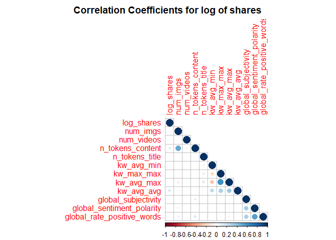<!-- -->

From the correlation graph, if the variable has a darker blue color, it
will signify a strong positive correlation with the other variable
whereas if it has a darker red color, it will have a stronger negative
correlation with the other variable.

``` r
#This new dataframe converts the days into categorical values for graphing.
moddf <- train%>%
  mutate(day = if_else(monday == 1,"Monday",if_else(tuesday == 1,"Tuesday",if_else(wednesday == 1,"Wednesday",if_else(
thursday == 1,"Thursday",if_else(friday == 1,"Friday",if_else(saturday == 1,"Saturday", "Sunday")))))))
#Eliminates any categorical variables for use of principal component analysis
continuous <- train %>%select(-c(monday, tuesday, wednesday, thursday,friday, saturday, sunday, is_weekend, ))
```

### 2. Boxplot for log shares subdivided by days.

``` r
#Boxplot for log shares subdivided by days.
ggplot(moddf, aes(x = day, y = log_shares, col = day)) + 
  geom_boxplot(fill="grey") + 
  geom_jitter() + 
  ylab("log(shares)") + 
  xlab("") +
  theme(axis.text.x = element_text(angle = 45)) +
  ggtitle("Boxplot for Log Shares by Day")
```

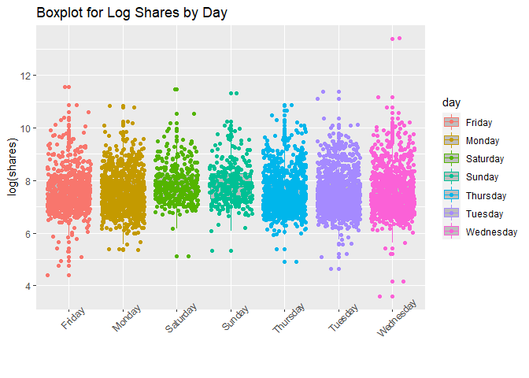<!-- -->

### 3. Scatterplot for log shares and number of images

``` r
#Scatterplot for log shares and number of images
ggplot(moddf, aes(y = log_shares, x = num_imgs, color = day)) + 
  geom_point(stat = "identity", position = "jitter") + 
  geom_smooth( method = "lm")  + 
  xlab("num_hrefs") + 
  ylab("log_shares")
```

    ## `geom_smooth()` using formula 'y ~ x'

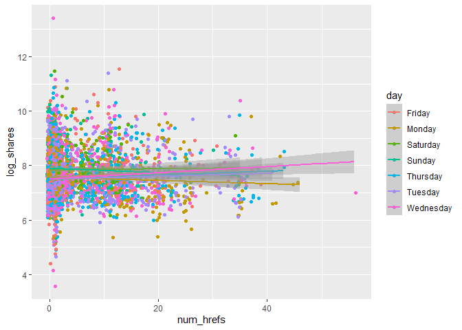<!-- -->

### 4. Scatterplot for log shares and number of videos.

``` r
#Scatterplot for log shares and number of videos.
ggplot(moddf, aes(y = log_shares, x = num_videos, color = day)) + 
  geom_point(stat = "identity", position = "jitter") + 
  geom_smooth( method = "lm")  + 
  xlab("num_hrefs") + 
  ylab("log_shares")
```

    ## `geom_smooth()` using formula 'y ~ x'

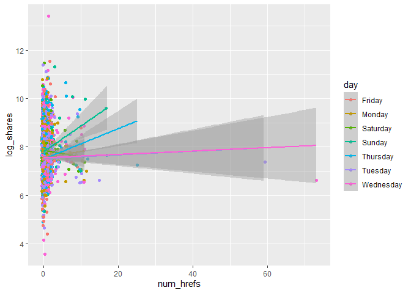<!-- -->

### 5. Histogram for log shares

``` r
#Histogram for log shares 
ggplot(moddf, aes(x=log_shares, fill = kw_avg_avg, color = day)) + geom_histogram(binwidth = 1, position="dodge") + xlab("Average KeyWord") + ylab("Log Shares")
```

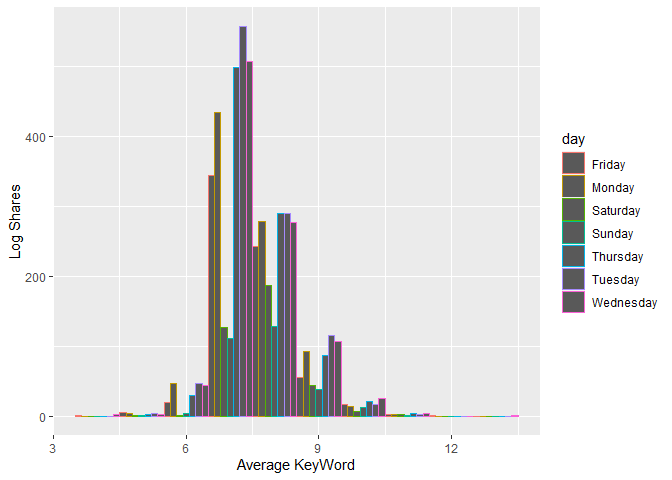<!-- -->

### 6. Scatterplot for number of unique tokens and log shares

``` r
#Scatterplot for number of unique tokens and log shares
ggplot(moddf, aes(y = log_shares, x = n_unique_tokens, color = day)) + 
  geom_point(stat = "identity", position = "jitter") + 
  geom_smooth( method = "lm")  + 
  xlab("n_unique_tokens") + 
  ylab("log_shares")
```

    ## `geom_smooth()` using formula 'y ~ x'

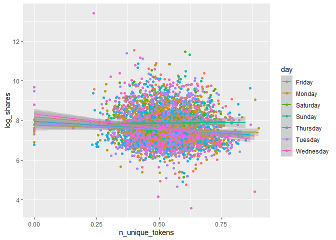<!-- -->

### 7. Scatterplot for number of tokens content and log shares

``` r
#Scatterplot for number of tokens content and log shares
ggplot(moddf, aes(y = log_shares, x = n_tokens_content, color = day)) + 
  geom_point(stat = "identity", position = "jitter") + 
  geom_smooth( method = "lm")  + 
  xlab("n_tokens_content") + 
  ylab("log_shares")
```

    ## `geom_smooth()` using formula 'y ~ x'

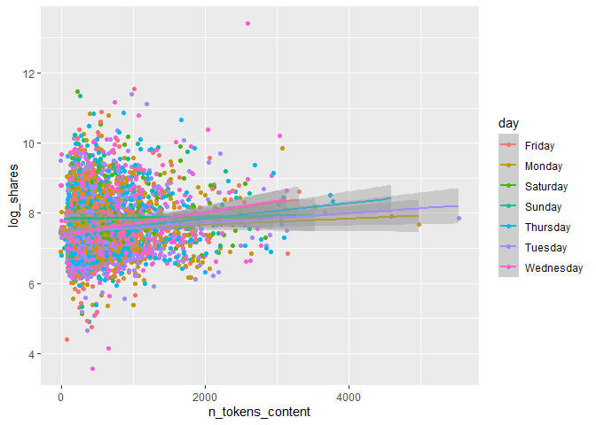<!-- -->

### 8. Scatterplot for number of token titles and log shares

``` r
#Scatterplot for number of token titles and log shares
ggplot(moddf, aes(y = log_shares, x = n_tokens_title, color = day)) + 
  geom_point(stat = "identity", position = "jitter") + 
  geom_smooth( method = "lm")  + 
  xlab("n_tokens_title") + 
  ylab("log_shares")
```

    ## `geom_smooth()` using formula 'y ~ x'

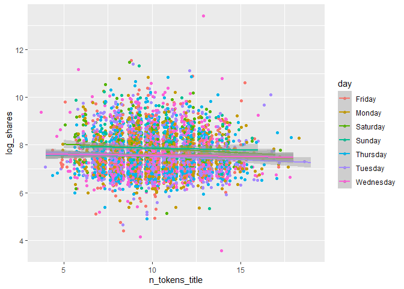<!-- -->

### 9. General summary statistics for continuous dataframe

The code chunk below will give summary statistics for the twelve
variables that we want to analyze. The results are ordered by descending
standard deviation. We want to know the general statistics for all of
these variables to see how they compare against each other.

### 10. Numerical summary of categorical variable is_weekend

let’s pull a summary of the number of shares. One of the factors that
most affects the number of shares is whether the day is weekday or
weekend. I wanted to look at the average, standard deviation, median and
IQR values of number of shares on weekdays and weekend. If the value of
average is larger , then articles tend to be shared more often.

``` r
library(tidyverse)
train %>%
  group_by(is_weekend) %>%
  summarise(average=mean(log_shares), median=median(log_shares), sd=sd(log_shares), IQR=IQR(log_shares))
```

### 11. Dependence of number of shares on text subjectivity

A scatter plot with the number of shares on the y-axis and the text
subjectivity on the x-axis is created: we can inspect the trend of
shares as a function of the text subjectivity. We know that if the value
of text subjectivity is 0, it stands for the article is very objective,
and value 1 stands for very subjective. If the most points distributed
lower than 0.5, then articles with more objectivity tend to be shared
more often. If the most points distributed larger than 0.5, then
articles with more subjectivity tend to be shared more often. If the
most points distributed around 0.5, then articles with more neutrality
tend to be shared more often.

``` r
library(tidyverse)
library(ggplot2)
subjectivityData <- train %>% group_by(global_subjectivity) %>% summarize(sharecount = mean(log_shares))
ggplot(subjectivityData, aes(x = global_subjectivity, y = sharecount, color =global_subjectivity)) +
geom_point() +
ggtitle("dependence of number of shares on text subjectivity ")
```

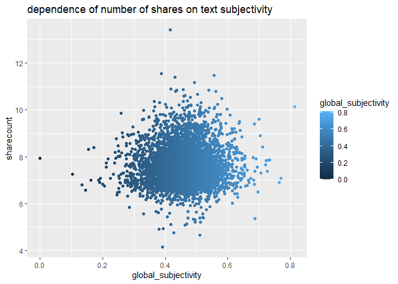<!-- -->

### 12. Dependence of number of shares on text sentiment polarity

A scatter plot with the number of shares on the y-axis and the text
sentiment polarity on the x-axis is created: we can inspect the trend of
shares as a function of the text sentiment polarity. We know that if the
value of text sentiment polarity is greater than -1 and less than 0, it
stands for the article sentiment is negative emotion. If the value of
text sentiment polarity is greater than 0 and less than 1, it stands for
the article sentiment is positive emotion. If the most points
distributed around (-1,0), then articles with negative emotion tend to
be shared more often. If the most points distributed around (0,1), then
articles with positive emotion tend to be shared more often. If the most
points distributed around 0, then articles with neutral emotion tend to
be shared more often.

``` r
library(tidyverse)
library(ggplot2)
sentimentpolarityData <- train %>% group_by(global_sentiment_polarity) %>% summarize(sharecount = mean(log_shares))
ggplot(sentimentpolarityData, aes(x = global_sentiment_polarity, y = sharecount, color =global_sentiment_polarity)) +
geom_point() +
ggtitle("dependence of number of shares on text sentiment polarity ")
```

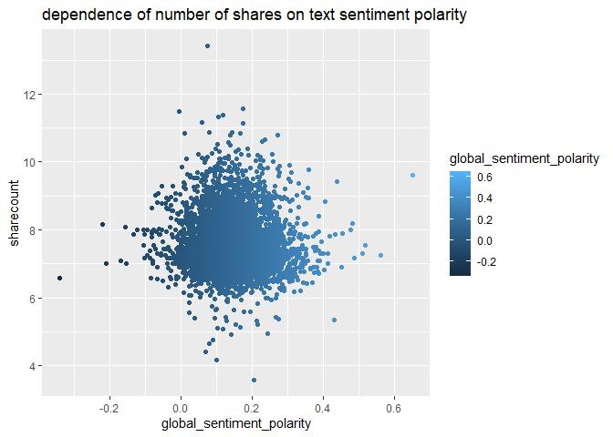<!-- -->

### 13. Dependence of number of shares on positive word rate

A scatter plot with the number of shares on the y-axis and the positive
word rate on the x-axis is created: we can inspect the trend of shares
as a function of the positive word rate. If the points show an upward
trend, then articles with more positive words tend to be shared more
often. If we see a negative trend then articles with more positive words
tend to be shared less often.

``` r
library(tidyverse)
library(ggplot2)
positivewordsData <- train %>% group_by(global_rate_positive_words) %>% summarize(sharecount = mean(log_shares))
ggplot(positivewordsData, aes(x = global_rate_positive_words, y = sharecount), color=global_rate_positive_words) +
geom_point() +
geom_smooth(method = "lm") +
ggtitle("dependence of number of shares on positive word rate ")
```

    ## `geom_smooth()` using formula 'y ~ x'

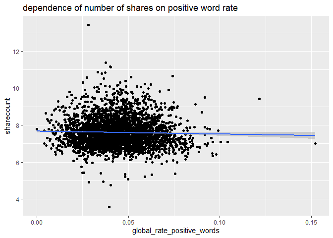<!-- --> \### 14.
Dependence of number of shares on negative words rate

A scatter plot with the number of shares on the y-axis and the negative
words rate on the x-axis is created: we can inspect the trend of shares
as a function of the negative words rate. If the points show an upward
trend, then articles with more negative words tend to be shared more
often. If we see a negative trend then articles with more negative words
tend to be shared less often.

``` r
library(tidyverse)
library(ggplot2)
negativewordsData <- train %>% group_by(global_rate_negative_words) %>% summarize(sharecount = mean(log_shares))
ggplot(negativewordsData, aes(x = global_rate_negative_words, y = sharecount)) +
geom_point() +
geom_smooth(method = "lm") +
ggtitle("dependence of number of shares on negative words rate")
```

    ## `geom_smooth()` using formula 'y ~ x'

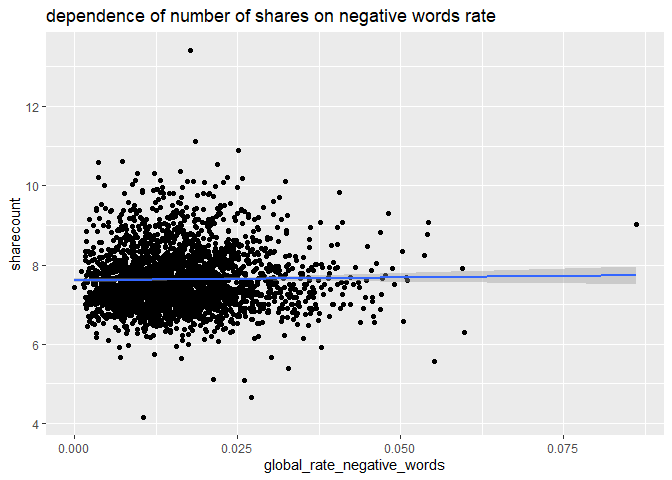<!-- -->

## Modeling

For models below, I have selected the log_shares as the dependent
variable, and num_imgs, num_videos, n_tokens_content, n_unique_tokens,
n_tokens_title, kw_avg_min, kw_max_max, kw_avg_max,
kw_avg_avg,global_subjectivity, global_sentiment_polarity,
global_rate_positive_words, global_rate_negative_words, monday, tuesday,
wednesday, thursday, friday, saturday, sunday as the independent
variables.

``` r
library(tidyverse)
#Select variables of interest for analysis.
analysis <- train %>% select(log_shares,num_imgs,num_videos,n_tokens_content,n_unique_tokens,n_tokens_title,kw_avg_min,kw_max_max,kw_avg_max,kw_avg_avg,global_subjectivity,global_sentiment_polarity,global_rate_positive_words,global_rate_negative_words,monday,tuesday,wednesday,thursday,friday,saturday,sunday)
analysis
```

Here after all the models formulated below, to compare them, I am
predicting the test data on this model to derive some common metrics
like RMSE and R squared values that can be used to compare multiple
models. For prediction, I am using predict() function, and to extract
prediction metrics, I am using postResample() function.

### 1. LASSO Regression Model

Lasso regression is a type of linear regression that uses shrinkage.
Shrinkage is where data values are shrunk towards a central point, like
the mean. The lasso procedure encourages simple, sparse models
(i.e. models with fewer parameters). This particular type of regression
is well-suited for models showing high levels of multicollinearity or
when you want to automate certain parts of model selection, like
variable selection/parameter elimination.

``` r
library(caret)
fitLASSO <- train(log_shares ~ ., data = analysis,
method = "lasso",
preProcess = c("center", "scale"),
trControl = trainControl(method = "cv", number = 10)
)
predLASSO <- predict(fitLASSO, newdata = test)
m1<-postResample(predLASSO, obs = test$log_shares)
m1
```

    ##       RMSE   Rsquared        MAE 
    ## 0.78104068 0.07716723 0.59455053

### 2. Boosted Tree Model

Boosting is an ensemble learning method that combines a set of weak
learners into a strong learner to minimize training errors. In boosting,
a random sample of data is selected, fitted with a model and then
trained sequentially—that is, each model tries to compensate for the
weaknesses of its predecessor. With each iteration, the weak rules from
each individual classifier are combined to form one, strong prediction
rule.

``` r
library(caret)
boostedFit <- train(log_shares ~ ., data = analysis, method = "gbm",trControl = trainControl(method = "cv" , number = 10),
                    preProcess = c("center", "scale"),
                    tuneGrid = expand.grid(n.trees = c(25, 50, 100, 150, 200),
                                           interaction.depth = 1:4,
                                           shrinkage = 0.1,
                                           n.minobsinnode = 10)
                    )
```

    ## Iter   TrainDeviance   ValidDeviance   StepSize   Improve
    ##      1        0.6452             nan     0.1000    0.0036
    ##      2        0.6414             nan     0.1000    0.0034
    ##      3        0.6382             nan     0.1000    0.0026
    ##      4        0.6361             nan     0.1000    0.0022
    ##      5        0.6339             nan     0.1000    0.0018
    ##      6        0.6320             nan     0.1000    0.0013
    ##      7        0.6307             nan     0.1000    0.0010
    ##      8        0.6295             nan     0.1000    0.0008
    ##      9        0.6285             nan     0.1000    0.0005
    ##     10        0.6269             nan     0.1000    0.0013
    ##     20        0.6180             nan     0.1000    0.0006
    ##     40        0.6064             nan     0.1000    0.0004
    ##     60        0.5980             nan     0.1000   -0.0002
    ##     80        0.5926             nan     0.1000    0.0001
    ##    100        0.5886             nan     0.1000   -0.0000
    ##    120        0.5850             nan     0.1000   -0.0001
    ##    140        0.5824             nan     0.1000   -0.0003
    ##    160        0.5805             nan     0.1000   -0.0002
    ##    180        0.5787             nan     0.1000   -0.0002
    ##    200        0.5774             nan     0.1000    0.0000
    ## 
    ## Iter   TrainDeviance   ValidDeviance   StepSize   Improve
    ##      1        0.6435             nan     0.1000    0.0042
    ##      2        0.6393             nan     0.1000    0.0037
    ##      3        0.6352             nan     0.1000    0.0033
    ##      4        0.6320             nan     0.1000    0.0031
    ##      5        0.6289             nan     0.1000    0.0022
    ##      6        0.6259             nan     0.1000    0.0024
    ##      7        0.6240             nan     0.1000    0.0014
    ##      8        0.6215             nan     0.1000    0.0015
    ##      9        0.6198             nan     0.1000    0.0012
    ##     10        0.6177             nan     0.1000    0.0015
    ##     20        0.6042             nan     0.1000    0.0004
    ##     40        0.5897             nan     0.1000    0.0002
    ##     60        0.5799             nan     0.1000   -0.0002
    ##     80        0.5728             nan     0.1000   -0.0004
    ##    100        0.5671             nan     0.1000   -0.0001
    ##    120        0.5617             nan     0.1000   -0.0002
    ##    140        0.5576             nan     0.1000   -0.0004
    ##    160        0.5539             nan     0.1000   -0.0001
    ##    180        0.5483             nan     0.1000   -0.0002
    ##    200        0.5444             nan     0.1000   -0.0002
    ## 
    ## Iter   TrainDeviance   ValidDeviance   StepSize   Improve
    ##      1        0.6437             nan     0.1000    0.0056
    ##      2        0.6377             nan     0.1000    0.0053
    ##      3        0.6335             nan     0.1000    0.0033
    ##      4        0.6290             nan     0.1000    0.0037
    ##      5        0.6255             nan     0.1000    0.0028
    ##      6        0.6223             nan     0.1000    0.0023
    ##      7        0.6196             nan     0.1000    0.0019
    ##      8        0.6170             nan     0.1000    0.0018
    ##      9        0.6143             nan     0.1000    0.0022
    ##     10        0.6126             nan     0.1000    0.0006
    ##     20        0.5971             nan     0.1000    0.0001
    ##     40        0.5778             nan     0.1000    0.0003
    ##     60        0.5660             nan     0.1000   -0.0006
    ##     80        0.5566             nan     0.1000   -0.0004
    ##    100        0.5484             nan     0.1000   -0.0006
    ##    120        0.5415             nan     0.1000   -0.0004
    ##    140        0.5348             nan     0.1000   -0.0003
    ##    160        0.5285             nan     0.1000   -0.0007
    ##    180        0.5221             nan     0.1000   -0.0004
    ##    200        0.5162             nan     0.1000   -0.0004
    ## 
    ## Iter   TrainDeviance   ValidDeviance   StepSize   Improve
    ##      1        0.6418             nan     0.1000    0.0060
    ##      2        0.6362             nan     0.1000    0.0050
    ##      3        0.6313             nan     0.1000    0.0034
    ##      4        0.6266             nan     0.1000    0.0031
    ##      5        0.6222             nan     0.1000    0.0031
    ##      6        0.6183             nan     0.1000    0.0020
    ##      7        0.6154             nan     0.1000    0.0020
    ##      8        0.6129             nan     0.1000    0.0014
    ##      9        0.6101             nan     0.1000    0.0022
    ##     10        0.6078             nan     0.1000    0.0010
    ##     20        0.5896             nan     0.1000    0.0008
    ##     40        0.5688             nan     0.1000   -0.0006
    ##     60        0.5538             nan     0.1000    0.0001
    ##     80        0.5414             nan     0.1000   -0.0003
    ##    100        0.5305             nan     0.1000   -0.0004
    ##    120        0.5224             nan     0.1000   -0.0008
    ##    140        0.5132             nan     0.1000   -0.0004
    ##    160        0.5035             nan     0.1000   -0.0007
    ##    180        0.4955             nan     0.1000   -0.0002
    ##    200        0.4891             nan     0.1000   -0.0005
    ## 
    ## Iter   TrainDeviance   ValidDeviance   StepSize   Improve
    ##      1        0.6621             nan     0.1000    0.0045
    ##      2        0.6582             nan     0.1000    0.0036
    ##      3        0.6552             nan     0.1000    0.0029
    ##      4        0.6524             nan     0.1000    0.0023
    ##      5        0.6498             nan     0.1000    0.0018
    ##      6        0.6482             nan     0.1000    0.0013
    ##      7        0.6469             nan     0.1000    0.0009
    ##      8        0.6450             nan     0.1000    0.0014
    ##      9        0.6434             nan     0.1000    0.0016
    ##     10        0.6421             nan     0.1000    0.0010
    ##     20        0.6321             nan     0.1000    0.0001
    ##     40        0.6191             nan     0.1000    0.0002
    ##     60        0.6113             nan     0.1000    0.0001
    ##     80        0.6059             nan     0.1000   -0.0000
    ##    100        0.6013             nan     0.1000   -0.0000
    ##    120        0.5977             nan     0.1000   -0.0000
    ##    140        0.5950             nan     0.1000   -0.0001
    ##    160        0.5930             nan     0.1000   -0.0003
    ##    180        0.5911             nan     0.1000   -0.0004
    ##    200        0.5894             nan     0.1000   -0.0002
    ## 
    ## Iter   TrainDeviance   ValidDeviance   StepSize   Improve
    ##      1        0.6614             nan     0.1000    0.0045
    ##      2        0.6566             nan     0.1000    0.0046
    ##      3        0.6521             nan     0.1000    0.0040
    ##      4        0.6485             nan     0.1000    0.0030
    ##      5        0.6456             nan     0.1000    0.0029
    ##      6        0.6431             nan     0.1000    0.0020
    ##      7        0.6405             nan     0.1000    0.0022
    ##      8        0.6380             nan     0.1000    0.0016
    ##      9        0.6358             nan     0.1000    0.0016
    ##     10        0.6337             nan     0.1000    0.0017
    ##     20        0.6188             nan     0.1000    0.0004
    ##     40        0.6020             nan     0.1000   -0.0001
    ##     60        0.5914             nan     0.1000   -0.0006
    ##     80        0.5842             nan     0.1000   -0.0004
    ##    100        0.5788             nan     0.1000   -0.0001
    ##    120        0.5734             nan     0.1000   -0.0003
    ##    140        0.5689             nan     0.1000   -0.0004
    ##    160        0.5647             nan     0.1000   -0.0003
    ##    180        0.5607             nan     0.1000   -0.0005
    ##    200        0.5571             nan     0.1000   -0.0002
    ## 
    ## Iter   TrainDeviance   ValidDeviance   StepSize   Improve
    ##      1        0.6611             nan     0.1000    0.0062
    ##      2        0.6556             nan     0.1000    0.0044
    ##      3        0.6511             nan     0.1000    0.0036
    ##      4        0.6473             nan     0.1000    0.0032
    ##      5        0.6434             nan     0.1000    0.0032
    ##      6        0.6399             nan     0.1000    0.0021
    ##      7        0.6365             nan     0.1000    0.0028
    ##      8        0.6335             nan     0.1000    0.0023
    ##      9        0.6307             nan     0.1000    0.0018
    ##     10        0.6284             nan     0.1000    0.0015
    ##     20        0.6096             nan     0.1000    0.0006
    ##     40        0.5906             nan     0.1000   -0.0004
    ##     60        0.5783             nan     0.1000   -0.0003
    ##     80        0.5682             nan     0.1000   -0.0004
    ##    100        0.5606             nan     0.1000   -0.0001
    ##    120        0.5534             nan     0.1000   -0.0001
    ##    140        0.5459             nan     0.1000   -0.0004
    ##    160        0.5386             nan     0.1000   -0.0000
    ##    180        0.5323             nan     0.1000   -0.0004
    ##    200        0.5252             nan     0.1000   -0.0006
    ## 
    ## Iter   TrainDeviance   ValidDeviance   StepSize   Improve
    ##      1        0.6583             nan     0.1000    0.0069
    ##      2        0.6524             nan     0.1000    0.0058
    ##      3        0.6471             nan     0.1000    0.0039
    ##      4        0.6425             nan     0.1000    0.0034
    ##      5        0.6380             nan     0.1000    0.0035
    ##      6        0.6343             nan     0.1000    0.0031
    ##      7        0.6310             nan     0.1000    0.0024
    ##      8        0.6281             nan     0.1000    0.0018
    ##      9        0.6252             nan     0.1000    0.0017
    ##     10        0.6222             nan     0.1000    0.0023
    ##     20        0.6008             nan     0.1000    0.0001
    ##     40        0.5799             nan     0.1000   -0.0004
    ##     60        0.5651             nan     0.1000   -0.0002
    ##     80        0.5532             nan     0.1000   -0.0004
    ##    100        0.5425             nan     0.1000   -0.0003
    ##    120        0.5330             nan     0.1000   -0.0003
    ##    140        0.5229             nan     0.1000   -0.0004
    ##    160        0.5128             nan     0.1000   -0.0002
    ##    180        0.5043             nan     0.1000   -0.0004
    ##    200        0.4960             nan     0.1000   -0.0004
    ## 
    ## Iter   TrainDeviance   ValidDeviance   StepSize   Improve
    ##      1        0.6512             nan     0.1000    0.0044
    ##      2        0.6473             nan     0.1000    0.0032
    ##      3        0.6440             nan     0.1000    0.0030
    ##      4        0.6415             nan     0.1000    0.0026
    ##      5        0.6391             nan     0.1000    0.0022
    ##      6        0.6374             nan     0.1000    0.0017
    ##      7        0.6359             nan     0.1000    0.0015
    ##      8        0.6345             nan     0.1000    0.0012
    ##      9        0.6330             nan     0.1000    0.0008
    ##     10        0.6320             nan     0.1000    0.0008
    ##     20        0.6225             nan     0.1000    0.0007
    ##     40        0.6100             nan     0.1000    0.0000
    ##     60        0.6022             nan     0.1000    0.0003
    ##     80        0.5966             nan     0.1000   -0.0002
    ##    100        0.5921             nan     0.1000   -0.0001
    ##    120        0.5887             nan     0.1000   -0.0001
    ##    140        0.5859             nan     0.1000   -0.0003
    ##    160        0.5839             nan     0.1000   -0.0000
    ##    180        0.5822             nan     0.1000   -0.0003
    ##    200        0.5805             nan     0.1000   -0.0003
    ## 
    ## Iter   TrainDeviance   ValidDeviance   StepSize   Improve
    ##      1        0.6499             nan     0.1000    0.0052
    ##      2        0.6452             nan     0.1000    0.0043
    ##      3        0.6409             nan     0.1000    0.0038
    ##      4        0.6370             nan     0.1000    0.0025
    ##      5        0.6344             nan     0.1000    0.0018
    ##      6        0.6314             nan     0.1000    0.0022
    ##      7        0.6292             nan     0.1000    0.0017
    ##      8        0.6270             nan     0.1000    0.0014
    ##      9        0.6251             nan     0.1000    0.0014
    ##     10        0.6233             nan     0.1000    0.0015
    ##     20        0.6089             nan     0.1000    0.0004
    ##     40        0.5934             nan     0.1000   -0.0001
    ##     60        0.5836             nan     0.1000   -0.0002
    ##     80        0.5761             nan     0.1000   -0.0004
    ##    100        0.5701             nan     0.1000    0.0001
    ##    120        0.5647             nan     0.1000   -0.0003
    ##    140        0.5596             nan     0.1000   -0.0003
    ##    160        0.5555             nan     0.1000   -0.0004
    ##    180        0.5515             nan     0.1000   -0.0005
    ##    200        0.5486             nan     0.1000   -0.0002
    ## 
    ## Iter   TrainDeviance   ValidDeviance   StepSize   Improve
    ##      1        0.6498             nan     0.1000    0.0052
    ##      2        0.6441             nan     0.1000    0.0047
    ##      3        0.6393             nan     0.1000    0.0045
    ##      4        0.6360             nan     0.1000    0.0027
    ##      5        0.6320             nan     0.1000    0.0034
    ##      6        0.6286             nan     0.1000    0.0031
    ##      7        0.6254             nan     0.1000    0.0030
    ##      8        0.6225             nan     0.1000    0.0024
    ##      9        0.6201             nan     0.1000    0.0016
    ##     10        0.6172             nan     0.1000    0.0019
    ##     20        0.5998             nan     0.1000    0.0010
    ##     40        0.5813             nan     0.1000   -0.0004
    ##     60        0.5681             nan     0.1000    0.0000
    ##     80        0.5584             nan     0.1000   -0.0004
    ##    100        0.5500             nan     0.1000    0.0000
    ##    120        0.5402             nan     0.1000    0.0001
    ##    140        0.5334             nan     0.1000   -0.0002
    ##    160        0.5261             nan     0.1000   -0.0002
    ##    180        0.5192             nan     0.1000   -0.0003
    ##    200        0.5137             nan     0.1000   -0.0003
    ## 
    ## Iter   TrainDeviance   ValidDeviance   StepSize   Improve
    ##      1        0.6482             nan     0.1000    0.0069
    ##      2        0.6422             nan     0.1000    0.0052
    ##      3        0.6368             nan     0.1000    0.0043
    ##      4        0.6321             nan     0.1000    0.0043
    ##      5        0.6279             nan     0.1000    0.0033
    ##      6        0.6234             nan     0.1000    0.0034
    ##      7        0.6199             nan     0.1000    0.0030
    ##      8        0.6164             nan     0.1000    0.0007
    ##      9        0.6132             nan     0.1000    0.0021
    ##     10        0.6105             nan     0.1000    0.0015
    ##     20        0.5924             nan     0.1000   -0.0007
    ##     40        0.5695             nan     0.1000   -0.0001
    ##     60        0.5549             nan     0.1000   -0.0001
    ##     80        0.5424             nan     0.1000   -0.0000
    ##    100        0.5318             nan     0.1000   -0.0005
    ##    120        0.5231             nan     0.1000   -0.0010
    ##    140        0.5134             nan     0.1000   -0.0001
    ##    160        0.5047             nan     0.1000   -0.0007
    ##    180        0.4970             nan     0.1000   -0.0004
    ##    200        0.4892             nan     0.1000   -0.0003
    ## 
    ## Iter   TrainDeviance   ValidDeviance   StepSize   Improve
    ##      1        0.6644             nan     0.1000    0.0040
    ##      2        0.6611             nan     0.1000    0.0032
    ##      3        0.6583             nan     0.1000    0.0027
    ##      4        0.6560             nan     0.1000    0.0023
    ##      5        0.6538             nan     0.1000    0.0022
    ##      6        0.6521             nan     0.1000    0.0012
    ##      7        0.6501             nan     0.1000    0.0016
    ##      8        0.6486             nan     0.1000    0.0015
    ##      9        0.6472             nan     0.1000    0.0009
    ##     10        0.6463             nan     0.1000   -0.0000
    ##     20        0.6361             nan     0.1000    0.0002
    ##     40        0.6235             nan     0.1000   -0.0005
    ##     60        0.6148             nan     0.1000    0.0001
    ##     80        0.6088             nan     0.1000    0.0002
    ##    100        0.6040             nan     0.1000   -0.0002
    ##    120        0.6009             nan     0.1000   -0.0003
    ##    140        0.5985             nan     0.1000   -0.0001
    ##    160        0.5967             nan     0.1000   -0.0003
    ##    180        0.5947             nan     0.1000   -0.0001
    ##    200        0.5936             nan     0.1000   -0.0003
    ## 
    ## Iter   TrainDeviance   ValidDeviance   StepSize   Improve
    ##      1        0.6630             nan     0.1000    0.0048
    ##      2        0.6584             nan     0.1000    0.0040
    ##      3        0.6547             nan     0.1000    0.0031
    ##      4        0.6509             nan     0.1000    0.0029
    ##      5        0.6480             nan     0.1000    0.0017
    ##      6        0.6448             nan     0.1000    0.0025
    ##      7        0.6424             nan     0.1000    0.0021
    ##      8        0.6406             nan     0.1000    0.0005
    ##      9        0.6384             nan     0.1000    0.0010
    ##     10        0.6371             nan     0.1000    0.0006
    ##     20        0.6223             nan     0.1000    0.0006
    ##     40        0.6054             nan     0.1000   -0.0000
    ##     60        0.5945             nan     0.1000    0.0001
    ##     80        0.5858             nan     0.1000   -0.0001
    ##    100        0.5797             nan     0.1000    0.0001
    ##    120        0.5740             nan     0.1000    0.0002
    ##    140        0.5678             nan     0.1000   -0.0002
    ##    160        0.5639             nan     0.1000   -0.0001
    ##    180        0.5599             nan     0.1000   -0.0006
    ##    200        0.5555             nan     0.1000   -0.0005
    ## 
    ## Iter   TrainDeviance   ValidDeviance   StepSize   Improve
    ##      1        0.6625             nan     0.1000    0.0052
    ##      2        0.6559             nan     0.1000    0.0054
    ##      3        0.6510             nan     0.1000    0.0031
    ##      4        0.6473             nan     0.1000    0.0027
    ##      5        0.6436             nan     0.1000    0.0027
    ##      6        0.6399             nan     0.1000    0.0024
    ##      7        0.6370             nan     0.1000    0.0017
    ##      8        0.6346             nan     0.1000    0.0016
    ##      9        0.6316             nan     0.1000    0.0020
    ##     10        0.6298             nan     0.1000    0.0007
    ##     20        0.6131             nan     0.1000    0.0001
    ##     40        0.5928             nan     0.1000   -0.0001
    ##     60        0.5788             nan     0.1000    0.0002
    ##     80        0.5678             nan     0.1000   -0.0005
    ##    100        0.5587             nan     0.1000   -0.0007
    ##    120        0.5509             nan     0.1000   -0.0004
    ##    140        0.5430             nan     0.1000   -0.0004
    ##    160        0.5362             nan     0.1000   -0.0001
    ##    180        0.5303             nan     0.1000   -0.0004
    ##    200        0.5233             nan     0.1000   -0.0004
    ## 
    ## Iter   TrainDeviance   ValidDeviance   StepSize   Improve
    ##      1        0.6617             nan     0.1000    0.0051
    ##      2        0.6553             nan     0.1000    0.0051
    ##      3        0.6503             nan     0.1000    0.0039
    ##      4        0.6463             nan     0.1000    0.0026
    ##      5        0.6418             nan     0.1000    0.0029
    ##      6        0.6375             nan     0.1000    0.0037
    ##      7        0.6346             nan     0.1000    0.0015
    ##      8        0.6316             nan     0.1000    0.0012
    ##      9        0.6291             nan     0.1000    0.0019
    ##     10        0.6267             nan     0.1000    0.0015
    ##     20        0.6075             nan     0.1000    0.0014
    ##     40        0.5844             nan     0.1000    0.0002
    ##     60        0.5694             nan     0.1000   -0.0001
    ##     80        0.5556             nan     0.1000   -0.0005
    ##    100        0.5431             nan     0.1000   -0.0005
    ##    120        0.5323             nan     0.1000   -0.0000
    ##    140        0.5230             nan     0.1000   -0.0003
    ##    160        0.5142             nan     0.1000   -0.0003
    ##    180        0.5059             nan     0.1000   -0.0007
    ##    200        0.4978             nan     0.1000   -0.0006
    ## 
    ## Iter   TrainDeviance   ValidDeviance   StepSize   Improve
    ##      1        0.6477             nan     0.1000    0.0044
    ##      2        0.6437             nan     0.1000    0.0036
    ##      3        0.6409             nan     0.1000    0.0031
    ##      4        0.6382             nan     0.1000    0.0024
    ##      5        0.6358             nan     0.1000    0.0019
    ##      6        0.6339             nan     0.1000    0.0017
    ##      7        0.6325             nan     0.1000    0.0008
    ##      8        0.6312             nan     0.1000    0.0008
    ##      9        0.6295             nan     0.1000    0.0014
    ##     10        0.6285             nan     0.1000    0.0006
    ##     20        0.6194             nan     0.1000    0.0001
    ##     40        0.6081             nan     0.1000   -0.0000
    ##     60        0.5997             nan     0.1000    0.0000
    ##     80        0.5945             nan     0.1000   -0.0001
    ##    100        0.5905             nan     0.1000   -0.0001
    ##    120        0.5873             nan     0.1000   -0.0003
    ##    140        0.5846             nan     0.1000   -0.0003
    ##    160        0.5827             nan     0.1000   -0.0002
    ##    180        0.5805             nan     0.1000   -0.0004
    ##    200        0.5791             nan     0.1000   -0.0002
    ## 
    ## Iter   TrainDeviance   ValidDeviance   StepSize   Improve
    ##      1        0.6463             nan     0.1000    0.0048
    ##      2        0.6419             nan     0.1000    0.0042
    ##      3        0.6378             nan     0.1000    0.0031
    ##      4        0.6339             nan     0.1000    0.0032
    ##      5        0.6310             nan     0.1000    0.0018
    ##      6        0.6282             nan     0.1000    0.0020
    ##      7        0.6260             nan     0.1000    0.0014
    ##      8        0.6236             nan     0.1000    0.0014
    ##      9        0.6221             nan     0.1000    0.0012
    ##     10        0.6205             nan     0.1000    0.0015
    ##     20        0.6062             nan     0.1000    0.0009
    ##     40        0.5907             nan     0.1000   -0.0001
    ##     60        0.5808             nan     0.1000   -0.0005
    ##     80        0.5741             nan     0.1000   -0.0001
    ##    100        0.5678             nan     0.1000   -0.0001
    ##    120        0.5625             nan     0.1000   -0.0003
    ##    140        0.5580             nan     0.1000   -0.0005
    ##    160        0.5535             nan     0.1000   -0.0002
    ##    180        0.5491             nan     0.1000   -0.0003
    ##    200        0.5446             nan     0.1000   -0.0003
    ## 
    ## Iter   TrainDeviance   ValidDeviance   StepSize   Improve
    ##      1        0.6448             nan     0.1000    0.0056
    ##      2        0.6394             nan     0.1000    0.0047
    ##      3        0.6343             nan     0.1000    0.0044
    ##      4        0.6300             nan     0.1000    0.0034
    ##      5        0.6260             nan     0.1000    0.0029
    ##      6        0.6231             nan     0.1000    0.0018
    ##      7        0.6204             nan     0.1000    0.0020
    ##      8        0.6182             nan     0.1000    0.0011
    ##      9        0.6157             nan     0.1000    0.0017
    ##     10        0.6137             nan     0.1000    0.0014
    ##     20        0.5974             nan     0.1000    0.0008
    ##     40        0.5778             nan     0.1000   -0.0004
    ##     60        0.5655             nan     0.1000   -0.0004
    ##     80        0.5552             nan     0.1000   -0.0004
    ##    100        0.5461             nan     0.1000   -0.0005
    ##    120        0.5389             nan     0.1000   -0.0007
    ##    140        0.5313             nan     0.1000   -0.0007
    ##    160        0.5237             nan     0.1000   -0.0007
    ##    180        0.5179             nan     0.1000   -0.0005
    ##    200        0.5107             nan     0.1000   -0.0006
    ## 
    ## Iter   TrainDeviance   ValidDeviance   StepSize   Improve
    ##      1        0.6446             nan     0.1000    0.0059
    ##      2        0.6386             nan     0.1000    0.0053
    ##      3        0.6326             nan     0.1000    0.0036
    ##      4        0.6283             nan     0.1000    0.0034
    ##      5        0.6243             nan     0.1000    0.0027
    ##      6        0.6206             nan     0.1000    0.0025
    ##      7        0.6170             nan     0.1000    0.0030
    ##      8        0.6141             nan     0.1000    0.0019
    ##      9        0.6113             nan     0.1000    0.0019
    ##     10        0.6082             nan     0.1000    0.0012
    ##     20        0.5891             nan     0.1000    0.0007
    ##     40        0.5675             nan     0.1000   -0.0003
    ##     60        0.5525             nan     0.1000   -0.0002
    ##     80        0.5407             nan     0.1000   -0.0001
    ##    100        0.5290             nan     0.1000   -0.0005
    ##    120        0.5196             nan     0.1000   -0.0004
    ##    140        0.5098             nan     0.1000    0.0001
    ##    160        0.4995             nan     0.1000   -0.0011
    ##    180        0.4911             nan     0.1000   -0.0004
    ##    200        0.4833             nan     0.1000   -0.0006
    ## 
    ## Iter   TrainDeviance   ValidDeviance   StepSize   Improve
    ##      1        0.6578             nan     0.1000    0.0041
    ##      2        0.6545             nan     0.1000    0.0034
    ##      3        0.6510             nan     0.1000    0.0030
    ##      4        0.6483             nan     0.1000    0.0025
    ##      5        0.6467             nan     0.1000    0.0009
    ##      6        0.6447             nan     0.1000    0.0019
    ##      7        0.6423             nan     0.1000    0.0017
    ##      8        0.6407             nan     0.1000    0.0007
    ##      9        0.6391             nan     0.1000    0.0011
    ##     10        0.6380             nan     0.1000    0.0007
    ##     20        0.6286             nan     0.1000    0.0001
    ##     40        0.6158             nan     0.1000    0.0002
    ##     60        0.6079             nan     0.1000   -0.0002
    ##     80        0.6015             nan     0.1000    0.0001
    ##    100        0.5971             nan     0.1000   -0.0001
    ##    120        0.5940             nan     0.1000   -0.0005
    ##    140        0.5911             nan     0.1000   -0.0003
    ##    160        0.5888             nan     0.1000   -0.0002
    ##    180        0.5871             nan     0.1000   -0.0002
    ##    200        0.5853             nan     0.1000   -0.0001
    ## 
    ## Iter   TrainDeviance   ValidDeviance   StepSize   Improve
    ##      1        0.6566             nan     0.1000    0.0050
    ##      2        0.6517             nan     0.1000    0.0046
    ##      3        0.6476             nan     0.1000    0.0039
    ##      4        0.6439             nan     0.1000    0.0032
    ##      5        0.6406             nan     0.1000    0.0026
    ##      6        0.6377             nan     0.1000    0.0024
    ##      7        0.6352             nan     0.1000    0.0021
    ##      8        0.6328             nan     0.1000    0.0019
    ##      9        0.6305             nan     0.1000    0.0012
    ##     10        0.6288             nan     0.1000    0.0013
    ##     20        0.6144             nan     0.1000    0.0009
    ##     40        0.5974             nan     0.1000   -0.0003
    ##     60        0.5869             nan     0.1000   -0.0001
    ##     80        0.5795             nan     0.1000   -0.0002
    ##    100        0.5743             nan     0.1000   -0.0004
    ##    120        0.5688             nan     0.1000   -0.0007
    ##    140        0.5641             nan     0.1000   -0.0008
    ##    160        0.5593             nan     0.1000   -0.0001
    ##    180        0.5552             nan     0.1000   -0.0001
    ##    200        0.5518             nan     0.1000   -0.0008
    ## 
    ## Iter   TrainDeviance   ValidDeviance   StepSize   Improve
    ##      1        0.6556             nan     0.1000    0.0057
    ##      2        0.6495             nan     0.1000    0.0050
    ##      3        0.6447             nan     0.1000    0.0044
    ##      4        0.6401             nan     0.1000    0.0034
    ##      5        0.6359             nan     0.1000    0.0024
    ##      6        0.6327             nan     0.1000    0.0016
    ##      7        0.6295             nan     0.1000    0.0015
    ##      8        0.6269             nan     0.1000    0.0015
    ##      9        0.6240             nan     0.1000    0.0020
    ##     10        0.6216             nan     0.1000    0.0018
    ##     20        0.6043             nan     0.1000    0.0004
    ##     40        0.5851             nan     0.1000    0.0004
    ##     60        0.5715             nan     0.1000   -0.0002
    ##     80        0.5623             nan     0.1000   -0.0003
    ##    100        0.5531             nan     0.1000   -0.0002
    ##    120        0.5460             nan     0.1000   -0.0004
    ##    140        0.5389             nan     0.1000   -0.0002
    ##    160        0.5317             nan     0.1000    0.0004
    ##    180        0.5247             nan     0.1000    0.0001
    ##    200        0.5187             nan     0.1000   -0.0005
    ## 
    ## Iter   TrainDeviance   ValidDeviance   StepSize   Improve
    ##      1        0.6544             nan     0.1000    0.0069
    ##      2        0.6468             nan     0.1000    0.0045
    ##      3        0.6409             nan     0.1000    0.0051
    ##      4        0.6363             nan     0.1000    0.0040
    ##      5        0.6318             nan     0.1000    0.0029
    ##      6        0.6279             nan     0.1000    0.0033
    ##      7        0.6248             nan     0.1000    0.0019
    ##      8        0.6217             nan     0.1000    0.0012
    ##      9        0.6190             nan     0.1000    0.0019
    ##     10        0.6164             nan     0.1000    0.0013
    ##     20        0.5978             nan     0.1000    0.0009
    ##     40        0.5756             nan     0.1000    0.0002
    ##     60        0.5593             nan     0.1000   -0.0005
    ##     80        0.5468             nan     0.1000   -0.0008
    ##    100        0.5349             nan     0.1000   -0.0006
    ##    120        0.5249             nan     0.1000   -0.0003
    ##    140        0.5145             nan     0.1000   -0.0004
    ##    160        0.5050             nan     0.1000   -0.0006
    ##    180        0.4977             nan     0.1000   -0.0007
    ##    200        0.4888             nan     0.1000   -0.0006
    ## 
    ## Iter   TrainDeviance   ValidDeviance   StepSize   Improve
    ##      1        0.6572             nan     0.1000    0.0045
    ##      2        0.6534             nan     0.1000    0.0038
    ##      3        0.6503             nan     0.1000    0.0028
    ##      4        0.6472             nan     0.1000    0.0026
    ##      5        0.6449             nan     0.1000    0.0020
    ##      6        0.6431             nan     0.1000    0.0018
    ##      7        0.6420             nan     0.1000    0.0006
    ##      8        0.6404             nan     0.1000    0.0016
    ##      9        0.6388             nan     0.1000    0.0011
    ##     10        0.6376             nan     0.1000    0.0009
    ##     20        0.6266             nan     0.1000    0.0007
    ##     40        0.6139             nan     0.1000   -0.0000
    ##     60        0.6054             nan     0.1000    0.0002
    ##     80        0.6000             nan     0.1000   -0.0001
    ##    100        0.5962             nan     0.1000    0.0001
    ##    120        0.5927             nan     0.1000   -0.0001
    ##    140        0.5900             nan     0.1000   -0.0001
    ##    160        0.5880             nan     0.1000   -0.0002
    ##    180        0.5862             nan     0.1000   -0.0002
    ##    200        0.5843             nan     0.1000   -0.0003
    ## 
    ## Iter   TrainDeviance   ValidDeviance   StepSize   Improve
    ##      1        0.6564             nan     0.1000    0.0050
    ##      2        0.6516             nan     0.1000    0.0039
    ##      3        0.6466             nan     0.1000    0.0036
    ##      4        0.6435             nan     0.1000    0.0029
    ##      5        0.6405             nan     0.1000    0.0028
    ##      6        0.6377             nan     0.1000    0.0025
    ##      7        0.6346             nan     0.1000    0.0023
    ##      8        0.6319             nan     0.1000    0.0023
    ##      9        0.6301             nan     0.1000    0.0015
    ##     10        0.6282             nan     0.1000    0.0017
    ##     20        0.6137             nan     0.1000    0.0006
    ##     40        0.5969             nan     0.1000   -0.0002
    ##     60        0.5865             nan     0.1000   -0.0001
    ##     80        0.5784             nan     0.1000   -0.0002
    ##    100        0.5718             nan     0.1000   -0.0003
    ##    120        0.5662             nan     0.1000   -0.0004
    ##    140        0.5612             nan     0.1000   -0.0001
    ##    160        0.5569             nan     0.1000   -0.0003
    ##    180        0.5523             nan     0.1000   -0.0006
    ##    200        0.5472             nan     0.1000   -0.0002
    ## 
    ## Iter   TrainDeviance   ValidDeviance   StepSize   Improve
    ##      1        0.6550             nan     0.1000    0.0044
    ##      2        0.6497             nan     0.1000    0.0046
    ##      3        0.6440             nan     0.1000    0.0042
    ##      4        0.6393             nan     0.1000    0.0035
    ##      5        0.6353             nan     0.1000    0.0035
    ##      6        0.6319             nan     0.1000    0.0025
    ##      7        0.6295             nan     0.1000    0.0016
    ##      8        0.6267             nan     0.1000    0.0020
    ##      9        0.6243             nan     0.1000    0.0015
    ##     10        0.6214             nan     0.1000    0.0023
    ##     20        0.6042             nan     0.1000    0.0005
    ##     40        0.5858             nan     0.1000    0.0001
    ##     60        0.5741             nan     0.1000   -0.0000
    ##     80        0.5641             nan     0.1000   -0.0005
    ##    100        0.5549             nan     0.1000   -0.0005
    ##    120        0.5458             nan     0.1000   -0.0005
    ##    140        0.5390             nan     0.1000   -0.0006
    ##    160        0.5327             nan     0.1000   -0.0002
    ##    180        0.5270             nan     0.1000   -0.0003
    ##    200        0.5210             nan     0.1000   -0.0006
    ## 
    ## Iter   TrainDeviance   ValidDeviance   StepSize   Improve
    ##      1        0.6541             nan     0.1000    0.0069
    ##      2        0.6475             nan     0.1000    0.0054
    ##      3        0.6418             nan     0.1000    0.0043
    ##      4        0.6362             nan     0.1000    0.0044
    ##      5        0.6319             nan     0.1000    0.0034
    ##      6        0.6281             nan     0.1000    0.0022
    ##      7        0.6246             nan     0.1000    0.0021
    ##      8        0.6217             nan     0.1000    0.0020
    ##      9        0.6187             nan     0.1000    0.0025
    ##     10        0.6160             nan     0.1000    0.0012
    ##     20        0.5975             nan     0.1000    0.0003
    ##     40        0.5752             nan     0.1000    0.0002
    ##     60        0.5604             nan     0.1000   -0.0010
    ##     80        0.5481             nan     0.1000   -0.0005
    ##    100        0.5367             nan     0.1000   -0.0001
    ##    120        0.5269             nan     0.1000   -0.0008
    ##    140        0.5175             nan     0.1000   -0.0002
    ##    160        0.5086             nan     0.1000   -0.0007
    ##    180        0.4999             nan     0.1000   -0.0008
    ##    200        0.4916             nan     0.1000   -0.0002
    ## 
    ## Iter   TrainDeviance   ValidDeviance   StepSize   Improve
    ##      1        0.6567             nan     0.1000    0.0040
    ##      2        0.6528             nan     0.1000    0.0038
    ##      3        0.6495             nan     0.1000    0.0028
    ##      4        0.6468             nan     0.1000    0.0023
    ##      5        0.6447             nan     0.1000    0.0017
    ##      6        0.6433             nan     0.1000    0.0007
    ##      7        0.6415             nan     0.1000    0.0013
    ##      8        0.6395             nan     0.1000    0.0013
    ##      9        0.6381             nan     0.1000    0.0007
    ##     10        0.6370             nan     0.1000    0.0007
    ##     20        0.6274             nan     0.1000    0.0004
    ##     40        0.6154             nan     0.1000    0.0000
    ##     60        0.6069             nan     0.1000   -0.0001
    ##     80        0.6019             nan     0.1000    0.0000
    ##    100        0.5976             nan     0.1000   -0.0003
    ##    120        0.5943             nan     0.1000   -0.0000
    ##    140        0.5919             nan     0.1000   -0.0001
    ##    160        0.5901             nan     0.1000   -0.0002
    ##    180        0.5881             nan     0.1000   -0.0001
    ##    200        0.5864             nan     0.1000   -0.0003
    ## 
    ## Iter   TrainDeviance   ValidDeviance   StepSize   Improve
    ##      1        0.6550             nan     0.1000    0.0052
    ##      2        0.6505             nan     0.1000    0.0037
    ##      3        0.6459             nan     0.1000    0.0043
    ##      4        0.6421             nan     0.1000    0.0031
    ##      5        0.6389             nan     0.1000    0.0022
    ##      6        0.6360             nan     0.1000    0.0024
    ##      7        0.6342             nan     0.1000    0.0009
    ##      8        0.6325             nan     0.1000    0.0010
    ##      9        0.6303             nan     0.1000    0.0016
    ##     10        0.6282             nan     0.1000    0.0014
    ##     20        0.6146             nan     0.1000    0.0000
    ##     40        0.5989             nan     0.1000   -0.0003
    ##     60        0.5882             nan     0.1000   -0.0003
    ##     80        0.5810             nan     0.1000   -0.0001
    ##    100        0.5762             nan     0.1000   -0.0003
    ##    120        0.5710             nan     0.1000   -0.0003
    ##    140        0.5663             nan     0.1000   -0.0004
    ##    160        0.5623             nan     0.1000   -0.0008
    ##    180        0.5574             nan     0.1000   -0.0006
    ##    200        0.5534             nan     0.1000   -0.0005
    ## 
    ## Iter   TrainDeviance   ValidDeviance   StepSize   Improve
    ##      1        0.6546             nan     0.1000    0.0058
    ##      2        0.6490             nan     0.1000    0.0042
    ##      3        0.6440             nan     0.1000    0.0048
    ##      4        0.6388             nan     0.1000    0.0039
    ##      5        0.6338             nan     0.1000    0.0029
    ##      6        0.6304             nan     0.1000    0.0024
    ##      7        0.6273             nan     0.1000    0.0021
    ##      8        0.6250             nan     0.1000    0.0015
    ##      9        0.6223             nan     0.1000    0.0019
    ##     10        0.6201             nan     0.1000    0.0010
    ##     20        0.6037             nan     0.1000    0.0007
    ##     40        0.5863             nan     0.1000   -0.0000
    ##     60        0.5734             nan     0.1000   -0.0009
    ##     80        0.5643             nan     0.1000   -0.0006
    ##    100        0.5548             nan     0.1000   -0.0000
    ##    120        0.5459             nan     0.1000   -0.0006
    ##    140        0.5393             nan     0.1000   -0.0006
    ##    160        0.5321             nan     0.1000   -0.0001
    ##    180        0.5258             nan     0.1000   -0.0005
    ##    200        0.5197             nan     0.1000   -0.0002
    ## 
    ## Iter   TrainDeviance   ValidDeviance   StepSize   Improve
    ##      1        0.6532             nan     0.1000    0.0064
    ##      2        0.6467             nan     0.1000    0.0049
    ##      3        0.6407             nan     0.1000    0.0048
    ##      4        0.6367             nan     0.1000    0.0032
    ##      5        0.6315             nan     0.1000    0.0037
    ##      6        0.6282             nan     0.1000    0.0023
    ##      7        0.6248             nan     0.1000    0.0018
    ##      8        0.6218             nan     0.1000    0.0020
    ##      9        0.6191             nan     0.1000    0.0016
    ##     10        0.6168             nan     0.1000    0.0012
    ##     20        0.5976             nan     0.1000    0.0002
    ##     40        0.5768             nan     0.1000   -0.0002
    ##     60        0.5626             nan     0.1000   -0.0003
    ##     80        0.5497             nan     0.1000   -0.0009
    ##    100        0.5383             nan     0.1000   -0.0004
    ##    120        0.5285             nan     0.1000   -0.0002
    ##    140        0.5196             nan     0.1000   -0.0006
    ##    160        0.5107             nan     0.1000   -0.0004
    ##    180        0.5020             nan     0.1000   -0.0002
    ##    200        0.4949             nan     0.1000   -0.0007
    ## 
    ## Iter   TrainDeviance   ValidDeviance   StepSize   Improve
    ##      1        0.6556             nan     0.1000    0.0041
    ##      2        0.6519             nan     0.1000    0.0035
    ##      3        0.6487             nan     0.1000    0.0027
    ##      4        0.6462             nan     0.1000    0.0021
    ##      5        0.6441             nan     0.1000    0.0018
    ##      6        0.6425             nan     0.1000    0.0015
    ##      7        0.6410             nan     0.1000    0.0012
    ##      8        0.6390             nan     0.1000    0.0014
    ##      9        0.6377             nan     0.1000    0.0008
    ##     10        0.6361             nan     0.1000    0.0007
    ##     20        0.6257             nan     0.1000    0.0006
    ##     40        0.6136             nan     0.1000    0.0001
    ##     60        0.6058             nan     0.1000    0.0003
    ##     80        0.5999             nan     0.1000   -0.0001
    ##    100        0.5957             nan     0.1000   -0.0001
    ##    120        0.5925             nan     0.1000   -0.0001
    ##    140        0.5899             nan     0.1000   -0.0005
    ##    160        0.5877             nan     0.1000   -0.0001
    ##    180        0.5857             nan     0.1000   -0.0001
    ##    200        0.5839             nan     0.1000   -0.0003
    ## 
    ## Iter   TrainDeviance   ValidDeviance   StepSize   Improve
    ##      1        0.6544             nan     0.1000    0.0049
    ##      2        0.6500             nan     0.1000    0.0032
    ##      3        0.6465             nan     0.1000    0.0033
    ##      4        0.6426             nan     0.1000    0.0030
    ##      5        0.6396             nan     0.1000    0.0026
    ##      6        0.6367             nan     0.1000    0.0024
    ##      7        0.6343             nan     0.1000    0.0024
    ##      8        0.6324             nan     0.1000    0.0012
    ##      9        0.6303             nan     0.1000    0.0015
    ##     10        0.6284             nan     0.1000    0.0011
    ##     20        0.6136             nan     0.1000    0.0007
    ##     40        0.5966             nan     0.1000    0.0002
    ##     60        0.5857             nan     0.1000    0.0000
    ##     80        0.5781             nan     0.1000   -0.0002
    ##    100        0.5717             nan     0.1000   -0.0001
    ##    120        0.5669             nan     0.1000    0.0000
    ##    140        0.5623             nan     0.1000   -0.0001
    ##    160        0.5576             nan     0.1000   -0.0003
    ##    180        0.5533             nan     0.1000   -0.0000
    ##    200        0.5484             nan     0.1000   -0.0004
    ## 
    ## Iter   TrainDeviance   ValidDeviance   StepSize   Improve
    ##      1        0.6528             nan     0.1000    0.0061
    ##      2        0.6470             nan     0.1000    0.0046
    ##      3        0.6419             nan     0.1000    0.0039
    ##      4        0.6383             nan     0.1000    0.0032
    ##      5        0.6341             nan     0.1000    0.0021
    ##      6        0.6301             nan     0.1000    0.0028
    ##      7        0.6271             nan     0.1000    0.0024
    ##      8        0.6243             nan     0.1000    0.0019
    ##      9        0.6219             nan     0.1000    0.0011
    ##     10        0.6200             nan     0.1000    0.0016
    ##     20        0.6024             nan     0.1000    0.0010
    ##     40        0.5838             nan     0.1000   -0.0005
    ##     60        0.5709             nan     0.1000   -0.0005
    ##     80        0.5606             nan     0.1000   -0.0004
    ##    100        0.5512             nan     0.1000   -0.0007
    ##    120        0.5428             nan     0.1000   -0.0002
    ##    140        0.5350             nan     0.1000   -0.0004
    ##    160        0.5289             nan     0.1000   -0.0005
    ##    180        0.5218             nan     0.1000   -0.0000
    ##    200        0.5151             nan     0.1000   -0.0003
    ## 
    ## Iter   TrainDeviance   ValidDeviance   StepSize   Improve
    ##      1        0.6527             nan     0.1000    0.0066
    ##      2        0.6457             nan     0.1000    0.0055
    ##      3        0.6402             nan     0.1000    0.0038
    ##      4        0.6355             nan     0.1000    0.0038
    ##      5        0.6312             nan     0.1000    0.0031
    ##      6        0.6278             nan     0.1000    0.0015
    ##      7        0.6249             nan     0.1000    0.0012
    ##      8        0.6215             nan     0.1000    0.0023
    ##      9        0.6188             nan     0.1000    0.0015
    ##     10        0.6166             nan     0.1000    0.0009
    ##     20        0.5959             nan     0.1000    0.0001
    ##     40        0.5751             nan     0.1000   -0.0000
    ##     60        0.5599             nan     0.1000    0.0005
    ##     80        0.5473             nan     0.1000   -0.0001
    ##    100        0.5354             nan     0.1000   -0.0007
    ##    120        0.5241             nan     0.1000   -0.0000
    ##    140        0.5128             nan     0.1000   -0.0006
    ##    160        0.5031             nan     0.1000   -0.0003
    ##    180        0.4948             nan     0.1000   -0.0002
    ##    200        0.4855             nan     0.1000   -0.0002
    ## 
    ## Iter   TrainDeviance   ValidDeviance   StepSize   Improve
    ##      1        0.6611             nan     0.1000    0.0040
    ##      2        0.6579             nan     0.1000    0.0032
    ##      3        0.6548             nan     0.1000    0.0026
    ##      4        0.6529             nan     0.1000    0.0011
    ##      5        0.6502             nan     0.1000    0.0020
    ##      6        0.6484             nan     0.1000    0.0019
    ##      7        0.6467             nan     0.1000    0.0015
    ##      8        0.6457             nan     0.1000    0.0006
    ##      9        0.6444             nan     0.1000    0.0013
    ##     10        0.6431             nan     0.1000    0.0010
    ##     20        0.6341             nan     0.1000    0.0003
    ##     40        0.6219             nan     0.1000    0.0001
    ##     60        0.6138             nan     0.1000   -0.0002
    ##     80        0.6085             nan     0.1000   -0.0002
    ##    100        0.6044             nan     0.1000    0.0000
    ##    120        0.6010             nan     0.1000   -0.0003
    ##    140        0.5984             nan     0.1000    0.0000
    ##    160        0.5962             nan     0.1000   -0.0004
    ##    180        0.5938             nan     0.1000   -0.0002
    ##    200        0.5920             nan     0.1000   -0.0001
    ## 
    ## Iter   TrainDeviance   ValidDeviance   StepSize   Improve
    ##      1        0.6605             nan     0.1000    0.0052
    ##      2        0.6552             nan     0.1000    0.0042
    ##      3        0.6512             nan     0.1000    0.0035
    ##      4        0.6484             nan     0.1000    0.0024
    ##      5        0.6448             nan     0.1000    0.0021
    ##      6        0.6425             nan     0.1000    0.0017
    ##      7        0.6407             nan     0.1000    0.0010
    ##      8        0.6386             nan     0.1000    0.0015
    ##      9        0.6366             nan     0.1000    0.0013
    ##     10        0.6351             nan     0.1000    0.0009
    ##     20        0.6212             nan     0.1000    0.0006
    ##     40        0.6055             nan     0.1000   -0.0003
    ##     60        0.5958             nan     0.1000    0.0002
    ##     80        0.5878             nan     0.1000   -0.0002
    ##    100        0.5811             nan     0.1000   -0.0002
    ##    120        0.5761             nan     0.1000    0.0004
    ##    140        0.5710             nan     0.1000   -0.0005
    ##    160        0.5670             nan     0.1000   -0.0004
    ##    180        0.5626             nan     0.1000   -0.0003
    ##    200        0.5584             nan     0.1000   -0.0004
    ## 
    ## Iter   TrainDeviance   ValidDeviance   StepSize   Improve
    ##      1        0.6595             nan     0.1000    0.0053
    ##      2        0.6538             nan     0.1000    0.0047
    ##      3        0.6488             nan     0.1000    0.0035
    ##      4        0.6446             nan     0.1000    0.0031
    ##      5        0.6415             nan     0.1000    0.0023
    ##      6        0.6383             nan     0.1000    0.0028
    ##      7        0.6356             nan     0.1000    0.0020
    ##      8        0.6330             nan     0.1000    0.0017
    ##      9        0.6312             nan     0.1000    0.0011
    ##     10        0.6288             nan     0.1000    0.0019
    ##     20        0.6134             nan     0.1000   -0.0002
    ##     40        0.5930             nan     0.1000   -0.0002
    ##     60        0.5809             nan     0.1000   -0.0007
    ##     80        0.5703             nan     0.1000   -0.0003
    ##    100        0.5615             nan     0.1000   -0.0005
    ##    120        0.5542             nan     0.1000   -0.0005
    ##    140        0.5463             nan     0.1000   -0.0004
    ##    160        0.5409             nan     0.1000   -0.0007
    ##    180        0.5336             nan     0.1000   -0.0004
    ##    200        0.5283             nan     0.1000   -0.0007
    ## 
    ## Iter   TrainDeviance   ValidDeviance   StepSize   Improve
    ##      1        0.6582             nan     0.1000    0.0063
    ##      2        0.6521             nan     0.1000    0.0038
    ##      3        0.6465             nan     0.1000    0.0035
    ##      4        0.6428             nan     0.1000    0.0024
    ##      5        0.6387             nan     0.1000    0.0030
    ##      6        0.6350             nan     0.1000    0.0023
    ##      7        0.6313             nan     0.1000    0.0021
    ##      8        0.6279             nan     0.1000    0.0027
    ##      9        0.6250             nan     0.1000    0.0012
    ##     10        0.6228             nan     0.1000    0.0010
    ##     20        0.6053             nan     0.1000    0.0003
    ##     40        0.5832             nan     0.1000   -0.0001
    ##     60        0.5683             nan     0.1000   -0.0006
    ##     80        0.5546             nan     0.1000   -0.0006
    ##    100        0.5441             nan     0.1000   -0.0001
    ##    120        0.5343             nan     0.1000   -0.0006
    ##    140        0.5251             nan     0.1000   -0.0003
    ##    160        0.5161             nan     0.1000   -0.0003
    ##    180        0.5082             nan     0.1000    0.0001
    ##    200        0.5000             nan     0.1000   -0.0004
    ## 
    ## Iter   TrainDeviance   ValidDeviance   StepSize   Improve
    ##      1        0.6541             nan     0.1000    0.0050
    ##      2        0.6491             nan     0.1000    0.0040
    ##      3        0.6444             nan     0.1000    0.0034
    ##      4        0.6410             nan     0.1000    0.0023
    ##      5        0.6383             nan     0.1000    0.0021
    ##      6        0.6361             nan     0.1000    0.0019
    ##      7        0.6337             nan     0.1000    0.0016
    ##      8        0.6316             nan     0.1000    0.0016
    ##      9        0.6294             nan     0.1000    0.0014
    ##     10        0.6276             nan     0.1000    0.0012
    ##     20        0.6143             nan     0.1000    0.0003
    ##     40        0.5990             nan     0.1000   -0.0002
    ##     60        0.5888             nan     0.1000   -0.0003
    ##     80        0.5815             nan     0.1000   -0.0003
    ##    100        0.5763             nan     0.1000   -0.0004

``` r
pred_boosted <- predict(boostedFit, newdata = test)
m2<-postResample(pred_boosted, test$log_shares)
m2
```

    ##       RMSE   Rsquared        MAE 
    ## 0.77336076 0.09396564 0.59176155

### 3. Forward Fitting Model

Also known as forward selection, this is a type of stepwise regression
which begins with an empty model and adds in variables one by one. For
each forward step, you add in a variable that will give the best
improvement to your model.

``` r
library(caret)
fit_forward <- train(log_shares ~., data = analysis,  method = "leapForward", preProcess = c("center", "scale"),trControl = trainControl(method = "cv", number = 10))
```

    ## Warning in leaps.setup(x, y, wt = weights, nbest = nbest, nvmax = nvmax, : 1 linear dependencies found

    ## Warning in leaps.setup(x, y, wt = weights, nbest = nbest, nvmax = nvmax, : 1 linear dependencies found

    ## Warning in leaps.setup(x, y, wt = weights, nbest = nbest, nvmax = nvmax, : 1 linear dependencies found

    ## Warning in leaps.setup(x, y, wt = weights, nbest = nbest, nvmax = nvmax, : 1 linear dependencies found

    ## Warning in leaps.setup(x, y, wt = weights, nbest = nbest, nvmax = nvmax, : 1 linear dependencies found

    ## Warning in leaps.setup(x, y, wt = weights, nbest = nbest, nvmax = nvmax, : 1 linear dependencies found

    ## Warning in leaps.setup(x, y, wt = weights, nbest = nbest, nvmax = nvmax, : 1 linear dependencies found

    ## Warning in leaps.setup(x, y, wt = weights, nbest = nbest, nvmax = nvmax, : 1 linear dependencies found

    ## Warning in leaps.setup(x, y, wt = weights, nbest = nbest, nvmax = nvmax, : 1 linear dependencies found

    ## Warning in leaps.setup(x, y, wt = weights, nbest = nbest, nvmax = nvmax, : 1 linear dependencies found

    ## Warning in leaps.setup(x, y, wt = weights, nbest = nbest, nvmax = nvmax, : 1 linear dependencies found

``` r
fit_forward_prediction <- predict(fit_forward, newdata = test)
m3<-postResample(fit_forward_prediction, test$log_shares)
m3
```

    ##       RMSE   Rsquared        MAE 
    ## 0.78681390 0.06190157 0.60156727

### 4. Random Forest Model

Random forests is another ensemble method in which we create multiple
trees from the bootstraps samples and average the results. However, we
use a random subset of predictors for each bootstrap sample instead of
the whole sample.

``` r
fit_forest <- train(log_shares ~ ., data = analysis, method = "treebag",trControl = trainControl(method = "cv" , number = 10),preProcess = c("center", "scale"),mtry = c(1:21))
pred_forest <- predict(fit_forest, newdata = test)
m4<-postResample(pred_forest, test$log_shares)
m4
```

    ##       RMSE   Rsquared        MAE 
    ## 0.79063752 0.05379077 0.60989915

## Comparison

``` r
LASSO<- tibble(model = c("LASSO"), RMSE = c(m1[[1]]), Rsquared = c(m1[[2]]))

boostedTree<- tibble(model = c("boosted"), RMSE = c(m2[[1]]), Rsquared = c(m2[[2]]))

farward<- tibble(model = c("farward"), RMSE = c(m3[[1]]), Rsquared = c(m3[[2]]))

randomForest<- tibble(model = c("randomForest"), RMSE = c(m4[[1]]), Rsquared = c(m4[[2]]))

comparison<- rbind(LASSO, boostedTree, farward, randomForest)
comparison
```

Based off the output, we would select the best model that would have the
least RMSE value and the largest R squared value.

### Screeplot and Biplot

For the screeplots, we are selecting the fewest number of PCAs that
would give the most amount of variation in our data. In addition, we are
seeing which PC is stronger on each predictor variable. In this case, we
are using two.

``` r
#For this portion, I split the principal component aspect into 3 chunks since including all of the variables in one graph would make it unreadable. 

#First chunk of code for screeplot and biplot. 

df_no_shares <- continuous %>%
  select(num_imgs,num_videos,n_tokens_content,n_unique_tokens)
#Creating PC's along with center and scaling variables
PCs <- prcomp(df_no_shares, center = TRUE, scale = TRUE)
#Creating screeplots
par(mfrow = c(1,2))
plot(PCs$sdev^2/sum(PCs$sdev^2), xlab = "Principal Component",
ylab = "Proportion of Variance Explained", ylim = c(0, 1), type = 'b')
plot(cumsum(PCs$sdev^2/sum(PCs$sdev^2)), xlab = "Principal Component",
ylab = "Cum. Prop of Variance Explained", ylim = c(0, 1), type = 'b')
```

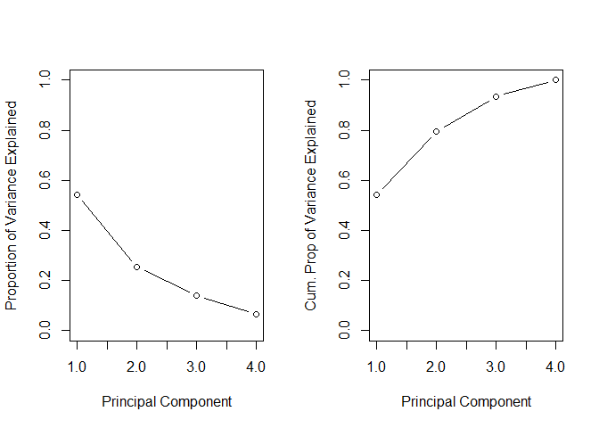<!-- -->

``` r
#Selecting only the PC's up to a 80% variance explained threshold using caret
PCs_eighty <- preProcess(df_no_shares, method = c("center","scale", "pca"), thresh = .8)
#Creating a data frame with just my PC's, day variables, and log_shares to use later as a regression
df_PC <- predict(PCs_eighty, newdata = df_no_shares)
#Monday is excluded to avoid multicollinearity
df_PC <- df_PC %>%
  bind_cols(log_shares = continuous$log_shares,tuesday = train$tuesday, 
            wednesday = train$wednesday, thursday = train$thursday, friday = train$friday,
            saturday = train$saturday, sunday = train$sunday)
screeplot(PCs, type = "lines")
biplot(PCs)
```

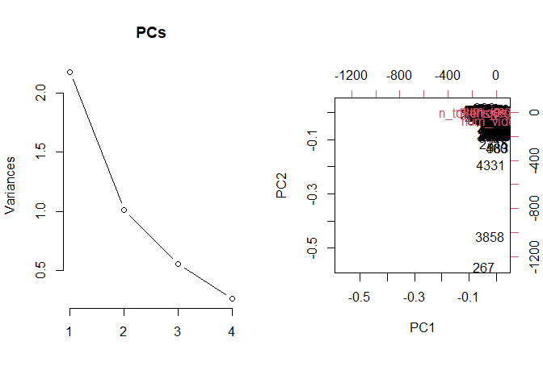<!-- -->

``` r
#Second chunk of code for screeplot and biplot

df_no_shares <- continuous %>%
  select(n_tokens_title,kw_avg_min,kw_max_max,kw_avg_max,kw_avg_avg)
#Creating PC's along with center and scaling variables
PCs <- prcomp(df_no_shares, center = TRUE, scale = TRUE)
#Creating screeplots
par(mfrow = c(1,2))
plot(PCs$sdev^2/sum(PCs$sdev^2), xlab = "Principal Component",
ylab = "Proportion of Variance Explained", ylim = c(0, 1), type = 'b')
plot(cumsum(PCs$sdev^2/sum(PCs$sdev^2)), xlab = "Principal Component",
ylab = "Cum. Prop of Variance Explained", ylim = c(0, 1), type = 'b')
```

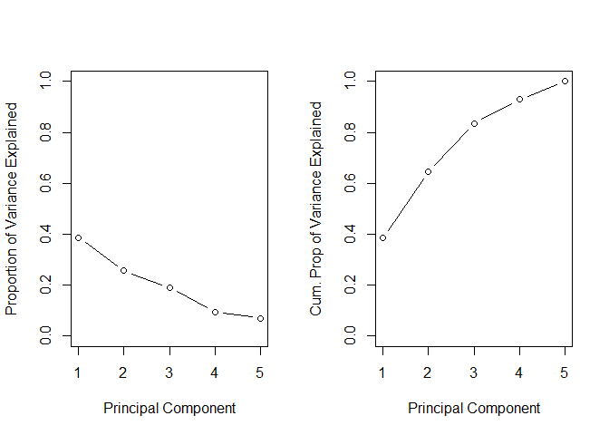<!-- -->

``` r
#Selecting only the PC's up to a 80% variance explained threshold using caret
PCs_eighty <- preProcess(df_no_shares, method = c("center","scale", "pca"), thresh = .8)
#Creating a data frame with just my PC's, day variables, and log_shares to use later as a regression
df_PC <- predict(PCs_eighty, newdata = df_no_shares)
#Monday is excluded to avoid multicollinearity
df_PC <- df_PC %>%
  bind_cols(log_shares = continuous$log_shares,tuesday = train$tuesday, 
            wednesday = train$wednesday, thursday = train$thursday, friday = train$friday,
            saturday = train$saturday, sunday = train$sunday)
screeplot(PCs, type = "lines")
biplot(PCs)
```

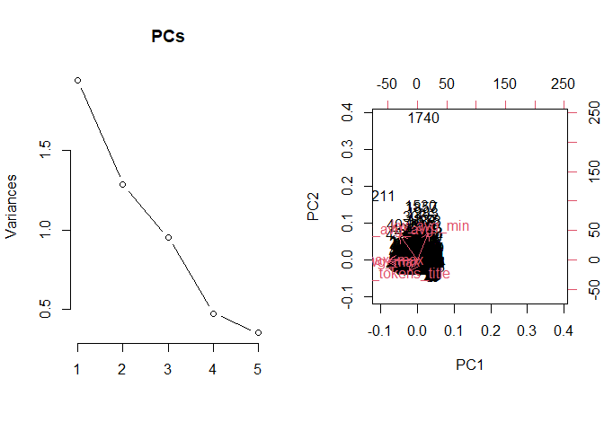<!-- -->

``` r
#Third Chunk


df_no_shares <- continuous %>%
  select(global_subjectivity,global_sentiment_polarity,global_rate_positive_words,global_rate_negative_words)
#Creating PC's along with center and scaling variables
PCs <- prcomp(df_no_shares, center = TRUE, scale = TRUE)
#Creating screeplots
par(mfrow = c(1,2))
plot(PCs$sdev^2/sum(PCs$sdev^2), xlab = "Principal Component",
ylab = "Proportion of Variance Explained", ylim = c(0, 1), type = 'b')
plot(cumsum(PCs$sdev^2/sum(PCs$sdev^2)), xlab = "Principal Component",
ylab = "Cum. Prop of Variance Explained", ylim = c(0, 1), type = 'b')
```

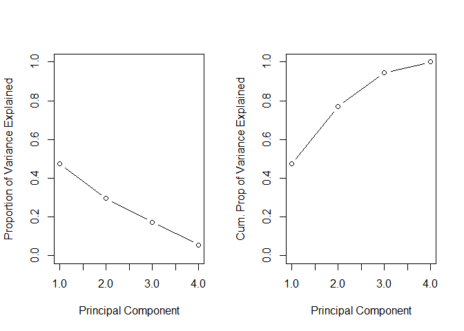<!-- -->

``` r
#Selecting only the PC's up to a 80% variance explained threshold using caret
PCs_eighty <- preProcess(df_no_shares, method = c("center","scale", "pca"), thresh = .8)
#Creating a data frame with just my PC's, day variables, and log_shares to use later as a regression
df_PC <- predict(PCs_eighty, newdata = df_no_shares)
#Monday is excluded to avoid multicollinearity
df_PC <- df_PC %>%
  bind_cols(log_shares = continuous$log_shares,tuesday = train$tuesday, 
            wednesday = train$wednesday, thursday = train$thursday, friday = train$friday,
            saturday = train$saturday, sunday = train$sunday)
screeplot(PCs, type = "lines")
biplot(PCs)
```

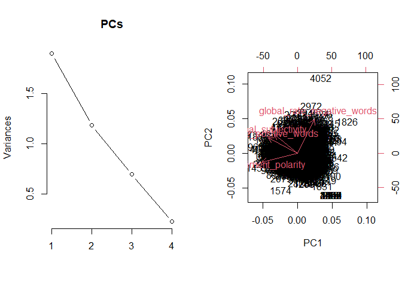<!-- -->

## Automation

\#install.packages(“purrr”)

``` r
library(purrr)
library(tidyverse)
#get data channels
channelIDs <- data.frame("lifestyle", "entertainment", "bus", "socmed", "tech", "world")
channelIDs
#create filenames
output_file <- paste0(channelIDs, ".md")
#create a list for each team with just the team name parameter
params<- lapply(channelIDs, FUN = function(x){list(channel = x)})
params
#put into a data frame
reports <- tibble(output_file, params)
reports

library(rmarkdown)
#render code
apply(reports, MARGIN = 1,
FUN = function(x){
render(input = "Project 3 Final.Rmd", output_file = x[[1]], params = x[[2]])
})
```
