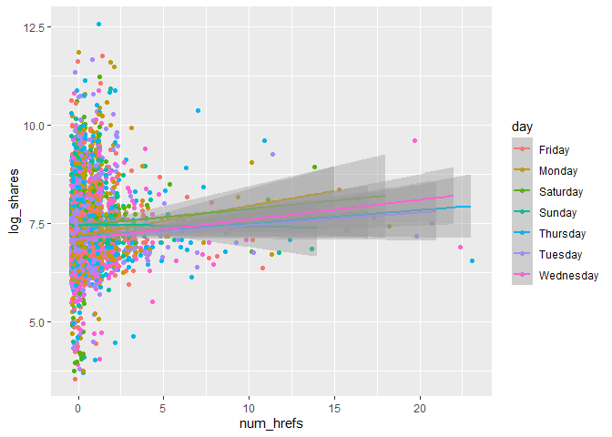
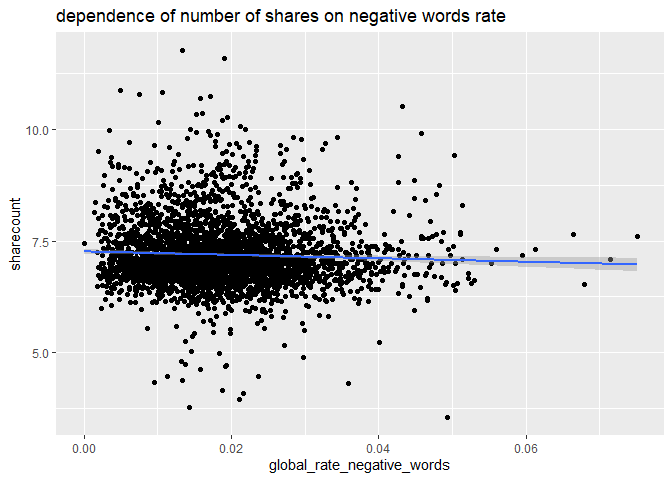

Project 3
================
Richard Xiao & Xi Yang
2022-11-12

## Introduction section

This is an online news popularity data set, and dataset summarizes a
heterogeneous set of features about articles published by Mashable in a
period of two years. The goal is to predict the number of shares in
social networks (popularity). We’re thinking about what kind of articles
are we most likely to share, and we believe there are two aspects. One
is objectivity. Users can feel the content is useful and valuable. The
other one is subjectivity. Users agree with the attitudes expressed in
the article, and also, the emotion expressed in the article resonated
with users.

Based on the two aspects, we choose 21 variables, and they are
n_tokens_title, n_tokens_content, n_unique_tokens, num_imgs, num_videos,
kw_avg_min, kw_max_max, kw_avg_max, kw_avg_avg, weekday_is_monday,
weekday_is_tuesday, weekday_is_wednesday, weekday_is_thursday,
weekday_is_friday,. weekday_is_saturday, weekday_is_sunday,
global_subjectivity, global_sentiment_polarity,
global_rate_positive_words, global_rate_negative_words, and share.

We produce some basic analysis before we fitting the model. The purpose
is to inspect the trends between different variables with respect to the
number of share, and also, figure out the correlation between a few
notable numeric variables. It helps the reader understand the summary or
graph.

For a linear regression model, we’ll use forward stepwise and LASSO
regression model. For an ensemble tree-based model, we’ll fit random
forest and boosted tree model.

## Data

``` r
library(tidyverse)
library(caret)
#read in data
df1 <- read_csv("OnlineNewsPopularity.csv")
```

    ## Rows: 39644 Columns: 61
    ## ── Column specification ────────────────────────────────────────────────────────────────────────────────────────
    ## Delimiter: ","
    ## chr  (1): url
    ## dbl (60): timedelta, n_tokens_title, n_tokens_content, n_unique_tokens, n_non_stop_words, n_non_stop_unique_...
    ## 
    ## ℹ Use `spec()` to retrieve the full column specification for this data.
    ## ℹ Specify the column types or set `show_col_types = FALSE` to quiet this message.

``` r
df1
#Remove the first two variables we don't need. Also want to rename the day variables to make it easier for analysis with rename variable.


df <- df1 %>%
  select(-c(url, timedelta)) %>%
  mutate(log_shares = log(shares)) %>%
  select(-shares) %>% rename(monday = weekday_is_monday , tuesday = weekday_is_tuesday, wednesday = weekday_is_wednesday, thursday = weekday_is_thursday, friday =     weekday_is_friday, saturday = weekday_is_saturday, sunday = weekday_is_sunday)
df 
#setting up data channel 
selectchannel<- paste0("data_channel_is_", params[[1]])
df<- df %>% filter(get(selectchannel) ==1 ) 
df
set.seed(100)
index <- createDataPartition(df$log_shares, p = .7, list = FALSE)
train <- df[index,]
test <- df[-index,]
train
test
```

## Summarizations

### 1. Plotting the correlation between a few notable numeric variables.

``` r
library(tidyverse)
library(corrplot)
cor_mat <- cor(train %>% select(log_shares,num_imgs,num_videos,n_tokens_content,n_tokens_title,kw_avg_min,kw_max_max,kw_avg_max,kw_avg_avg,global_subjectivity,global_sentiment_polarity,global_rate_positive_words), method = "pearson")
corrplot(cor_mat, hc.order = TRUE,
type = "lower",
tl.pos = "lt",
title = "Correlation Coefficients for log of shares",
subtitle = "Correlation Coefficients for log of shares",
mar=c(0,0,2,0)
)
```

    ## Warning in text.default(pos.xlabel[, 1], pos.xlabel[, 2], newcolnames, srt = tl.srt, : "hc.order" is not a
    ## graphical parameter

    ## Warning in text.default(pos.xlabel[, 1], pos.xlabel[, 2], newcolnames, srt = tl.srt, : "subtitle" is not a
    ## graphical parameter

    ## Warning in text.default(pos.ylabel[, 1], pos.ylabel[, 2], newrownames, col = tl.col, : "hc.order" is not a
    ## graphical parameter

    ## Warning in text.default(pos.ylabel[, 1], pos.ylabel[, 2], newrownames, col = tl.col, : "subtitle" is not a
    ## graphical parameter

    ## Warning in title(title, ...): "hc.order" is not a graphical parameter

    ## Warning in title(title, ...): "subtitle" is not a graphical parameter

<!-- -->

From the correlation graph, if the variable has a darker blue color, it
will signify a strong positive correlation with the other variable
whereas if it has a darker red color, it will have a stronger negative
correlation with the other variable.

``` r
#This new dataframe converts the days into categorical values for graphing.
moddf <- train%>%
  mutate(day = if_else(monday == 1,"Monday",if_else(tuesday == 1,"Tuesday",if_else(wednesday == 1,"Wednesday",if_else(
thursday == 1,"Thursday",if_else(friday == 1,"Friday",if_else(saturday == 1,"Saturday", "Sunday")))))))
#Eliminates any categorical variables for use of principal component analysis
continuous <- train %>%select(-c(monday, tuesday, wednesday, thursday,friday, saturday, sunday, is_weekend, ))
```

### 2. Boxplot for log shares subdivided by days.

``` r
#Boxplot for log shares subdivided by days.
ggplot(moddf, aes(x = day, y = log_shares, col = day)) + 
  geom_boxplot(fill="grey") + 
  geom_jitter() + 
  ylab("log(shares)") + 
  xlab("") +
  theme(axis.text.x = element_text(angle = 45)) +
  ggtitle("Boxplot for Log Shares by Day")
```

<!-- -->

### 3. Scatterplot for log shares and number of images

``` r
#Scatterplot for log shares and number of images
ggplot(moddf, aes(y = log_shares, x = num_imgs, color = day)) + 
  geom_point(stat = "identity", position = "jitter") + 
  geom_smooth( method = "lm")  + 
  xlab("num_hrefs") + 
  ylab("log_shares")
```

    ## `geom_smooth()` using formula 'y ~ x'

<!-- -->

### 4. Scatterplot for log shares and number of videos.

``` r
#Scatterplot for log shares and number of videos.
ggplot(moddf, aes(y = log_shares, x = num_videos, color = day)) + 
  geom_point(stat = "identity", position = "jitter") + 
  geom_smooth( method = "lm")  + 
  xlab("num_hrefs") + 
  ylab("log_shares")
```

    ## `geom_smooth()` using formula 'y ~ x'

<!-- -->

### 5. Histogram for log shares

``` r
#Histogram for log shares 
ggplot(moddf, aes(x=log_shares, fill = kw_avg_avg, color = day)) + geom_histogram(binwidth = 1, position="dodge") + xlab("Average KeyWord") + ylab("Log Shares")
```

<!-- -->

### 6. Scatterplot for number of unique tokens and log shares

``` r
#Scatterplot for number of unique tokens and log shares
ggplot(moddf, aes(y = log_shares, x = n_unique_tokens, color = day)) + 
  geom_point(stat = "identity", position = "jitter") + 
  geom_smooth( method = "lm")  + 
  xlab("n_unique_tokens") + 
  ylab("log_shares")
```

    ## `geom_smooth()` using formula 'y ~ x'

<!-- -->

### 7. Scatterplot for number of tokens content and log shares

``` r
#Scatterplot for number of tokens content and log shares
ggplot(moddf, aes(y = log_shares, x = n_tokens_content, color = day)) + 
  geom_point(stat = "identity", position = "jitter") + 
  geom_smooth( method = "lm")  + 
  xlab("n_tokens_content") + 
  ylab("log_shares")
```

    ## `geom_smooth()` using formula 'y ~ x'

<!-- -->

### 8. Scatterplot for number of token titles and log shares

``` r
#Scatterplot for number of token titles and log shares
ggplot(moddf, aes(y = log_shares, x = n_tokens_title, color = day)) + 
  geom_point(stat = "identity", position = "jitter") + 
  geom_smooth( method = "lm")  + 
  xlab("n_tokens_title") + 
  ylab("log_shares")
```

    ## `geom_smooth()` using formula 'y ~ x'

<!-- -->

### 9. General summary statistics for continuous dataframe

The code chunk below will give summary statistics for the twelve
variables that we want to analyze. The results are ordered by descending
standard deviation. We want to know the general statistics for all of
these variables to see how they compare against each other.

### 10. Numerical summary of categorical variable is_weekend

let’s pull a summary of the number of shares. One of the factors that
most affects the number of shares is whether the day is weekday or
weekend. I wanted to look at the average, standard deviation, median and
IQR values of number of shares on weekdays and weekend. If the value of
average is larger , then articles tend to be shared more often.

``` r
library(tidyverse)
train %>%
  group_by(is_weekend) %>%
  summarise(average=mean(log_shares), median=median(log_shares), sd=sd(log_shares), IQR=IQR(log_shares))
```

### 11. Dependence of number of shares on text subjectivity

A scatter plot with the number of shares on the y-axis and the text
subjectivity on the x-axis is created: we can inspect the trend of
shares as a function of the text subjectivity. We know that if the value
of text subjectivity is 0, it stands for the article is very objective,
and value 1 stands for very subjective. If the most points distributed
lower than 0.5, then articles with more objectivity tend to be shared
more often. If the most points distributed larger than 0.5, then
articles with more subjectivity tend to be shared more often. If the
most points distributed around 0.5, then articles with more neutrality
tend to be shared more often.

``` r
library(tidyverse)
library(ggplot2)
subjectivityData <- train %>% group_by(global_subjectivity) %>% summarize(sharecount = mean(log_shares))
ggplot(subjectivityData, aes(x = global_subjectivity, y = sharecount, color =global_subjectivity)) +
geom_point() +
ggtitle("dependence of number of shares on text subjectivity ")
```

<!-- -->

### 12. Dependence of number of shares on text sentiment polarity

A scatter plot with the number of shares on the y-axis and the text
sentiment polarity on the x-axis is created: we can inspect the trend of
shares as a function of the text sentiment polarity. We know that if the
value of text sentiment polarity is greater than -1 and less than 0, it
stands for the article sentiment is negative emotion. If the value of
text sentiment polarity is greater than 0 and less than 1, it stands for
the article sentiment is positive emotion. If the most points
distributed around (-1,0), then articles with negative emotion tend to
be shared more often. If the most points distributed around (0,1), then
articles with positive emotion tend to be shared more often. If the most
points distributed around 0, then articles with neutral emotion tend to
be shared more often.

``` r
library(tidyverse)
library(ggplot2)
sentimentpolarityData <- train %>% group_by(global_sentiment_polarity) %>% summarize(sharecount = mean(log_shares))
ggplot(sentimentpolarityData, aes(x = global_sentiment_polarity, y = sharecount, color =global_sentiment_polarity)) +
geom_point() +
ggtitle("dependence of number of shares on text sentiment polarity ")
```

<!-- -->

### 13. Dependence of number of shares on positive word rate

A scatter plot with the number of shares on the y-axis and the positive
word rate on the x-axis is created: we can inspect the trend of shares
as a function of the positive word rate. If the points show an upward
trend, then articles with more positive words tend to be shared more
often. If we see a negative trend then articles with more positive words
tend to be shared less often.

``` r
library(tidyverse)
library(ggplot2)
positivewordsData <- train %>% group_by(global_rate_positive_words) %>% summarize(sharecount = mean(log_shares))
ggplot(positivewordsData, aes(x = global_rate_positive_words, y = sharecount), color=global_rate_positive_words) +
geom_point() +
geom_smooth(method = "lm") +
ggtitle("dependence of number of shares on positive word rate ")
```

    ## `geom_smooth()` using formula 'y ~ x'

<!-- --> \### 14.
Dependence of number of shares on negative words rate

A scatter plot with the number of shares on the y-axis and the negative
words rate on the x-axis is created: we can inspect the trend of shares
as a function of the negative words rate. If the points show an upward
trend, then articles with more negative words tend to be shared more
often. If we see a negative trend then articles with more negative words
tend to be shared less often.

``` r
library(tidyverse)
library(ggplot2)
negativewordsData <- train %>% group_by(global_rate_negative_words) %>% summarize(sharecount = mean(log_shares))
ggplot(negativewordsData, aes(x = global_rate_negative_words, y = sharecount)) +
geom_point() +
geom_smooth(method = "lm") +
ggtitle("dependence of number of shares on negative words rate")
```

    ## `geom_smooth()` using formula 'y ~ x'

<!-- -->

## Modeling

For models below, I have selected the log_shares as the dependent
variable, and num_imgs, num_videos, n_tokens_content, n_unique_tokens,
n_tokens_title, kw_avg_min, kw_max_max, kw_avg_max,
kw_avg_avg,global_subjectivity, global_sentiment_polarity,
global_rate_positive_words, global_rate_negative_words, monday, tuesday,
wednesday, thursday, friday, saturday, sunday as the independent
variables.

``` r
library(tidyverse)
#Select variables of interest for analysis.
analysis <- train %>% select(log_shares,num_imgs,num_videos,n_tokens_content,n_unique_tokens,n_tokens_title,kw_avg_min,kw_max_max,kw_avg_max,kw_avg_avg,global_subjectivity,global_sentiment_polarity,global_rate_positive_words,global_rate_negative_words,monday,tuesday,wednesday,thursday,friday,saturday,sunday)
analysis
```

Here after all the models formulated below, to compare them, I am
predicting the test data on this model to derive some common metrics
like RMSE and R squared values that can be used to compare multiple
models. For prediction, I am using predict() function, and to extract
prediction metrics, I am using postResample() function.

### 1. LASSO Regression Model

Lasso regression is a type of linear regression that uses shrinkage.
Shrinkage is where data values are shrunk towards a central point, like
the mean. The lasso procedure encourages simple, sparse models
(i.e. models with fewer parameters). This particular type of regression
is well-suited for models showing high levels of multicollinearity or
when you want to automate certain parts of model selection, like
variable selection/parameter elimination.

``` r
library(caret)
fitLASSO <- train(log_shares ~ ., data = analysis,
method = "lasso",
preProcess = c("center", "scale"),
trControl = trainControl(method = "cv", number = 10)
)
predLASSO <- predict(fitLASSO, newdata = test)
m1<-postResample(predLASSO, obs = test$log_shares)
m1
```

    ##       RMSE   Rsquared        MAE 
    ## 0.78448473 0.06194983 0.55434936

### 2. Boosted Tree Model

Boosting is an ensemble learning method that combines a set of weak
learners into a strong learner to minimize training errors. In boosting,
a random sample of data is selected, fitted with a model and then
trained sequentially—that is, each model tries to compensate for the
weaknesses of its predecessor. With each iteration, the weak rules from
each individual classifier are combined to form one, strong prediction
rule.

``` r
library(caret)
boostedFit <- train(log_shares ~ ., data = analysis, method = "gbm",trControl = trainControl(method = "cv" , number = 10),
                    preProcess = c("center", "scale"),
                    tuneGrid = expand.grid(n.trees = c(25, 50, 100, 150, 200),
                                           interaction.depth = 1:4,
                                           shrinkage = 0.1,
                                           n.minobsinnode = 10)
                    )
```

    ## Iter   TrainDeviance   ValidDeviance   StepSize   Improve
    ##      1        0.7060             nan     0.1000    0.0044
    ##      2        0.7025             nan     0.1000    0.0035
    ##      3        0.6998             nan     0.1000    0.0027
    ##      4        0.6971             nan     0.1000    0.0023
    ##      5        0.6946             nan     0.1000    0.0018
    ##      6        0.6930             nan     0.1000    0.0014
    ##      7        0.6915             nan     0.1000    0.0009
    ##      8        0.6900             nan     0.1000    0.0011
    ##      9        0.6884             nan     0.1000    0.0013
    ##     10        0.6873             nan     0.1000    0.0001
    ##     20        0.6767             nan     0.1000    0.0009
    ##     40        0.6616             nan     0.1000    0.0003
    ##     60        0.6515             nan     0.1000   -0.0006
    ##     80        0.6443             nan     0.1000    0.0001
    ##    100        0.6395             nan     0.1000   -0.0000
    ##    120        0.6361             nan     0.1000   -0.0003
    ##    140        0.6332             nan     0.1000   -0.0002
    ##    160        0.6305             nan     0.1000   -0.0002
    ##    180        0.6285             nan     0.1000   -0.0000
    ##    200        0.6266             nan     0.1000   -0.0000
    ## 
    ## Iter   TrainDeviance   ValidDeviance   StepSize   Improve
    ##      1        0.7049             nan     0.1000    0.0048
    ##      2        0.7000             nan     0.1000    0.0040
    ##      3        0.6964             nan     0.1000    0.0033
    ##      4        0.6928             nan     0.1000    0.0031
    ##      5        0.6902             nan     0.1000    0.0024
    ##      6        0.6876             nan     0.1000    0.0014
    ##      7        0.6848             nan     0.1000    0.0023
    ##      8        0.6827             nan     0.1000    0.0009
    ##      9        0.6806             nan     0.1000    0.0015
    ##     10        0.6788             nan     0.1000    0.0008
    ##     20        0.6624             nan     0.1000    0.0010
    ##     40        0.6429             nan     0.1000   -0.0003
    ##     60        0.6317             nan     0.1000   -0.0004
    ##     80        0.6242             nan     0.1000   -0.0005
    ##    100        0.6171             nan     0.1000   -0.0001
    ##    120        0.6123             nan     0.1000   -0.0005
    ##    140        0.6070             nan     0.1000   -0.0006
    ##    160        0.6017             nan     0.1000    0.0001
    ##    180        0.5978             nan     0.1000   -0.0002
    ##    200        0.5934             nan     0.1000   -0.0001
    ## 
    ## Iter   TrainDeviance   ValidDeviance   StepSize   Improve
    ##      1        0.7045             nan     0.1000    0.0059
    ##      2        0.6993             nan     0.1000    0.0041
    ##      3        0.6945             nan     0.1000    0.0034
    ##      4        0.6894             nan     0.1000    0.0041
    ##      5        0.6854             nan     0.1000    0.0034
    ##      6        0.6815             nan     0.1000    0.0018
    ##      7        0.6784             nan     0.1000    0.0019
    ##      8        0.6752             nan     0.1000    0.0023
    ##      9        0.6728             nan     0.1000    0.0011
    ##     10        0.6708             nan     0.1000    0.0011
    ##     20        0.6514             nan     0.1000    0.0009
    ##     40        0.6289             nan     0.1000   -0.0004
    ##     60        0.6129             nan     0.1000    0.0001
    ##     80        0.6040             nan     0.1000   -0.0002
    ##    100        0.5953             nan     0.1000    0.0001
    ##    120        0.5868             nan     0.1000    0.0000
    ##    140        0.5797             nan     0.1000   -0.0004
    ##    160        0.5729             nan     0.1000   -0.0003
    ##    180        0.5659             nan     0.1000   -0.0004
    ##    200        0.5601             nan     0.1000   -0.0004
    ## 
    ## Iter   TrainDeviance   ValidDeviance   StepSize   Improve
    ##      1        0.7027             nan     0.1000    0.0061
    ##      2        0.6972             nan     0.1000    0.0053
    ##      3        0.6917             nan     0.1000    0.0034
    ##      4        0.6871             nan     0.1000    0.0033
    ##      5        0.6831             nan     0.1000    0.0029
    ##      6        0.6794             nan     0.1000    0.0025
    ##      7        0.6757             nan     0.1000    0.0022
    ##      8        0.6728             nan     0.1000    0.0015
    ##      9        0.6695             nan     0.1000    0.0020
    ##     10        0.6665             nan     0.1000    0.0014
    ##     20        0.6440             nan     0.1000    0.0011
    ##     40        0.6178             nan     0.1000   -0.0002
    ##     60        0.6007             nan     0.1000   -0.0004
    ##     80        0.5870             nan     0.1000   -0.0004
    ##    100        0.5756             nan     0.1000   -0.0003
    ##    120        0.5647             nan     0.1000    0.0003
    ##    140        0.5552             nan     0.1000   -0.0007
    ##    160        0.5462             nan     0.1000   -0.0005
    ##    180        0.5384             nan     0.1000   -0.0009
    ##    200        0.5306             nan     0.1000   -0.0005
    ## 
    ## Iter   TrainDeviance   ValidDeviance   StepSize   Improve
    ##      1        0.6926             nan     0.1000    0.0034
    ##      2        0.6890             nan     0.1000    0.0038
    ##      3        0.6859             nan     0.1000    0.0030
    ##      4        0.6836             nan     0.1000    0.0015
    ##      5        0.6819             nan     0.1000    0.0014
    ##      6        0.6795             nan     0.1000    0.0021
    ##      7        0.6771             nan     0.1000    0.0020
    ##      8        0.6755             nan     0.1000    0.0015
    ##      9        0.6738             nan     0.1000    0.0012
    ##     10        0.6721             nan     0.1000    0.0012
    ##     20        0.6622             nan     0.1000    0.0005
    ##     40        0.6473             nan     0.1000   -0.0001
    ##     60        0.6383             nan     0.1000    0.0001
    ##     80        0.6313             nan     0.1000   -0.0000
    ##    100        0.6260             nan     0.1000    0.0000
    ##    120        0.6229             nan     0.1000   -0.0001
    ##    140        0.6199             nan     0.1000   -0.0004
    ##    160        0.6174             nan     0.1000   -0.0002
    ##    180        0.6150             nan     0.1000   -0.0001
    ##    200        0.6130             nan     0.1000   -0.0001
    ## 
    ## Iter   TrainDeviance   ValidDeviance   StepSize   Improve
    ##      1        0.6923             nan     0.1000    0.0054
    ##      2        0.6887             nan     0.1000    0.0031
    ##      3        0.6840             nan     0.1000    0.0038
    ##      4        0.6807             nan     0.1000    0.0026
    ##      5        0.6772             nan     0.1000    0.0025
    ##      6        0.6753             nan     0.1000    0.0006
    ##      7        0.6725             nan     0.1000    0.0022
    ##      8        0.6696             nan     0.1000    0.0022
    ##      9        0.6674             nan     0.1000    0.0008
    ##     10        0.6655             nan     0.1000    0.0015
    ##     20        0.6500             nan     0.1000    0.0012
    ##     40        0.6295             nan     0.1000    0.0001
    ##     60        0.6180             nan     0.1000    0.0002
    ##     80        0.6091             nan     0.1000    0.0000
    ##    100        0.6033             nan     0.1000   -0.0005
    ##    120        0.5974             nan     0.1000   -0.0003
    ##    140        0.5925             nan     0.1000   -0.0005
    ##    160        0.5869             nan     0.1000   -0.0002
    ##    180        0.5826             nan     0.1000   -0.0003
    ##    200        0.5783             nan     0.1000   -0.0004
    ## 
    ## Iter   TrainDeviance   ValidDeviance   StepSize   Improve
    ##      1        0.6915             nan     0.1000    0.0047
    ##      2        0.6855             nan     0.1000    0.0055
    ##      3        0.6804             nan     0.1000    0.0046
    ##      4        0.6758             nan     0.1000    0.0035
    ##      5        0.6720             nan     0.1000    0.0029
    ##      6        0.6685             nan     0.1000    0.0016
    ##      7        0.6659             nan     0.1000    0.0018
    ##      8        0.6625             nan     0.1000    0.0023
    ##      9        0.6599             nan     0.1000    0.0021
    ##     10        0.6578             nan     0.1000    0.0010
    ##     20        0.6394             nan     0.1000    0.0003
    ##     40        0.6159             nan     0.1000   -0.0002
    ##     60        0.6020             nan     0.1000   -0.0001
    ##     80        0.5922             nan     0.1000   -0.0001
    ##    100        0.5831             nan     0.1000   -0.0001
    ##    120        0.5748             nan     0.1000   -0.0002
    ##    140        0.5674             nan     0.1000   -0.0003
    ##    160        0.5599             nan     0.1000   -0.0005
    ##    180        0.5538             nan     0.1000   -0.0006
    ##    200        0.5481             nan     0.1000   -0.0005
    ## 
    ## Iter   TrainDeviance   ValidDeviance   StepSize   Improve
    ##      1        0.6909             nan     0.1000    0.0063
    ##      2        0.6849             nan     0.1000    0.0051
    ##      3        0.6788             nan     0.1000    0.0041
    ##      4        0.6729             nan     0.1000    0.0033
    ##      5        0.6690             nan     0.1000    0.0029
    ##      6        0.6649             nan     0.1000    0.0025
    ##      7        0.6619             nan     0.1000    0.0009
    ##      8        0.6585             nan     0.1000    0.0022
    ##      9        0.6561             nan     0.1000    0.0006
    ##     10        0.6538             nan     0.1000    0.0010
    ##     20        0.6323             nan     0.1000    0.0005
    ##     40        0.6063             nan     0.1000   -0.0006
    ##     60        0.5917             nan     0.1000   -0.0003
    ##     80        0.5800             nan     0.1000   -0.0005
    ##    100        0.5689             nan     0.1000   -0.0004
    ##    120        0.5588             nan     0.1000   -0.0005
    ##    140        0.5494             nan     0.1000   -0.0003
    ##    160        0.5398             nan     0.1000   -0.0004
    ##    180        0.5318             nan     0.1000   -0.0007
    ##    200        0.5237             nan     0.1000   -0.0006
    ## 
    ## Iter   TrainDeviance   ValidDeviance   StepSize   Improve
    ##      1        0.7024             nan     0.1000    0.0043
    ##      2        0.6982             nan     0.1000    0.0031
    ##      3        0.6949             nan     0.1000    0.0031
    ##      4        0.6922             nan     0.1000    0.0023
    ##      5        0.6897             nan     0.1000    0.0019
    ##      6        0.6880             nan     0.1000    0.0008
    ##      7        0.6859             nan     0.1000    0.0019
    ##      8        0.6840             nan     0.1000    0.0017
    ##      9        0.6822             nan     0.1000    0.0013
    ##     10        0.6809             nan     0.1000    0.0012
    ##     20        0.6699             nan     0.1000    0.0005
    ##     40        0.6552             nan     0.1000    0.0002
    ##     60        0.6457             nan     0.1000    0.0001
    ##     80        0.6396             nan     0.1000    0.0002
    ##    100        0.6352             nan     0.1000   -0.0001
    ##    120        0.6314             nan     0.1000   -0.0000
    ##    140        0.6287             nan     0.1000   -0.0000
    ##    160        0.6265             nan     0.1000   -0.0002
    ##    180        0.6245             nan     0.1000   -0.0004
    ##    200        0.6226             nan     0.1000   -0.0003
    ## 
    ## Iter   TrainDeviance   ValidDeviance   StepSize   Improve
    ##      1        0.7010             nan     0.1000    0.0051
    ##      2        0.6961             nan     0.1000    0.0043
    ##      3        0.6917             nan     0.1000    0.0040
    ##      4        0.6878             nan     0.1000    0.0027
    ##      5        0.6849             nan     0.1000    0.0027
    ##      6        0.6821             nan     0.1000    0.0028
    ##      7        0.6789             nan     0.1000    0.0018
    ##      8        0.6765             nan     0.1000    0.0016
    ##      9        0.6744             nan     0.1000    0.0009
    ##     10        0.6723             nan     0.1000    0.0014
    ##     20        0.6569             nan     0.1000    0.0004
    ##     40        0.6378             nan     0.1000   -0.0000
    ##     60        0.6260             nan     0.1000   -0.0003
    ##     80        0.6175             nan     0.1000   -0.0001
    ##    100        0.6109             nan     0.1000   -0.0002
    ##    120        0.6054             nan     0.1000   -0.0000
    ##    140        0.6009             nan     0.1000   -0.0003
    ##    160        0.5973             nan     0.1000   -0.0000
    ##    180        0.5926             nan     0.1000   -0.0003
    ##    200        0.5886             nan     0.1000   -0.0005
    ## 
    ## Iter   TrainDeviance   ValidDeviance   StepSize   Improve
    ##      1        0.7007             nan     0.1000    0.0058
    ##      2        0.6949             nan     0.1000    0.0050
    ##      3        0.6895             nan     0.1000    0.0031
    ##      4        0.6845             nan     0.1000    0.0036
    ##      5        0.6809             nan     0.1000    0.0036
    ##      6        0.6772             nan     0.1000    0.0027
    ##      7        0.6743             nan     0.1000    0.0026
    ##      8        0.6721             nan     0.1000    0.0009
    ##      9        0.6690             nan     0.1000    0.0016
    ##     10        0.6667             nan     0.1000    0.0011
    ##     20        0.6480             nan     0.1000    0.0012
    ##     40        0.6250             nan     0.1000    0.0004
    ##     60        0.6110             nan     0.1000    0.0001
    ##     80        0.6001             nan     0.1000   -0.0003
    ##    100        0.5915             nan     0.1000   -0.0000
    ##    120        0.5848             nan     0.1000   -0.0003
    ##    140        0.5776             nan     0.1000   -0.0001
    ##    160        0.5706             nan     0.1000   -0.0003
    ##    180        0.5646             nan     0.1000   -0.0003
    ##    200        0.5568             nan     0.1000   -0.0001
    ## 
    ## Iter   TrainDeviance   ValidDeviance   StepSize   Improve
    ##      1        0.6997             nan     0.1000    0.0052
    ##      2        0.6934             nan     0.1000    0.0051
    ##      3        0.6874             nan     0.1000    0.0042
    ##      4        0.6823             nan     0.1000    0.0047
    ##      5        0.6777             nan     0.1000    0.0030
    ##      6        0.6736             nan     0.1000    0.0035
    ##      7        0.6704             nan     0.1000    0.0022
    ##      8        0.6666             nan     0.1000    0.0013
    ##      9        0.6636             nan     0.1000    0.0020
    ##     10        0.6607             nan     0.1000    0.0020
    ##     20        0.6399             nan     0.1000    0.0001
    ##     40        0.6137             nan     0.1000    0.0003
    ##     60        0.5960             nan     0.1000    0.0000
    ##     80        0.5844             nan     0.1000   -0.0008
    ##    100        0.5733             nan     0.1000   -0.0006
    ##    120        0.5624             nan     0.1000   -0.0006
    ##    140        0.5533             nan     0.1000   -0.0007
    ##    160        0.5439             nan     0.1000   -0.0005
    ##    180        0.5354             nan     0.1000   -0.0000
    ##    200        0.5262             nan     0.1000   -0.0004
    ## 
    ## Iter   TrainDeviance   ValidDeviance   StepSize   Improve
    ##      1        0.6992             nan     0.1000    0.0048
    ##      2        0.6947             nan     0.1000    0.0037
    ##      3        0.6916             nan     0.1000    0.0029
    ##      4        0.6888             nan     0.1000    0.0023
    ##      5        0.6862             nan     0.1000    0.0018
    ##      6        0.6839             nan     0.1000    0.0017
    ##      7        0.6818             nan     0.1000    0.0018
    ##      8        0.6801             nan     0.1000    0.0013
    ##      9        0.6787             nan     0.1000    0.0012
    ##     10        0.6776             nan     0.1000    0.0006
    ##     20        0.6676             nan     0.1000    0.0004
    ##     40        0.6537             nan     0.1000    0.0005
    ##     60        0.6450             nan     0.1000    0.0002
    ##     80        0.6382             nan     0.1000    0.0002
    ##    100        0.6334             nan     0.1000   -0.0001
    ##    120        0.6298             nan     0.1000   -0.0002
    ##    140        0.6269             nan     0.1000   -0.0004
    ##    160        0.6245             nan     0.1000   -0.0002
    ##    180        0.6227             nan     0.1000   -0.0001
    ##    200        0.6206             nan     0.1000   -0.0000
    ## 
    ## Iter   TrainDeviance   ValidDeviance   StepSize   Improve
    ##      1        0.6991             nan     0.1000    0.0060
    ##      2        0.6945             nan     0.1000    0.0041
    ##      3        0.6902             nan     0.1000    0.0037
    ##      4        0.6860             nan     0.1000    0.0030
    ##      5        0.6827             nan     0.1000    0.0026
    ##      6        0.6801             nan     0.1000    0.0022
    ##      7        0.6771             nan     0.1000    0.0019
    ##      8        0.6744             nan     0.1000    0.0018
    ##      9        0.6718             nan     0.1000    0.0019
    ##     10        0.6700             nan     0.1000    0.0016
    ##     20        0.6543             nan     0.1000    0.0010
    ##     40        0.6364             nan     0.1000   -0.0001
    ##     60        0.6247             nan     0.1000   -0.0001
    ##     80        0.6165             nan     0.1000   -0.0000
    ##    100        0.6096             nan     0.1000   -0.0001
    ##    120        0.6043             nan     0.1000   -0.0006
    ##    140        0.5997             nan     0.1000   -0.0006
    ##    160        0.5953             nan     0.1000   -0.0004
    ##    180        0.5909             nan     0.1000   -0.0002
    ##    200        0.5867             nan     0.1000   -0.0005
    ## 
    ## Iter   TrainDeviance   ValidDeviance   StepSize   Improve
    ##      1        0.6984             nan     0.1000    0.0060
    ##      2        0.6929             nan     0.1000    0.0041
    ##      3        0.6882             nan     0.1000    0.0029
    ##      4        0.6840             nan     0.1000    0.0037
    ##      5        0.6800             nan     0.1000    0.0030
    ##      6        0.6768             nan     0.1000    0.0026
    ##      7        0.6735             nan     0.1000    0.0027
    ##      8        0.6699             nan     0.1000    0.0021
    ##      9        0.6676             nan     0.1000    0.0012
    ##     10        0.6645             nan     0.1000    0.0017
    ##     20        0.6465             nan     0.1000    0.0009
    ##     40        0.6240             nan     0.1000    0.0008
    ##     60        0.6104             nan     0.1000   -0.0002
    ##     80        0.6005             nan     0.1000   -0.0003
    ##    100        0.5902             nan     0.1000   -0.0003
    ##    120        0.5828             nan     0.1000   -0.0002
    ##    140        0.5753             nan     0.1000   -0.0005
    ##    160        0.5687             nan     0.1000   -0.0007
    ##    180        0.5621             nan     0.1000   -0.0006
    ##    200        0.5546             nan     0.1000   -0.0006
    ## 
    ## Iter   TrainDeviance   ValidDeviance   StepSize   Improve
    ##      1        0.6967             nan     0.1000    0.0065
    ##      2        0.6906             nan     0.1000    0.0054
    ##      3        0.6853             nan     0.1000    0.0042
    ##      4        0.6801             nan     0.1000    0.0034
    ##      5        0.6757             nan     0.1000    0.0026
    ##      6        0.6712             nan     0.1000    0.0022
    ##      7        0.6678             nan     0.1000    0.0022
    ##      8        0.6652             nan     0.1000    0.0011
    ##      9        0.6625             nan     0.1000    0.0019
    ##     10        0.6594             nan     0.1000    0.0019
    ##     20        0.6386             nan     0.1000    0.0011
    ##     40        0.6141             nan     0.1000    0.0003
    ##     60        0.5981             nan     0.1000   -0.0001
    ##     80        0.5861             nan     0.1000   -0.0006
    ##    100        0.5761             nan     0.1000   -0.0004
    ##    120        0.5656             nan     0.1000    0.0001
    ##    140        0.5551             nan     0.1000   -0.0003
    ##    160        0.5465             nan     0.1000   -0.0006
    ##    180        0.5368             nan     0.1000   -0.0002
    ##    200        0.5295             nan     0.1000   -0.0005
    ## 
    ## Iter   TrainDeviance   ValidDeviance   StepSize   Improve
    ##      1        0.6987             nan     0.1000    0.0043
    ##      2        0.6952             nan     0.1000    0.0034
    ##      3        0.6917             nan     0.1000    0.0026
    ##      4        0.6892             nan     0.1000    0.0024
    ##      5        0.6871             nan     0.1000    0.0019
    ##      6        0.6851             nan     0.1000    0.0019
    ##      7        0.6832             nan     0.1000    0.0015
    ##      8        0.6819             nan     0.1000    0.0013
    ##      9        0.6803             nan     0.1000    0.0014
    ##     10        0.6792             nan     0.1000    0.0006
    ##     20        0.6689             nan     0.1000    0.0006
    ##     40        0.6537             nan     0.1000   -0.0000
    ##     60        0.6435             nan     0.1000    0.0002
    ##     80        0.6371             nan     0.1000   -0.0002
    ##    100        0.6315             nan     0.1000   -0.0001
    ##    120        0.6279             nan     0.1000   -0.0002
    ##    140        0.6247             nan     0.1000   -0.0002
    ##    160        0.6221             nan     0.1000   -0.0002
    ##    180        0.6200             nan     0.1000   -0.0004
    ##    200        0.6184             nan     0.1000   -0.0002
    ## 
    ## Iter   TrainDeviance   ValidDeviance   StepSize   Improve
    ##      1        0.6978             nan     0.1000    0.0046
    ##      2        0.6928             nan     0.1000    0.0042
    ##      3        0.6889             nan     0.1000    0.0032
    ##      4        0.6852             nan     0.1000    0.0028
    ##      5        0.6824             nan     0.1000    0.0025
    ##      6        0.6795             nan     0.1000    0.0021
    ##      7        0.6765             nan     0.1000    0.0028
    ##      8        0.6742             nan     0.1000    0.0016
    ##      9        0.6724             nan     0.1000    0.0014
    ##     10        0.6700             nan     0.1000    0.0017
    ##     20        0.6532             nan     0.1000    0.0007
    ##     40        0.6351             nan     0.1000   -0.0003
    ##     60        0.6235             nan     0.1000   -0.0000
    ##     80        0.6160             nan     0.1000   -0.0003
    ##    100        0.6093             nan     0.1000   -0.0005
    ##    120        0.6040             nan     0.1000   -0.0003
    ##    140        0.5988             nan     0.1000   -0.0002
    ##    160        0.5950             nan     0.1000   -0.0006
    ##    180        0.5913             nan     0.1000   -0.0005
    ##    200        0.5861             nan     0.1000   -0.0001
    ## 
    ## Iter   TrainDeviance   ValidDeviance   StepSize   Improve
    ##      1        0.6977             nan     0.1000    0.0045
    ##      2        0.6921             nan     0.1000    0.0049
    ##      3        0.6875             nan     0.1000    0.0040
    ##      4        0.6830             nan     0.1000    0.0035
    ##      5        0.6786             nan     0.1000    0.0030
    ##      6        0.6750             nan     0.1000    0.0028
    ##      7        0.6720             nan     0.1000    0.0024
    ##      8        0.6694             nan     0.1000    0.0018
    ##      9        0.6664             nan     0.1000    0.0010
    ##     10        0.6636             nan     0.1000    0.0014
    ##     20        0.6443             nan     0.1000    0.0007
    ##     40        0.6208             nan     0.1000   -0.0002
    ##     60        0.6088             nan     0.1000    0.0001
    ##     80        0.5982             nan     0.1000   -0.0004
    ##    100        0.5905             nan     0.1000   -0.0001
    ##    120        0.5828             nan     0.1000   -0.0004
    ##    140        0.5755             nan     0.1000   -0.0001
    ##    160        0.5685             nan     0.1000   -0.0002
    ##    180        0.5622             nan     0.1000   -0.0007
    ##    200        0.5554             nan     0.1000   -0.0004
    ## 
    ## Iter   TrainDeviance   ValidDeviance   StepSize   Improve
    ##      1        0.6960             nan     0.1000    0.0065
    ##      2        0.6900             nan     0.1000    0.0053
    ##      3        0.6839             nan     0.1000    0.0050
    ##      4        0.6800             nan     0.1000    0.0025
    ##      5        0.6758             nan     0.1000    0.0034
    ##      6        0.6713             nan     0.1000    0.0032
    ##      7        0.6674             nan     0.1000    0.0024
    ##      8        0.6640             nan     0.1000    0.0024
    ##      9        0.6601             nan     0.1000    0.0025
    ##     10        0.6574             nan     0.1000    0.0012
    ##     20        0.6359             nan     0.1000    0.0009
    ##     40        0.6116             nan     0.1000   -0.0000
    ##     60        0.5940             nan     0.1000   -0.0001
    ##     80        0.5815             nan     0.1000   -0.0007
    ##    100        0.5711             nan     0.1000   -0.0008
    ##    120        0.5609             nan     0.1000   -0.0004
    ##    140        0.5522             nan     0.1000   -0.0000
    ##    160        0.5421             nan     0.1000   -0.0004
    ##    180        0.5334             nan     0.1000   -0.0004
    ##    200        0.5258             nan     0.1000   -0.0006
    ## 
    ## Iter   TrainDeviance   ValidDeviance   StepSize   Improve
    ##      1        0.6967             nan     0.1000    0.0046
    ##      2        0.6931             nan     0.1000    0.0040
    ##      3        0.6900             nan     0.1000    0.0028
    ##      4        0.6868             nan     0.1000    0.0028
    ##      5        0.6848             nan     0.1000    0.0017
    ##      6        0.6834             nan     0.1000    0.0007
    ##      7        0.6809             nan     0.1000    0.0023
    ##      8        0.6786             nan     0.1000    0.0020
    ##      9        0.6768             nan     0.1000    0.0012
    ##     10        0.6750             nan     0.1000    0.0014
    ##     20        0.6640             nan     0.1000    0.0008
    ##     40        0.6492             nan     0.1000   -0.0001
    ##     60        0.6394             nan     0.1000    0.0004
    ##     80        0.6327             nan     0.1000    0.0002
    ##    100        0.6273             nan     0.1000   -0.0001
    ##    120        0.6237             nan     0.1000   -0.0002
    ##    140        0.6201             nan     0.1000    0.0001
    ##    160        0.6179             nan     0.1000   -0.0000
    ##    180        0.6157             nan     0.1000   -0.0002
    ##    200        0.6141             nan     0.1000   -0.0003
    ## 
    ## Iter   TrainDeviance   ValidDeviance   StepSize   Improve
    ##      1        0.6944             nan     0.1000    0.0056
    ##      2        0.6903             nan     0.1000    0.0042
    ##      3        0.6856             nan     0.1000    0.0042
    ##      4        0.6821             nan     0.1000    0.0031
    ##      5        0.6784             nan     0.1000    0.0030
    ##      6        0.6754             nan     0.1000    0.0024
    ##      7        0.6731             nan     0.1000    0.0023
    ##      8        0.6707             nan     0.1000    0.0016
    ##      9        0.6684             nan     0.1000    0.0021
    ##     10        0.6667             nan     0.1000    0.0010
    ##     20        0.6505             nan     0.1000    0.0007
    ##     40        0.6302             nan     0.1000    0.0003
    ##     60        0.6197             nan     0.1000   -0.0004
    ##     80        0.6119             nan     0.1000   -0.0003
    ##    100        0.6055             nan     0.1000   -0.0007
    ##    120        0.6005             nan     0.1000   -0.0003
    ##    140        0.5968             nan     0.1000   -0.0005
    ##    160        0.5919             nan     0.1000   -0.0002
    ##    180        0.5879             nan     0.1000   -0.0002
    ##    200        0.5836             nan     0.1000   -0.0003
    ## 
    ## Iter   TrainDeviance   ValidDeviance   StepSize   Improve
    ##      1        0.6936             nan     0.1000    0.0060
    ##      2        0.6876             nan     0.1000    0.0052
    ##      3        0.6825             nan     0.1000    0.0043
    ##      4        0.6778             nan     0.1000    0.0038
    ##      5        0.6742             nan     0.1000    0.0025
    ##      6        0.6707             nan     0.1000    0.0025
    ##      7        0.6678             nan     0.1000    0.0017
    ##      8        0.6652             nan     0.1000    0.0015
    ##      9        0.6625             nan     0.1000    0.0018
    ##     10        0.6602             nan     0.1000    0.0014
    ##     20        0.6410             nan     0.1000    0.0010
    ##     40        0.6183             nan     0.1000    0.0005
    ##     60        0.6043             nan     0.1000   -0.0002
    ##     80        0.5944             nan     0.1000   -0.0006
    ##    100        0.5859             nan     0.1000   -0.0004
    ##    120        0.5787             nan     0.1000   -0.0007
    ##    140        0.5719             nan     0.1000   -0.0003
    ##    160        0.5649             nan     0.1000   -0.0003
    ##    180        0.5575             nan     0.1000   -0.0000
    ##    200        0.5515             nan     0.1000   -0.0007
    ## 
    ## Iter   TrainDeviance   ValidDeviance   StepSize   Improve
    ##      1        0.6933             nan     0.1000    0.0061
    ##      2        0.6868             nan     0.1000    0.0058
    ##      3        0.6809             nan     0.1000    0.0044
    ##      4        0.6758             nan     0.1000    0.0035
    ##      5        0.6720             nan     0.1000    0.0029
    ##      6        0.6682             nan     0.1000    0.0026
    ##      7        0.6642             nan     0.1000    0.0031
    ##      8        0.6610             nan     0.1000    0.0017
    ##      9        0.6587             nan     0.1000    0.0012
    ##     10        0.6555             nan     0.1000    0.0021
    ##     20        0.6331             nan     0.1000    0.0009
    ##     40        0.6086             nan     0.1000   -0.0001
    ##     60        0.5910             nan     0.1000   -0.0009
    ##     80        0.5773             nan     0.1000   -0.0005
    ##    100        0.5658             nan     0.1000   -0.0006
    ##    120        0.5563             nan     0.1000   -0.0005
    ##    140        0.5475             nan     0.1000   -0.0007
    ##    160        0.5384             nan     0.1000   -0.0005
    ##    180        0.5293             nan     0.1000   -0.0003
    ##    200        0.5219             nan     0.1000   -0.0005
    ## 
    ## Iter   TrainDeviance   ValidDeviance   StepSize   Improve
    ##      1        0.6981             nan     0.1000    0.0039
    ##      2        0.6951             nan     0.1000    0.0029
    ##      3        0.6924             nan     0.1000    0.0027
    ##      4        0.6899             nan     0.1000    0.0025
    ##      5        0.6876             nan     0.1000    0.0017
    ##      6        0.6855             nan     0.1000    0.0020
    ##      7        0.6840             nan     0.1000    0.0011
    ##      8        0.6821             nan     0.1000    0.0015
    ##      9        0.6805             nan     0.1000    0.0012
    ##     10        0.6792             nan     0.1000    0.0011
    ##     20        0.6677             nan     0.1000    0.0003
    ##     40        0.6527             nan     0.1000   -0.0002
    ##     60        0.6426             nan     0.1000    0.0002
    ##     80        0.6359             nan     0.1000    0.0001
    ##    100        0.6307             nan     0.1000   -0.0003
    ##    120        0.6269             nan     0.1000   -0.0001
    ##    140        0.6241             nan     0.1000   -0.0002
    ##    160        0.6218             nan     0.1000   -0.0001
    ##    180        0.6196             nan     0.1000   -0.0001
    ##    200        0.6181             nan     0.1000   -0.0003
    ## 
    ## Iter   TrainDeviance   ValidDeviance   StepSize   Improve
    ##      1        0.6962             nan     0.1000    0.0047
    ##      2        0.6917             nan     0.1000    0.0043
    ##      3        0.6884             nan     0.1000    0.0029
    ##      4        0.6849             nan     0.1000    0.0030
    ##      5        0.6820             nan     0.1000    0.0025
    ##      6        0.6792             nan     0.1000    0.0022
    ##      7        0.6770             nan     0.1000    0.0014
    ##      8        0.6749             nan     0.1000    0.0019
    ##      9        0.6726             nan     0.1000    0.0016
    ##     10        0.6707             nan     0.1000    0.0009
    ##     20        0.6534             nan     0.1000    0.0005
    ##     40        0.6333             nan     0.1000   -0.0000
    ##     60        0.6211             nan     0.1000   -0.0002
    ##     80        0.6120             nan     0.1000   -0.0002
    ##    100        0.6054             nan     0.1000   -0.0003
    ##    120        0.5996             nan     0.1000   -0.0001
    ##    140        0.5949             nan     0.1000   -0.0005
    ##    160        0.5904             nan     0.1000   -0.0002
    ##    180        0.5867             nan     0.1000   -0.0004
    ##    200        0.5832             nan     0.1000   -0.0000
    ## 
    ## Iter   TrainDeviance   ValidDeviance   StepSize   Improve
    ##      1        0.6955             nan     0.1000    0.0060
    ##      2        0.6895             nan     0.1000    0.0045
    ##      3        0.6847             nan     0.1000    0.0039
    ##      4        0.6806             nan     0.1000    0.0035
    ##      5        0.6774             nan     0.1000    0.0018
    ##      6        0.6744             nan     0.1000    0.0020
    ##      7        0.6711             nan     0.1000    0.0025
    ##      8        0.6683             nan     0.1000    0.0023
    ##      9        0.6663             nan     0.1000    0.0013
    ##     10        0.6636             nan     0.1000    0.0008
    ##     20        0.6441             nan     0.1000    0.0011
    ##     40        0.6215             nan     0.1000    0.0002
    ##     60        0.6081             nan     0.1000   -0.0003
    ##     80        0.5978             nan     0.1000   -0.0003
    ##    100        0.5893             nan     0.1000   -0.0002
    ##    120        0.5803             nan     0.1000   -0.0004
    ##    140        0.5727             nan     0.1000   -0.0003
    ##    160        0.5663             nan     0.1000   -0.0002
    ##    180        0.5599             nan     0.1000   -0.0006
    ##    200        0.5533             nan     0.1000   -0.0004
    ## 
    ## Iter   TrainDeviance   ValidDeviance   StepSize   Improve
    ##      1        0.6945             nan     0.1000    0.0054
    ##      2        0.6892             nan     0.1000    0.0043
    ##      3        0.6838             nan     0.1000    0.0029
    ##      4        0.6790             nan     0.1000    0.0032
    ##      5        0.6744             nan     0.1000    0.0031
    ##      6        0.6703             nan     0.1000    0.0033
    ##      7        0.6662             nan     0.1000    0.0033
    ##      8        0.6632             nan     0.1000    0.0018
    ##      9        0.6603             nan     0.1000    0.0015
    ##     10        0.6577             nan     0.1000    0.0013
    ##     20        0.6358             nan     0.1000    0.0004
    ##     40        0.6104             nan     0.1000   -0.0000
    ##     60        0.5939             nan     0.1000   -0.0003
    ##     80        0.5818             nan     0.1000   -0.0007
    ##    100        0.5716             nan     0.1000   -0.0002
    ##    120        0.5613             nan     0.1000   -0.0009
    ##    140        0.5515             nan     0.1000   -0.0002
    ##    160        0.5417             nan     0.1000   -0.0001
    ##    180        0.5343             nan     0.1000   -0.0005
    ##    200        0.5263             nan     0.1000   -0.0005
    ## 
    ## Iter   TrainDeviance   ValidDeviance   StepSize   Improve
    ##      1        0.6998             nan     0.1000    0.0047
    ##      2        0.6958             nan     0.1000    0.0036
    ##      3        0.6929             nan     0.1000    0.0032
    ##      4        0.6901             nan     0.1000    0.0026
    ##      5        0.6878             nan     0.1000    0.0022
    ##      6        0.6858             nan     0.1000    0.0019
    ##      7        0.6837             nan     0.1000    0.0018
    ##      8        0.6818             nan     0.1000    0.0015
    ##      9        0.6799             nan     0.1000    0.0013
    ##     10        0.6783             nan     0.1000    0.0012
    ##     20        0.6681             nan     0.1000    0.0004
    ##     40        0.6542             nan     0.1000    0.0003
    ##     60        0.6443             nan     0.1000   -0.0001
    ##     80        0.6383             nan     0.1000    0.0000
    ##    100        0.6335             nan     0.1000   -0.0001
    ##    120        0.6301             nan     0.1000   -0.0003
    ##    140        0.6267             nan     0.1000    0.0000
    ##    160        0.6243             nan     0.1000   -0.0000
    ##    180        0.6222             nan     0.1000   -0.0002
    ##    200        0.6204             nan     0.1000   -0.0002
    ## 
    ## Iter   TrainDeviance   ValidDeviance   StepSize   Improve
    ##      1        0.6991             nan     0.1000    0.0048
    ##      2        0.6943             nan     0.1000    0.0036
    ##      3        0.6902             nan     0.1000    0.0037
    ##      4        0.6861             nan     0.1000    0.0032
    ##      5        0.6830             nan     0.1000    0.0024
    ##      6        0.6800             nan     0.1000    0.0025
    ##      7        0.6774             nan     0.1000    0.0014
    ##      8        0.6750             nan     0.1000    0.0016
    ##      9        0.6725             nan     0.1000    0.0013
    ##     10        0.6707             nan     0.1000    0.0013
    ##     20        0.6550             nan     0.1000    0.0008
    ##     40        0.6374             nan     0.1000   -0.0001
    ##     60        0.6256             nan     0.1000    0.0003
    ##     80        0.6176             nan     0.1000    0.0001
    ##    100        0.6111             nan     0.1000   -0.0000
    ##    120        0.6064             nan     0.1000   -0.0002
    ##    140        0.6009             nan     0.1000   -0.0006
    ##    160        0.5952             nan     0.1000   -0.0003
    ##    180        0.5914             nan     0.1000   -0.0003
    ##    200        0.5873             nan     0.1000   -0.0002
    ## 
    ## Iter   TrainDeviance   ValidDeviance   StepSize   Improve
    ##      1        0.6982             nan     0.1000    0.0046
    ##      2        0.6920             nan     0.1000    0.0047
    ##      3        0.6863             nan     0.1000    0.0048
    ##      4        0.6824             nan     0.1000    0.0026
    ##      5        0.6787             nan     0.1000    0.0027
    ##      6        0.6750             nan     0.1000    0.0030
    ##      7        0.6723             nan     0.1000    0.0021
    ##      8        0.6693             nan     0.1000    0.0022
    ##      9        0.6669             nan     0.1000    0.0011
    ##     10        0.6650             nan     0.1000    0.0011
    ##     20        0.6462             nan     0.1000    0.0001
    ##     40        0.6250             nan     0.1000   -0.0005
    ##     60        0.6100             nan     0.1000   -0.0001
    ##     80        0.5987             nan     0.1000   -0.0001
    ##    100        0.5896             nan     0.1000    0.0005
    ##    120        0.5794             nan     0.1000   -0.0006
    ##    140        0.5723             nan     0.1000   -0.0005
    ##    160        0.5664             nan     0.1000   -0.0003
    ##    180        0.5602             nan     0.1000   -0.0002
    ##    200        0.5540             nan     0.1000   -0.0006
    ## 
    ## Iter   TrainDeviance   ValidDeviance   StepSize   Improve
    ##      1        0.6970             nan     0.1000    0.0060
    ##      2        0.6905             nan     0.1000    0.0059
    ##      3        0.6847             nan     0.1000    0.0043
    ##      4        0.6800             nan     0.1000    0.0031
    ##      5        0.6755             nan     0.1000    0.0036
    ##      6        0.6716             nan     0.1000    0.0027
    ##      7        0.6686             nan     0.1000    0.0019
    ##      8        0.6651             nan     0.1000    0.0017
    ##      9        0.6614             nan     0.1000    0.0019
    ##     10        0.6592             nan     0.1000    0.0007
    ##     20        0.6374             nan     0.1000    0.0011
    ##     40        0.6129             nan     0.1000    0.0000
    ##     60        0.5969             nan     0.1000   -0.0001
    ##     80        0.5844             nan     0.1000   -0.0007
    ##    100        0.5729             nan     0.1000   -0.0004
    ##    120        0.5628             nan     0.1000   -0.0003
    ##    140        0.5539             nan     0.1000    0.0000
    ##    160        0.5440             nan     0.1000   -0.0004
    ##    180        0.5352             nan     0.1000   -0.0002
    ##    200        0.5262             nan     0.1000   -0.0000
    ## 
    ## Iter   TrainDeviance   ValidDeviance   StepSize   Improve
    ##      1        0.6948             nan     0.1000    0.0037
    ##      2        0.6910             nan     0.1000    0.0031
    ##      3        0.6882             nan     0.1000    0.0025
    ##      4        0.6856             nan     0.1000    0.0022
    ##      5        0.6836             nan     0.1000    0.0015
    ##      6        0.6817             nan     0.1000    0.0016
    ##      7        0.6799             nan     0.1000    0.0013
    ##      8        0.6782             nan     0.1000    0.0015
    ##      9        0.6768             nan     0.1000    0.0002
    ##     10        0.6756             nan     0.1000    0.0009
    ##     20        0.6648             nan     0.1000    0.0007
    ##     40        0.6498             nan     0.1000    0.0005
    ##     60        0.6395             nan     0.1000    0.0002
    ##     80        0.6330             nan     0.1000   -0.0001
    ##    100        0.6284             nan     0.1000    0.0000
    ##    120        0.6245             nan     0.1000   -0.0002
    ##    140        0.6215             nan     0.1000   -0.0002
    ##    160        0.6194             nan     0.1000   -0.0003
    ##    180        0.6174             nan     0.1000    0.0000
    ##    200        0.6153             nan     0.1000   -0.0001
    ## 
    ## Iter   TrainDeviance   ValidDeviance   StepSize   Improve
    ##      1        0.6936             nan     0.1000    0.0042
    ##      2        0.6896             nan     0.1000    0.0043
    ##      3        0.6862             nan     0.1000    0.0031
    ##      4        0.6825             nan     0.1000    0.0033
    ##      5        0.6794             nan     0.1000    0.0025
    ##      6        0.6769             nan     0.1000    0.0022
    ##      7        0.6743             nan     0.1000    0.0018
    ##      8        0.6720             nan     0.1000    0.0016
    ##      9        0.6700             nan     0.1000    0.0012
    ##     10        0.6683             nan     0.1000   -0.0001
    ##     20        0.6517             nan     0.1000    0.0008
    ##     40        0.6330             nan     0.1000    0.0003
    ##     60        0.6209             nan     0.1000   -0.0002
    ##     80        0.6125             nan     0.1000   -0.0000
    ##    100        0.6059             nan     0.1000   -0.0002
    ##    120        0.6008             nan     0.1000   -0.0000
    ##    140        0.5946             nan     0.1000   -0.0002
    ##    160        0.5901             nan     0.1000   -0.0002
    ##    180        0.5855             nan     0.1000   -0.0003
    ##    200        0.5815             nan     0.1000   -0.0004
    ## 
    ## Iter   TrainDeviance   ValidDeviance   StepSize   Improve
    ##      1        0.6932             nan     0.1000    0.0048
    ##      2        0.6879             nan     0.1000    0.0049
    ##      3        0.6833             nan     0.1000    0.0034
    ##      4        0.6788             nan     0.1000    0.0042
    ##      5        0.6754             nan     0.1000    0.0033
    ##      6        0.6722             nan     0.1000    0.0021
    ##      7        0.6694             nan     0.1000    0.0016
    ##      8        0.6664             nan     0.1000    0.0018
    ##      9        0.6638             nan     0.1000    0.0019
    ##     10        0.6607             nan     0.1000    0.0026
    ##     20        0.6419             nan     0.1000    0.0011
    ##     40        0.6194             nan     0.1000    0.0003
    ##     60        0.6047             nan     0.1000   -0.0005
    ##     80        0.5934             nan     0.1000   -0.0002
    ##    100        0.5844             nan     0.1000   -0.0003
    ##    120        0.5760             nan     0.1000   -0.0004
    ##    140        0.5686             nan     0.1000   -0.0001
    ##    160        0.5616             nan     0.1000   -0.0002
    ##    180        0.5552             nan     0.1000   -0.0003
    ##    200        0.5489             nan     0.1000   -0.0005
    ## 
    ## Iter   TrainDeviance   ValidDeviance   StepSize   Improve
    ##      1        0.6915             nan     0.1000    0.0051
    ##      2        0.6854             nan     0.1000    0.0046
    ##      3        0.6807             nan     0.1000    0.0038
    ##      4        0.6757             nan     0.1000    0.0038
    ##      5        0.6725             nan     0.1000    0.0019
    ##      6        0.6681             nan     0.1000    0.0030
    ##      7        0.6652             nan     0.1000    0.0015
    ##      8        0.6614             nan     0.1000    0.0025
    ##      9        0.6583             nan     0.1000    0.0020
    ##     10        0.6554             nan     0.1000    0.0011
    ##     20        0.6356             nan     0.1000   -0.0007
    ##     40        0.6110             nan     0.1000   -0.0004
    ##     60        0.5953             nan     0.1000   -0.0012
    ##     80        0.5811             nan     0.1000   -0.0004
    ##    100        0.5693             nan     0.1000    0.0001
    ##    120        0.5574             nan     0.1000   -0.0003
    ##    140        0.5475             nan     0.1000   -0.0008
    ##    160        0.5397             nan     0.1000   -0.0005
    ##    180        0.5311             nan     0.1000   -0.0001
    ##    200        0.5233             nan     0.1000   -0.0002
    ## 
    ## Iter   TrainDeviance   ValidDeviance   StepSize   Improve
    ##      1        0.7041             nan     0.1000    0.0043
    ##      2        0.6997             nan     0.1000    0.0042
    ##      3        0.6963             nan     0.1000    0.0031
    ##      4        0.6943             nan     0.1000    0.0015
    ##      5        0.6916             nan     0.1000    0.0026
    ##      6        0.6891             nan     0.1000    0.0023
    ##      7        0.6874             nan     0.1000    0.0015
    ##      8        0.6854             nan     0.1000    0.0017
    ##      9        0.6834             nan     0.1000    0.0015
    ##     10        0.6819             nan     0.1000    0.0011
    ##     20        0.6706             nan     0.1000    0.0006
    ##     40        0.6558             nan     0.1000    0.0003
    ##     60        0.6459             nan     0.1000   -0.0003
    ##     80        0.6384             nan     0.1000   -0.0001
    ##    100        0.6336             nan     0.1000   -0.0003
    ##    120        0.6296             nan     0.1000   -0.0000
    ##    140        0.6264             nan     0.1000   -0.0001
    ##    160        0.6239             nan     0.1000   -0.0001
    ##    180        0.6222             nan     0.1000   -0.0000
    ##    200        0.6203             nan     0.1000   -0.0003
    ## 
    ## Iter   TrainDeviance   ValidDeviance   StepSize   Improve
    ##      1        0.7027             nan     0.1000    0.0048
    ##      2        0.6974             nan     0.1000    0.0045
    ##      3        0.6936             nan     0.1000    0.0036
    ##      4        0.6897             nan     0.1000    0.0036
    ##      5        0.6863             nan     0.1000    0.0027
    ##      6        0.6834             nan     0.1000    0.0021
    ##      7        0.6806             nan     0.1000    0.0016
    ##      8        0.6782             nan     0.1000    0.0015
    ##      9        0.6761             nan     0.1000    0.0008
    ##     10        0.6744             nan     0.1000    0.0006
    ##     20        0.6562             nan     0.1000    0.0009
    ##     40        0.6366             nan     0.1000    0.0001
    ##     60        0.6247             nan     0.1000   -0.0000
    ##     80        0.6159             nan     0.1000   -0.0001
    ##    100        0.6096             nan     0.1000   -0.0003
    ##    120        0.6034             nan     0.1000    0.0000
    ##    140        0.5981             nan     0.1000   -0.0003
    ##    160        0.5939             nan     0.1000   -0.0004
    ##    180        0.5896             nan     0.1000   -0.0004
    ##    200        0.5854             nan     0.1000   -0.0004
    ## 
    ## Iter   TrainDeviance   ValidDeviance   StepSize   Improve
    ##      1        0.7018             nan     0.1000    0.0059
    ##      2        0.6956             nan     0.1000    0.0045
    ##      3        0.6908             nan     0.1000    0.0039
    ##      4        0.6861             nan     0.1000    0.0040
    ##      5        0.6823             nan     0.1000    0.0030
    ##      6        0.6789             nan     0.1000    0.0024
    ##      7        0.6751             nan     0.1000    0.0021
    ##      8        0.6722             nan     0.1000    0.0023
    ##      9        0.6694             nan     0.1000    0.0019
    ##     10        0.6667             nan     0.1000    0.0018
    ##     20        0.6474             nan     0.1000   -0.0001
    ##     40        0.6249             nan     0.1000   -0.0001
    ##     60        0.6103             nan     0.1000   -0.0003
    ##     80        0.6001             nan     0.1000   -0.0003
    ##    100        0.5909             nan     0.1000   -0.0003
    ##    120        0.5816             nan     0.1000   -0.0005
    ##    140        0.5732             nan     0.1000   -0.0004
    ##    160        0.5656             nan     0.1000   -0.0006
    ##    180        0.5597             nan     0.1000   -0.0004
    ##    200        0.5538             nan     0.1000    0.0001
    ## 
    ## Iter   TrainDeviance   ValidDeviance   StepSize   Improve
    ##      1        0.7005             nan     0.1000    0.0062
    ##      2        0.6937             nan     0.1000    0.0044
    ##      3        0.6878             nan     0.1000    0.0044
    ##      4        0.6826             nan     0.1000    0.0033
    ##      5        0.6780             nan     0.1000    0.0033
    ##      6        0.6741             nan     0.1000    0.0026
    ##      7        0.6706             nan     0.1000    0.0024
    ##      8        0.6676             nan     0.1000    0.0021
    ##      9        0.6653             nan     0.1000    0.0012
    ##     10        0.6622             nan     0.1000    0.0016
    ##     20        0.6391             nan     0.1000    0.0013
    ##     40        0.6134             nan     0.1000    0.0003
    ##     60        0.5977             nan     0.1000   -0.0010
    ##     80        0.5842             nan     0.1000   -0.0006
    ##    100        0.5714             nan     0.1000   -0.0003
    ##    120        0.5606             nan     0.1000    0.0000
    ##    140        0.5524             nan     0.1000   -0.0004
    ##    160        0.5438             nan     0.1000   -0.0004
    ##    180        0.5352             nan     0.1000   -0.0006
    ##    200        0.5271             nan     0.1000   -0.0005
    ## 
    ## Iter   TrainDeviance   ValidDeviance   StepSize   Improve
    ##      1        0.6992             nan     0.1000    0.0044
    ##      2        0.6950             nan     0.1000    0.0034
    ##      3        0.6918             nan     0.1000    0.0026
    ##      4        0.6892             nan     0.1000    0.0022
    ##      5        0.6869             nan     0.1000    0.0020
    ##      6        0.6857             nan     0.1000    0.0005
    ##      7        0.6839             nan     0.1000    0.0016
    ##      8        0.6820             nan     0.1000    0.0017
    ##      9        0.6804             nan     0.1000    0.0006
    ##     10        0.6789             nan     0.1000    0.0012
    ##     20        0.6682             nan     0.1000    0.0006
    ##     40        0.6537             nan     0.1000    0.0001
    ##     60        0.6443             nan     0.1000    0.0001
    ##     80        0.6375             nan     0.1000    0.0003
    ##    100        0.6329             nan     0.1000   -0.0000
    ##    120        0.6292             nan     0.1000   -0.0004
    ##    140        0.6262             nan     0.1000    0.0000
    ##    160        0.6237             nan     0.1000   -0.0000
    ##    180        0.6219             nan     0.1000   -0.0004
    ##    200        0.6201             nan     0.1000   -0.0004

``` r
pred_boosted <- predict(boostedFit, newdata = test)
m2<-postResample(pred_boosted, test$log_shares)
m2
```

    ##      RMSE  Rsquared       MAE 
    ## 0.7772616 0.0792323 0.5473200

### 3. Forward Fitting Model

Also known as forward selection, this is a type of stepwise regression
which begins with an empty model and adds in variables one by one. For
each forward step, you add in a variable that will give the best
improvement to your model.

``` r
library(caret)
fit_forward <- train(log_shares ~., data = analysis,  method = "leapForward", preProcess = c("center", "scale"),trControl = trainControl(method = "cv", number = 10))
```

    ## Warning in leaps.setup(x, y, wt = weights, nbest = nbest, nvmax = nvmax, : 1 linear dependencies found

    ## Warning in leaps.setup(x, y, wt = weights, nbest = nbest, nvmax = nvmax, : 1 linear dependencies found

    ## Warning in leaps.setup(x, y, wt = weights, nbest = nbest, nvmax = nvmax, : 1 linear dependencies found

    ## Warning in leaps.setup(x, y, wt = weights, nbest = nbest, nvmax = nvmax, : 1 linear dependencies found

    ## Warning in leaps.setup(x, y, wt = weights, nbest = nbest, nvmax = nvmax, : 1 linear dependencies found

    ## Warning in leaps.setup(x, y, wt = weights, nbest = nbest, nvmax = nvmax, : 1 linear dependencies found

    ## Warning in leaps.setup(x, y, wt = weights, nbest = nbest, nvmax = nvmax, : 1 linear dependencies found

    ## Warning in leaps.setup(x, y, wt = weights, nbest = nbest, nvmax = nvmax, : 1 linear dependencies found

    ## Warning in leaps.setup(x, y, wt = weights, nbest = nbest, nvmax = nvmax, : 1 linear dependencies found

    ## Warning in leaps.setup(x, y, wt = weights, nbest = nbest, nvmax = nvmax, : 1 linear dependencies found

    ## Warning in leaps.setup(x, y, wt = weights, nbest = nbest, nvmax = nvmax, : 1 linear dependencies found

``` r
fit_forward_prediction <- predict(fit_forward, newdata = test)
m3<-postResample(fit_forward_prediction, test$log_shares)
m3
```

    ##       RMSE   Rsquared        MAE 
    ## 0.79354314 0.04021048 0.56286833

### 4. Random Forest Model

Random forests is another ensemble method in which we create multiple
trees from the bootstraps samples and average the results. However, we
use a random subset of predictors for each bootstrap sample instead of
the whole sample.

``` r
fit_forest <- train(log_shares ~ ., data = analysis, method = "treebag",trControl = trainControl(method = "cv" , number = 10),preProcess = c("center", "scale"),mtry = c(1:21))
pred_forest <- predict(fit_forest, newdata = test)
m4<-postResample(pred_forest, test$log_shares)
m4
```

    ##       RMSE   Rsquared        MAE 
    ## 0.79001313 0.05055275 0.56149471

## Comparison

``` r
LASSO<- tibble(model = c("LASSO"), RMSE = c(m1[[1]]), Rsquared = c(m1[[2]]))

boostedTree<- tibble(model = c("boosted"), RMSE = c(m2[[1]]), Rsquared = c(m2[[2]]))

farward<- tibble(model = c("farward"), RMSE = c(m3[[1]]), Rsquared = c(m3[[2]]))

randomForest<- tibble(model = c("randomForest"), RMSE = c(m4[[1]]), Rsquared = c(m4[[2]]))

comparison<- rbind(LASSO, boostedTree, farward, randomForest)
comparison
```

Based off the output, we would select the best model that would have the
least RMSE value and the largest R squared value.

### Screeplot and Biplot

For the screeplots, we are selecting the fewest number of PCAs that
would give the most amount of variation in our data. In addition, we are
seeing which PC is stronger on each predictor variable. In this case, we
are using two.

``` r
#For this portion, I split the principal component aspect into 3 chunks since including all of the variables in one graph would make it unreadable. 

#First chunk of code for screeplot and biplot. 

df_no_shares <- continuous %>%
  select(num_imgs,num_videos,n_tokens_content,n_unique_tokens)
#Creating PC's along with center and scaling variables
PCs <- prcomp(df_no_shares, center = TRUE, scale = TRUE)
#Creating screeplots
par(mfrow = c(1,2))
plot(PCs$sdev^2/sum(PCs$sdev^2), xlab = "Principal Component",
ylab = "Proportion of Variance Explained", ylim = c(0, 1), type = 'b')
plot(cumsum(PCs$sdev^2/sum(PCs$sdev^2)), xlab = "Principal Component",
ylab = "Cum. Prop of Variance Explained", ylim = c(0, 1), type = 'b')
```

<!-- -->

``` r
#Selecting only the PC's up to a 80% variance explained threshold using caret
PCs_eighty <- preProcess(df_no_shares, method = c("center","scale", "pca"), thresh = .8)
#Creating a data frame with just my PC's, day variables, and log_shares to use later as a regression
df_PC <- predict(PCs_eighty, newdata = df_no_shares)
#Monday is excluded to avoid multicollinearity
df_PC <- df_PC %>%
  bind_cols(log_shares = continuous$log_shares,tuesday = train$tuesday, 
            wednesday = train$wednesday, thursday = train$thursday, friday = train$friday,
            saturday = train$saturday, sunday = train$sunday)
screeplot(PCs, type = "lines")
biplot(PCs)
```

<!-- -->

``` r
#Second chunk of code for screeplot and biplot

df_no_shares <- continuous %>%
  select(n_tokens_title,kw_avg_min,kw_max_max,kw_avg_max,kw_avg_avg)
#Creating PC's along with center and scaling variables
PCs <- prcomp(df_no_shares, center = TRUE, scale = TRUE)
#Creating screeplots
par(mfrow = c(1,2))
plot(PCs$sdev^2/sum(PCs$sdev^2), xlab = "Principal Component",
ylab = "Proportion of Variance Explained", ylim = c(0, 1), type = 'b')
plot(cumsum(PCs$sdev^2/sum(PCs$sdev^2)), xlab = "Principal Component",
ylab = "Cum. Prop of Variance Explained", ylim = c(0, 1), type = 'b')
```

<!-- -->

``` r
#Selecting only the PC's up to a 80% variance explained threshold using caret
PCs_eighty <- preProcess(df_no_shares, method = c("center","scale", "pca"), thresh = .8)
#Creating a data frame with just my PC's, day variables, and log_shares to use later as a regression
df_PC <- predict(PCs_eighty, newdata = df_no_shares)
#Monday is excluded to avoid multicollinearity
df_PC <- df_PC %>%
  bind_cols(log_shares = continuous$log_shares,tuesday = train$tuesday, 
            wednesday = train$wednesday, thursday = train$thursday, friday = train$friday,
            saturday = train$saturday, sunday = train$sunday)
screeplot(PCs, type = "lines")
biplot(PCs)
```

<!-- -->

``` r
#Third Chunk


df_no_shares <- continuous %>%
  select(global_subjectivity,global_sentiment_polarity,global_rate_positive_words,global_rate_negative_words)
#Creating PC's along with center and scaling variables
PCs <- prcomp(df_no_shares, center = TRUE, scale = TRUE)
#Creating screeplots
par(mfrow = c(1,2))
plot(PCs$sdev^2/sum(PCs$sdev^2), xlab = "Principal Component",
ylab = "Proportion of Variance Explained", ylim = c(0, 1), type = 'b')
plot(cumsum(PCs$sdev^2/sum(PCs$sdev^2)), xlab = "Principal Component",
ylab = "Cum. Prop of Variance Explained", ylim = c(0, 1), type = 'b')
```

<!-- -->

``` r
#Selecting only the PC's up to a 80% variance explained threshold using caret
PCs_eighty <- preProcess(df_no_shares, method = c("center","scale", "pca"), thresh = .8)
#Creating a data frame with just my PC's, day variables, and log_shares to use later as a regression
df_PC <- predict(PCs_eighty, newdata = df_no_shares)
#Monday is excluded to avoid multicollinearity
df_PC <- df_PC %>%
  bind_cols(log_shares = continuous$log_shares,tuesday = train$tuesday, 
            wednesday = train$wednesday, thursday = train$thursday, friday = train$friday,
            saturday = train$saturday, sunday = train$sunday)
screeplot(PCs, type = "lines")
biplot(PCs)
```

<!-- -->

## Automation

\#install.packages(“purrr”)

``` r
library(purrr)
library(tidyverse)
#get data channels
channelIDs <- data.frame("lifestyle", "entertainment", "bus", "socmed", "tech", "world")
channelIDs
#create filenames
output_file <- paste0(channelIDs, ".md")
#create a list for each team with just the team name parameter
params<- lapply(channelIDs, FUN = function(x){list(channel = x)})
params
#put into a data frame
reports <- tibble(output_file, params)
reports

library(rmarkdown)
#render code
apply(reports, MARGIN = 1,
FUN = function(x){
render(input = "Project 3 Final.Rmd", output_file = x[[1]], params = x[[2]])
})
```
